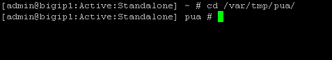

Lab 2.2 - Executing the PUA Script
------------------------------------------------

**Overview**

The ./build_pua.sh script will do a pre-flight check to ensure all the pre-requisites are met and will invoke a UCS backup by default before making any changes. If this script is run on a BIG-IP with a trial license, you must use the -s or --sanity option to prevent checking for licensing restrictions, this should only be done in a non-production environment as this may cause issues with production systems.

After each invocation, a log file will be left in /var/log called f5-pua-install-xxxx.log which will outline all the actions taken along with the result or any errors encountered. This log file may be requested by support or an F5 engineer to assist in any troubleshooting.

**Usage**

Invoking ./build_pua.sh with "-h" or "--help" will alert you to the potential options you may use to modify the behavior of the script. As of this document and version 1.1.3 the current options are:

.. list-table::
    :widths: 20 40
    :header-rows: 1

    * - **Options**
      - **Descriptions**
    * - -h, -\\-help
      - This Notice
    * - -s -\\-sanity
      - Bypass santiy checks (license, BIG-IP status)
    * - -u -\\-update
      - Update existing installation
    * - -e -\\-extract
      - Extract files to temp location and exit
    * - -n -\\-nobackup
      - Does not perform UCS backup
    * - -c -\\-checkonly
      - Check installed versions against this package
    * - -d -\\-disabletest
      - Disable test user
    * - -f -\\-forceupgrade
      - Force upgrade of packages from this archive

.. note::

   This lab will automate the installation of the ./build_pua.sh script by creating a file called pua_config.sh and saving to the same directory as ./build_pua.sh.
   The **pua_config.sh** file is located in the **/var/tmp/pua** directory

.. code-block:: console

   # Sample unattended install script
   # place this in the same directory as
   # build_pua.sh to automatcailly install
   #
   # uncomment the lines below to use/customize
   noninteractive=true
   radiusvip=10.1.20.104
   ldapvip=10.1.20.104
   ldapsvip=10.1.20.104
   webtopvip=10.1.10.104
   radiusconfig=y
   sampleca=y
   disabletest=true
   nobackup=true

Setting the "noninteractive=true" option will perform a full unattended install if all the sample prompts above are provided and uncommented, otherwise the answers provided in pua_config.sh will be used as the defaults in a semi-interactive install method.

Task - Running Installation Script
~~~~~~~~~~~~~~~~~~~~~~~~~~~~~~~~~~~~~~~~~~~~~~~~~~~~~~~~~~~~~~~~

#. Login to into the BIG-IP via SSH

#. Change Directory to **/var/tmp/pua**

   .. code-block:: console

      cd /var/tmp/pua

   |image01|

#. Unzip the PUA Build Script

   .. code-block:: console

      unzip build_pua-151-1.1.5-rc17.zip

   |image02|

#. Verify the **pua_config.sh**

   .. code-block:: console

      cat pua_config.sh

   |image03|

#. Run the PUA installation script **./build_pua.sh**

   .. code-block:: console

      ./build_pua-151.sh

   .. code-block:: console

      [admin@bigip1:Active:Standalone] pua # ./build_pua-151.sh

      /var/tmp/pua/build_pua-151.sh - v1.1.5-rc17 on BIG-IP v15.1.0
      Reading config from /var/tmp/pua/pua_config.sh...

      noninteractive is GO... Buckle up...

      Preparing environment... [OK]

      Changing to /tmp/pua.rILEoICRFw... [OK]

      Extracting archive... [OK]

      Checking License Entitlements for Privileged User Access... [OK]

      Adding ILX archive directory... [OK]

      Checking modules are provisioned.

      Checking apm... [OK]

      Checking ilx... [OK]

      SUCCESS: All modules provisioned.

      Checking for BIG-IP-ILX-WebSSH2-current.tgz... [OK]

      Hash check for BIG-IP-ILX-WebSSH2-current.tgz... [OK]

      Checking for BIG-IP-ILX-ephemeral_auth-151-current.tgz... [OK]

      Hash check for BIG-IP-ILX-ephemeral_auth-151-current.tgz... [OK]

      RADIUS = 10.1.20.104

      LDAP = 10.1.20.104

      LDAPS = 10.1.20.104

      Webtop = 10.1.10.104
      [OK]
      [OK]
      [OK]
      [OK]
      [OK]
      [OK]

      Checking for ca.pua.lab.cer... [OK]

      Hash check for ca.pua.lab.cer... [OK]

      Installing CA file ca.pua.lab.cer... [OK]

      Creating pua_webtop-clientssl profile with CA ca.pua.lab.cer... [OK]

      Creating ephemeral_config data group... [OK]

      Creating ephemeral_LDAP_Bypass data group... [OK]

      Creating ephemeral_RADIUS_Bypass data group... [OK]

      Creating ephemeral_radprox_host_groups data group... [OK]

      Creating ephemeral_radprox_radius_attributes data group... [OK]

      Creating ephemeral_radprox_radius_client data group... [OK]

      Creating WebSSH2 Workspace... [OK]

      Extracting BIG-IP-ILX-WebSSH2-current.tgz to /var/ilx/workspaces/Common... [OK]

      Copying WebSSH2 config.json.sample to config.json... [OK]

      Creating WebSSH2 Plugin... [OK]

      Importing APM sample profile ... [OK]

      Modifying pua Web Top Link... [OK]

      Applying pua APM Policy... [OK]

      Creating Ephemeral Authentication Workspace... [OK]

      Extracting BIG-IP-ILX-ephemeral_auth-151-current.tgz to /var/ilx/workspaces/Common... [OK]

      Modifying Ephemeral Authentication Workspace... [OK]

      Copying Ephemeral Auth config.json.sample to config.json... [OK]

      Creating Ephemeral Authentication Plugin... [OK]

      Creating RADIUS Proxy Service Virtual Server... [OK]

      Creating LDAP Proxy Service Virtual Server... [OK]

      Creating LDAP Proxy Service Virtual Server... [OK]

      Creating LDAPS (ssl) Proxy Service Virtual Server... [OK]

      Creating Webtop Virtual Server... [OK]

      Modifying BIG-IP for RADIUS authentication against itself... [OK]

      Saving config... [OK]

      You can test your new APM webtop now by browsing to:

         https://10.1.10.104

         username: <any>
         password: <any>

      This will let anyone in with any policy. The next step after testing would be
      to add access control through AD, MFA, or some other method.

      If the RADIUS testing option was enabled, any username will log in using
      Ephemeral Authentication.

      Task complete.

      Now go build an APM policy for PUA!

      Cleaning up...

      /var/tmp/pua/build_pua-151.sh - v1.1.5-rc17 on BIG-IP v15.1.0
      [admin@bigip1:Active:Standalone]

