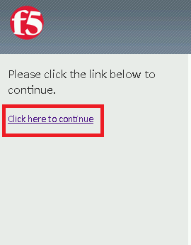
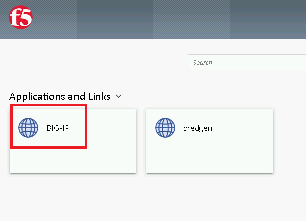

Lab 2.3 - Validating the PUA Script Installation
------------------------------------------------

In this section, you will test the initial installation of the PUA deployment.

Task - Accessing the BIG-IP via APM Webtop
~~~~~~~~~~~~~~~~~~~~~~~~~~~~~~~~~~~~~~~~~~

#. Open a web browser and navigate to https://pua.acme.com

#. A Warning Banner page (customizable) should appear, click the **Click here to continue** link.

   |image10|

#. You should now see a logon page. Enter a random username and any password. Then, click the **Logon** button.

   |image11|

#. You should be directed to the webtop. Click the **BIG-IP** tile.

   |image12|

#. You should then see a WebSSH screen. Notice that you were logged into the BIG-IP with the username that you entered at the logon page.

   |image13|

