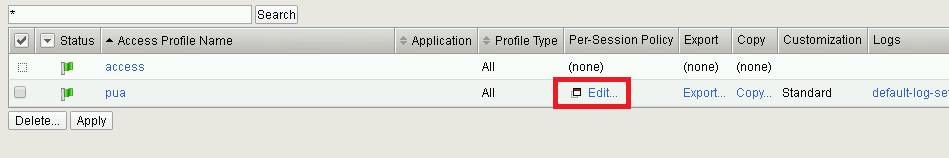
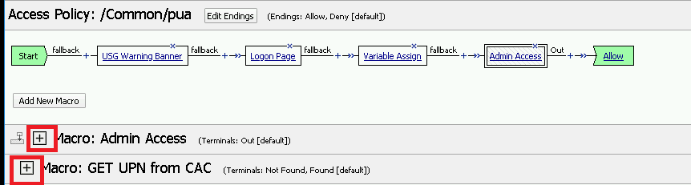

Lab 2.4 -Policy Review
----------------------------------------------------

In this section, you will review the initial APM policy created by the PUA Build Script

Task - Review the APM Policy Created by the PUA Build Script
~~~~~~~~~~~~~~~~~~~~~~~~~~~~~~~~~~~~~~~~~~~~~~~~~~~~~~~~~~~~

#. Open a web browser and log into the BIG-IP via its management address: https://10.1.1.4

#. Navigate to **Access >> Profiles/Policies >> Access Profiles (Per-Session Polices)**.

   |image20|

#. Click the **Edit** link for the **pua** Access Profile.

   |image21|

#. Expanded the Macros by clicking the square box with the plus sign inside.

   |image22|

#. Here is the policy created by the PUA Build Script:

   |image23|

