Lab 2.5 - Creating an APM Policy - LDAP
------------------------------------------------

PUA requires a Directory Service to authenticate users. In this section you will build a LDAP macro to perform the authentication function.

Task - Build a LDAP macro
~~~~~~~~~~~~~~~~~~~~~~~~~~
.. note::

   This lab makes use of APM macros to make policies easy to view and manage.

The LDAP macro will verify that the requesting user has a valid account and the appropriate group permission.

#. Click the **Add New Macro** button

   |image30|

#. Enter **LDAP_Query** for the and click **Save**

   |image31|

#. Open the newly created macro by clicking the plus sign by the name: **Macro: LDAP_Query**

   |image32|

#. Add the LDAP Query action by clicking the plus sign

   |image33|

#. Select the **Authentication** tab, select the **LDAP Query** agent, and then click **Add Item**

   |image34|

#. Update the **Properties** tab by modifying the **Server**, **SearchDN**, **SearchFilter**, and **Fetch Groups** settings

   - Server = **/Common/ldap-servers**
   - SearchDN = **DC=f5lab,DC=local**
   - SearchFilter = **UserPrincipalName=%{session.custom.ephemeral.upn}**
   - Fetch groups to which the user or group belong = **Direct**

   |image35|

#. Click on the **Branch Rules** tab to edit the Branch Rules

#. Click the **X** button beside **User Group Membership**. This will delete the branch

   |image36|

#. Click **Add Branch Rule**

   |image37|

#. Enter **LDAP Query** in the **Name** field and click the **change** link

   |image38|

#. Click the **Add Expression** button

   |image39|

#. Change the **Context** setting to **LDAP Query** and the **Condition** setting to **LDAP Query Passed**. Ensure that **LDAP Query has** is set to **Passed**. Click th 

   |image130|

#. Click the **Add Expression** button

   |image131|

#. Click **Finish**, and then click **Save**

#. Now add a **Message Box** agent to alert when the LDAP query fails. Click on the plus sign on the **fallback** branch (between the **LDAP Query** and the **OUT** terminal)

   |image132|

#. Select the **General Purpose** tab and then select **Message Box** in the main section, and Click the **Add Item** button

   |image133|

#. Enter the following values for the message box agent, and Click on the **Save** button

   .. code-block:: console

      Name:    **LDAP Failure**
      Message: **LDAP Failure for user %{UserPrincipalName}**

   |image134|

#. Click on the **Edit Terminals** button to change the terminals to report Success and Failure

   |image136|

#. Change the Name from **out** to **Success**, and then click on the **Add Terminal** button

   |image137|

#. Change the name from **Terminal 1** to **Failure**, and then click on **Save**

   |image138|

#. Click the terminal for the **LDAP Failure** branch 

   |image139|

#. Change the setting from **Success** to **Failure**. and click **Save**

   |image1130|

#. Click **Save**

Here is the completed macro.

   |image135|

.. |image30| image:: media/image030.png
.. |image31| image:: media/image031.png
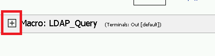
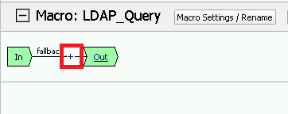
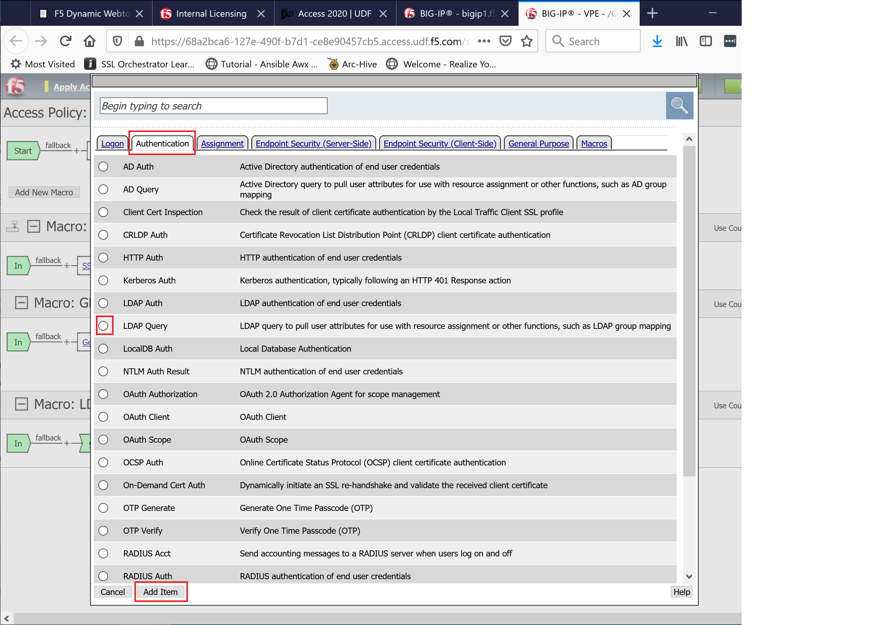
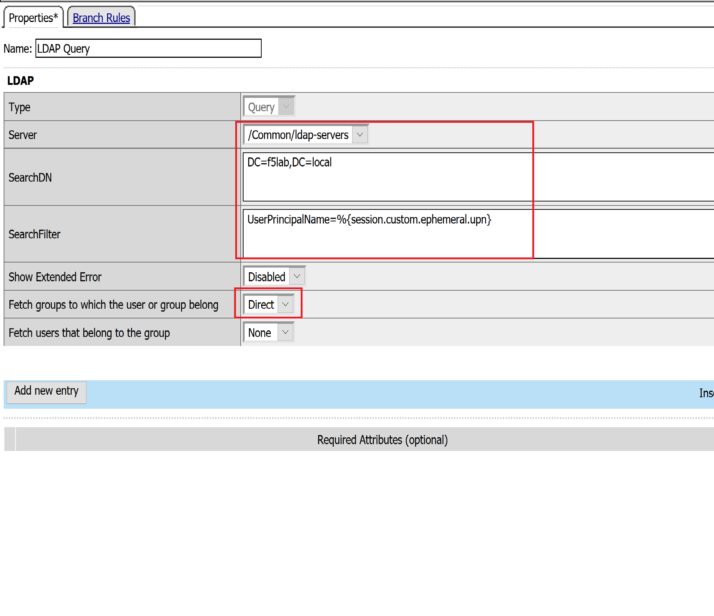
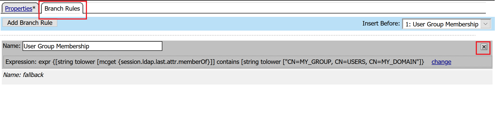
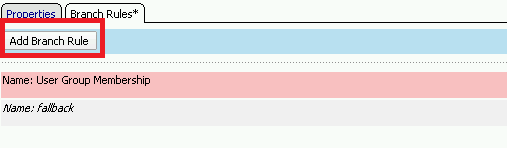
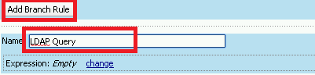
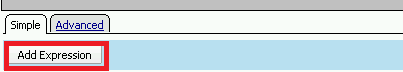
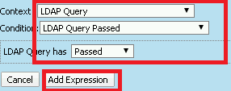
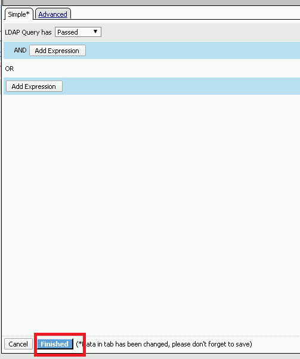
.. |image132| image:: media/image132.png
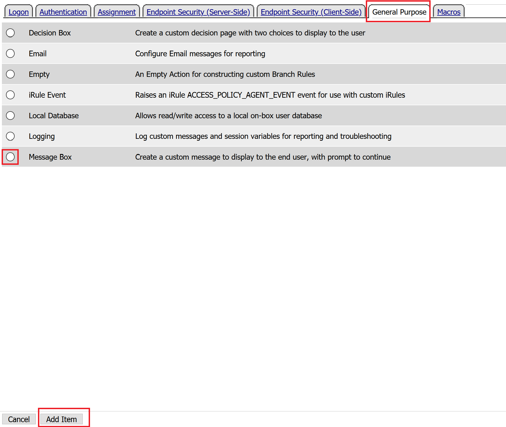
.. |image134| image:: media/image134.png
.. |image135| image:: media/image135.png
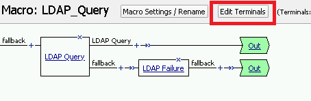
.. |image137| image:: media/image137.png
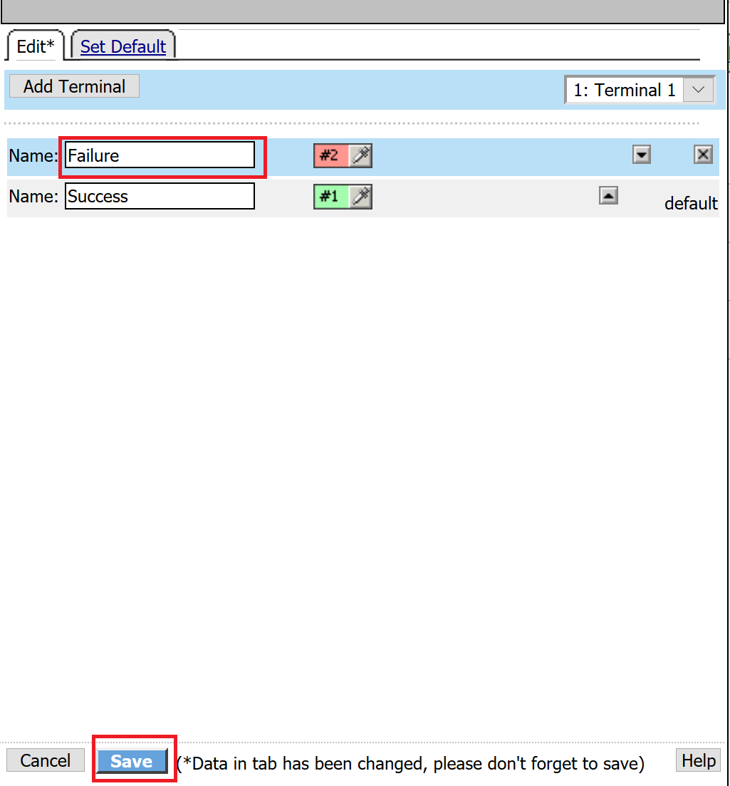
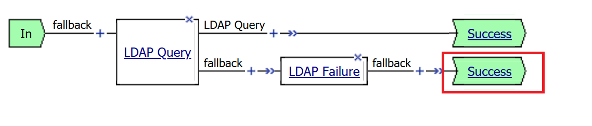
.. |image1130| image:: media/image1130.png

