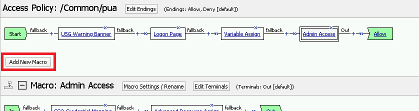
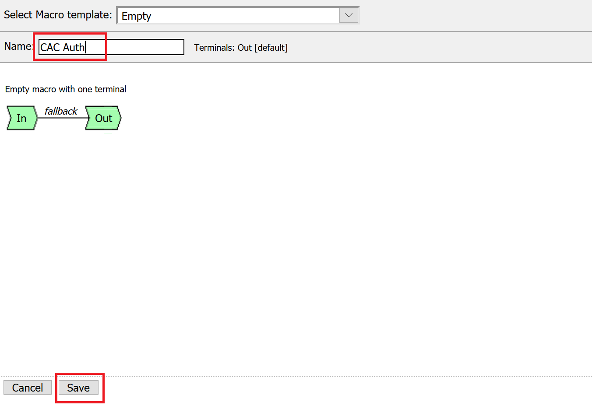
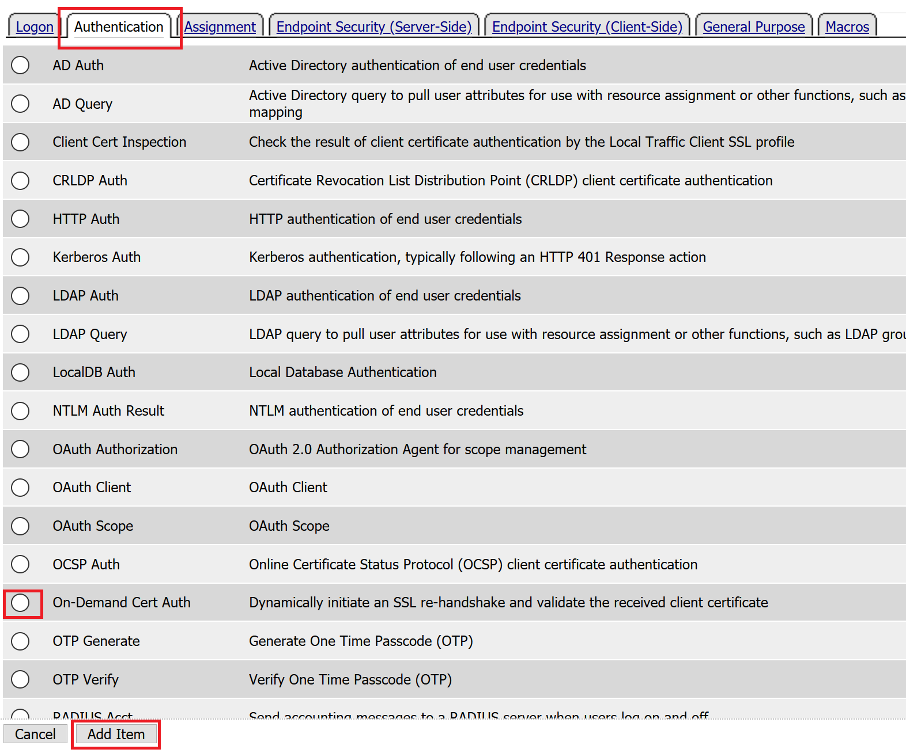
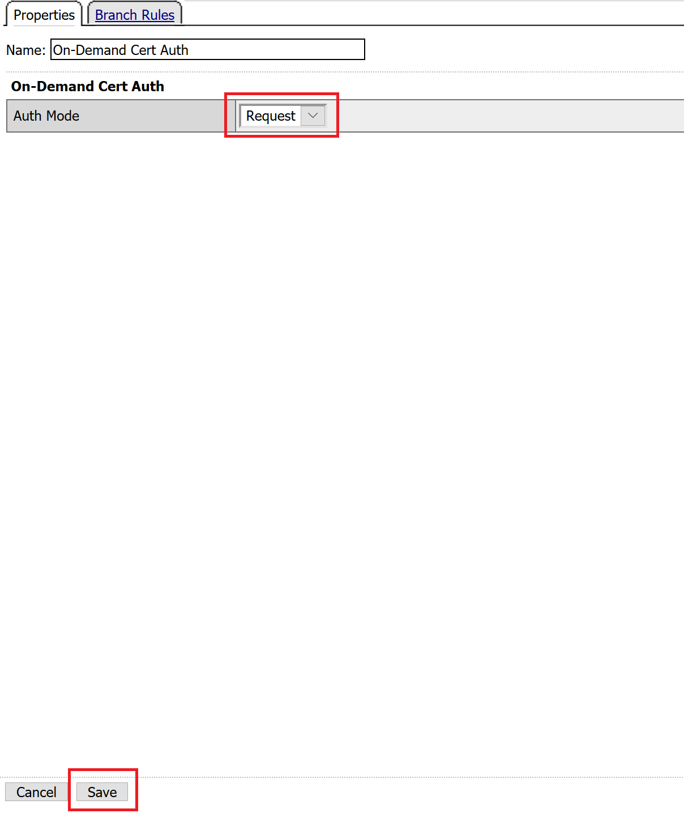
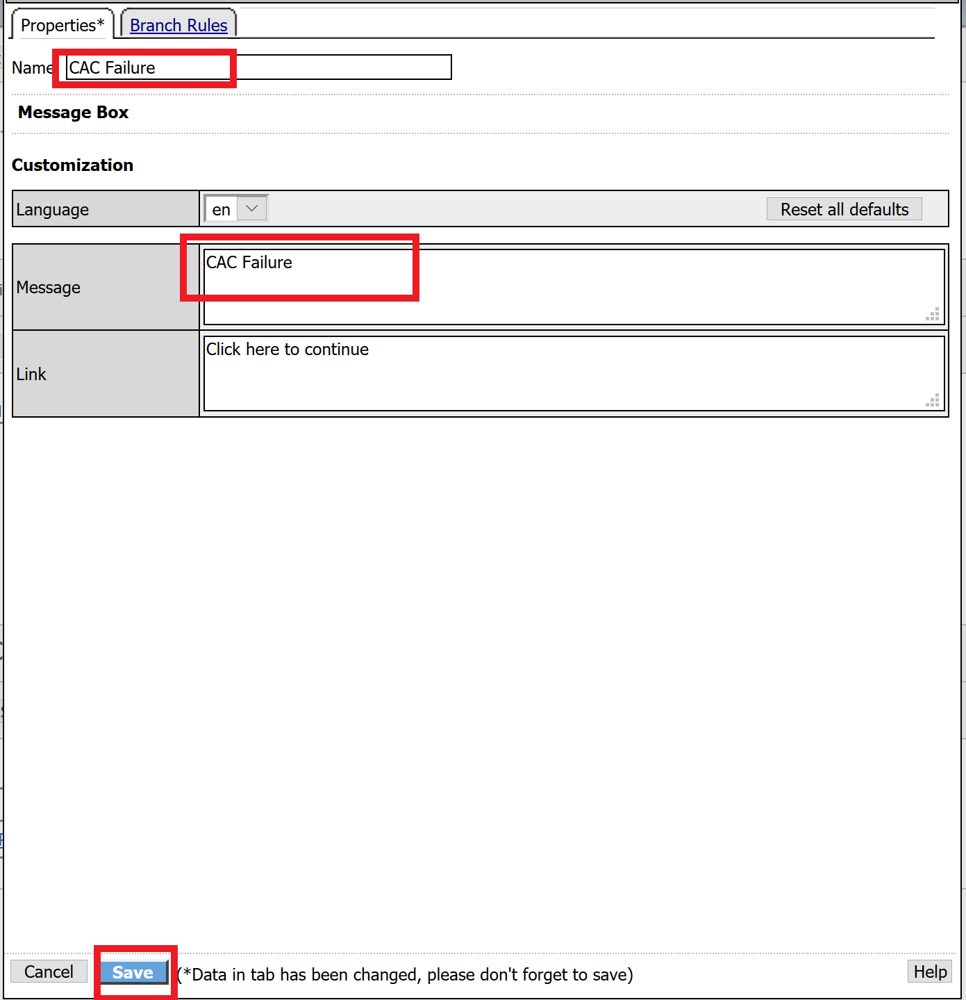
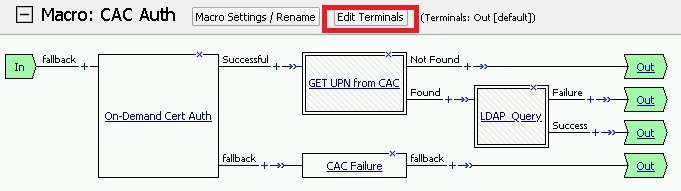

Lab 2.6 - Creating an APM Policy - CAC Authentication
--------------------------------------------------------

In this section, you will build a macro to request the user certificate.

Task - Build CAC AUTH Macro
~~~~~~~~~~~~~~~~~~~~~~~~~~~

#. Click the **Add New Macro** button

   |image30|

#. Name the Macro CAC Auth and click **save**

   |image40|

#. Open the newly created macro by clicking the plus sign by the name: **CAC Auth**

   |image41|

#. Click the **Authentication** tab across the top, select **On-Demand Cert Auth**, and click **Add Item**

   |image42|

#. Leave the **Auth Mode** set to the default **Request**, and click **Save**

   |image43|

#. Click the plus sign on the **Successful** branch

   |image44|

#. Click the tab **Macros** across the top, select the **GET UPN from CAC** button in the main page, and click **Add Item**

   |image45|

#. Click the plus sign on the **Found** branch

   |image46|

#. Select **Macros** across the top, select the **LDAP_Query** button in the main page, and click **Add Item**

   |image47|

#. Click the plus sign on the **fallback** branch after the On-Demand Cert Auth

   |image48|

#. Select **General Purpose** across the top, select **Message Box** in the main page, and click **Add Item**

   |image49|

#. Name the message box CAC Failure, enter CAC Failure in the **Message** box, and click **Save**

   |image140|

#. Click **Edit Terminals**

   |image141|

#. Change the default name from Out to **Success**, and click **Add Terminal**

   |image142|

#. Change the default name to Failure

   |image143|

#. Click the down arrow beside the Failure box to change the order. The **Success** terminal should be on top. Click **Save**

   |image147|

#. Click the terminals on the **Not Found**, **Failure**, **Fallback** branches and change them from **Success** to **Failure**. Click **Save**

   |image144|

   |image145|

.. note:: The completed CAC Auth Macro

   |image146|

.. |image47| image:: media/image047.png

