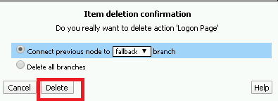
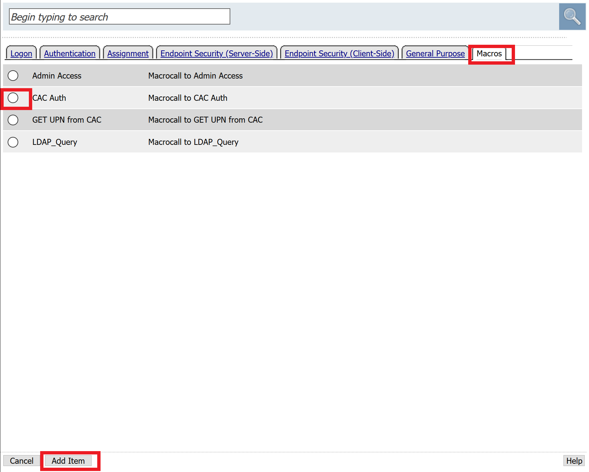
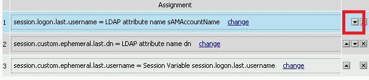
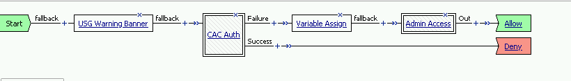

Lab 2.7 - Creating an APM Policy - Update Initial Access Policy
----------------------------------------------------------------

In this section, you will add the CAC Auth Macro to the initial access policy and update the variable assignments.

Task - Update the Initial Access Policy
~~~~~~~~~~~~~~~~~~~~~~~~~~~~~~~~~~~~~~~

#. Click the **X** the Logon Page box to remove the Logon Page

   |image50|

#. Click the Delete button

   |image51|

#. Click the plus sign between USG Waring Banner and Variable Assign

   |image52|

#. Select **Macros** across the top, select the **CAC Auth** button in the main page, and click **Add Item**

   |image53|

#. Click the **Variable Assign** box

   |image54|

#. Click **change** on row 1

   |image55|

#. Make the following changes

   - Change the right hand pull down setting to **AAA Attribute**
   - Change the Agent Type to **LDAP**
   - Change the Attribute type to **USE LDAP attribute**
   - Set the LDAP attribute name to **dn**
   - Click **Finished**

   |image56|

#. Click **Add new entry**

   |image57|

#. Click **change**

   |image58|

#. Make the following changes

   - Update the field below Custom Variable with **session.logon.last.username**
   - Change the Custom Expression pull down to **AAA Atribute**
   - Change the Agent Type to **LDAP**
   - Change the Atribute type to **Use LDAP attribute**
   - Set the LDAP attribute name to **sAMAccountName**
   - Click **Finished**

   |image59|

#. Click the down arrow on row 1 to move the Assignment to the second row, and click **Save**

   |image150|

   Here is the completed initial policy

   |image151|

#. Click **Apply Access Policy**

   |image152|

.. |image52| image:: media/image052.png

.. |image56| image:: media/image056.png

