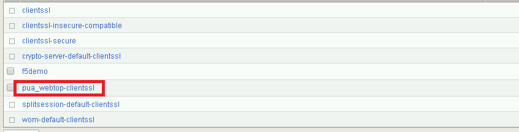
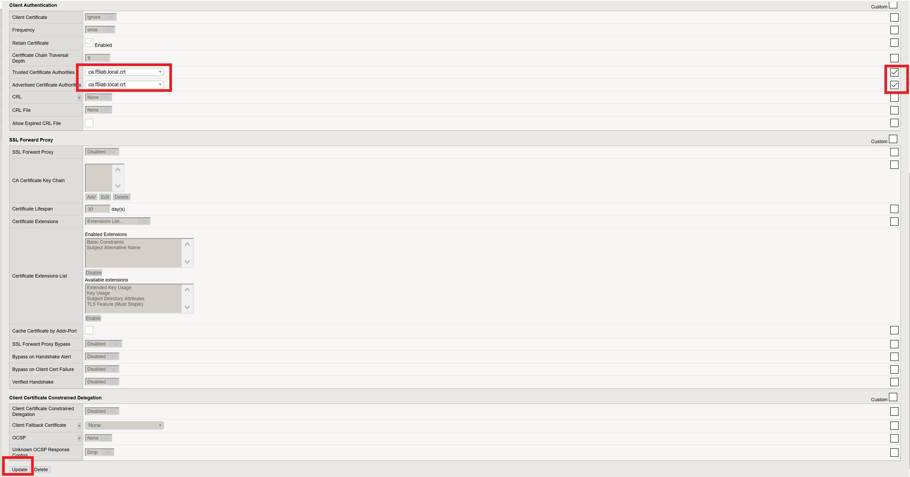

Lab 2.8 - Certificate Update
------------------------------

In this section, you will modify the SSL profile to present an internally signed certificate for the PUA webtop and select a trusted Certificate Authority to validate the user certificates.

Task - Update the SSL Profile
~~~~~~~~~~~~~~~~~~~~~~~~~~~~~~

#. Click Local Traffic >> Profiles >> SSL >> Client

   |image60|

#. Click **pua_webtop-clientssl**

   |image61|

#. Update the **Certificate Key Chain**

   - Check the custom box beside **Certificate Key Chain**
   - Highlight the **default key chain** and click **delete**

      |image62|

   - Click **ADD**

      |image63|

   - Change the Certificate to **acme.com-wildcard.crt**
   - Change the Key to **acme.com-wildcard.key**
   - Click **ADD**

      |image64|

#. Update the Certificate Authorities

   - Change the Trusted Certificate from ca. pua.lab.cer to ca.f5lab.local.crt
   - Change the Advertised Certificate from ca. pua.lab.cer to ca.f5lab.local.crt
   - Click **Update**

   |image65|

