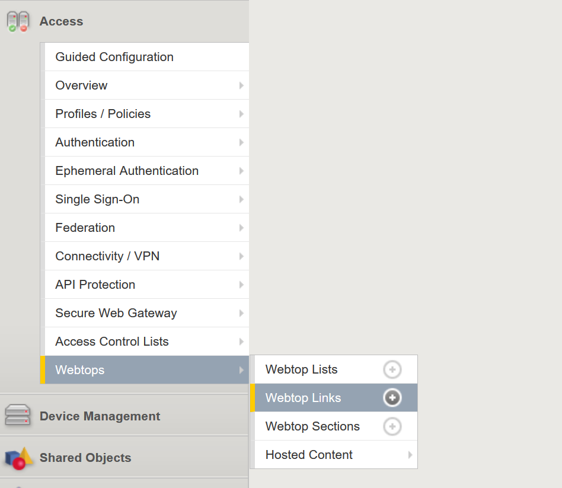
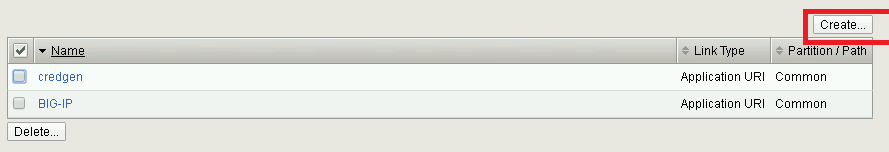
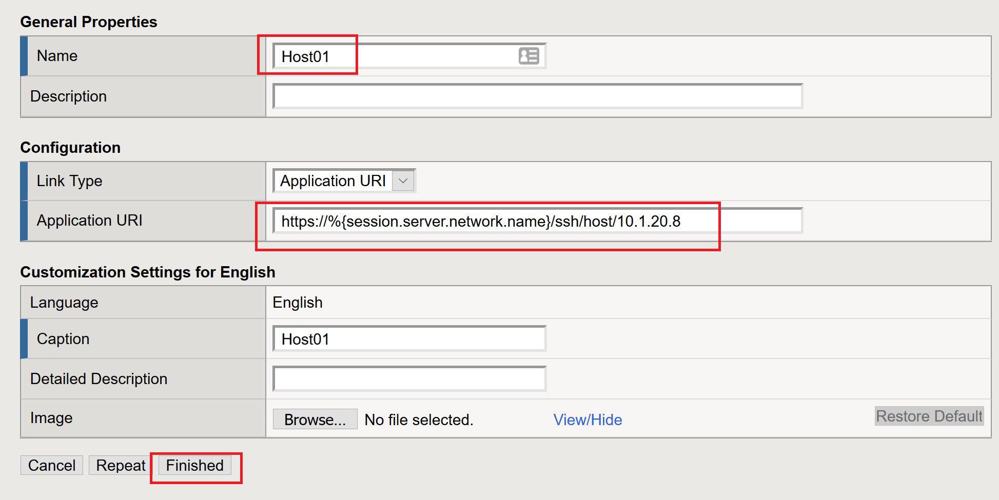
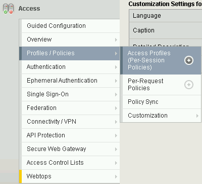
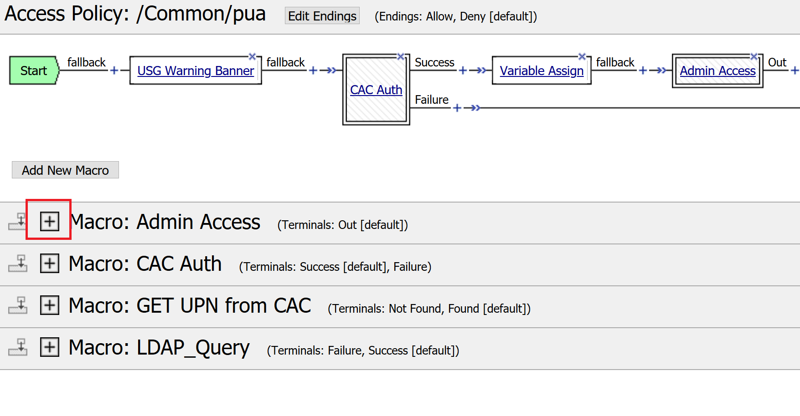
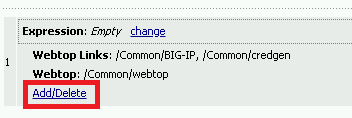
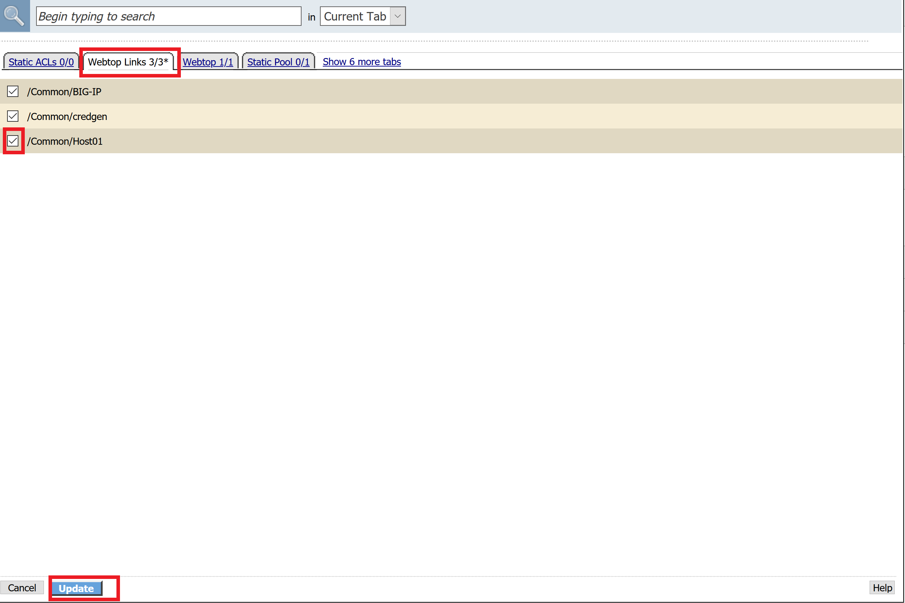
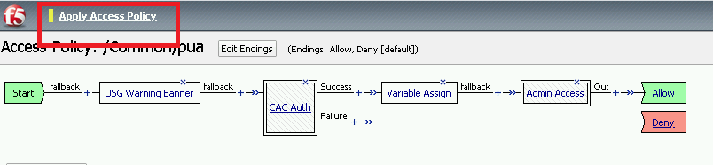

Lab 2.9 - Adding Devices to the webtop
-----------------------------------------

Task - Adding Device to the PUA Webtop
~~~~~~~~~~~~~~~~~~~~~~~~~~~~~~~~~~~~~~~

#. click **Access >> Webtop >> Webtop Links**

   |image70|

#. Click **Create**

   |image71|

#. Make the following changes

   - Enter **Host01** as the **Name**
   - Change the **Link Type** to **Application URI**
   - Update the **Application URI** with  **https://%{session.server.network.name}/ssh/host/10.1.20.8**

#. Click **Finish**

   |image72|

#. Click **Access >> Profiles/Policies >> Access Profiles (Per-Session Polices)**

   |image73|

#. Click the **Edit** button on the **pua** row

   |image74|

#. Click the plus sign beside the **Macro: Admin Access**

   |image75|

#. Click **Advanced Resource Assign**

   |image76|

#. Click the **Add/Delete** button

   |image77|

#. Click the **Webtop Links** tab and enable the **/Common/Host1** checkbox

#. Click **Update**, and then click **Save**

   |image78|

#. Click **Apply Access Policy**

   |image79|

.. |image74| image:: media/image074.png

