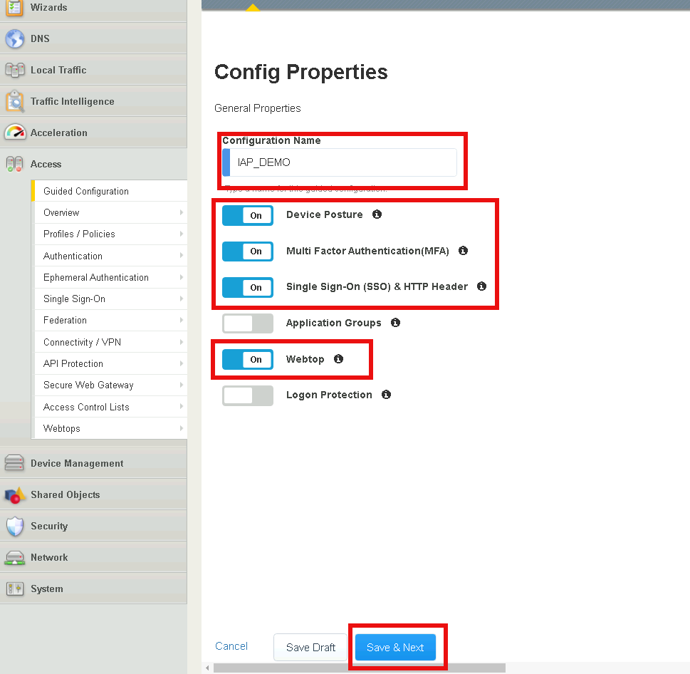
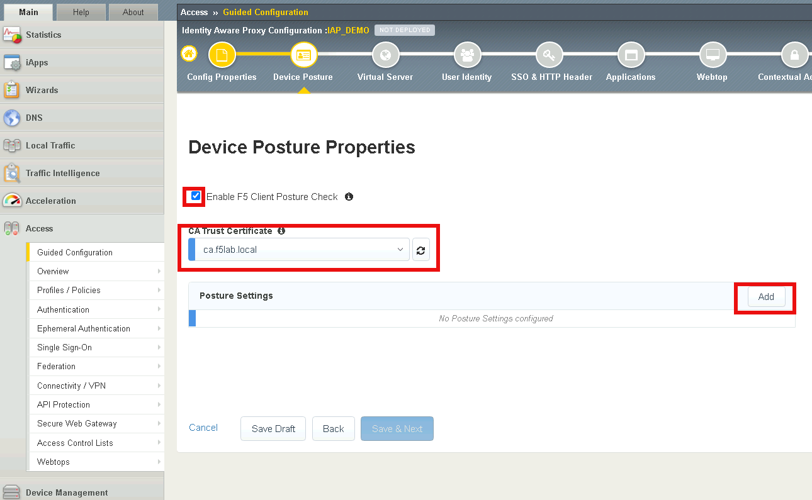
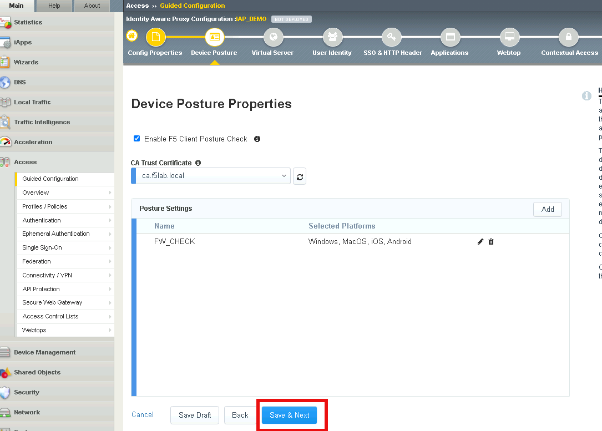
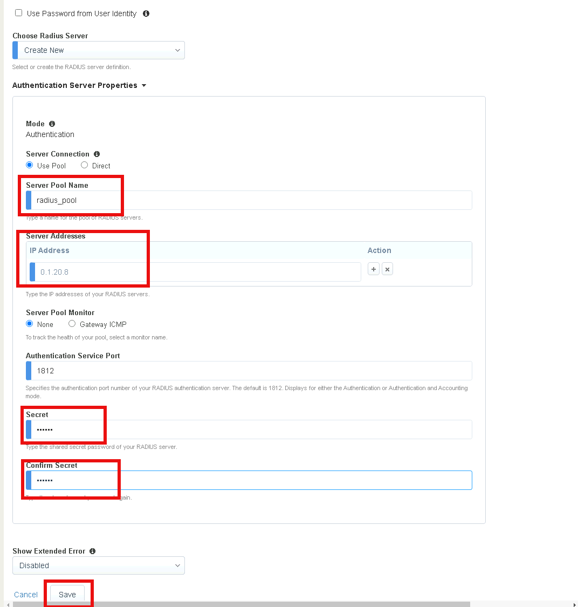
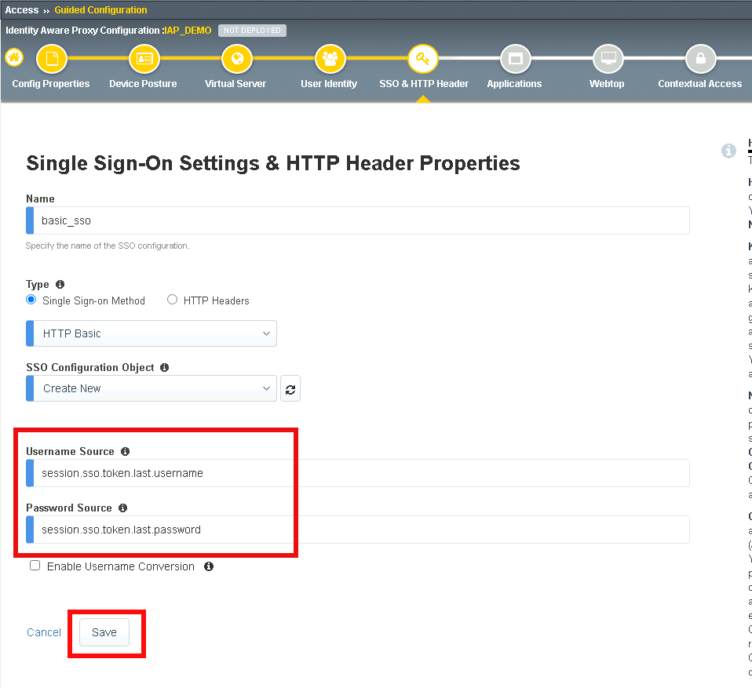
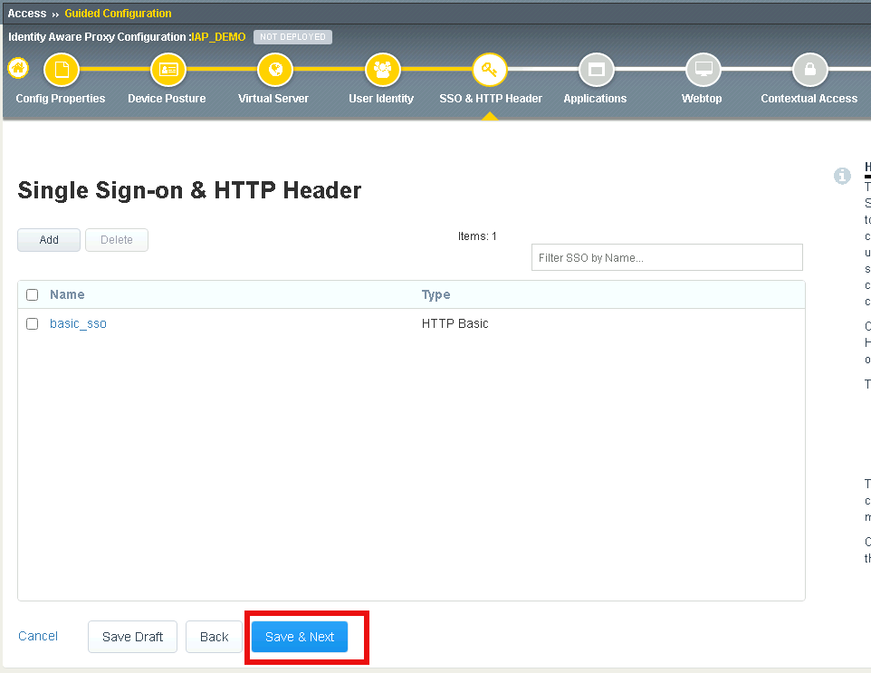
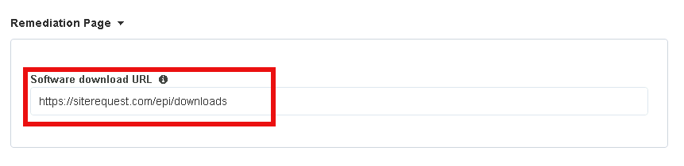
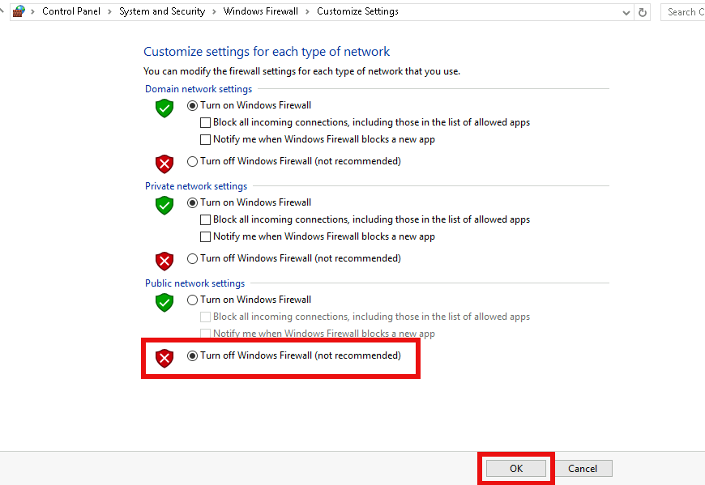
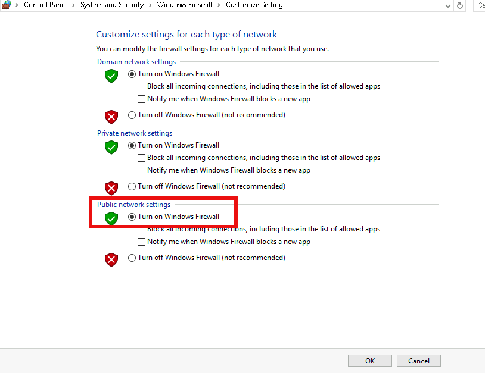

Lab 1: Configure Identity Aware Proxy(16.0)
===========================================

The Zero Trust Architecture shifts many of the objects that would exist in a per-session policy to the per-request policy thereby creating a more secure authentication and authorization scheme. The authenticity of each request is further enhanced through the use of F5’s Access Guard agent installed on a client.  This agent provides a PKI signed report of the posture assessment performed on the client real-time rather than the historical way plug-ins reported status. Previously, after a user connected to an application they would experience a delay in access as the agent performed the posture assessment to provide an unsigned report to the BIG-IP. 

Topics Covered
----------------
- Real-time Posture Assessments
- Per-Request Frameworks
- Contextual Access
- HTTP Connector

Expected time to complete: **1 hour**

Setup Lab Environment
--------------------------

To access your dedicated student lab environment, you will need a web browser and Remote Desktop Protocol (RDP) client software. The web browser will be used to access the Unified Demo Framework (UDF) Training Portal. The RDP client will be used to connect to the jumphost, where you will be able to access the BIG-IP management interfaces (HTTPS, SSH).

#. Click **DEPLOYMENT** located on the top left corner to display the environment

#. Click **ACCESS** next to jumphost.f5lab.local

   |image90|

#. Select your RDP resolution.  

#. The RDP client on your local host establishes a RDP connection to the Jump Host.

#. Login with the following credentials:

         - User: **f5lab\\user1**
         - Password: **user1**

#. After successful logon the Chrome browser will auto launch opening the site https://portal.f5lab.local.  This process usually takes 30 seconds after logon.

	|image91|

#. Click the **Classes** tab at the top of the page.

#. Scroll down the page until you see **201- 16.0 Zero Trust - Identity Aware Proxy** on the left

   |image87|

#. Hover over tile **Configure Identity Aware Proxy(16.0)**. A start and stop icon should appear within the tile.  Click the **Play** Button to start the automation to build the environment

   |image88|

#. The screen should refresh displaying the progress of the automation within 30 seconds.  Scroll to the bottom of the automation workflow to ensure all requests succeeded.  If you you experience errors try running the automation a second time or open an issue on the `Access Labs Repo <https://github.com/f5devcentral/access-labs>`__.

   |image89|

#. Close Chrome.

Section 1.1 - Access Guided Configuration
----------------------------------------------

The first step in deploying the IAP is accessing Guided Configuration

Task  1 - Access the Zero Trust IAP guided configuration
~~~~~~~~~~~~~~~~~~~~~~~~~~~~~~~~~~~~~~~~~~~~~~~~~~~~~~~~~~

#. Open Firefox, and navigate to https://bigip1.f5lab.local

#. Login with username **admin** and password **admin**

   |image2|

#. Click on the **Access** tab located on the left side

   |image3|

#. Click **Guided Configuration**

   |image4|

#. Click **Zero Trust**

   |image5|

#. Click **Identity Aware Proxy**

   |image6|

#. Click **Next**

   .. NOTE::  Review the design considerations for deploying IAP in a **Single Proxy** versus a **Multi-proxy** solution.

   |image7|
   
   
Section 1.2 - General Properties
------------------------------------------------

In this section, you will configure the IAP policy to perform posture assessment from client devices.  

Task 1 - Select the component to configure for Lab 1
~~~~~~~~~~~~~~~~~~~~~~~~~~~~~~~~~~~~~~~~~~~~~~~~~~~~~~~~~~~~~~~~

#. Define the configuration name **IAP_DEMO**

#. Click **Device Posture**

#. Click **Multi Factor Authentication**

#. Click **Single Sign-On (SSO)& HTTP Header**

#. Click **Webtop**

#. Click **Save & Next**

   |image8|

Section 1.3 - Device Posture
------------------------------------------------

Task 1 - Enable Posture Checks
~~~~~~~~~~~~~~~~~~~~~~~~~~~~~~~~~~~~~~~~~~~~~~~~~~~~~~~~~~~~~~~~

#. Check **Enable F5 Client Posture Check**

#. select **ca.f5lab.local** from the CA Trust Certificate dropdown list

#. Select **Add** to create a posture assessment group

   |image9|

Task 2 - Define a firewall Posture Assessment
~~~~~~~~~~~~~~~~~~~~~~~~~~~~~~~~~~~~~~~~~~~~~

#. Define the Posture Group Name **FW_CHECK**
#. Check the **Firewall** box
#. Check the **Domain Managed Devices** box
#. Enter the Domain Name **f5lab.local** 
#. Click **Done**

   |image10|

Task 3 - Verify the posture assessment 
~~~~~~~~~~~~~~~~~~~~~~~~~~~~~~~~~~~~~~~

#. The Posture Settings box should contain **FW_CHECK**
#. Click **Save & Next**

   |image11|
   
   
Section  1.4 - Virtual Server
------------------------------------------------

In this section, you will define the virtual server IP address and its SSL profile settings 

Task 1 - Create a virtual server
~~~~~~~~~~~~~~~~~~~~~~~~~~~~~~~~~~~~~~~~~~

#. Enable **Advanced Settings** located in the top left corner
#. Enter the IP address **10.1.10.100** in Destination Address
#. In the **Client SSL Profile** section, move **clientssl**  profile to **Available** side
#. Double click the **acme.com-wildcard** to move the profile to **Selected**

   |image12|

#. In the **Server SSL Profile** section, double-click the **serverssl** SSL Profile to move it to the **Selected** side (or select it and then click the right-arrow to move)
#. Click **Save & Next**

   |image13|

Section 1.5 - User Identity
---------------------------------

In this section you will configure a single User Identity using Active Directory.  

Task 1 - Configure Active Directory AAA
~~~~~~~~~~~~~~~~~~~~~~~~~~~~~~~~~~~~~~~~~~

#. Click **Add**

   |image14|

#. Enter **"ad"** for the name
#. Ensure the Authentication Type is **AAA**
#. Ensure the Choose Authentication Server Type is set to **Active Directory**
#. Select **ad-servers** from the Choose Authentication Server dropdown box
#. Check **Active Directory Query Properties**

   |image15|

#. Double-click **memberOf** in the Required Attributes box 
#. Click **Save**

   |image16|

Section 1.6 - MFA
------------------------------------------------

In this section you will configure a RADIUS server to enable simulated MFA capabilities.

Task 1 - Configure a RADIUS AAA Server
~~~~~~~~~~~~~~~~~~~~~~~~~~~~~~~~~~~~~~~~~~

#. Click the **MFA** tab

   |image17|

#. Click **Add**

   |image18|

#. Double click **Custom Radius Based**

   |image19|

#. Select **Create New** from the Choose RADIUS Server dropdown

   |image20|

#. Enter the Server Pool Name **radius_pool**
#. Enter the Server Address **10.1.20.8**
#. Enter the Secret **secret**
#. Click **Save**

   |image21|

#. Verify **Custom RADIUS based Authentication** appears
#. Click **Save & Next**

   |image22|

Section 1.7 - SSO & HTTP Header
------------------------------------------------

In this section you will configure HTTP Basic SSO.

Task 1 - Create a HTTP basic SSO object
~~~~~~~~~~~~~~~~~~~~~~~~~~~~~~~~~~~~~~~~~~

#. Click **Add**

   |image23|

#. Enter the name **basic_sso**
#. Verify **HTTP Basic** is selected
#. Select **Create New** from the SSO Configuration Object dropdown box

   |image24|

#. Verify the Username Source is **session.sso.token.last.username**
#. Verify the Password Source is **session.sso.token.last.password**
#. Click **Save**

   |image25|

#. Verify the **basic_sso** object was created
#. click **Save & Next**

   |image26|

Section 1.8 - Applications
------------------------------------------------

In this section you will define a single application

Task 1 - Create basic.acme.com application
~~~~~~~~~~~~~~~~~~~~~~~~~~~~~~~~~~~~~~~~~~~~

#. Enter Auth Domain **iap1.acme.com** 
#. Click **Add**

   |image27|

#. Enter **basic.acme.com** for the application name
#. Enter **basic.acme.com** for the FQDN
#. Enter the IP address **10.1.20.6** for the pool member
#. Click **Save** 

   |image28|

#. Verfiy **basic.acme.com** application was created
#. Click **Save & Next**

   |image29|

Section 1.9 - Webtop
---------------------------

Task 1 - Modify the Webtop setting
~~~~~~~~~~~~~~~~~~~~~~~~~~~~~~~~~~~~~~~~~~

#. Set the Primary Authentication to **ad**
#. Verify **basic.acme.com** is listed under Application
#. Click **Save & Next**

   |image30|

Section 1.10 - Contextual Access
-------------------------------------

In this section you will define contextual access for the previously created application.  Context access is where all of the previously created objects are put together to provide fine-grain access control.

Task 1 - Create Contextual Access for basic.acme.com
~~~~~~~~~~~~~~~~~~~~~~~~~~~~~~~~~~~~~~~~~~~~~~~~~~~~~~

#. Click **Add**

   |image31|

#. Enter **basic.acme.com** for the contextual access name
#. Select **basic.acme.com** from the Resource dropdown box
#. Select **fw_check** from the Device Posture dropdown box
#. Select **ad** from the Primary Authentication dropdown box
#. Select **basic_sso** from the Single Sign-On dropdown box
#. Enter **Sales Engineering** in the Filter by Group Name.  This group assignment section controls the display of resources on the Webtop.  It does not control the access to the actual resource.  That will be covered in lab2.
#. Click **Add** beside the Group Name

   |image32|

#. Check **Additional Checks**
#. For the Default Fallback rule, select **Step Up** from the dropdown box under **Match Action**
#. Select **Custom Radius based Authentication (MFA)** from the Step Up Authentication box
#. Click **Save**

   |image33|

#. Verify **basic.acme.com** Contextual Access
#. Click **Save & Next**

   |image33-2|

Section 1.11 - Customization
------------------------------------------------

The Customization section allows an administrator to define the images, colors, and messages that are presented to a user.

Task 1 - Customize the Remediation Page URL
~~~~~~~~~~~~~~~~~~~~~~~~~~~~~~~~~~~~~~~~~~~~~~~

The default **remediation Page** URL uses the hostname site **request.com**.  This should be changed to reference a real host where users can download and install the EPI updates.

#. Scroll down to the Remediation Page Section

   |image36|

#. Enter the URL **https://iap1.acme.com/epi/downloads**

   |image37|

#. Click **Save & Next**

#. On the Session Management Properties menu, Click **Save & Next**

Section 1.12 - Summary
------------------------------------------------

The **Summary** page allows you to review the configuration that is about to be deployed.  In the event a change is required anywhere in the configuration the **pencil icon** on the right side can be selected to quickly edit the appropriate section.

Task 1 - Deploy the configuration 
~~~~~~~~~~~~~~~~~~~~~~~~~~~~~~~~~~

#. Click **Deploy**

   |image38|

#. Once the deployment is complete, click **Finish**

Section 1.13 - Testing 
------------------------------------------------

In this section you will access the application basic.acme.com and watch how the BIG-IP restricts access when a device fails it's posture assessment.

Task 1 - Access basic.acme.com
~~~~~~~~~~~~~~~~~~~~~~~~~~~~~~~~~~~~~~~~~~

.. NOTE:: Posture Assessments in a Per-Request Policy use F5 Access Guard(running on clients) to perform posture assessments prior to accessing an application.  This improves the user experience since posture checks do not introduce any delay when accessing the application. This also improves security by allowing posture assessments to occur continuously throughout the life of the session.

#. From the jumpbox, browse to https://iap1.acme.com
#. At the logon page enter the Username:**user1** and Password:**user1**
#. Click **Logon**

   |image39|

#. Click the **basic.acme.com** tile on the webtop

   |image40|

#. The RADIUS logon page, prepopulates the username:**user1**.  Enter the PIN: **123456** in the password field

   |image41|

#. The SSO profile passes the username and password to the website for logon.

   |image42|

#. Close the browser Window to ensure there is not cached data

Task 2 - Disable Windows Firewall
~~~~~~~~~~~~~~~~~~~~~~~~~~~~~~~~~~

#. Right click the computer icon in the taskbar and open **Network and Sharing Center**

   |image43|

#. Click **Windows Firewall**

   |image44|

#. Click **Turn Windows Firewall on or off**

   |image45|

#. Click the radio button **Turn off Windows Firewall** 
#. Click **Ok**

   |image46|

Task 3 - See Deny Page iap1.acme.com
~~~~~~~~~~~~~~~~~~~~~~~~~~~~~~~~~~~~~~~~

#. From the jumpbox, browse to https://iap1.acme.com
#. At the logon page enter the Username:**user1** and Password:**user1**
#. Click **Logon**

   |image39|

#. Click the **basic.acme.com** tile on the webtop

   |image40|

#. After approximately 15 seconds you will receive a deny page from the IAP stating that you have failed the network firewall check

   |image47|

#. Close the browser Window to ensure there is no cached data

Task 4 - Enable Windows Firewall
~~~~~~~~~~~~~~~~~~~~~~~~~~~~~~~~~~

#. Right click the computer icon in the taskbar and open **Network and Sharing Center**

   |image43|

#. Click **Windows Firewall**

   |image44|

#. Click **Turn Windows Firewall on or off**

   |image45|

#. Click the radio button **Turn on Windows Firewall** 
#. Click **Ok**

   |image48|
   
#. From the jumpbox, connect to https://iap1.acme.com webtop, and then access the **basic.acme.com** application

#. This concludes lab 1.

   |image100|

.. |image1| image:: media/lab01/image001.png
.. |image2| image:: media/lab01/image002.png
.. |image3| image:: media/lab01/image003.png
.. |image4| image:: media/lab01/image004.png
.. |image5| image:: media/lab01/image005.png
.. |image6| image:: media/lab01/image006.png
.. |image7| image:: media/lab01/image007.png

.. |image10| image:: media/lab01/image010.png

.. |image12| image:: media/lab01/image012.png
.. |image13| image:: media/lab01/image013.png
.. |image14| image:: media/lab01/image014.png
.. |image15| image:: media/lab01/image015.png
.. |image16| image:: media/lab01/image016.png
.. |image17| image:: media/lab01/image017.png
.. |image18| image:: media/lab01/image018.png
.. |image19| image:: media/lab01/image019.png
.. |image20| image:: media/lab01/image020.png

.. |image22| image:: media/lab01/image022.png
.. |image23| image:: media/lab01/image023.png
.. |image24| image:: media/lab01/image024.png

.. |image27| image:: media/lab01/image027.png
.. |image28| image:: media/lab01/image028.png
.. |image29| image:: media/lab01/image029.png
.. |image30| image:: media/lab01/image030.png
.. |image31| image:: media/lab01/image031.png
.. |image32| image:: media/lab01/image032.png
.. |image33| image:: media/lab01/image033.png
.. |image33-2| image:: media/lab01/image033-2.png

.. |image37| image:: media/lab01/image037.png
.. |image38| image:: media/lab01/image038.png
.. |image39| image:: media/lab01/image039.png
.. |image40| image:: media/lab01/image040.png
.. |image41| image:: media/lab01/image041.png
.. |image42| image:: media/lab01/image042.png
.. |image43| image:: media/lab01/image043.png
.. |image44| image:: media/lab01/image044.png
.. |image45| image:: media/lab01/image045.png

.. |image47| image:: media/lab01/image047.png

.. |image87| image:: media/lab01/087.png
.. |image88| image:: media/lab01/088.png
.. |image89| image:: media/lab01/089.png
.. |image90| image:: media/lab01/090.png
.. |image91| image:: media/lab01/091.png
.. |image100| image:: media/lab01/image100.png
