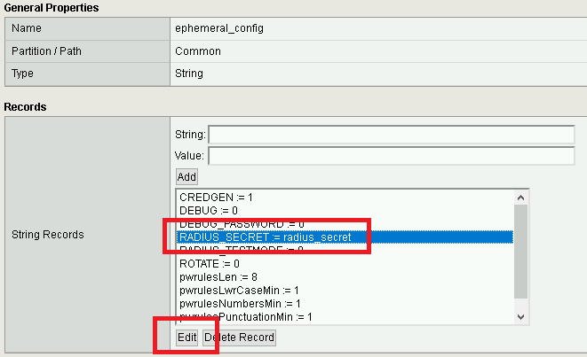
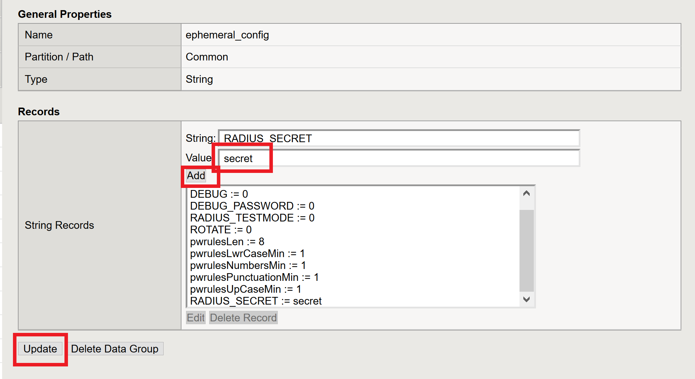
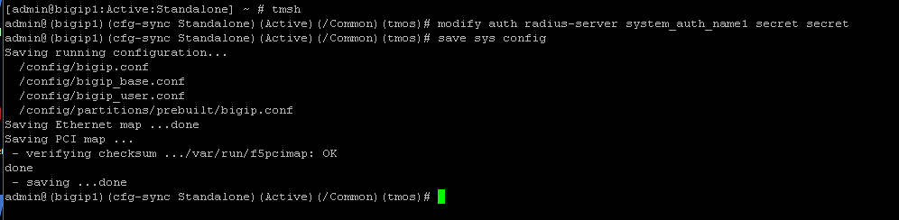

Lab 2.10 - Modifying Radius Configurations
-----------------------------------------------

Task - Modifying the Radius Server secret password
~~~~~~~~~~~~~~~~~~~~~~~~~~~~~~~~~~~~~~~~~~~~~~~~~~~

#. Navigate to **Local Traffic >> iRules >> Data Group List**

   |image80|

#. Click **ephemeral_config**

   |image81|

#. Change the Radius Secret

   - Highlight **RADIUS_SECRET** in the String Records window
   - Click **Edit**

   |image82|

#. Change the Value from radius_secret to **secret**, Click **ADD**, and click **Update**

   |image83|

Task - Modifying the BIG-IP radius secret
~~~~~~~~~~~~~~~~~~~~~~~~~~~~~~~~~~~~~~~~~~

#. SSH into the BIG-IP and enter traffic management shell by typing **tmsh**

#. Enter the following commands

   .. code-block:: console

      modify auth radius-server system_auth_name1 secret secret
      save sys config

   |image84|

