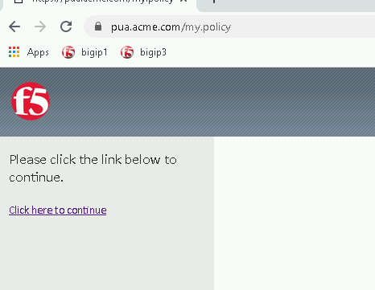
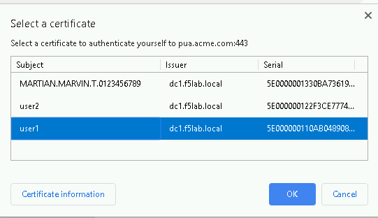
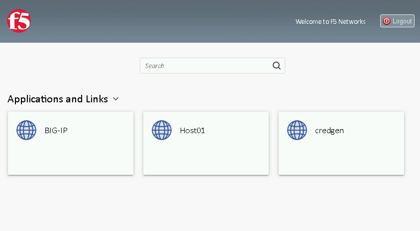
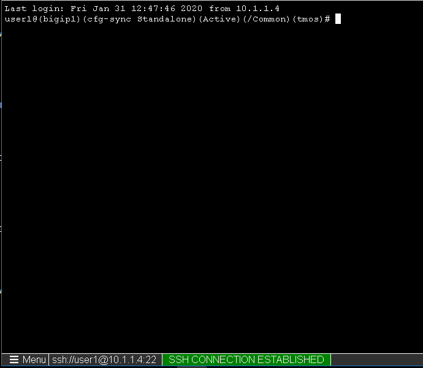
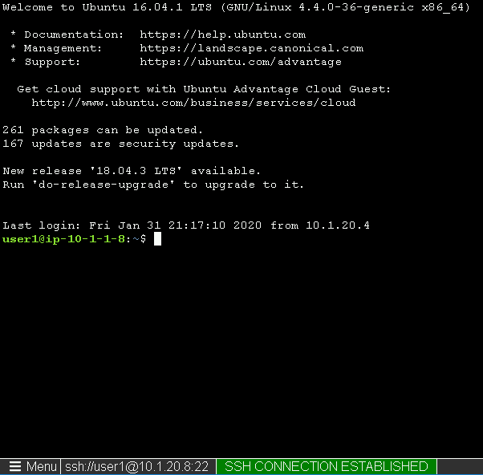
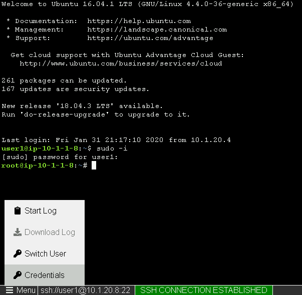

Lab 2.11 - Verification Testing
-------------------------------------

Task - Test the updated Webtop
~~~~~~~~~~~~~~~~~~~~~~~~~~~~~~~~

#. Access the webtop via https://pua.acme.com

#. A Warning Banner page (customizable) should appear, click the **Click here to continue** link.

   |image90|

#. Select the certificate for user1 and click OK

   |image91|

#. Observer the updated webtop with Host01

   |image92|

#. Click the BIG-IP icon, and observer the username in the bottom left corner

   |image93|

#. Close the browser window and return to webtop

#. Click the Host01 icon

   |image92|

#. Observer the the username at the bottom left corner

   |image94|

#. Escalate Priviledges

   - type **sudo -i**
   - click the **Menu** button
   - click click **Credentials** button

   |image95|

.. note::
   The Credentials button sends the password to terminal

