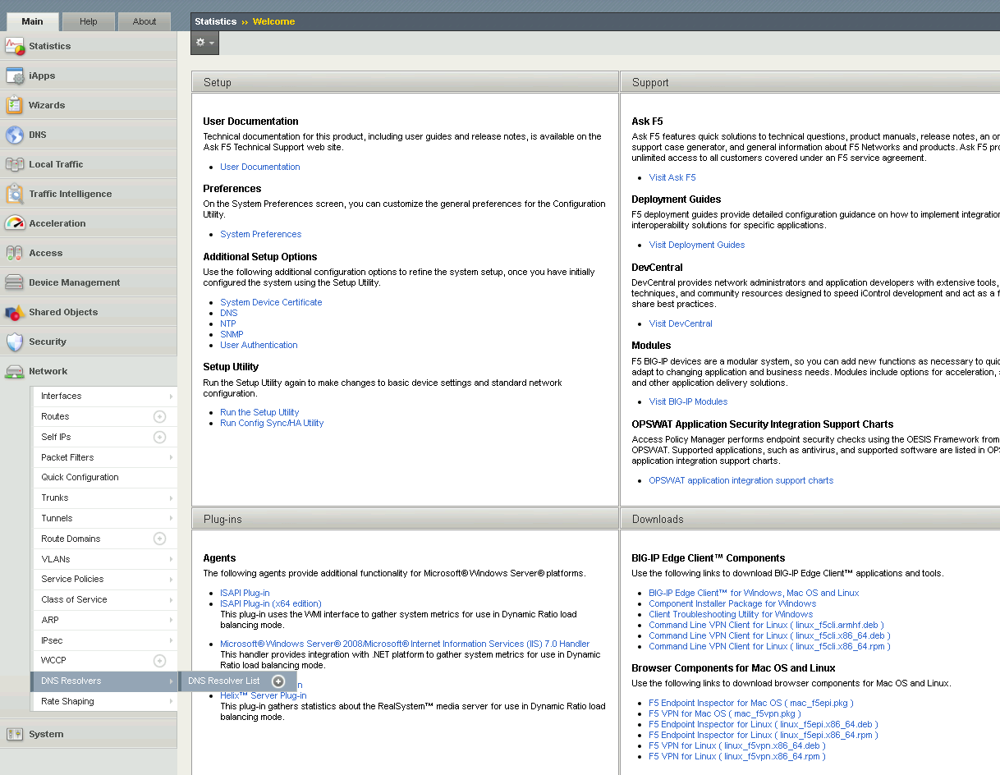
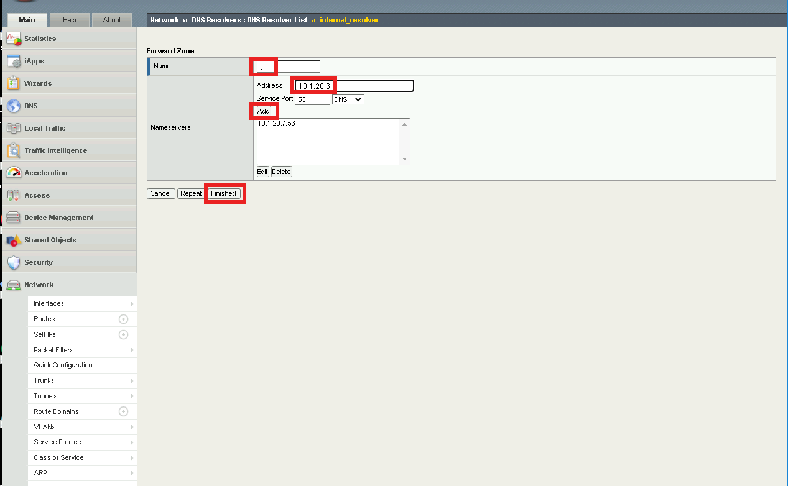
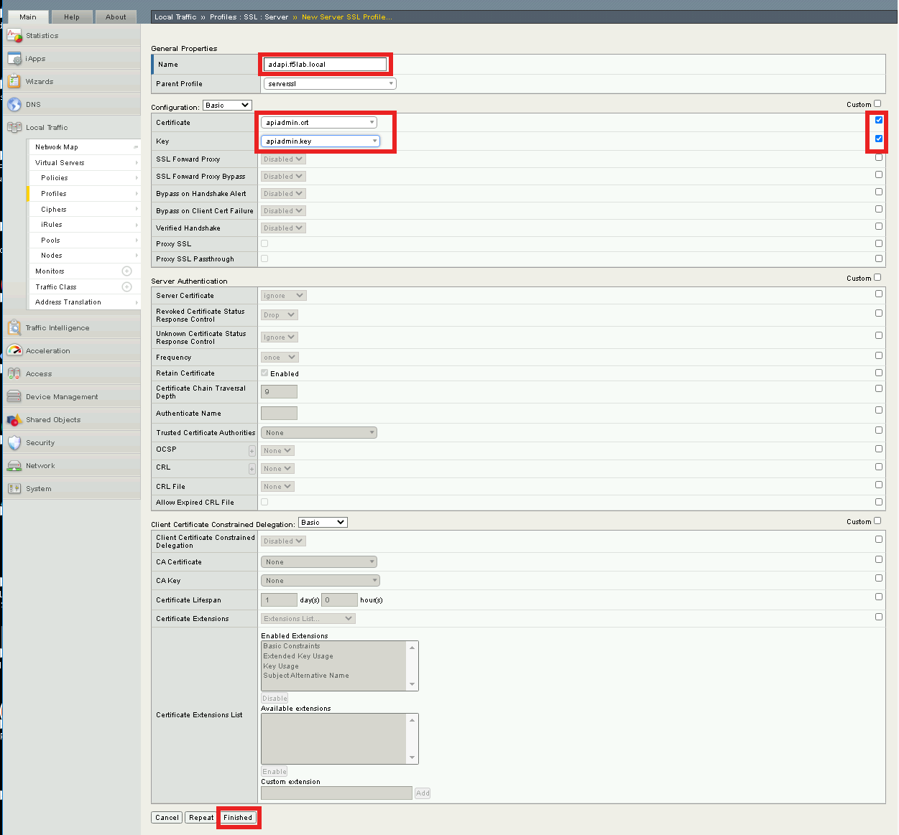
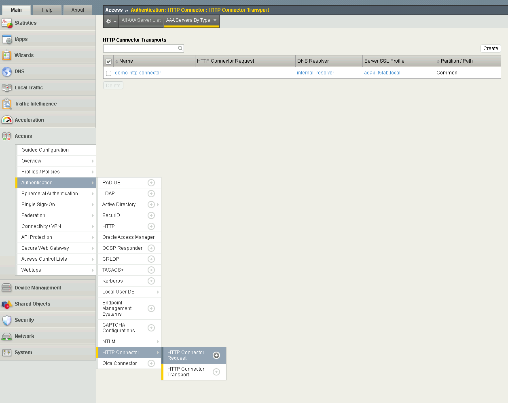
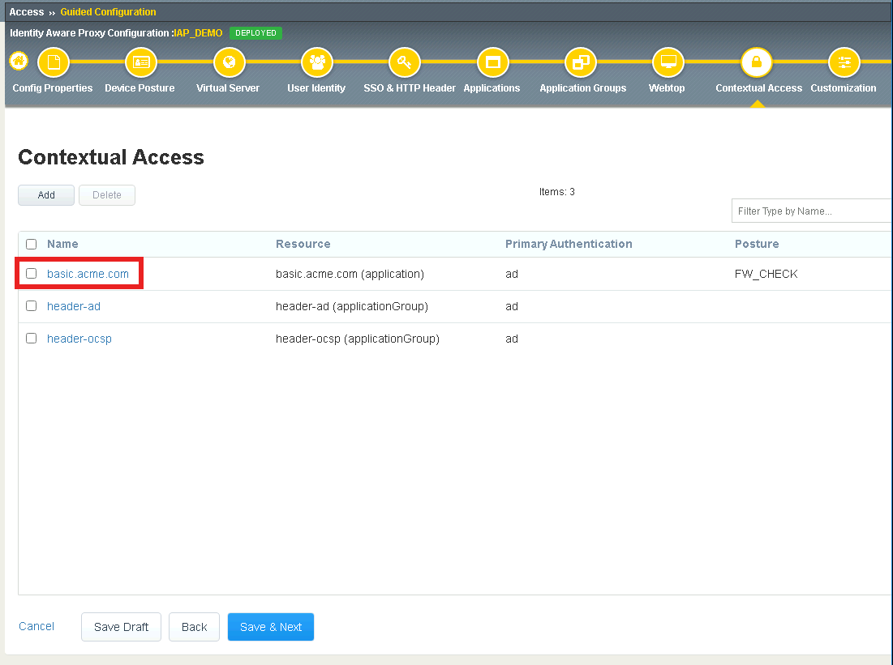
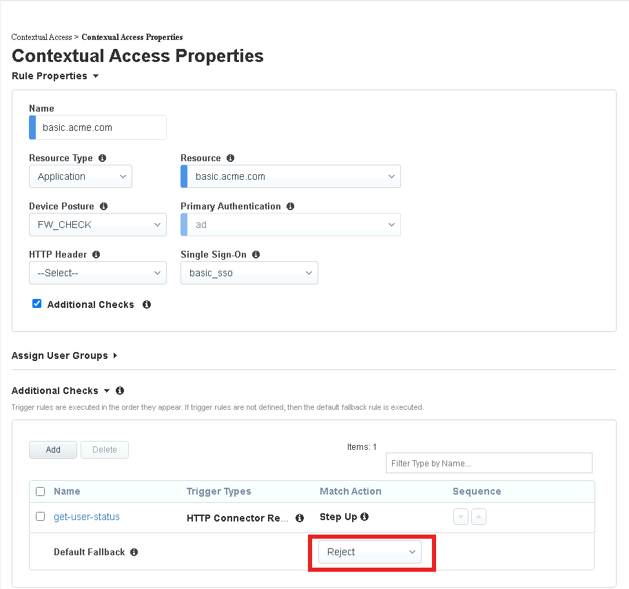
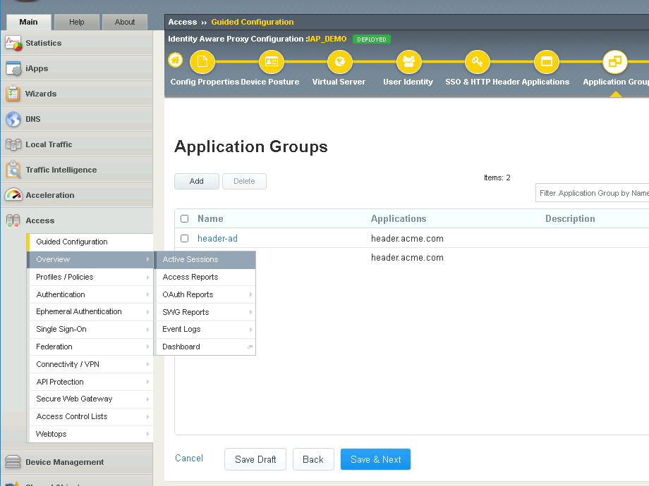
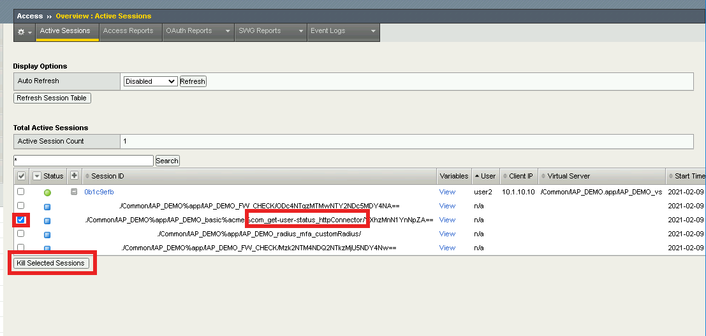
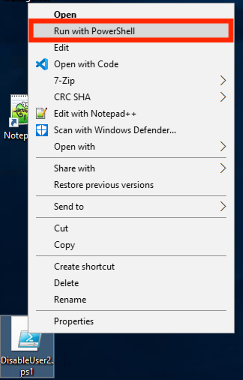

Lab 3: Utilize HTTP Connector(16.0)
======================================================

HTTP Connector is a feature released in BIG-IP APM 15.1 that allows HTTP requests to be initiated from a Per-Request Policy.  This could be used to send a request to an API to retrieve additional information to make an access control decision, or send information to update an external resource.  

  
Section 3.1 - Create the HTTP Connector Request
------------------------------------------------

The HTTP Connector is made up of two parts.  The first part is called the HTTP Connector Transport and it defines settings related to SSL, DNS, timeouts, and payload sizes.  The second part is the HTTP Connector Request which contains specific details such as HTTP Method, URL, message body, and how to handle the HTTP responses.

Task 1 - Create a DNS Resolver
~~~~~~~~~~~~~~~~~~~~~~~~~~~~~~~~

#. From the jumphost, return to Firefox then navigate to the BIG-IP GUI at https://bigip1.f5lab.local

#. Login with the following credentials:

         - User: **admin**
         - Password: **admin**

#. Navigate to Network >> DNS Resolvers >> DNS Resolver List. Click the  **+ (Plus symbol)** Symbol

   |image1|

#. Enter Name **internal_resolver** and click **Finished**

   |image2|

#. Click **internal_resolver** 

   |image3|

#. Click the **Forward Zones** tab

   |image4|

#. Click **Add**

   |image5|

#. Enter **. (a Single dot)** in the **Name** field
#. Add a Nameserver by entering Address **10.1.20.7** and click **Add**
#. Click **Finished**

   |image6|

Task 2 - Create a ServerSide SSL Profile
~~~~~~~~~~~~~~~~~~~~~~~~~~~~~~~~~~~~~~~~~~~~~~~~~~~~~~

#. Navigate to Local Traffic >> Profiles >> SSL >> Server. Click the  **+ (Plus Symbol)** Symbol

   |image7|

#. Enter Name **adapi.f5lab.local**
#. Check **Custom** box to the right of the Certificate and Key fields to make them editable.
#. Select **apiadmin.crt** from the Certificate dropdown
#. Select **apiadmin.key** from the key dropdown
#. Click **Finished** at the Bottom of the page

   |image8|

Task 3 - Create a HTTP Connector Transport
~~~~~~~~~~~~~~~~~~~~~~~~~~~~~~~~~~~~~~~~~~~~~~~~~~~~~~

#. Navigate to Access >> Authentication >> HTTP Connector >> HTTP Connector Transport  Click the  **+ (Plus Symbol)**

   |image9|

#. Enter the name **demo-http-connector**
#. Select **internal_resolver** from the DNS Resolver dropdown
#. Select **adapi.f5lab.local** from the Server SSL Profile
#. Click **Save**

   |image10|

Task 4 - Create a HTTP Connector Request
~~~~~~~~~~~~~~~~~~~~~~~~~~~~~~~~~~~~~~~~~~~~~~~~~~~~~~

#. Navigate to Access >> Authentication >> HTTP Connector >> HTTP Connector Request.  Click the  **+ (Plus Symbol)**

   |image11|

#. Enter name **get-aduser-attributes**
#. Select **demo-http-connector** from the dropdown 
#. Enter URL **https://adapi.f5lab.local:8443/user?username=%{perflow.username}**
#. Enter **GET** for the Method
#. Select **Parse** for the Response Action
#. Click **Save** 

   |image12|

Section 3.2 - Add HTTP Connector to the IAP Policy
--------------------------------------------------

Now that the HTTP Connector Request has been defined you will add it to basic.acme.com application and test.

Task 1 - Add the HTTP Connector Request
~~~~~~~~~~~~~~~~~~~~~~~~~~~~~~~~~~~~~~~~~~~~~~~~~~~~~~

#. From the web browser, click on the **Guided Configuration** 

   |image13|

#. Click **IAP_DEMO** 

   |image14|

#. Click on **Contextual Access**
   
   |image15|

#. Click on **basic.acme.com**

   |image16|

#. Click **Add** under Additional Checks

   |image17|

#. Enter Name **get-user-status**
#. Check **HTTP Connector Request**
#. Select **get-aduser-attributes** from the HTTP Connector Request dropdown
#. Under Value (Success Expression) enter **expr {[mcget {subsession.http_connector.body.userAccountControl}] == 66048 }**
#. Select **Step Up** from the Match Action dropdown
#. Select **Custom Radius based Authentication (MFA)** from the Step Up Authentication field

   |image18|

#. Change the **Match Action** field for the **Default Fallback** rule to **Reject**

   |image19|

#. Click **Assign User Groups**
#. Enter **Product Management** in the Primary Authentication filter Group Name
#. Click **Add** beside Product Management
#. Click **Any** under Selected User Groups
#. Click **Save**

   |image20|

#. Click **Deploy**. Deployment will take a few moments

   |image21|

Section 3.3 - Testing
------------------------------------------------

In this section you will test how HTTP connector can influence policy changes dynamically as conditions change in the network 

Task 1 - Access basic.acme.com
~~~~~~~~~~~~~~~~~~~~~~~~~~~~~~~~~~~~~~~~~~

#. From the Jumphost's Firefox browser access the site **https://iap1.acme.com**
#. Login with the Username: **user2** and Password: **user2**

   |image24|

#. Click the **basic.acme.com** tile  

   |image25|

#. Enter the PIN **123456** for RADIUS authentication

   |image26|

#. You will be presented the website

   |image27|

#. From a separate browser tab access the BIG-IP management interface https://bigip1.f5lab.local

#. Navigate to Access >> Overview >> **Active Sessions**

   |image28|

#. You will see an active session for **user2**.
#. Expand the session to see all the sub-sessions by clicking the **+ (Plus symbol)** to the left of the session ID.  

   .. note:: Your session ID will not match the one displayed in the screenshot below.

   |image29|

#. Click **View** to the right of the HTTP Connector request **get-user-status** to see the sub-session variables.

   |image30|

#. You will notice that HTTP Connector received multiple values back in the response and each JSON key was parsed to individual subsession variables. 
#. userAccountControl is currently set to **66048**.  Which mean the account is enabled and the password never expires.

   |image31|

#. Click **Cancel**

#. Expand the session to see all the sub-sessions by clicking the **+ (Plus Symbol)** to the left of the session ID.  

   .. note:: You session ID will not match the one displayed in the screenshot below.

   |image32|

#. If the HTTP Connector sub-session still exists check off that specific sub-session only and click **Kill Selected Sessions**

   .. NOTE:: You are doing this to speed up the process and bypass the typical timers associated with HTTP Connector. This will enable you to see HTTP Connector trigger immediately on the next HTTP request sent from the jumphost.

   |image33|

#. Locate DisableUser2.ps1 Powershell script located on the desktop.  

#. Right click the script and select **Run with PowerShell**.  A Powershell window will appear displaying User2 account is Disabled.

   |image35|

#. Return to webtop and click the **basic.acme.com** tile.

   |image36|

#. Click on one of the links for the website.  You will receive a **Deny Page**.

   |image37|

#. If you return to the sub-session variables screen in BIG-IP you will see UserAccountControl was **66050**.

   |image38|

#. This concludes lab 3.

   |image100|

.. |image0| image:: media/lab03/image000.png

.. |image2| image:: media/lab03/image002.png
.. |image3| image:: media/lab03/image003.png
.. |image4| image:: media/lab03/image004.png
.. |image5| image:: media/lab03/image005.png

.. |image7| image:: media/lab03/image007.png

.. |image9| image:: media/lab03/image009.png
.. |image10| image:: media/lab03/image010.png

.. |image12| image:: media/lab03/image012.png
	:width: 800px
.. |image13| image:: media/lab03/image013.png
.. |image14| image:: media/lab03/image014.png
.. |image15| image:: media/lab03/image015.png
	:width: 1200px

.. |image17| image:: media/lab03/image017.png
.. |image18| image:: media/lab03/image018.png

.. |image20| image:: media/lab03/image020.png

.. |image21| image:: media/lab03/image021.png
.. |image22| image:: media/lab03/image022.png
.. |image23| image:: media/lab03/image023.png
.. |image24| image:: media/lab03/image024.png
.. |image25| image:: media/lab03/image025.png
.. |image26| image:: media/lab03/026.png
.. |image27| image:: media/lab03/image027.png

.. |image29| image:: media/lab03/image029.png
	:width: 1000px
.. |image30| image:: media/lab03/image030.png
.. |image31| image:: media/lab03/image031.png

.. |image33| image:: media/lab03/image033.png
.. |image34| image:: media/lab03/image034.png

.. |image36| image:: media/lab03/image036.png
.. |image37| image:: media/lab03/image037.png
.. |image38| image:: media/lab03/image038.png
.. |image100| image:: media/lab03/image100.png

