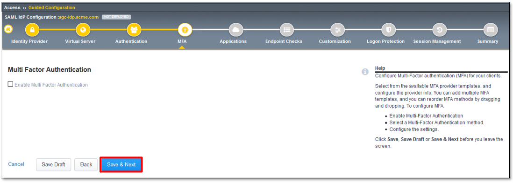
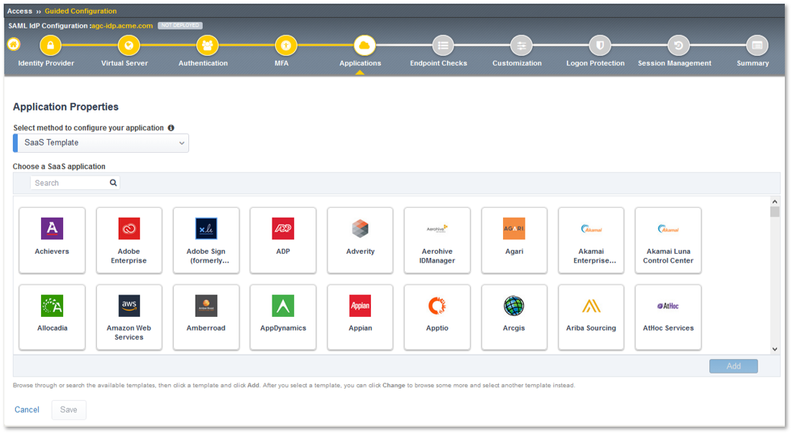
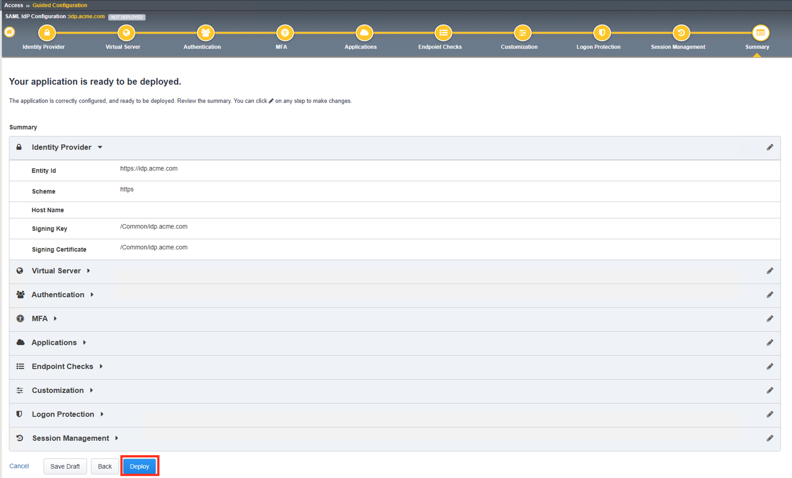
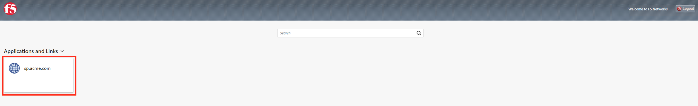
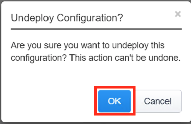
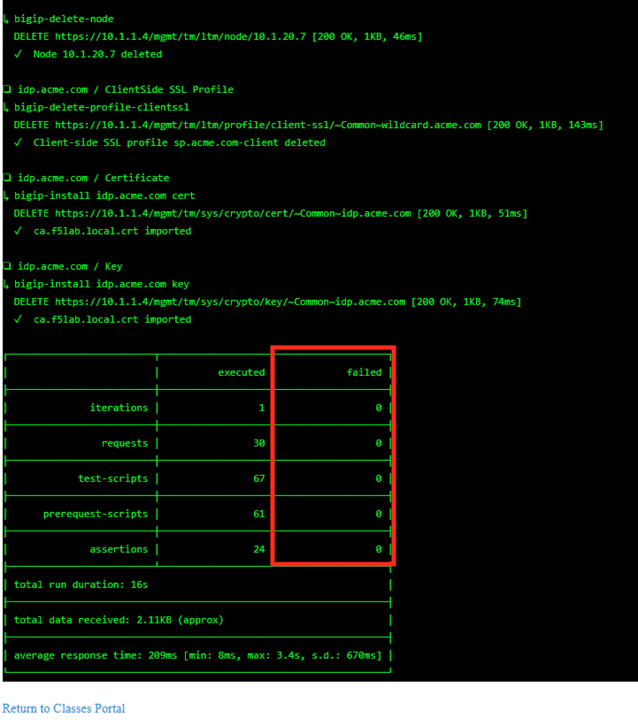
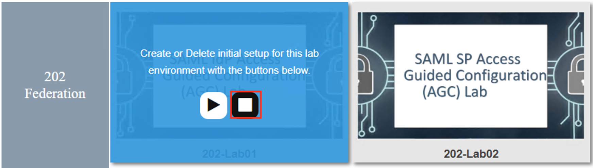
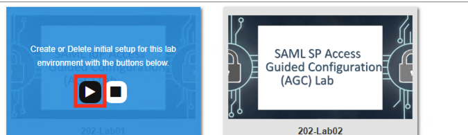

Lab 1: SAML IdP Access Guided Configuration (AGC) Lab
======================================================

The purpose of this lab is to configure and test SAML Federation Services.

Students will leverage Access Guided Configuration (AGC) to 
configure the various aspects of a SAML Identity Provider (IdP), import and bind
to a SAML Service Provider (SP) and test IdP-Initiated SAML Federation.

Objective:
------------

-  Gain an understanding of SAML Federation configurations and
   their component parts through Access Guided Configuration (AGC)

-  Gain an understanding of the access flow for IDP & SP Initiated SAML

Lab Requirements:
-----------------

-  All Lab requirements will be noted in the tasks that follow

-  Estimated completion time: 25-30 minutes

Task 1 - Setup Lab environment
---------------------------------

To access your dedicated student lab environment, you will require a web browser and Remote Desktop Protocol (RDP) client software. The web browser will be used to access the Lab Training Portal. The RDP client will be used to connect to the Jump Host, where you will be able to access the BIG-IP management interfaces (HTTPS, SSH).

#. Click **DEPLOYMENT** located on the top left corner to display the environment

#. Click **ACCESS** next to jumpbox.f5lab.local

   |image999|

#. Select your RDP solution.  

#. The RDP client on your local host establishes a RDP connection to the Jump Host.

#. Login with the following credentials:

         - User: **f5lab\\user1**
         - Password: **user1**

#. After successful logon the Chrome browser will auto launch opening the site https://portal.f5lab.local.  This process usually takes 30 seconds after logon.

#. Click the **Classes** tab at the top of the page.

	|image998|

#. Scroll down the page until you see **202 - Federation** on the left

   |image997|

#. Hover over tile **SAML IdP Access Guided Configuration(AGC) Lab**. A start and stop icon should appear within the tile.  Click the **Play** Button to start the automation to build the environment

   |image996|

#. The screen should refresh displaying the progress of the automation within 30 seconds.  Scroll to the bottom of the automation workflow to ensure all requests succeeded.  If you you experience errors try running the automation a second time or open an issue on the `Access Labs Repo <https://github.com/f5devcentral/access-labs>`__.

   |image995|

TASK 2 - Configure a SAML Identity Provider (IdP) via AGC 
-------------------------------------------------------------

+----------------------------------------------------------------------------------------------+
| 1. Login to your lab provided **Virtual Edition BIG-IP**  by clicking **bigip1** in the      |
|                                                                                              |
|    shortcut toolbar from the Jumphost.  Username: **admin**, Password: **admin**.            |
|                                                                                              |
| **Note:** *Many of the lab steps will need to be run from the Jumphost. This is to support*  |
|                                                                                              |
| *file imports and various other tasks.*                                                      |
+----------------------------------------------------------------------------------------------+
| |image001|                                                                                   |
+----------------------------------------------------------------------------------------------+

+----------------------------------------------------------------------------------------------+
| 2. Navigate to **Access -> Guided Configuration** in the left-hand menu.                     |
+----------------------------------------------------------------------------------------------+
| |image002|                                                                                   |
+----------------------------------------------------------------------------------------------+

+----------------------------------------------------------------------------------------------+
| 3. Once **Guided Configuration** loads, click on **Federation** and then in the resulting    |
|                                                                                              |
|    **Federation** sub-menu click, **SAML Identity Provider Federation for Applications**.    |
+----------------------------------------------------------------------------------------------+
| |image003|                                                                                   |
+----------------------------------------------------------------------------------------------+

+----------------------------------------------------------------------------------------------+
| 4. In the resulting **SAML Identity Provider Federation for Applications** window,           |
|                                                                                              |
|    review the **IdP-Initiated SAML flow** and then click the **right arrow**.                |
+----------------------------------------------------------------------------------------------+
| |image004|                                                                                   |
+----------------------------------------------------------------------------------------------+

+----------------------------------------------------------------------------------------------+
| 5. Review the **SP-Initiated SAML flow** and then scroll down to the bottom of the window.   |
+----------------------------------------------------------------------------------------------+
| |image005|                                                                                   |
+----------------------------------------------------------------------------------------------+

+----------------------------------------------------------------------------------------------+
| 6. Review the configuration objects to be created and the click **Next**.                    |
+----------------------------------------------------------------------------------------------+
| |image006|                                                                                   |
+----------------------------------------------------------------------------------------------+

TASK 3 - Configure the Identity Provider
-------------------------------------------------------------

+----------------------------------------------------------------------------------------------+
| 1. In the **Identity Provider Properties** section, enter the following values in the fields |
|                                                                                              |
|    provided:                                                                                 |
|                                                                                              |
|    * In the **Configuration Name** field input **idp.acme.com**.                             |
|                                                                                              |
|    * In the **Entity ID** field input **https://idp.acme.com**.                              |
|                                                                                              |
| 2. In the **Assertion Properties** section, use the dropdowns to select the following:       |
|                                                                                              |
|    * For the **Signing Key** select **idp.acme.com**.                                        |
|                                                                                              |
|    * For the **Signing Certificate** select **idp.acme.com**.                                |
|                                                                                              |
| 3. Click **Save & Next**.                                                                    |
+----------------------------------------------------------------------------------------------+
| |image007|                                                                                   |
+----------------------------------------------------------------------------------------------+

TASK 4 - Configure the Virtual Server
-------------------------------------------------------------

+----------------------------------------------------------------------------------------------+
| 1. In the **Virtual Server Properties** section, enter the following values in the fields    |
|                                                                                              |
|    provided:                                                                                 |
|                                                                                              |
|    * In the **Destination Address** field input **10.1.10.102**.                             |
|                                                                                              |
|    * In the **Service Port** field input **443** **HTTPS**                                   |
|                                                                                              |
|    * In the **Redirect Port** field input **80** **HTTP**                                    |
|                                                                                              |
| 2. In the **Client SSL Profile** section, use the arrows to move only the                    |
|                                                                                              |
|    **wildcard.acme.com** profile to the right-hand column as shown.                          |
|                                                                                              |
| 3. Click **Save & Next**.                                                                    |
+----------------------------------------------------------------------------------------------+
| |image008|                                                                                   |
+----------------------------------------------------------------------------------------------+

TASK 5 - Configure Authentication
-------------------------------------------------------------

+----------------------------------------------------------------------------------------------+
| 1. In the **Authentication Properties** section, use the dropdowns to select the following:  |
|                                                                                              |
|    * For the **Choose Authentication Server Type** select **Active Directory**.              |
|                                                                                              |
|    * For the **Choose Authentication Server** select **f5lab.local**.                        |
|                                                                                              |
| 2. **Check** the **Active Directory Query Properties** checkbox.                             |
|                                                                                              |
| 3. Input **%{session.logon.last.username}** in **Search Filter** field. Your cursor will be  |
|                                                                                              |
|    next to the existing **sAMAccountName=**.                                                 |
|                                                                                              |
| 4. In the **Required Attributes** section, use the arrows to move only the                   |
|                                                                                              |
|    **memberOf** attribute to the right-hand column as shown.                                 |
|                                                                                              |
| 5. Scroll to the bottom of the window and click **Save & Next**.                             |
+----------------------------------------------------------------------------------------------+
| |image009|                                                                                   |
+----------------------------------------------------------------------------------------------+

TASK 6 - Configure MFA
-------------------------------------------------------------

+----------------------------------------------------------------------------------------------+
| 1. In the Multi Factor Authentication winodw, click **Save & Next**.                         |
|                                                                                              |
| **Note:** *Multiple MFA options can be easily integrated with TMOS.*                         |
+----------------------------------------------------------------------------------------------+
| |image010|                                                                                   |
+----------------------------------------------------------------------------------------------+

TASK 7: Configure Applications
-------------------------------------------------------------

+----------------------------------------------------------------------------------------------+
| 1. In the **Application Properties** section, use the **Select method to configure your**    |
|                                                                                              |
|    **application** dropdown to choose **Metadata**.                                          |
|                                                                                              |
| **Note:** *Multiple applications are available to be configured with more continually added* |
+----------------------------------------------------------------------------------------------+
| |image011|                                                                                   |
+----------------------------------------------------------------------------------------------+

+----------------------------------------------------------------------------------------------+
| 2. In the updated **Application Properties** window, click the **Choose File** button, browse|
|                                                                                              |
|    the **Jumphost** desktop and select the **sp_acme_com.xml** file.                         |
|                                                                                              |
| 3. For the **Application Name**, input **sp.acme.com**                                       |
|                                                                                              |
| 4. For the **Webtop Caption**, make sure the value is **sp.partner.com**                     |
|                                                                                              |
| 5. Scroll to the bottom of the window and click **Save**.                                    |
+----------------------------------------------------------------------------------------------+
| |image012|                                                                                   |
+----------------------------------------------------------------------------------------------+

+----------------------------------------------------------------------------------------------+
| 6. Review the **Configured Application List** and then click **Save & Next**.                |
+----------------------------------------------------------------------------------------------+
| |image013|                                                                                   |
+----------------------------------------------------------------------------------------------+

TASK 8 - Configure Endpoint Checks
-------------------------------------------------------------

+----------------------------------------------------------------------------------------------+
| 1. In the **Endpoints Checks Properties** window, click **Save & Next**.                     |
|                                                                                              |
| **Note:** *Endpoints checks can also be configured to protect application access.  The*      |
|                                                                                              |
| *Access 302 Lab, hosted at this year's Agility will have additional details.*                |
+----------------------------------------------------------------------------------------------+
| |image014|                                                                                   |
+----------------------------------------------------------------------------------------------+

TASK 9 - Configure Customization
-------------------------------------------------------------

+----------------------------------------------------------------------------------------------+
| 1. Review the Customization options, then scroll to the bottom of the window and click       |
|                                                                                              |
|    **Save & Next**.                                                                          |
|                                                                                              |
| **Note:** *Unlike iApps, Access basic customizations are part of AGC.*                       |
+----------------------------------------------------------------------------------------------+
| |image015|                                                                                   |
+----------------------------------------------------------------------------------------------+

TASK 10 - Configure Logon Protection
-------------------------------------------------------------

+----------------------------------------------------------------------------------------------+
| 1. In the **Logon Protection Properties** window, click **Save & Next**.                     |
|                                                                                              |
| **Note:** *Logon Page Protection enables Datasafe to further protect logon pages and*        |
|                                                                                              |
| *defend against malicious in-browser attacks*.                                               |
+----------------------------------------------------------------------------------------------+
| |image016|                                                                                   |
+----------------------------------------------------------------------------------------------+

TASK 11: Configure Session Management
-------------------------------------------------------------

+----------------------------------------------------------------------------------------------+
| 1. Review the Session Managment settings, in the **Timeout Settings** section then scroll to |
|                                                                                              |
|    the bottom of the window and click **Save & Next**.                                       |
+----------------------------------------------------------------------------------------------+
| |image017|                                                                                   |
+----------------------------------------------------------------------------------------------+

TASK 12: Review the Summary and Deploy
-------------------------------------------------------------

+----------------------------------------------------------------------------------------------+
| 1. Review the Summary, then scroll to the bottom of the window and click **Deploy**.         |
+----------------------------------------------------------------------------------------------+
| |image018|                                                                                   |
+----------------------------------------------------------------------------------------------+

+----------------------------------------------------------------------------------------------+
| 2. Once the application is deployed, scroll to the bottom and click **Finish**.              |
+----------------------------------------------------------------------------------------------+
| |image019|                                                                                   |
+----------------------------------------------------------------------------------------------+

+----------------------------------------------------------------------------------------------+
| 3. Review the Access Guided Confguration window, **Status** for **idp.acme.com** is          |
|                                                                                              |
|    **DEPLOYED**.                                                                             |
+----------------------------------------------------------------------------------------------+
| |image020|                                                                                   |
+----------------------------------------------------------------------------------------------+

TASK: 13: Testing the SAML Identity Provider (IdP)
-------------------------------------------------------------

+----------------------------------------------------------------------------------------------+
| 1. Open Firefox from the Jumphost desktop and navigate to https://idp.acme.com               |
|                                                                                              |
| 2. Once the page loads, enter **user1** for username and **user1** for password  in the      |
|                                                                                              |
|    logon form and click the logon button.                                                    |
|                                                                                              |
| **Note:** *If you have issues, open Firefox in a New Private Window (Incognito/Safe Mode)*   |
+----------------------------------------------------------------------------------------------+
| |image021|                                                                                   |
+----------------------------------------------------------------------------------------------+

+----------------------------------------------------------------------------------------------+
| 3. On the presented webtop, click the **sp.acme.com** link in the **Applications and**       |
|                                                                                              |
|    **Links** section.                                                                        |
+----------------------------------------------------------------------------------------------+
| |image023|                                                                                   |
+----------------------------------------------------------------------------------------------+
 
+----------------------------------------------------------------------------------------------+
| 4. The **Application** will now open if successfully configured.  Close the                  |
|                                                                                              |
|    Application window, navigate to the **F5 Dynamic Webtop** tab/window and click **Logout**.|
+----------------------------------------------------------------------------------------------+
| |image024|                                                                                   |
+----------------------------------------------------------------------------------------------+

TASK 14: Lab CleanUp
-------------------------------------------------------------

+----------------------------------------------------------------------------------------------+
| 1. Navigate to **Access -> Guided Configuration** in the left-hand menu.                     |                                                                  
+----------------------------------------------------------------------------------------------+
| |image002|                                                                                   |
+----------------------------------------------------------------------------------------------+

+----------------------------------------------------------------------------------------------+
| 2. Click the **Undeploy** button                                                             |                                                                  
+----------------------------------------------------------------------------------------------+
| |image025|                                                                                   |
+----------------------------------------------------------------------------------------------+

+----------------------------------------------------------------------------------------------+
| 3. Click **OK** when asked, "Are you sure you want to undeploy this configuration?"          |                                                                  
+----------------------------------------------------------------------------------------------+
| |image026|                                                                                   |
+----------------------------------------------------------------------------------------------+

+----------------------------------------------------------------------------------------------+
| 4. Click the **Delete** button once the deployment is undeployed                             |                                                                  
+----------------------------------------------------------------------------------------------+
| |image027|                                                                                   |
+----------------------------------------------------------------------------------------------+

+----------------------------------------------------------------------------------------------+
| 5. Click **OK** when asked, "Are you sure you want to delete this configuration?"            |                                                                  
+----------------------------------------------------------------------------------------------+
| |image028|                                                                                   |
+----------------------------------------------------------------------------------------------+

+----------------------------------------------------------------------------------------------+
| 6. The Configuration section should now be empty                                             |
+----------------------------------------------------------------------------------------------+
| |image029|                                                                                   |
+----------------------------------------------------------------------------------------------+

+----------------------------------------------------------------------------------------------+
| 7. From a browser on the jumphost navigate to https://portal.f5lab.local                     |
|                                                                                              |
| 8. Click the **Classes** tab at the top of the page.                                         |
+----------------------------------------------------------------------------------------------+
| |image998|                                                                                   |
+----------------------------------------------------------------------------------------------+

+----------------------------------------------------------------------------------------------+
| 9. Scroll down the page until you see **202 - Federation** on the left                       |                                                                  
+----------------------------------------------------------------------------------------------+
| |image997|                                                                                   |
+----------------------------------------------------------------------------------------------+

+----------------------------------------------------------------------------------------------+
| 10. Hover over the tile **SAML IdP Access Guided Configuration(AGC) Lab**. A start and stop  |
| icon should appear within the tile.  Click the **Stop** Button to start the automation to    |
| delete any prebuilt objects                                                                  |                                                                  
+----------------------------------------------------------------------------------------------+
| |image045|                                                                                   |
+----------------------------------------------------------------------------------------------+

+----------------------------------------------------------------------------------------------+
| 11. The screen should refresh displaying the progress of the automation within 30 seconds.   |  
| Scroll to the bottom of the automation workflow to ensure all requests succeeded.            |
| If you you experience errors try running the automation a second time or open an issue on    | 
| the `Access Labs Repo <https://github.com/f5devcentral/access-labs>`__.                      |
|                                                                                              |                                             
+----------------------------------------------------------------------------------------------+
| |image044|                                                                                   |
+----------------------------------------------------------------------------------------------+

+----------------------------------------------------------------------------------------------+
| 12. This concludes Lab1.                                                                     |
|                                                                                              |
+----------------------------------------------------------------------------------------------+
| |image000|                                                                                   |
+----------------------------------------------------------------------------------------------+

.. |image000| image:: ./media/lab01/000.png
   :width: 800px
.. |image001| image:: ./media/lab01/lab1-001.png
   :width: 800px
.. |image002| image:: ./media/lab01/lab1-002.png
   :width: 800px
.. |image003| image:: ./media/lab01/lab1-003.png
   :width: 800px
.. |image004| image:: ./media/lab01/lab1-004.png
   :width: 800px
.. |image005| image:: ./media/lab01/lab1-005.png
   :width: 800px
.. |image006| image:: ./media/lab01/lab1-006.png
   :width: 800px
.. |image007| image:: ./media/lab01/007.png
   :width: 800px
.. |image008| image:: ./media/lab01/lab1-008.png
   :width: 800px
.. |image009| image:: ./media/lab01/lab1-009.png
   :width: 800px

.. |image012| image:: ./media/lab01/012.png
   :width: 800px
.. |image013| image:: ./media/lab01/013.png
   :width: 800px
.. |image014| image:: ./media/lab01/lab1-014.png
   :width: 800px
.. |image015| image:: ./media/lab01/lab1-015.png
   :width: 800px
.. |image016| image:: ./media/lab01/lab1-016.png
   :width: 800px
.. |image017| image:: ./media/lab01/lab1-017.png
   :width: 800px

.. |image019| image:: ./media/lab01/019.png
   :width: 800px
.. |image020| image:: ./media/lab01/lab1-020.png
   :width: 800px
.. |image021| image:: ./media/lab01/021.png
   :width: 800px

.. |image024| image:: ./media/lab01/024.png
   :width: 800px
.. |image025| image:: ./media/lab01/025.png
   :width: 800px

.. |image027| image:: ./media/lab01/027.png
   :width: 800px
.. |image028| image:: ./media/lab01/028.png
   :width: 800px
.. |image029| image:: ./media/lab01/029.png
   :width: 800px
.. |image030| image:: ./media/lab01/lab1-030.png
   :width: 800px
.. |image031| image:: ./media/lab01/lab1-031.png
   :width: 800px
.. |image032| image:: ./media/lab01/lab1-032.png
   :width: 800px
.. |image033| image:: ./media/lab01/lab1-033.png
   :width: 800px
.. |image034| image:: ./media/lab01/lab1-034.png
   :width: 800px
.. |image035| image:: ./media/lab01/lab1-035.png
   :width: 800px
.. |image036| image:: ./media/lab01/lab1-036.png
   :width: 800px
.. |image037| image:: ./media/lab01/lab1-037.png
   :width: 800px
.. |image038| image:: ./media/lab01/lab1-038.png
   :width: 800px
.. |image039| image:: ./media/lab01/lab1-039.png
   :width: 800px
.. |image040| image:: ./media/lab01/lab1-040.png
   :width: 800px
.. |image041| image:: ./media/lab01/lab1-041.png
   :width: 800px
.. |image042| image:: ./media/lab01/lab1-042.png
   :width: 800px
.. |image043| image:: ./media/lab01/lab1-043.png
   :width: 800px

.. |image995| image:: ./media/lab01/995.png
   :width: 800px

.. |image997| image:: ./media/lab01/997.png
   :width: 800px
.. |image998| image:: ./media/lab01/998.png
   :width: 800px 
.. |image999| image:: ./media/lab01/999.png
   :width: 800px

