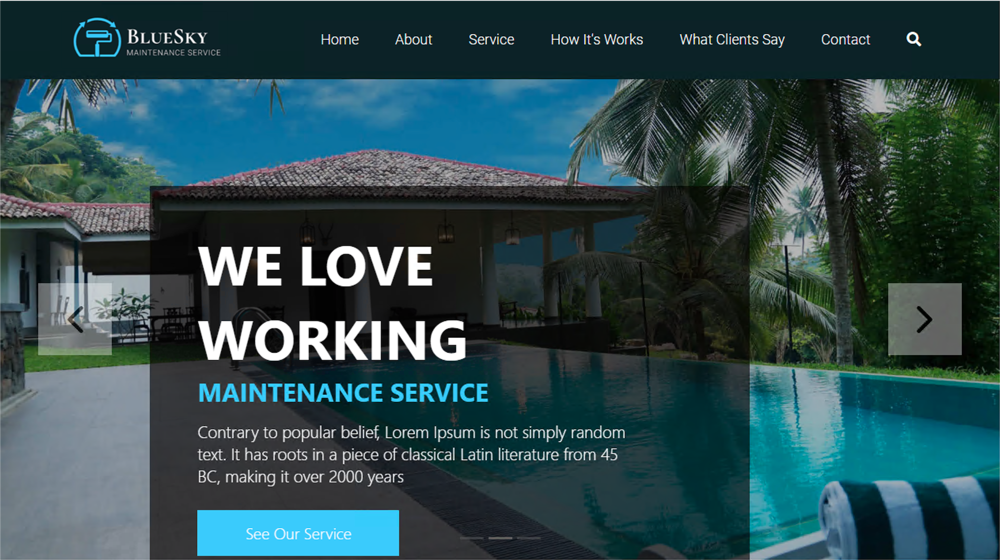

Architecture of Internal Apps
#############################

Bluesky application
*******************

This application resides on-prems in IIS server. Its FQDN is ``https://bluesky.f5access.onmicrosoft.com`` 

This application is not **authenticated**, meaning there is no **Single Sign on** required in front of this app.

|

Vanilla application
*******************

This application resides on-prems in IIS server. Its FQDN is ``https://vanilla.f5access.onmicrosoft.com`` 

This application is **authenticated** by Kerberos. So a **Signle Sign On** will be required to connect to this app.

.. image:: ../pictures/module1/vanilla.png
   :align: center

**Check IIS configuration**

#. RDP to IIS with ``f5access\user`` as user, and ``user`` as password
#. Click ``IIS manager`` icon in the taskbar

   .. image:: ../pictures/module1/winmenu.png
      :align: center
      :scale: 50%

#. In the Connections tree, click on ``vanilla`` and ``Authentication``

   .. image:: ../pictures/module1/IIS_vanilla.png
      :align: center
      :scale: 50%

#. You can notice ``Anonymous Auth`` is **Disabled** and ``Windows Authentication`` is **Enabled**

   .. image:: ../pictures/module1/vanilla_krbt.png
      :align: center
      :scale: 50%

.. note :: In the next class we will configure APM to publish, protect and SSO to internal apps.