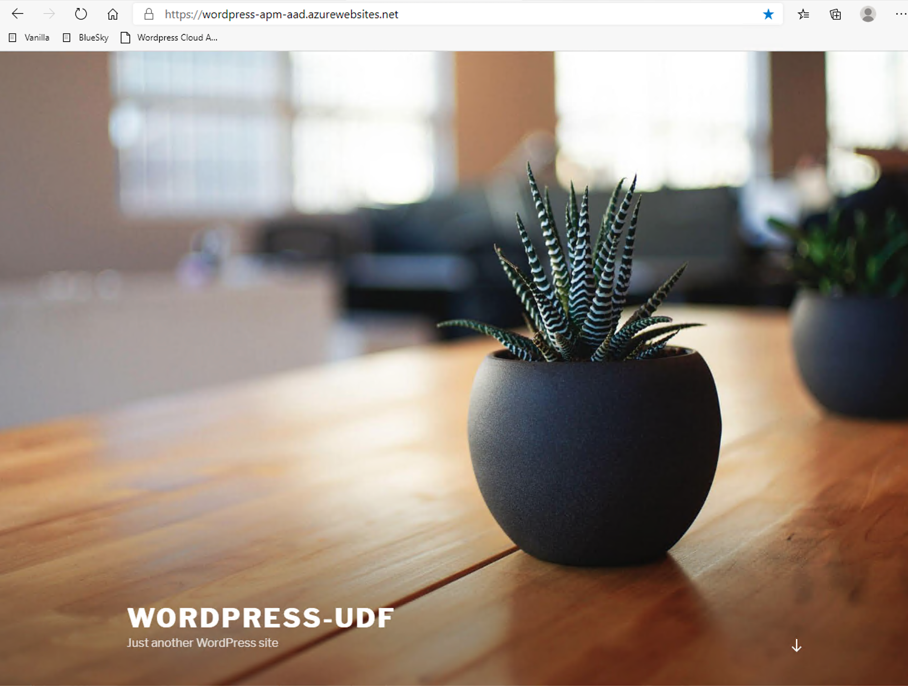

Architecture of Cloud App
#########################

.. note :: In this use case, we don't cover only internal, sensitive or legacy applications. In a real world, customers have applications on-prems and in the public cloud.

.. note :: A Wordpress application is already up and running in Azure Cloud at this address ``https://wordpress-apm-aad.azurewebsites.net/``

#. This Wordpress application is an Azure App Service.

   .. image:: ../pictures/module2/azure.png
      :align: center

#. This App Service is already bound with our demo Azure AD tenant.

   .. image:: ../pictures/module2/OIDC.png
      :align: center
      :scale: 50%

.. warning :: It is important to note this application is **not tied** to APM. APM only publishes and protects on-prems apps. All other cloud and SaaS apps are directly connected to Azure AD.

