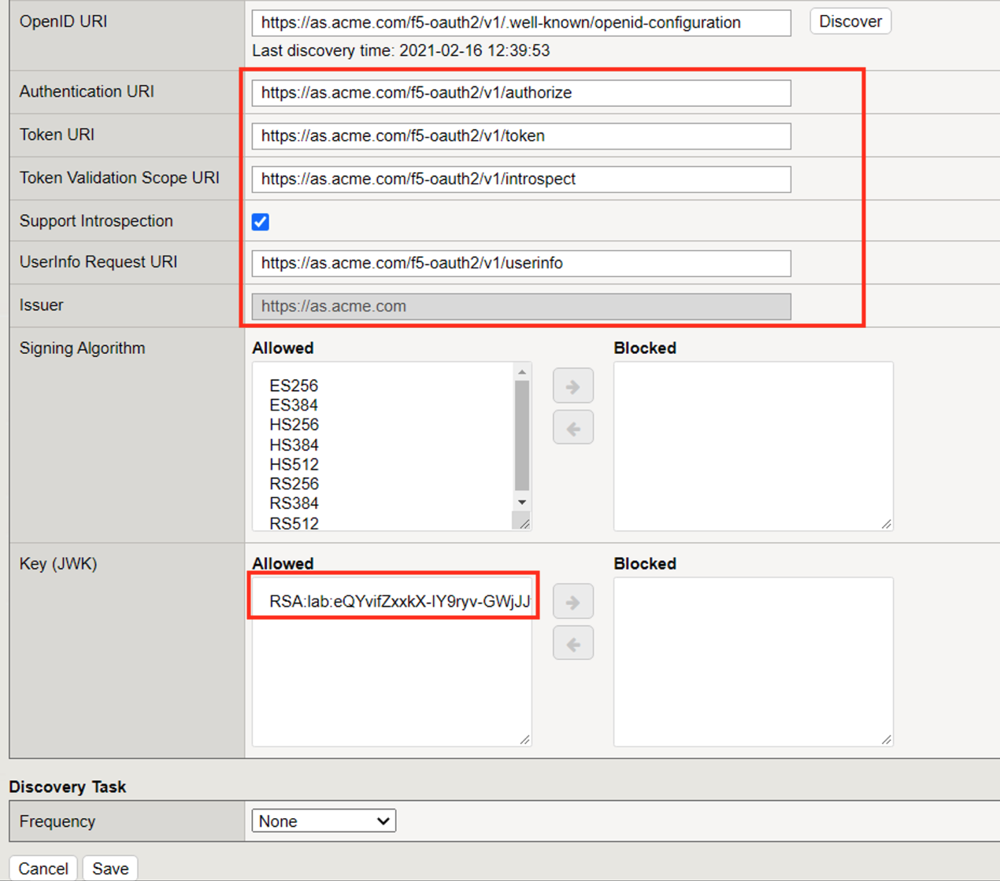
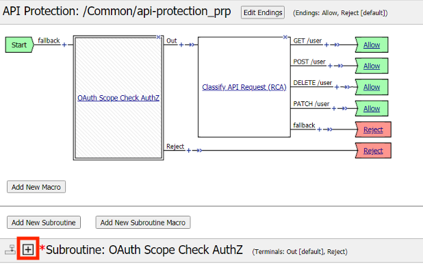

Lab 1: Azure AD Easy Button integration
=============================================

.. warning :: For any remark or mistake in this lab, please send a Teams chat to Matthieu DIERICK.

In this lab, you will learn how to connect APM to Azure AD as IDaaS. Since v15.1, you can enable APM as SAML SP and Azure AD as SAML IDP. 
In this lab, we will use the new **Easy Button** Guided Configuration template. This template:

#. Publish on-prems apps
#. Enable Single Sign on
#. Interconnect (SAML binding) APM with Azure AD tenant

.. note :: You will notice we will never connect to Azure AD interface. APM will use Microsoft Graph API to configure AAD tenant accordingly.

   |image001|

In the video below, you can see the use case. This is **not** the **lab video**, it is the public facing use case demo.

.. raw:: html

    

    <iframe width="896" height="504" src="https://www.youtube.com/embed/6NDUaDz7NQE" frameborder="0" allow="accelerometer; autoplay; encrypted-media; gyroscope; picture-in-picture" allowfullscreen></iframe>
    

Section 1.1 - Check the Lab Architecture
--------------------------------------------

In this lab, we will protect 3 apps:

#. 2 internal apps
   
   #. ``Vanilla`` Application hosted in IIS
   #. ``Skyblue`` Application hosted in IIS

#. 1 cloud app hosted in Azure cloud

   #. ``Wordpress-UDF`` hosted in Azure cloud

   |image002|

Architecture of Internal Apps
~~~~~~~~~~~~~~~~~~~~~~~~~~~~~~~~

Bluesky application
*******************

This application resides on-prems in IIS server. Its FQDN is ``https://bluesky.f5access.onmicrosoft.com`` 

This application is not **authenticated**, meaning there is no **Single Sign on** required in front of this app.

   |image003|

Vanilla application
*******************

This application resides on-prems in IIS server. Its FQDN is ``https://vanilla.f5access.onmicrosoft.com`` 

This application is **authenticated** by Kerberos. So a **Signle Sign On** will be required to connect to this app.

   |image004|

Task 1  - Check IIS configuration
~~~~~~~~~~~~~~~~~~~~~~~~~~~~~~~~~~~

#. RDP to IIS with ``f5access\user`` as user, and ``user`` as password
#. Click ``IIS manager`` icon in the taskbar

   |image005|

#. In the Connections tree, click on ``vanilla`` and ``Authentication``

   |image006|

#. You can notice ``Anonymous Auth`` is **Disabled** and ``Windows Authentication`` is **Enabled**

   |image007|

.. note :: In the next class we will configure APM to publish, protect and SSO to internal apps.

Architecture of Cloud App
~~~~~~~~~~~~~~~~~~~~~~~~~~~~~~~~

.. note :: In this use case, we don't cover only internal, sensitive or legacy applications. In a real world, customers have applications on-prems and in the public cloud.

.. note :: A Wordpress application is already up and running in Azure Cloud at this address ``https://wordpress-apm-aad.azurewebsites.net/``

   |image008|

#. This Wordpress application is an Azure App Service.

   |image009|

#. This App Service is already bound with our demo Azure AD tenant.

   |image010|

 
.. warning :: It is important to note this application is **not tied** to APM. APM only publishes and protects on-prems apps. All other cloud and SaaS apps are directly connected to Azure AD.

Section 1.2 - Deploy APM to protect Bluesky App
--------------------------------------------------------

In this section, we will publish the ``Bluesky`` application hosted on-prems.

Task 1 - Publish and protect Bluesky app
~~~~~~~~~~~~~~~~~~~~~~~~~~~~~~~~~~~~~~~~~~~~~

Let's start with ``Bluesky`` application. Reminder, Bluesky does not have any ``Authentication`` enabled. 

#. Connect to BIG-IP HTTPS user interface from UDF as ``admin`` and password ``admin``
#. In ``Access`` > ``Guided Configuration``, select ``Microsoft Integration`` > ``Azure AD application`` 

|image011|

Task 2 - Configuration Properties
~~~~~~~~~~~~~~~~~~~~~~~~~~~~~~~~~~~~~

#. Click ``Next`` and start the configuration
#. Configure the page as below

   #. Configuration Name : ``IIS-Bluesky-<My Name>``  Why my name ? Because this app will be created in Azure AD tenant. And we need to differentiate all apps. Example : ``IIS-Bluesky-Matt``
   #. In ``Azure Service Account Details``, Select ``Copy Account Info form Existing Configuration``, and select ``IIS-baseline``, then click ``Copy``

      |image012|

    
      .. note:: In a real world, you will set here the values from the Azure Service Application created for APM. You have to create an Azure Application so that APM gets access to Microsoft Graph API. But for **security concerns**, I can't show in this lab the application secret.

      .. note:: The steps to create this Azure applications are below

         #. In Azure AD, create a service application under your organization's tenant directory using App Registration.
         #. Register the App as Azure AD only single-tenant.
         #. Request permissions for Microsoft Graph APIs and assign the following permissions to the application:
            
            #. Application.ReadWrite.All
            #. Application.ReadWrite.OwnedBy
            #. Directory.Read.All
            #. Group.Read.All
            #. Policy.Read.All
            #. Policy.ReadWrite.ApplicationConfiguration
            #. User.Read.All
         #. Grant admin consent for your organization's directory.
         #. Copy the Client ID, Client Secret, and Tenant ID and add them to the Azure AD Application configuration.

   #. Click ``Test Connection`` button --> Connection is valid

      |image013|

    #. Click ``Next``

Task 3 - Service Provider
~~~~~~~~~~~~~~~~~~~~~~~~~~~

#. Configure the page as below

   #. Host ``bluesky.f5access.onmicrosoft.com``
   #. Entity ID is auto-filled ``https://bluesky.f5access.onmicrosoft.com/IIS-Bluesky-my name>``

      |image014|

   #. Click ``Save & Next``

Task 4 - Azure Active Directory
~~~~~~~~~~~~~~~~~~~~~~~~~~~~~~~~

#. Select ``Azure BIG-IP APM Azure AD...`` template

   .. note :: As you can notice, there are several templates available for different applications. Here, in this lab, we will publish a generic app. So we select the first template.

#. Click ``Add``
#. In the new screen, configure as below

   #. Signing Key : ``default.key``
   #. Signing Certificate : ``default.crt``
   #. Signing Key Passphrase : ``F5twister$``

      |image015|

    
   #. In ``User And User Groups``, click ``Add``

      .. note :: We have to assign Azure AD users/group to this app, so that they can be allowed to connect to it.

      #. In the list, click ``Add`` for the user ``user1``. If you can't find it, search for it in the ``search`` field.
         

         |image016|

                
      #. Click ``Close``
      #. You can see ``user1`` in the list.

         |image017|

 
      #. Click ``Save & Next``

Task 5 - Virtual Server Properties
~~~~~~~~~~~~~~~~~~~~~~~~~~~~~~~~~~~~~

#. Configure the VS as below

   #. IP address : ``10.1.10.104``
   #. ``ClientSSL`` profile. We will get a TLS warning in the browser, but it does not matter for this lab.

      |image018|

#. Click ``Save & Next``

Task 6 - Pool Properties
~~~~~~~~~~~~~~~~~~~~~~~~~~~~~~~~

#. Select ``Create New``
#. In Pool Servers, select ``/Common/10.1.20.9`` This is the IIS server.

   |image019|

Task 7 - Session Management Properties
~~~~~~~~~~~~~~~~~~~~~~~~~~~~~~~~~~~~~~~

#. Nothing to change, click ``Save & Next``

Task 8 - Deploy your app template
~~~~~~~~~~~~~~~~~~~~~~~~~~~~~~~~~~~

#. Click ``Deploy``

   |image020|

#. Behind the scene, the deployment creates an ``Azure Enterprise Application`` for ``Bluesky``. We can see it in ``Azure portal`` (you don't have access in this lab). With this Enterprise Application, Azure knows where to redirect the user when authenticated. And this app has the certificate and key used to sign the SAML assertion.

   |image021|

Task 9 - Test your deployment
~~~~~~~~~~~~~~~~~~~~~~~~~~~~~~~~

#. RDP to Win10 machine as ``user`` and password ``user``
#. Open ``Microsoft Edge`` browser - icon is on the Desktop
#. Click on the ``bookmark`` ``Bluesky``
#. You will be redirected to Azure AD login page. Login as ``user1@f5access.onmicrosoft.com``, and for the password please ask to the instructor.

   .. warning :: Don't reset or change the password so that all students can use it.

   |image022|

#. You are redirected to APM with a SAML assertion, and can access to Bluesky application

   |image023|

Section 1.3 - Deploy APM to protect the Vanilla App
--------------------------------------------------------

In this section, we will publish the ``Vanilla`` application hosted on-prems.

Task 1 - Publish and protect Vanilla app
~~~~~~~~~~~~~~~~~~~~~~~~~~~~~~~~~~~~~~~~~~

Let's continue with ``Vanilla`` application. Reminder, Vanilla application as ``Authentication`` enabled with Kerberos auth. So, we will need to enable ``Kerberos Constrained Delegation``. 

#. Connect to BIG-IP HTTPS user interface from UDF as ``admin`` and password ``admin``
#. In ``Access`` > ``Guided Configuration``, select ``Microsoft Integration`` > ``Azure AD application`` 

   .. note :: As you can notice, we deploy one template per application

   |image011|

Task 2 - Configuration Properties
~~~~~~~~~~~~~~~~~~~~~~~~~~~~~~~~~~

#. Click ``Next`` and start the configuration
#. Configure the page as below

   #. Configuration Name : ``IIS-Vanilla-<My Name>``  Why my name ? Because this app will be created in Azure AD tenant. And we need to differentiate all apps. 
   #. Enable ``Single Sign-on (SSO)``

      |image024|
      

   #. In ``Azure Service Account Details``, Select ``Copy Account Info form Existing Configuration``, and select ``IIS-baseline``, then click ``Copy``

      |image025|
    
      .. note:: In a real world, you will set here the values from the Azure Service Application created for APM. You have to create an Azure Application so that APM get access to Microsoft Graph API. But for **security concerns**, I can't show in this lab the application secret.

      .. note:: The steps to create this Azure applications are below

         #. In Azure AD, create a service application under your organization's tenant directory using App Registration.
         #. Register the App as Azure AD only single-tenant.
         #. Request permissions for Microsoft Graph APIs and assign the following permissions to the application:
            
            #. Application.ReadWrite.All
            #. Application.ReadWrite.OwnedBy
            #. Directory.Read.All
            #. Group.Read.All
            #. Policy.Read.All
            #. Policy.ReadWrite.ApplicationConfiguration
            #. User.Read.All
         #. Grant admin consent for your organization's directory.
         #. Copy the Client ID, Client Secret, and Tenant ID and add them to the Azure AD Application configuration.

   #. Click ``Test Connection`` button --> Connection is valid

      |image026|

   #. Click Next

Task 3 - Service Provider
~~~~~~~~~~~~~~~~~~~~~~~~~~~~~~~~

#. Configure the page as below

   #. Host ``vanilla.f5access.onmicrosoft.com``
   #. Entity ID is auto-filled ``https://vanilla.f5access.onmicrosoft.com/IIS-Bluesky-my name>``

      |image027|

   #. Click ``Save & Next``

Task 4 - Azure Active Directory
~~~~~~~~~~~~~~~~~~~~~~~~~~~~~~~~

#. Select ``Azure BIG-IP APM Azure AD...`` template

   .. note :: As you can notice, there are several templates available for different applications. Here, in this lab, we will publish a generic app. So we select the first template.

#. Click ``Add``
#. In the new screen, configure as below.

   #. Signing Key : ``default.key``
   #. Signing Certificate : ``default.crt``
   #. Signing Key Passphrase : ``F5twister$``

      |image028|

   #. In ``User And User Groups``, click ``Add``

      .. note :: We have to assign Azure AD users/group to this app, so that they can be allowed to connect to it.

      #. In the list, click ``Add`` for the user ``user1``. If you can't find it, search for it in the ``search`` field.
         
         |image029|

      #. Click ``Close``
      #. You can see ``user1`` in the list.

         |image030|

      #. Click ``Save & Next``

Task 5 - Virtual Server Properties
~~~~~~~~~~~~~~~~~~~~~~~~~~~~~~~~~~~

#. Configure the VS as below

   #. IP address : ``10.1.10.103``
   #. ``ClientSSL`` profile. We will get a TLS warning in the browser, but it does not matter for this lab.

      |image031|

#. Click ``Save & Next``

Task 6 - Pool Properties
~~~~~~~~~~~~~~~~~~~~~~~~~~~~~~~~~~~

#. Select ``Create New``
#. In Pool Servers, select ``/Common/10.1.20.9`` This is the IIS server.

   |image032|

Task 7 - Single Sign-On Settings
~~~~~~~~~~~~~~~~~~~~~~~~~~~~~~~~~~~

#. In ``Selected Single Sign-on Type``, select ``Kerberos``, and select ``Advanced Settings``

   |image033|

#. In ``Credentials Source``, fill as below

    #. Username Source : ``session.saml.last.identity``
    #. Delete User Realm Source value - keep it empty. The domain is similar between Azure AD and on-prems AD.

#. In ``SSO Method Configuration``, fill as below

    #. Kerberos Realm : ``f5access.onmicrosoft.com``
    #. Account name : ``host/apm-deleg.f5access.onmicrosoft.com``
    #. Account Password : ``F5twister$``
    #. KDC : ``10.1.20.8``
    #. UPN Support : ``Enaled``
    #. SPN Pattern : ``HTTP/%s@f5access.onmicrosoft.com``

      |image034|

#. Click ``Save & Next``

Task 8 - Session Management Properties
~~~~~~~~~~~~~~~~~~~~~~~~~~~~~~~~~~~~~~~~

#. Nothing to change, click ``Save & Next``

Task 9 - Deploy your app template
~~~~~~~~~~~~~~~~~~~~~~~~~~~~~~~~~~~

#. Click ``Deploy``

   |image035|

#. Behind the scene, the deployment creates an ``Azure Enterprise Application`` for ``Bluesky``. We can see it in ``Azure portal`` (you don't have access in this lab). With this Enterprise Application, Azure knows where to redirect you when authenticated. And this app has the certificate and key used to sign the SAML assertion.

   |image036|

Task 10 - Test your deployment
~~~~~~~~~~~~~~~~~~~~~~~~~~~~~~~~~~~

#. RDP to Win10 machine as ``user`` and password ``user``
#. Open ``Microsoft Edge`` browser - icon is on the Desktop
#. Click on the ``bookmark`` ``Vanilla``
#. You will be redirected to Azure AD login page - only if your previous session with ``Bluesky`` expired in APM. Login as ``user1@f5access.onmicrosoft.com``, and for the password please ask to your instructor (if you are prompted). But as you already authenticated against Azure AD, you still have a session in Azure AD.

   |image037|

   

#. You are redirected to APM with a SAML assertion, and can access to Vanilla application.
#. APM did ``Single Sign-on`` with Vanilla application (Kerberos Constrained Delegation)

   |image038|
  
#. Click ``Bluesky`` bookmark, you can access ``Bluesky`` application as well.
#. Extra lab, enable ``Inspect mode`` in Edge, and follow the SAML redirections to understand the workflow.

Section 1.4 - Leverage Azure AD to protect Cloud Apps
--------------------------------------------------------

In this lab, we will check that ``user1`` can access any cloud app federated with Azure AD.

In a real world, companies deploy applications ``on-prems`` and in ``public clouds``. If the company uses **Azure AD as IDaaS**, it will federate all cloud apps with this Azure AD tenant.

This is what we prepared for you in this lab. This application is **federated** with our Azure AD tenant.

You have **nothing** to configure on APM side, as everything is dealed between the ``cloud app`` and ``Azure AD``. In Azure portal, we configured ``Oauth`` for the cloud app, so that every user reaching this app will be redirected to Azure login page.

   |image039|

#. RDP to Win10 machine as ``user`` and password ``user``
#. Open ``Microsoft Edge`` browser - icon is on the Desktop
#. Click on the ``bookmark`` ``Wordpress Cloud App``
#. You will be redirected to Azure AD login page (it can take a while - look at the address bar). Login as ``user1@f5access.onmicrosoft.com``, and for the password please ask to the instructor (if prompted). You already have a session up and running in Azure AD, from previous class.
#. You are redirected to the ``cloud app`` in Azure cloud, and can access to Wordpress-UDF application.

   |image040|

Section 1.5 - Clean up the Lab
--------------------------------------------------------

.. warning :: In order to keep the Azure AD tenant clean, it is important you delete your application in Guided Configuration, when your demo is finished.

#. In Guided Configuration menu, click on the ``Undeploy`` icon, then ``OK``

   |image041|
   
#. When finished, click on ``Delete`` icon

   |image042|

.. note :: Thanks a lot, you cleaned up your config on both sides (APM and AAD). FYI, all old deployments will be deleted automatically in Azure AD.

.. |image001| image:: media/lab01/001.png
.. |image002| image:: media/lab01/002.png
.. |image003| image:: media/lab01/003.png
.. |image004| image:: media/lab01/004.png

.. |image006| image:: media/lab01/006.png
.. |image007| image:: media/lab01/007.png
.. |image008| image:: media/lab01/008.png
.. |image009| image:: media/lab01/009.png
.. |image010| image:: media/lab01/010.png
.. |image011| image:: media/lab01/011.png
.. |image012| image:: media/lab01/012.png

.. |image014| image:: media/lab01/014.png

.. |image016| image:: media/lab01/016.png
.. |image017| image:: media/lab01/017.png
.. |image018| image:: media/lab01/018.png
.. |image019| image:: media/lab01/019.png
.. |image020| image:: media/lab01/020.png
.. |image021| image:: media/lab01/021.png
.. |image022| image:: media/lab01/022.png
.. |image023| image:: media/lab01/023.png

.. |image025| image:: media/lab01/025.png

.. |image028| image:: media/lab01/028.png
.. |image029| image:: media/lab01/029.png
.. |image030| image:: media/lab01/030.png
.. |image031| image:: media/lab01/031.png
.. |image032| image:: media/lab01/032.png
.. |image033| image:: media/lab01/033.png
.. |image034| image:: media/lab01/034.png
.. |image035| image:: media/lab01/035.png
.. |image036| image:: media/lab01/036.png
.. |image037| image:: media/lab01/037.png
.. |image038| image:: media/lab01/038.png
.. |image039| image:: media/lab01/039.png
.. |image040| image:: media/lab01/040.png  
.. |image041| image:: media/lab01/041.png
.. |image042| image:: media/lab01/042.png
  
   

