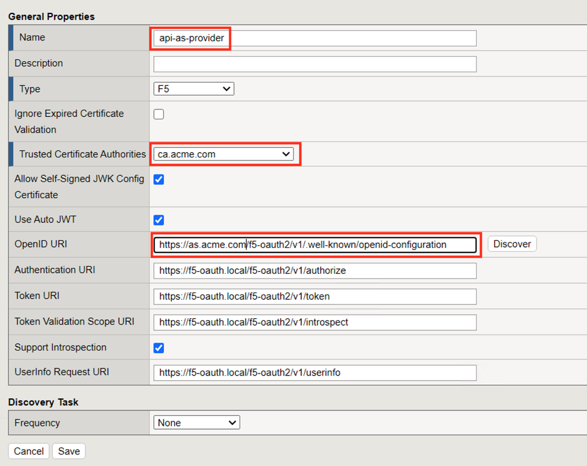
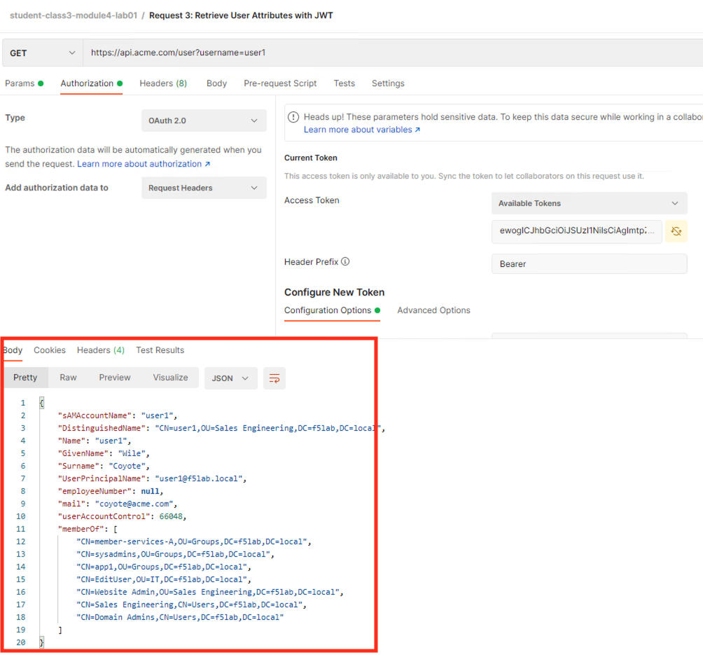

Lab 1: Azure AD Easy Button integration
=============================================

.. warning :: If you have any feedback on this guide, please raise an issue at https://github.com/f5devcentral/f5-agility-labs-iam/issues .

In this lab, students will learn how to leverage Azure AD as an IDaaS provider while using APM as a SAML SP. Since v15.1, F5 has offered a "Guided Configuration" template to make this integration easier for administrators. This lab guide will also be accessible via a bookmark on the Win10 Edge and Chrome browsers.

This template:

#. Publishes on-prem apps
#. Enables Single Sign-on
#. Interconnects (SAML binding) APM with an Azure AD tenant

.. note :: You will notice we never connect directly to the Azure AD interface. APM will use Microsoft's Graph API to configure the AAD tenant accordingly.

   |image001|

The video below illustrates the APM & Azure AD integration. This is **not** the **lab video**. It's simply a demo of the use-case.

.. raw:: html

    

    <iframe width="896" height="504" src="https://www.youtube.com/embed/6NDUaDz7NQE" frameborder="0" allow="accelerometer; autoplay; encrypted-media; gyroscope; picture-in-picture" allowfullscreen></iframe>
    

Section 1.1 - Check the Lab Architecture
--------------------------------------------

In this lab, we will protect 3 apps:

#. 2 internal apps
   
   #. ``Vanilla`` Application hosted in IIS
   #. ``Skyblue`` Application hosted in IIS

#. 1 cloud app hosted in Azure cloud

   #. ``Wordpress-UDF`` hosted in Azure cloud

   |image002|

Architecture of Internal Apps
~~~~~~~~~~~~~~~~~~~~~~~~~~~~~~~~

Bluesky application
*******************

This application resides on-prem in IIS. Its FQDN is ``https://bluesky.f5access.onmicrosoft.com`` 

This application is not **authenticated**, meaning there is no **Single Sign-On** required in front of this app.

   |image003|

Vanilla application
*******************

This application also resides on-prem in IIS. Its FQDN is ``https://vanilla.f5access.onmicrosoft.com`` 

This application is **authenticated** by Kerberos so a **Single Sign-On** will be required to connect to this app.

   |image004|

Task 1  - Check IIS configuration (Optional)
~~~~~~~~~~~~~~~~~~~~~~~~~~~~~~~~~~~~~~~~~~~~~

#. RDP to IIS with ``f5access\user`` as user, and ``user`` as password
#. Click ``IIS manager`` icon in the taskbar

   |image005|

#. In the Connections tree, expand ``IIS``, ``Sites``, click ``vanilla``, and finally, double-click ``Authentication``

   |image006|

#. You'll notice ``Anonymous Auth`` is **Disabled** and ``Windows Authentication`` is **Enabled**

   |image007|

.. note :: In the next class we will configure APM to publish, protect and SSO to internal apps. Feel free to close your RDP session to the IIS Server.

Architecture of Cloud App
~~~~~~~~~~~~~~~~~~~~~~~~~~~~~~~~

.. note :: Since customers often have a mixture of authenticated and non-authenticated apps running on-prem and in the public cloud, this lab utilizes an Application hosted in Azure that doesn't leverage APM for authentication. This application does leverage Azure AD and is meant simply to illustrate the user-experience with such a mixture of application types. This wordpress application is already up and running in Azure Cloud at this address ``https://wordpress-apm-aad.azurewebsites.net/``

   |image008|

#. This Wordpress application is an Azure App Service.

   |image009|

#. This App Service is already bound with our demo Azure AD tenant.

   |image010|

Section 1.2 - Deploy APM to protect Bluesky App
--------------------------------------------------------

In this section, we will publish the ``Bluesky`` application hosted on-prem.

Task 1 - Publish and protect Bluesky app
~~~~~~~~~~~~~~~~~~~~~~~~~~~~~~~~~~~~~~~~~~~~~

Let's start with the ``Bluesky`` application. Reminder, Bluesky does not have any ``Authentication`` enabled. 

#. Either access TMUI via UDF > Access > BIG-IP > TMUI or RDP to win10 (user/user) and launch Edge or Chrome. Using the BIG-IP bookmark, connect to the BIG-IP user interface (admin/admin)
#. In ``Access`` > ``Guided Configuration``, select ``Microsoft Integration`` > ``Azure AD application`` 

|image011|

Task 2 - Configuration Properties
~~~~~~~~~~~~~~~~~~~~~~~~~~~~~~~~~~~~~

#. Click ``Next`` and start the configuration
#. Configure the page as below

   #. Configuration Name : ``IIS-Bluesky-<My Name>``  Why my name ? This app will be created in Azure AD tenant and we need to differentiate all apps. Example : ``IIS-Bluesky-ChrisMi`` The chance of name conflicts increases with the number of students so if possible, please at least use your first name and two characters of your last name. You can leave ``SSO``, ``Endpoint Checks``, and ``Additional Checks`` at their defaults (not selected.)
   #. In ``Azure Service Account Details``, Select ``Copy Account Info form Existing Configuration``, and select ``IIS-baseline``, then click ``Copy``

      |image012|

    
      .. note:: In the real world, this is where you'd configure the application settings from the Azure Service Application created for APM. You have to create an Azure Application so that APM gets access to Microsoft Graph API. Due to **security best practices**, we won't show the application secret in this lab.

      .. note:: For those curious, the steps to create this Azure applications are below

         #. In Azure AD, create a service application under your organization's tenant directory using App Registration.
         #. Register the App as Azure AD only single-tenant.
         #. Request permissions for Microsoft Graph APIs and assign the following permissions to the application:
            
            #. Application.ReadWrite.All
            #. Application.ReadWrite.OwnedBy
            #. Directory.Read.All
            #. Group.Read.All
            #. Policy.Read.All
            #. Policy.ReadWrite.ApplicationConfiguration
            #. User.Read.All
         #. Grant admin consent for your organization's directory.
         #. Copy the Client ID, Client Secret, and Tenant ID and add them to the Azure AD Application configuration.

   #. In the guided configuration UI, Click the ``Test Connection`` button and the result should yield --> Connection is valid

      |image013|

    #. Click ``Save & Next``

Task 3 - Service Provider
~~~~~~~~~~~~~~~~~~~~~~~~~~~

#. Configure the page as below

   #. Host ``bluesky.f5access.onmicrosoft.com``
   #. Entity ID is auto-filled ``https://bluesky.f5access.onmicrosoft.com/IIS-Bluesky-my name>``

      |image014|

   #. Click ``Save & Next``

Task 4 - Azure Active Directory
~~~~~~~~~~~~~~~~~~~~~~~~~~~~~~~~

#. Double-click the ``F5 BIG-IP APM Azure AD...`` template

   .. note :: As you notice, there are several templates available for different applications. In this lab, we will publish a generic app so we select the first template.

#. In the new screen, configure as below

   #. Signing Key : ``default.key``
   #. Signing Certificate : ``default.crt``
   #. Signing Key Passphrase : ``F5twister$``

      |image015|

    
   #. In ``User And User Groups``, click ``Add``

      .. note :: We have to assign Azure AD users/group to this app, so that they can be allowed to connect to it.

      #. In the list, click ``Assign`` for the user ``user1``. If you can't find it, search for it in the ``search`` field.
         

         |image016|

                
      #. Click ``Close``
      #. You can see ``user1`` in the list.

         |image017|

 
      #. Click ``Save & Next``

Task 5 - Virtual Server Properties
~~~~~~~~~~~~~~~~~~~~~~~~~~~~~~~~~~~~~

#. Configure the VS as below

   #. IP address : ``10.1.10.104``
   #. The ``ClientSSL`` profile is selected by default so let's use that one. We'll get a TLS warning in the browser, but it doesn't matter for this lab.

      |image018|

#. Click ``Save & Next``

Task 6 - Pool Properties
~~~~~~~~~~~~~~~~~~~~~~~~~~~~~~~~

#. Leave the ``Select a Pool` setting as ``Create New``
#. In Pool Servers, select ``/Common/10.1.20.9`` from the drop-down menu. This is the Lab's IIS server whose config you may have viewed earlier. 
#. Click ``Save & Next``

   |image019|

Task 7 - Session Management Properties
~~~~~~~~~~~~~~~~~~~~~~~~~~~~~~~~~~~~~~~

#. Nothing to change, click ``Save & Next``

Task 8 - Deploy your app template
~~~~~~~~~~~~~~~~~~~~~~~~~~~~~~~~~~~

#. Click ``Deploy``

   |image020|

#. Behind the scenes, the deployment creates an ``Azure Enterprise Application`` for ``Bluesky``. We can see it in ``Azure portal`` (you don't have access in this lab). With this Enterprise Application, Azure knows where to redirect the user after they're authenticated. This app will also have the certificate and key used to sign the SAML assertion.

   |image021|
#. Click ``Finish`` and ``OK`` on the Confirmation Pop-Up Dialog Box.

Task 9 - Test your deployment
~~~~~~~~~~~~~~~~~~~~~~~~~~~~~~~~

#. RDP to Win10 machine as ``user`` and password ``user``
#. Open ``Google Chrome`` or the ``Microsoft Edge`` browser - both icons are on the Desktop and the Taskbar
#. From the bookmarks list/toolbar, choose ``Bluesky`` and ignore the inevitable cert warnings.
#. You will be redirected to Azure AD login page. Login as ``user1@f5access.onmicrosoft.com`` and hit ``Next``. The password is stored in a text file named ``azure_ad_creds.txt`` on the Win10 Desktop.

   .. warning :: Don't reset or change the password.

   |image022|

#. After being successfully authenticated by Azure AD, you're redirected to APM with a SAML assertion. After validating this assertion, APM allows you to access the Bluesky application. You'll want to keep your RDP session to ``Win10`` open since you'll use it again for subsequent testing.

   |image023|

Section 1.3 - Deploy APM to protect the Vanilla App
--------------------------------------------------------

In this section, we will publish the ``Vanilla`` application which like bluesky, is hosted on-prem.

Task 1 - Publish and protect Vanilla app
~~~~~~~~~~~~~~~~~~~~~~~~~~~~~~~~~~~~~~~~~~

Unlike Bluesky, the Vanilla application has ``Authentication`` enabled via Kerberos and because APM won't have access to an Azure AD user's password, we'll need to enable and leverage ``Kerberos Constrained Delegation``. 

#. As before, Connect to the BIG-IP GUI directly from UDF or via Win10 with admin/admin.
#. In ``Access`` > ``Guided Configuration``, select ``Microsoft Integration`` > ``Azure AD application`` 

   .. note :: As you'll notice, we only deploy one application per Guided Config template.

   |image011|

Task 2 - Configuration Properties
~~~~~~~~~~~~~~~~~~~~~~~~~~~~~~~~~~

#. Click ``Next`` and start the configuration
#. Configure the page as below

   #. Configuration Name : ``IIS-Vanilla-<My Name>``  Just like before, please try to use a unique string for My Name, IE your first name and first two characters of your last name. IIS-Vanilla-ChrisMi is an example name.  
   #. Enable ``Single Sign-on (SSO)``

      |image024|
      

   #. In ``Azure Service Account Details``, Select ``Copy Account Info form Existing Configuration``, and select ``IIS-baseline``, then click ``Copy``

      |image025|
    
      .. note:: Just like before, a real-world deployment would require an administrator to obtain these values via the Azure Service App created for APM. This Azure Application must be created so that APM can access the Microsoft Graph API. 

      .. note:: The steps to create this Azure applications are below

         #. In Azure AD, create a service application under your organization's tenant directory using App Registration.
         #. Register the App as Azure AD only single-tenant.
         #. Request permissions for Microsoft Graph APIs and assign the following permissions to the application:
            
            #. Application.ReadWrite.All
            #. Application.ReadWrite.OwnedBy
            #. Directory.Read.All
            #. Group.Read.All
            #. Policy.Read.All
            #. Policy.ReadWrite.ApplicationConfiguration
            #. User.Read.All
         #. Grant admin consent for your organization's directory.
         #. Copy the Client ID, Client Secret, and Tenant ID and add them to the Azure AD Application configuration.

   #. In the Guided Config GUI, Click the ``Test Connection`` button which should yield --> Connection is valid

      |image026|

   #. Click ``Save & Next``

Task 3 - Service Provider
~~~~~~~~~~~~~~~~~~~~~~~~~~~~~~~~

#. Configure the page as below

   #. Host ``vanilla.f5access.onmicrosoft.com``
   #. The Entity ID is auto-filled ``https://vanilla.f5access.onmicrosoft.com/IIS-Bluesky-my name>``

      |image027|

   #. Click ``Save & Next``

Task 4 - Azure Active Directory
~~~~~~~~~~~~~~~~~~~~~~~~~~~~~~~~

#. Double click the  ``F5 BIG-IP APM Azure AD...`` template

   .. note :: As you can notice, there are several templates available for different applications. Here, in this lab, we will publish a generic app. So we select the first template.

#. Click ``Add``
#. In the new screen, configure as below.

   #. Signing Key : ``default.key``
   #. Signing Certificate : ``default.crt``
   #. Signing Key Passphrase : ``F5twister$``

      |image028|

   #. In ``User And User Groups``, click ``Add``

      .. note :: We have to assign Azure AD users/group to this app, so that they can be allowed to connect to it.

      #. In the list, click ``Assign`` for the user ``user1``. If you can't find it, search for it in the ``search`` field.
         
         |image029|

      #. Click ``Close``
      #. You can see ``user1`` in the list.

         |image030|

      #. Click ``Save & Next``

Task 5 - Virtual Server Properties
~~~~~~~~~~~~~~~~~~~~~~~~~~~~~~~~~~~

#. Configure the VS as below

   #. IP address : ``10.1.10.103``
   #. Since we'll use the already-selected, existing ``ClientSSL`` profile, you don't have to do anything for the Client SSL Profile section. We'll get a TLS warning in the browser, but it doesn't matter for this lab.

      |image031|

#. Click ``Save & Next``

Task 6 - Pool Properties
~~~~~~~~~~~~~~~~~~~~~~~~~~~~~~~~~~~

#. For ``Select a Pool``, leave ``Create New`` selected
#. In Pool Servers, select ``/Common/10.1.20.9`` This is once again the lab's IIS server whose config you investigated earlier. 
#. Click ``Save & Next``

   |image032|

Task 7 - Single Sign-On Settings
~~~~~~~~~~~~~~~~~~~~~~~~~~~~~~~~~~~

#. Check the ``Advanced Settings`` box so it's ``On``
#. Check the ``Single Sign-On box.
#. In ``Selected Single Sign-on Type``, select ``Kerberos``, and select ``Create New`` for ``SSO Configuration Object``

   |image033|

#. In ``Credentials Source``, fill as below

    #. Username Source : Change this value to ``session.logon.last.username``
    #. Clear out the text in  ``User Realm Source``. The domain is similar between Azure AD and on-prem AD so we don't need a realm variable.

#. In ``SSO Method Configuration``, fill as below

    #. Kerberos Realm : ``f5access.onmicrosoft.com``
    #. Account name : ``host/apm-deleg.f5access.onmicrosoft.com``
    #. Account Password : ``F5twister$`` (You'll be asked to enter this password twice for confirmation)
    #. KDC : ``10.1.20.8``
    #. UPN Support : ``Enabled``
    #. SPN Pattern : ``HTTP/%s@f5access.onmicrosoft.com``

      |image034|

#. Leave the other settings at their default values and Click ``Save & Next``

Task 8 - Session Management Properties
~~~~~~~~~~~~~~~~~~~~~~~~~~~~~~~~~~~~~~~~

#. Nothing to change, click ``Save & Next``

Task 9 - Deploy your app template
~~~~~~~~~~~~~~~~~~~~~~~~~~~~~~~~~~~

#. Click ``Deploy`` and after patiently waiting, click ``Finish`` and ``OK`` on thhe Pop-Up Dialog Box once the deployment is successful

   |image035|

#. Behind the scenes, the deployment creates an ``Azure Enterprise Application`` for ``Bluesky``. We can see it in ``Azure portal`` (you don't have access in this lab). With this Enterprise Application, Azure knows where to redirect the user after they're authenticated. This app will also have the certificate and key used to sign the SAML assertion.

   |image036|

Task 10 - Test your deployment
~~~~~~~~~~~~~~~~~~~~~~~~~~~~~~~~~~~

#. If you closed your RDP session to Win10, pleae re-connect as ``user`` and password ``user``
#. Open ``Google Chrome`` or ``Microsoft Edge`` - the icons are on the Desktop and the Taskbar
#. From the bookmarks menu/toolbar, select ``Vanilla`` and ignore the Cert Errors.
#. Since you already logged into Azure AD when accessing ``BlueSky``, you may notice you didn't need to sign-in again and were automatically taken into the application. Your previous assertion was still validated but it was done transparently. If you were sent to Azure AD again for authenticaton, please use the same credentials as before: ``user1@f5access.onmicrosoft.com`` and the password is stored in a text file named ``azure_ad_creds.txt`` on the Win10 Desktop.

   |image037|

   

#. Reminder: Since APM doesn't have a SAML user's password if it isn't the IdP, it performs server-side ``Single Sign-on`` with the Vanilla application via ``Kerberos Constrained Delegation`` in which it requests a Kerberos Ticket on behalf of the user leveraging the username found in the SAML Assertion sent by Azure AD.

   |image038|
  
#. In your already-open browser, Click the ``Bluesky`` bookmark. You'll notice you were automatically authenticated with your already-existing Azure AD session. 
#. Optional: enable ``Inspect mode`` in Edge or ``Dev Tools`` in Chrome, and follow the SAML redirections to understand the workflow.

Section 1.4 - Leverage Azure AD to protect Cloud Apps
--------------------------------------------------------

In this lab, we will verify that ``user1`` can access any cloud app federated with Azure AD.

As mentioned earlier, customers often deploy applications ``on-prem`` and in ``public clouds``. If the customer uses **Azure AD as their IDaaS**, it will federate all cloud apps within this Azure AD tenant.

As an example, we've configured a ``Wordpress Cloud Application``. This application is **federated** with our Azure AD tenant.

Since everything is handled between the App and Azure AD, you have **nothing** to configure on the APM side. In the Azure portal, we configured ``OAuth`` for the cloud app so that every user attempting to access this App would be redirected to Azure AD for Authentication. 

   |image039|

#. If not already connected, RDP to Win10 as ``user`` and password ``user``
#. Open ``Google Chrome`` or ``Microsoft Edge`` - icons are on the Desktop and Taskbar
#. Click on the bookmarks menu/toolbar and select ``Wordpress Cloud App``
#. Just like before, you'll only be redirected to the Azure AD login page if your prior session expired. Accessing this app can take a while so be patient. Pay special attention to the address bar and you'll notice the redirects during the authentication process. If prompted for creds, Login as ``user1@f5access.onmicrosoft.com`` and the password is stored in a text file named ``azure_ad_creds.txt`` on the Win10 Desktop.
#. After Azure AD authenticates (either transparently or via login,) you're redirected to the ``cloud app`` in Azure cloud, and can access to Wordpress-UDF application.

   |image040|

Section 1.5 - Clean up the Lab
--------------------------------------------------------

.. warning :: In order to keep the Azure AD tenant clean, it is important you delete your application in the Guided Configuration, when your demo is finished.

#. In Guided Configuration menu, click on the ``Undeploy`` icon for IIS-Bluesky, then ``OK``. After it finishes, do the same for IIS-Vanilla. You don't need to do anything for IIS-baseline.

   |image041|
   
#. After undeploying has finished, click on the ``Delete`` icon for each app, then ``OK``. 

   |image042|

.. note :: Thanks a lot, you cleaned up your config on both sides (APM and AAD). FYI, all old deployments will be deleted automatically in Azure AD.

.. |image001| image:: media/lab01/001.png
.. |image002| image:: media/lab01/002.png
.. |image003| image:: media/lab01/003.png

.. |image005| image:: media/lab01/005.png
.. |image006| image:: media/lab01/006.png
.. |image007| image:: media/lab01/007.png
.. |image008| image:: media/lab01/008.png
.. |image009| image:: media/lab01/009.png
.. |image010| image:: media/lab01/010.png
.. |image011| image:: media/lab01/011.png
.. |image012| image:: media/lab01/012.png
.. |image013| image:: media/lab01/013.png
.. |image014| image:: media/lab01/014.png
.. |image015| image:: media/lab01/015.png
.. |image016| image:: media/lab01/016.png
.. |image017| image:: media/lab01/017.png
.. |image018| image:: media/lab01/018.png
.. |image019| image:: media/lab01/019.png
.. |image020| image:: media/lab01/020.png
.. |image021| image:: media/lab01/021.png
.. |image022| image:: media/lab01/022.png
.. |image023| image:: media/lab01/023.png
.. |image024| image:: media/lab01/024.png
.. |image025| image:: media/lab01/025.png
.. |image026| image:: media/lab01/026.png
.. |image027| image:: media/lab01/027.png
.. |image028| image:: media/lab01/028.png

.. |image030| image:: media/lab01/030.png

.. |image032| image:: media/lab01/032.png

.. |image036| image:: media/lab01/036.png

.. |image038| image:: media/lab01/038.png
.. |image039| image:: media/lab01/039.png
.. |image040| image:: media/lab01/040.png  
.. |image041| image:: media/lab01/041.png
.. |image042| image:: media/lab01/042.png
  
   

