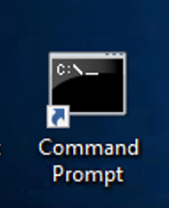

Class - Identity Aware Proxy
===============================

The 15.1 Zero Trust Architecture shifts many of the objects that would exist in a per-session policy to the per-request policy thereby creating a more secure authentication and authorization scheme. The authenticity of each request is further enhanced through the use of F5’s Access Guard agent installed on a client.  This agent provides a PKI signed report of the posture assessment performed on the client real-time rather than the historical way plug-ins reported status. Previously, after a user connected to an application they would experience a delay in access as the agent performed the posture assessment to provide an unsigned report to the BIG-IP. 

Topics Covered
----------------
- Real-time Posture Assessments
- Per-Request Frameworks
- Contextual Access
- HTTP Connector

Expected time to complete: **1 hour**

UDF blueprint version: **44**

Setup Lab Environment
----------------------------------------

#. Click the **Command Prompt** shortcut to open the command prompt on the jumphost 

   |image1|

#. Type the command **cd C:\\labs\\class3\\postman** to navigate the Postman collection folder.

#. Type the command **setup.bat**

#. All Steps in the collection should succeed before moving on to the lab.  If an API call fails run the collection again by repeating the previous step.  

   |image2|

.. |image2| image:: media/image002.png

.. toctree::
   :maxdepth: 1
   :glob:

   labinfo
   module*/module*
