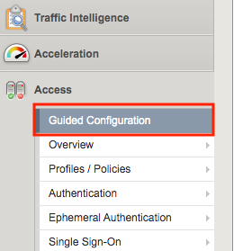

Lab 2: Extending the SAML Use Case
==================================

The purpose of this lab is to expand a fairly standard SAML use case. In this
Lab Students will not being using Access Guided Configuration but instead 
making direct SAML configuration changes to familiarize themselves with the 
underlying SAML components and menus.  

This lab has an existing SAML configuration for ACME in which an ACME SAML
IdP is already Federated with an ACME SAML Service Provider. Students will 
review and verify the functionality of IDP-Initiated and SP-Initiated SAML flows.

The lab is in two parts.  In Part 1, Students will extend an ACME SAML SP 
provided application to a Partner. In Part 2, Students will include a Partner 
provided SAML SP to extend ACME's federations via ACME's SAML IdP.

Objective:
----------

-  Gain an understanding of integrating underlying SAML Configuration
   objects. 

-  Gain further understanding of IdP-Initiated and SP-Initiated flows.
   
-  Review logs and data via SAML troubleshooting tools.

Lab Requirements:
-----------------

-  All Lab requirements will be noted in the tasks that follow

-  Estimated completion time: 25 minutes

Lab 2 Tasks Part 1
------------------

TASK 1: Review the configured SAML IdP and SAML SP (ACME) 
~~~~~~~~~~~~~~~~~~~~~~~~~~~~~~~~~~~~~~~~~~~~~~~~~~~~~~~~~

+----------------------------------------------------------------------------------------------+
| 1. Open Firefox from the Jumphost desktop and click on the **ACME-IDP** link in the bookmark |
|                                                                                              |
|    toolbar.                                                                                  |
|                                                                                              |
| **Note:** *If you have issues, open Firefox in a New Private Window (Incognito/Safe Mode)*   |
+----------------------------------------------------------------------------------------------+
| |image001|                                                                                   |
+----------------------------------------------------------------------------------------------+

+----------------------------------------------------------------------------------------------+
| 2. Once the page loads, enter **user1** for username and **user1** for password  in the      |
|                                                                                              |
|    logon form and click the **Logon** button.                                                |
+----------------------------------------------------------------------------------------------+
| |image002|                                                                                   |
+----------------------------------------------------------------------------------------------+

+----------------------------------------------------------------------------------------------+
| 3. On the presented webtop, click the **sp.acme.com** link in the **Applications and**       |
|                                                                                              |
|    **Links** section.                                                                        |
+----------------------------------------------------------------------------------------------+
| |image003|                                                                                   |
+----------------------------------------------------------------------------------------------+
 
+----------------------------------------------------------------------------------------------+
| 4. The **ACME Application 1** will now open if successfully configured. Close the **ACME**   |
|                                                                                              |
|    **Application 1** broswer window and logout of the **F5 Dynamic Webtop**.                 |
|                                                                                              |
| **Note:** *This was a SAML IdP-Initiated flow.*                                              |
+----------------------------------------------------------------------------------------------+
| |image004|                                                                                   |
+----------------------------------------------------------------------------------------------+

+----------------------------------------------------------------------------------------------+
| 5. Navigate to **Access -> Overview -> Active Sessions** on your **bigip1**                  |
|                                                                                              |
| 6. Note the two active sessions created by the access of **https://idp.acme.com**            |
|                                                                                              |
| **Question:** Why are there two sessions?                                                    |
+----------------------------------------------------------------------------------------------+
| |image005|                                                                                   |
+----------------------------------------------------------------------------------------------+

+----------------------------------------------------------------------------------------------+
| 7. Click the checkboxes in the first column and click the **Kill Selected Sessions**         |
|                                                                                              |
|    button.                                                                                   |
+----------------------------------------------------------------------------------------------+
| |image006|                                                                                   |
+----------------------------------------------------------------------------------------------+

+----------------------------------------------------------------------------------------------+
| 8. In the resulting window make sure both Session ID's are checked and click the **Delete**  |
|                                                                                              |
|    button.                                                                                   |
+----------------------------------------------------------------------------------------------+
| |image007|                                                                                   |
+----------------------------------------------------------------------------------------------+

+----------------------------------------------------------------------------------------------+
| 9. Open Firefox from the Jumphost desktop and click on the **ACME-SP (ACME)** link in the    |
|                                                                                              |
|    bookmark toolbar.                                                                         |
|                                                                                              |
| **Note:** *If you have issues, open Firefox in a New Private Window (Incognito/Safe Mode)*   |
+----------------------------------------------------------------------------------------------+
| |image008|                                                                                   |
+----------------------------------------------------------------------------------------------+

+----------------------------------------------------------------------------------------------+
| 10. Once the page loads, enter **user1** for username and **user1** for password  in the     |
|                                                                                              |
|     logon form and click the **Logon** button.                                               |
+----------------------------------------------------------------------------------------------+
| |image009|                                                                                   |
+----------------------------------------------------------------------------------------------+
 
+----------------------------------------------------------------------------------------------+
| 11. The **ACME Application 1** will now open if successfully configured. Close the **ACME**  |
|                                                                                              |
|    **Application 1** broswer window.                                                         |
|                                                                                              |
| **Note:** *This was a SAML SP-Initiated flow.*                                               |
+----------------------------------------------------------------------------------------------+
| |image010|                                                                                   |
+----------------------------------------------------------------------------------------------+

TASK 2: Extend the ACME SAML Service Provider (SP) 
~~~~~~~~~~~~~~~~~~~~~~~~~~~~~~~~~~~~~~~~~~~~~~~~~~

+----------------------------------------------------------------------------------------------+
| 1. Navigate to **Access -> Federation -> SAML Service Provider -> External IdP Connectors**  |
|                                                                                              |
| 2. In the resulting main window update, click the small **down arrow** beside the **create** |
|                                                                                              |
|    button.                                                                                   |
|                                                                                              |
| 3. From the displayed dropdown menu, select **From Metadata**                                |
+----------------------------------------------------------------------------------------------+
| |image011|                                                                                   |
+----------------------------------------------------------------------------------------------+

+----------------------------------------------------------------------------------------------+
| 4. In the resulting pop-up window for **Create New SAML IdP Connector**, click the           |
|                                                                                              |
|    **browse** button.                                                                        |
|                                                                                              |
| 5. From the Jumphost desktop seleect the **idp_partner_com_metadata.xml** file               |
|                                                                                              |
| 6. In the **Identity Provider Name** field input **idp.partner.com** and click **OK**        |
+----------------------------------------------------------------------------------------------+
| |image012|                                                                                   |
+----------------------------------------------------------------------------------------------+

+----------------------------------------------------------------------------------------------+
| 7. Navigate to the horizontal navgination menu and from the **SAML Service Provider**        |
|                                                                                              |
|    dropdown select **Local SP Services**                                                     |
+----------------------------------------------------------------------------------------------+
| |image013|                                                                                   |
+----------------------------------------------------------------------------------------------+

+----------------------------------------------------------------------------------------------+
| 8. In the resulting main window update, check the checkbox on the **sp.acme.com** row and    |
|                                                                                              |
|    click the **Bind/Unbind IdP Connectors** button.                                          |
+----------------------------------------------------------------------------------------------+
| |image014|                                                                                   |
+----------------------------------------------------------------------------------------------+

+----------------------------------------------------------------------------------------------+
| 9. In the resulting pop-up window for **Edit SAML IdPs that use this SP**, click the **Add** |
|                                                                                              |
|    **New Row** button.                                                                       |
|                                                                                              |
| 10. In the newly added row select or input the follwoing values:                             |
|                                                                                              |
|     * **SAML IdP Connectors:** **/Common/idp.partner.com** (select from dropdown)            |
|                                                                                              |
|     * **Matching Source:** **%{session.server.landinguri}** (select from dropdown)           |
|                                                                                              |
|     * **Matching Value:** **/partner\*** (input value)                                       |
|                                                                                              |
| 11. Click the **Update** button.                                                             |
+----------------------------------------------------------------------------------------------+
| |image015|                                                                                   |
+----------------------------------------------------------------------------------------------+

+----------------------------------------------------------------------------------------------+
| 12. Review the configuration and then click **OK**                                           |
+----------------------------------------------------------------------------------------------+
| |image016|                                                                                   |
+----------------------------------------------------------------------------------------------+

+----------------------------------------------------------------------------------------------+
| 13. In the **bigip1** GUI, look to the top left and click the **Apply Access Policy** link.  |
+----------------------------------------------------------------------------------------------+
| |image017|                                                                                   |
+----------------------------------------------------------------------------------------------+

+----------------------------------------------------------------------------------------------+
| 14. In the resulting window for **Access Profiles (Per-Session Policies)**, ensure the       |
|                                                                                              |
|     **sp.acme.com** row is checked and click the **Apply** button.                           |
+----------------------------------------------------------------------------------------------+
| |image018|                                                                                   |
+----------------------------------------------------------------------------------------------+

+----------------------------------------------------------------------------------------------+
| 15. The **Apply Access Policy** link should now disappear in the top left corner.            |
|                                                                                              |
|     **Note:** *May take a few seconds to update.*                                            |
+----------------------------------------------------------------------------------------------+
| |image019|                                                                                   |
+----------------------------------------------------------------------------------------------+

TASK 3: Testing Partner Access to SAML SP (ACME)
~~~~~~~~~~~~~~~~~~~~~~~~~~~~~~~~~~~~~~~~~~~~~~~~

+----------------------------------------------------------------------------------------------+
| 1. Open Firefox from the Jumphost desktop and click on the **ACME-SP (Partner)** link in the |
|                                                                                              |
|    bookmark toolbar.                                                                         |
|                                                                                              |
| 2. Notice now that the **Partner Secure Logon** page loads, enter **user1** for username and |
|                                                                                              |
|    **user1** for password  in the logon form and click the **Logon** button.                 |
|                                                                                              |
| **Note:** *If you have issues, open Firefox in a Private Window (Incognito/Safe Mode)*       |
+----------------------------------------------------------------------------------------------+
| |image020|                                                                                   |
+----------------------------------------------------------------------------------------------+
 
+----------------------------------------------------------------------------------------------+
| 3. The **ACME Application 1** will now open if successfully configured. This concludes       |
|                                                                                              |
|    Lab 2 Tasks / Part 1.                                                                     |
|                                                                                              |
| **Note:** *This was a SAML SP-Initiated flow for the Partner.*                               |
+----------------------------------------------------------------------------------------------+
| |image021|                                                                                   |
+----------------------------------------------------------------------------------------------+

Lab 2 Tasks Part 2
------------------

TASK 1: Extend the ACME SAML Identity Provider (IdP) 
~~~~~~~~~~~~~~~~~~~~~~~~~~~~~~~~~~~~~~~~~~~~~~~~~~~~

+----------------------------------------------------------------------------------------------+
| 1. Navigate to **Access -> Federation -> SAML Identity Provider -> External SP Connectors**  |
|                                                                                              |
| 2. In the resulting main window update, click the small **down arrow** beside the **create** |
|                                                                                              |
|    button.                                                                                   |
|                                                                                              |
| 3. From the displayed dropdown menu, select **From Metadata**                                |
+----------------------------------------------------------------------------------------------+
| |image022|                                                                                   |
+----------------------------------------------------------------------------------------------+

+----------------------------------------------------------------------------------------------+
| 4. In the resulting pop-up window for **Create New SAML Service Provider**, click the        |
|                                                                                              |
|    **browse** button.                                                                        |
|                                                                                              |
| 5. From the Jumphost desktop seleect the **sp_partner_com_metadata.xml** file                |
|                                                                                              |
| 6. In the **Service Provider Name** field input **sp.partner.com** and click **OK**          |
+----------------------------------------------------------------------------------------------+
| |image023|                                                                                   |
+----------------------------------------------------------------------------------------------+

+----------------------------------------------------------------------------------------------+
| 7. Navigate to the horizontal navgination menu and from the **SAML Identity Provider**       |
|                                                                                              |
|    dropdown select **Local IdP Services**                                                    |
+----------------------------------------------------------------------------------------------+
| |image024|                                                                                   |
+----------------------------------------------------------------------------------------------+

+----------------------------------------------------------------------------------------------+
| 8. In the resulting main window update, click the **Create** button on the right-hand side.  |
+----------------------------------------------------------------------------------------------+
| |image025|                                                                                   |
+----------------------------------------------------------------------------------------------+

+----------------------------------------------------------------------------------------------+
| 9. In the resulting pop-up window for **Create New IdP Service**, click the **General**      |
|                                                                                              |
|    **Settings** menu link.                                                                   |
|                                                                                              |
| 10. In the updated window input the following values:                                        |
|                                                                                              |
|     * **IdP Service Name:** **idp.acme.com_Partner**                                         |
|                                                                                              |
|     * **IdP Entity ID:** **https://idp.acme.com**                                            |
+----------------------------------------------------------------------------------------------+
| |image026|                                                                                   |
+----------------------------------------------------------------------------------------------+

+----------------------------------------------------------------------------------------------+
| 11. Click the **Assertion Settings** menu link.                                              |
|                                                                                              |
| 12. In the updated window input the follwoing values:                                        |
|                                                                                              |
|     * **Assertion Subject Value:** **%{session.logon.last.username}** (select from dropdown) |
+----------------------------------------------------------------------------------------------+
| |image027|                                                                                   |
+----------------------------------------------------------------------------------------------+

+----------------------------------------------------------------------------------------------+
| 13. Click the **Security Settings** menu link.                                               |
|                                                                                              |
| 14. In the updated window input the follwoing values:                                        |
|                                                                                              |
|     * **Signing Key:** **/Common/saml-idp.acme.com** (select from dropdown)                  |
|                                                                                              |
|     * **Signing Certificate:** **/Common/saml-idp.acme.com** (select from dropdown)          |
|                                                                                              |
| 15. Click the **OK** button.                                                                 |
+----------------------------------------------------------------------------------------------+
| |image028|                                                                                   |
+----------------------------------------------------------------------------------------------+

+----------------------------------------------------------------------------------------------+
| 16. In the resulting window for **Local IdP Services**, check only the checkbox on the       |
|                                                                                              |
|     **idp.acme.com_Partner** row.                                                            |
|                                                                                              |
| 17. Click the **Bind/Unbind SP Connectors** button.                                          |
|                                                                                              |
| **Note:** *The idp.acme.com_ACME & the idp.acme.com_Partner objects have the exact same*     |
|                                                                                              |
| *settings in terms of basic configurations for this lab. In an actual configuration,*        |
|                                                                                              |
| *setting specific security and certificates configurations will provide additional layers*   |
|                                                                                              |
| *of security.*                                                                               |
+----------------------------------------------------------------------------------------------+
| |image029|                                                                                   |
+----------------------------------------------------------------------------------------------+

+----------------------------------------------------------------------------------------------+
| 18. In the resulting pop-up window for **Edit SAML SPs that use this IdP**, check the        |
|                                                                                              |
|     checkbox in the **/Common/sp.partner.com** row and then click the **OK** button.         |
+----------------------------------------------------------------------------------------------+
| |image030|                                                                                   |
+----------------------------------------------------------------------------------------------+

+----------------------------------------------------------------------------------------------+
| 19. Navigate to **Access -> Federation -> SAML Resources** and click the **+ (Plus Sign)**   |
|                                                                                              |
| **Note:** *If you miss clicking the plus sign, simply click the create button on the right.* |
+----------------------------------------------------------------------------------------------+
| |image031|                                                                                   |
+----------------------------------------------------------------------------------------------+

+----------------------------------------------------------------------------------------------+
| 14. In the resulting window for **New SAML Resource**, input the following values in the     |
|                                                                                              |
|     indicated fields.                                                                        |
|                                                                                              |
|     * **Name:** **sp.partner.com**                                                           |
|                                                                                              |
|     * **SSO Configuration:** **idp.acme.com_Partner**                                        |
|                                                                                              |
|     * **Caption:** **sp.partner.com**                                                        |
|                                                                                              |
| 15. Click the **Finished** button.                                                           |
+----------------------------------------------------------------------------------------------+
| |image032|                                                                                   |
+----------------------------------------------------------------------------------------------+

+----------------------------------------------------------------------------------------------+
| 16. Navigate to **Access -> Profiles/Policies -> Access Profiles (Per-Session Policies)**    |
|                                                                                              |
|     and then click the **Edit** link for the **idp.acme.com** Per Session Policy.            |
+----------------------------------------------------------------------------------------------+
| |image033|                                                                                   |
+----------------------------------------------------------------------------------------------+

+----------------------------------------------------------------------------------------------+
| 17. In the resulting Visual Policy Editor window, click on the **Advanced Resource Assign**  |
|                                                                                              |
|     agent.                                                                                   |
+----------------------------------------------------------------------------------------------+
| |image034|                                                                                   |
+----------------------------------------------------------------------------------------------+

+----------------------------------------------------------------------------------------------+
| 18. In the **Advanced Resource Assign** window click on the **Add/Delete** link in the first |
|                                                                                              |
|     assignment row.                                                                          |
+----------------------------------------------------------------------------------------------+
| |image035|                                                                                   |
+----------------------------------------------------------------------------------------------+

+----------------------------------------------------------------------------------------------+
| 19. In the resulting window, click on the **SAML** tab and check the checbox on the          |
|                                                                                              |
|     **/Common/sp.partner.com** row and then click update.                                    |
+----------------------------------------------------------------------------------------------+
| |image036|                                                                                   |
+----------------------------------------------------------------------------------------------+

+----------------------------------------------------------------------------------------------+
| 20. Click on the **Save** button in the **Advanced Resource Assign** window.                 |
+----------------------------------------------------------------------------------------------+
| |image037|                                                                                   |
+----------------------------------------------------------------------------------------------+

+----------------------------------------------------------------------------------------------+
| 21. Click on the **Apply Access Policy** link in the top left-hand corner of the Visual      |
|                                                                                              |
|     Policy Editor.                                                                           |
+----------------------------------------------------------------------------------------------+
| |image038|                                                                                   |
+----------------------------------------------------------------------------------------------+

TASK 2: Testing Access to the Partner SAML SP
~~~~~~~~~~~~~~~~~~~~~~~~~~~~~~~~~~~~~~~~~~~~~

+----------------------------------------------------------------------------------------------+
| 1. Open Firefox from the Jumphost desktop and click on the **SAML Tracer** icon on the       |
|                                                                                              |
|    right-hand side of the Firefox toolbar as indicated.                                      |
|                                                                                              |
| **Note:** *This is setting up testing tools to be used later in the lab.*                    |
+----------------------------------------------------------------------------------------------+
| |image039|                                                                                   |
+----------------------------------------------------------------------------------------------+

+----------------------------------------------------------------------------------------------+
| 2. The **SAML Tracer** extension window will launch. Simply leave it running and return to   |
|                                                                                              |
|    open Firefox browser.                                                                     |
+----------------------------------------------------------------------------------------------+
| |image040|                                                                                   |
+----------------------------------------------------------------------------------------------+

+----------------------------------------------------------------------------------------------+
| 3. Click on the **Partner-SP (ACME)** link in the open Firefox brwoser.                      |
|                                                                                              |
| **Note:** *If you have issues, open Firefox in a Provate Window (Incognito/Safe Mode)*       |
+----------------------------------------------------------------------------------------------+
| |image041|                                                                                   |
+----------------------------------------------------------------------------------------------+

+----------------------------------------------------------------------------------------------+
| 4. Once the page loads, enter **user1** for username and **user1** for password  in the      |
|                                                                                              |
|    logon form and click the **Logon** button.                                                |
+----------------------------------------------------------------------------------------------+
| |image042|                                                                                   |
+----------------------------------------------------------------------------------------------+

+----------------------------------------------------------------------------------------------+
| 5. The **Partner Application** will now open if successfully configured.                     |
|                                                                                              |
| **Note:** *This is a SP-Initiated flow to the Partner's SAML SP.*                            |
+----------------------------------------------------------------------------------------------+
| |image043|                                                                                   |
+----------------------------------------------------------------------------------------------+

TASK 3: Review SAML Tracer Logs 
~~~~~~~~~~~~~~~~~~~~~~~~~~~~~~~

+----------------------------------------------------------------------------------------------+
| 1. Locate the **SAML Tracer** window on the Jumphost desktop.                                |
|                                                                                              |
| 2. Click the **Pause** button to keep the log flow from scrolling.                           |
|                                                                                              |
| 3. Locate the first, **SAML** tagged log event. Note that just a few lines above a **GET**   |
|                                                                                              |
|    was made to **https://sp.partner.com/acme** (The bookmarked clicked on in Task 2 Step 3   |
|                                                                                              |
|    above.                                                                                    |
|                                                                                              |
| 4. The first **SAML** tagged log event was a **POST** to the ACME IdP located at             |
|                                                                                              |
|    **https://idp.acme.com/saml/idp/profile/redirectorpost/sso**                              |
|                                                                                              |
| 5. In the bottom pane of the **SAML Tracer** window on the **HTTP** tab, details about the   |
|                                                                                              |
|    SAML POST can be identified.                                                              |
+----------------------------------------------------------------------------------------------+
| |image044|                                                                                   |
+----------------------------------------------------------------------------------------------+

+----------------------------------------------------------------------------------------------+
| 6. Click on **SAML** tab in the bottom pane of the **SAML Tracer** window.  Here can be      |
|                                                                                              |
|    found the relevant data for the SAML AuthnRequest. Good for troubleshooting.              |
+----------------------------------------------------------------------------------------------+
| |image045|                                                                                   |
+----------------------------------------------------------------------------------------------+

+----------------------------------------------------------------------------------------------+
| 7. Locate the second, **SAML** tagged log event. Note that this tagged log line is a         |
|                                                                                              |
|    **POST** back to the Partner's SAML SP Assesrtion Consumer Service located at             |
|                                                                                              |
|    **https://sp.partner.com/saml/sp/profile/post/acs**.                                      |
|                                                                                              |
|    **Note:** *The links used by both the IdP and SP were exchnaged when the XML metadata*    |
|                                                                                              |
|    *was imported.*                                                                           |
|                                                                                              |
| 8. In the bottom pane of the **SAML Tracer** window on the **HTTP** tab, details about the   |
|                                                                                              |
|    SAML POST can be identified.                                                              |
+----------------------------------------------------------------------------------------------+
| |image046|                                                                                   |
+----------------------------------------------------------------------------------------------+

+----------------------------------------------------------------------------------------------+
| 9. Click on **SAML** tab in the bottom pane of the **SAML Tracer** window.  Here can be      |
|                                                                                              |
|    found the relevant data for the SAML Response. Good for troubleshooting.                  |
+----------------------------------------------------------------------------------------------+
| |image045|                                                                                   |
+----------------------------------------------------------------------------------------------+

TASK 4: End of Lab2
~~~~~~~~~~~~~~~~~~~

+----------------------------------------------------------------------------------------------+
| 1. This concludes Part 2 of Lab2. This concludes Lab2, feel free to review and test the      |
|                                                                                              |
|    configuration.                                                                            |
+----------------------------------------------------------------------------------------------+
| |image000|                                                                                   |
+----------------------------------------------------------------------------------------------+

.. |image001| image:: media/lab2-001.png
   :width: 800px
.. |image002| image:: media/lab2-002.png
   :width: 800px
.. |image003| image:: media/lab2-003.png
   :width: 800px
.. |image004| image:: media/lab2-004.png
   :width: 800px
.. |image005| image:: media/lab2-005.png
   :width: 800px
.. |image006| image:: media/lab2-006.png
   :width: 800px
.. |image007| image:: media/lab2-007.png
   :width: 800px
.. |image008| image:: media/lab2-008.png
   :width: 800px
.. |image009| image:: media/lab2-009.png
   :width: 800px
.. |image010| image:: media/lab2-010.png
   :width: 800px
.. |image011| image:: media/lab2-011.png
   :width: 800px
.. |image012| image:: media/lab2-012.png
   :width: 800px
.. |image013| image:: media/lab2-013.png
   :width: 800px
.. |image014| image:: media/lab2-014.png
   :width: 800px
.. |image015| image:: media/lab2-015.png
   :width: 800px
.. |image016| image:: media/lab2-016.png
   :width: 800px
.. |image017| image:: media/lab2-017.png
   :width: 800px
.. |image018| image:: media/lab2-018.png
   :width: 800px
.. |image019| image:: media/lab2-019.png
   :width: 800px
.. |image020| image:: media/lab2-020.png
   :width: 800px
.. |image021| image:: media/lab2-021.png
   :width: 800px
.. |image022| image:: media/lab2-022.png
   :width: 800px
.. |image023| image:: media/lab2-023.png
   :width: 800px
.. |image024| image:: media/lab2-024.png
   :width: 800px
.. |image025| image:: media/lab2-025.png
   :width: 800px
.. |image026| image:: media/lab2-026.png
   :width: 800px
.. |image027| image:: media/lab2-027.png
   :width: 800px
.. |image028| image:: media/lab2-028.png
   :width: 800px
.. |image029| image:: media/lab2-029.png
   :width: 800px
.. |image030| image:: media/lab2-030.png
   :width: 800px
.. |image031| image:: media/lab2-031.png
   :width: 800px
.. |image032| image:: media/lab2-032.png
   :width: 800px
.. |image033| image:: media/lab2-033.png
   :width: 800px
.. |image034| image:: media/lab2-034.png
   :width: 800px
.. |image035| image:: media/lab2-035.png
   :width: 800px
.. |image036| image:: media/lab2-036.png
   :width: 800px
.. |image037| image:: media/lab2-037.png
   :width: 800px
.. |image038| image:: media/lab2-038.png
   :width: 800px
.. |image039| image:: media/lab2-039.png
   :width: 800px
.. |image040| image:: media/lab2-040.png
   :width: 800px
.. |image041| image:: media/lab2-041.png
   :width: 800px
.. |image042| image:: media/lab2-042.png
   :width: 800px
.. |image043| image:: media/lab2-043.png
   :width: 800px
.. |image044| image:: media/lab2-044.png
   :width: 800px
.. |image045| image:: media/lab2-045.png
   :width: 800px
.. |image046| image:: media/lab2-046.png
   :width: 800px
.. |image047| image:: media/lab2-047.png
   :width: 800px

