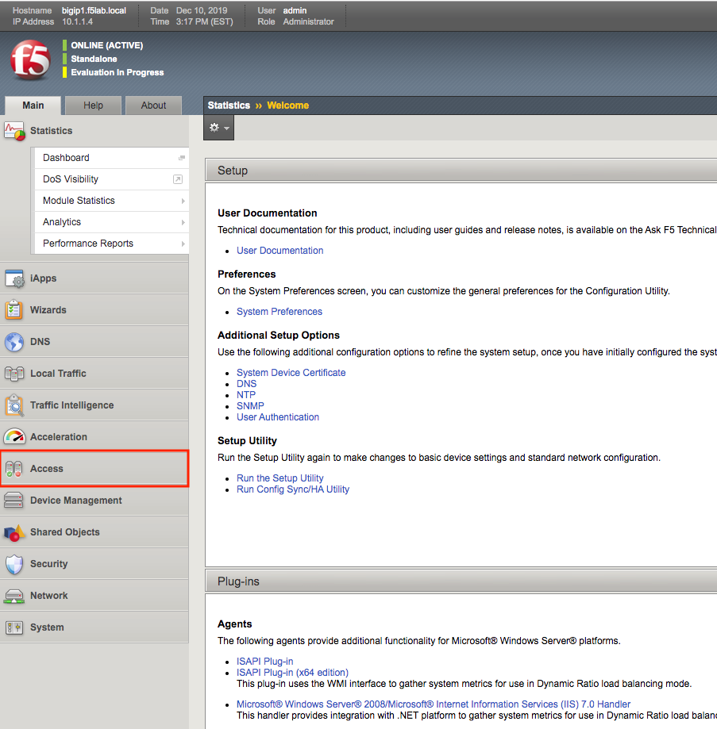

Lab 1.1 - Access Guided Configuration
----------------------------------------

The first step in deploying the IAP is accessing Guided Configuration

Task - Access the Zero Trust IAP guided configuration
~~~~~~~~~~~~~~~~~~~~~~~~~~~~~~~~~~~~~~~~~~~~~~~~~~~~~~~~

#. From the webbrowser, click on the **Access** tab located on the left side.

   |image0|

#. Click **Guided Configuration**

   |image1|

#. Click **Zero Trust**

   |image2|

#. Click **Identity Aware Proxy**

   |image3|

#. Click **Next**

   .. NOTE::  Review the design considerations for deploying IAP in a **Single Proxy** versus a **Multi-proxy** solution.

   |image4|

.. |image1| image:: media/image001.png

