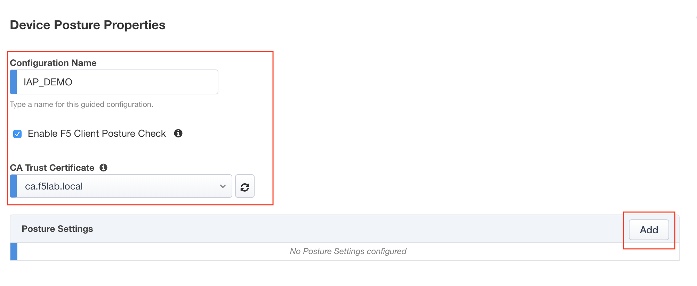

Lab 1.2 - Device Posture 
------------------------------------------------

In this section, you will configure the IAP to perform posture assessment from client devices.  

Task - Configure name of IAP Policy and enable Posture Checks
~~~~~~~~~~~~~~~~~~~~~~~~~~~~~~~~~~~~~~~~~~~~~~~~~~~~~~~~~~~~~~~~

#. Define the configuration name **IAP_DEMO**

#. Check **Enable F5 Client Posture Check**

#. select **ca.f5lab.local.crt** from the CA Trust Certificate dropdown list

#. Select **add** to create a posture assessment group

   |image5|

Task - Define a firewall Posture Assessment
~~~~~~~~~~~~~~~~~~~~~~~~~~~~~~~~~~~~~~~~~~~~~

#. Define the Posture Group Name **FW_CHECK**
#. Check the enable a **Firewall** box
#. Check the enable a **Domain Managed Devices** box
#. Enter the Domain Name **f5lab.local** 
#. Click **Done**

   |image6|

Task - Verify the posture assessment 
~~~~~~~~~~~~~~~~~~~~~~~~~~~~~~~~~~~~~~~

#. The Posture Settings box should contain **FW_CHECK**
#. Click **Save & Next**

   |image7|

