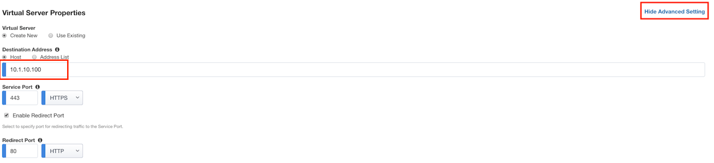
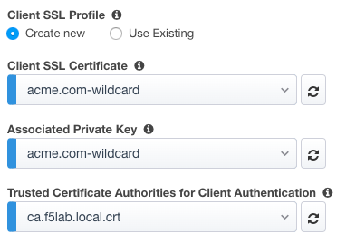
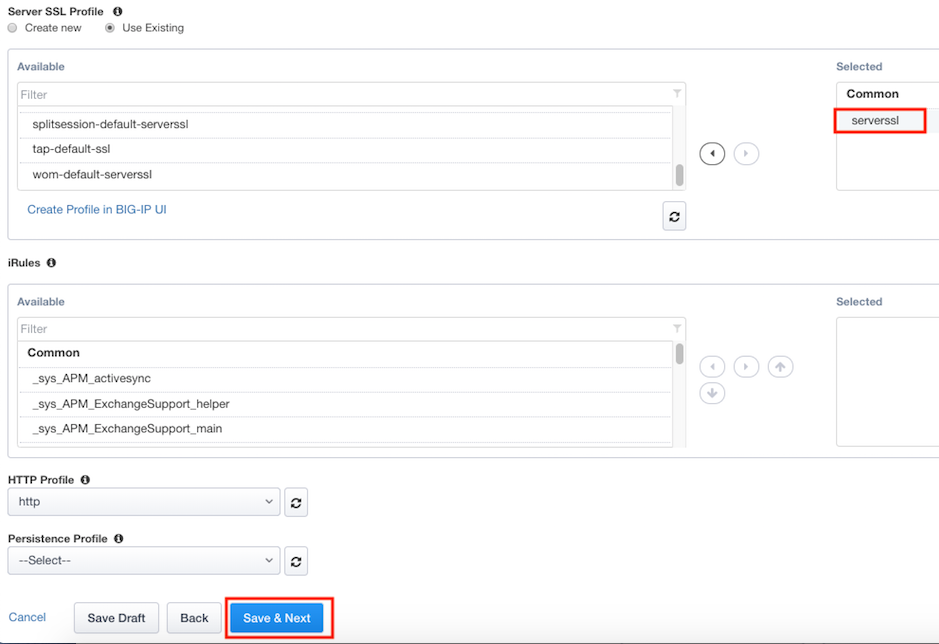

Lab 1.3 - Virtual Server
------------------------------------------------

In this section, you will define the virtual server IP address and its SSL profile settings 

Task - Create a virtual server
~~~~~~~~~~~~~~~~~~~~~~~~~~~~~~~~~~~~~~~~~~

#. Click **Show Advanced Setting** located in the top right corner to expose the Server-Side SSL profile settings
#. Enter the IP address **10.1.10.100**

   |image8|

#. Click the **Create New** radio button under Client SSL Profile
#. Select **acme.com-wildcard** from the Client SSL certificate dropdown box
#. Select **acme.com-wildcard** from the Associated Private Key dropdown box
#. Select **ca.f5lab.local.crt** from the Trusted Certificate Authorities for Client Authentication drop down box

   |image9|

#. In the **Server SSL Profile** section, move the **serverssl** SSL Profile to the **Selected** side (select item and then click the right-arrow)
#. Click **Save & Next**

   |image10|

