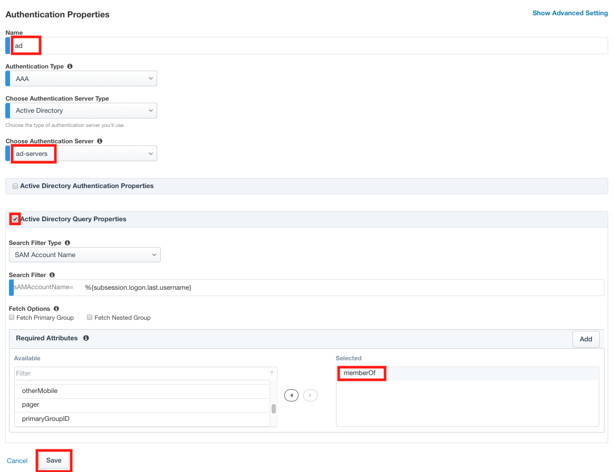

Lab 1.4 - User Identity
------------------------------------------------

In this section you will configure a single User Identity using Active Directory.  

Task - Configure Active Directory AAA
~~~~~~~~~~~~~~~~~~~~~~~~~~~~~~~~~~~~~~~~~~

#. Enter **"ad"** for the name
#. Ensure the Authentication Type is **AAA**
#. Ensure the Choose Authentication Server Type is set to **Active Directory**
#. Select **ad-servers** from the Choose Authentication Server dropdown box
#. Check **Active Directory Query Properties**
#. Select the **memberOf** in the Required Attributes box 
#. Click **Save**
#. Click **Save & Next**

|image11|

