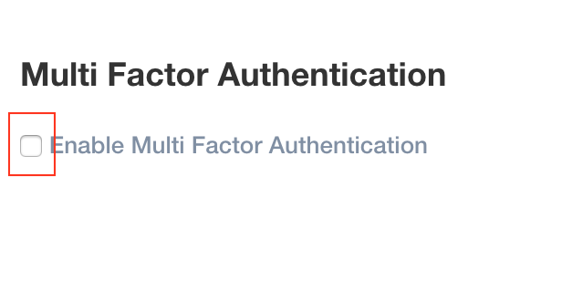
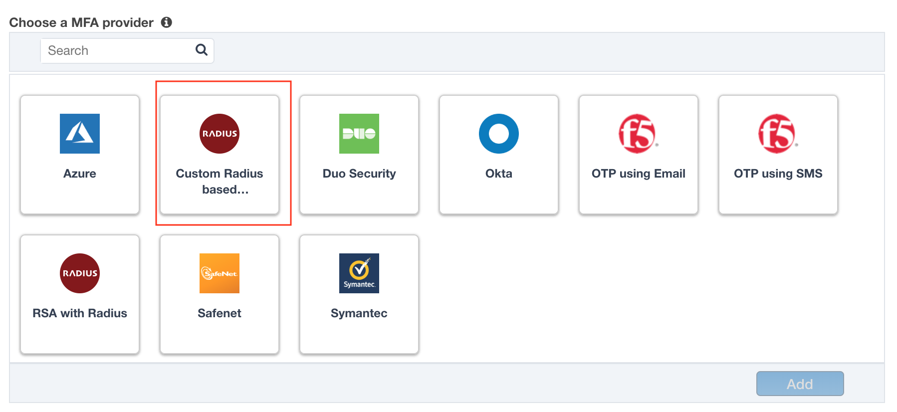
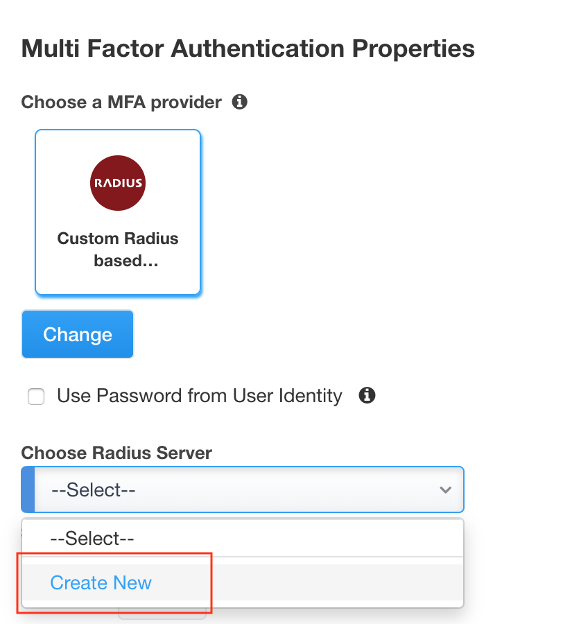
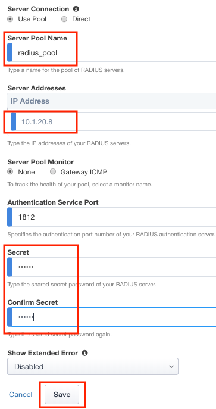
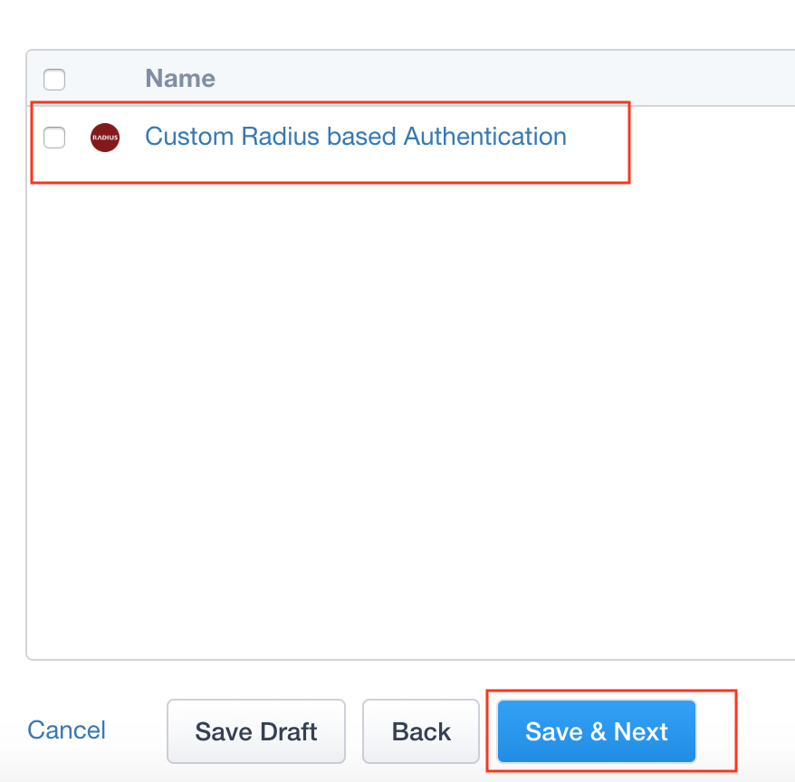

Lab 1.5 - MFA
------------------------------------------------

In this section you will configure a RADIUS server to enable simulated MFA capabilities.

Task - Configure a RADIUS AAA Server
~~~~~~~~~~~~~~~~~~~~~~~~~~~~~~~~~~~~~~~~~~

#. Check **Enable MultiFactor Authentication**

   |image13|

#. Select **Custom Radius Based**

   |image14|

#. Select **Create New** from the Choose RADIUS Server dropdown

   |image15|

#. Enter the Server Pool Name **radius_pool**
#. Enter the Server Address **10.1.20.8**
#. Enter the Secret **secret**
#. Click **Save**

   |image16|

#. Verify Custom RADIUS based Authentication appears
#. Click **Save & Next**

   |image17|

