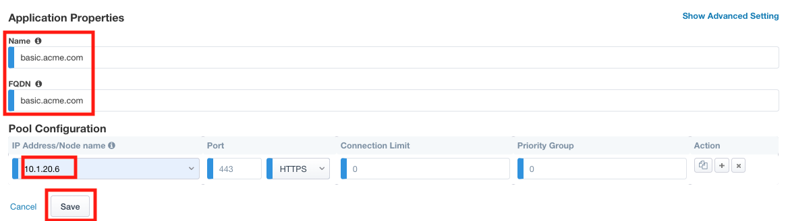

Lab 1.7 - Applications
------------------------------------------------

In this section you will define a single application

Task - Create basic.acme.com application
~~~~~~~~~~~~~~~~~~~~~~~~~~~~~~~~~~~~~~~~~~~~

#. Enter the **basic.acme.com** for the application name
#. Enter the **basic.acme.com** for the FQDN
#. Enter the IP address **10.1.20.6** for the pool member
#. Click **Save** 

|image22|

