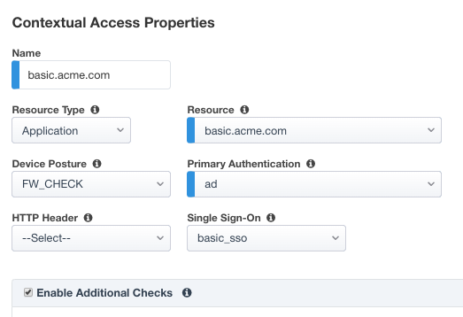
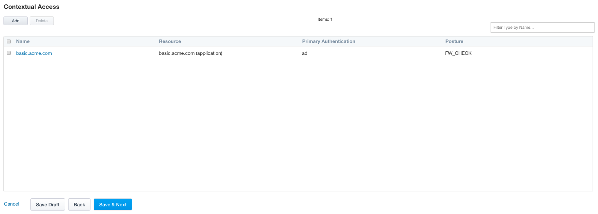

Lab 1.9 - Contextual Access
------------------------------------------------

In this section you will define contextual access for the previously created application.  Context access is where all of the previously created objects are put together to provide fine-grain access control.

Task - Create Contextual Access for basic.acme.com
~~~~~~~~~~~~~~~~~~~~~~~~~~~~~~~~~~~~~~~~~~~~~~~~~~~~~~

#. Enter **basic.acme.com** for the contextual access name
#. Select **basic.acme.com** from the Resource dropdown box
#. Select **fw_check** from the Device Posture dropdown box
#. Select **ad** from the Primary Authentication dropdown box
#. Select **basic_sso** from the Single Sign-On dropdown box
#. Check **Enable Additional Checks**

   |image23|

#. For the **Default Fallback** rule, select **Step Up** from the dropdown box under **Match Action**

#. Select **Custom Radius based Authentication (MFA)** from the Step Up Authentication box

   |image24|

#. Click **Save & Next**

   |image25|

.. |image24| image:: media/image024.png

