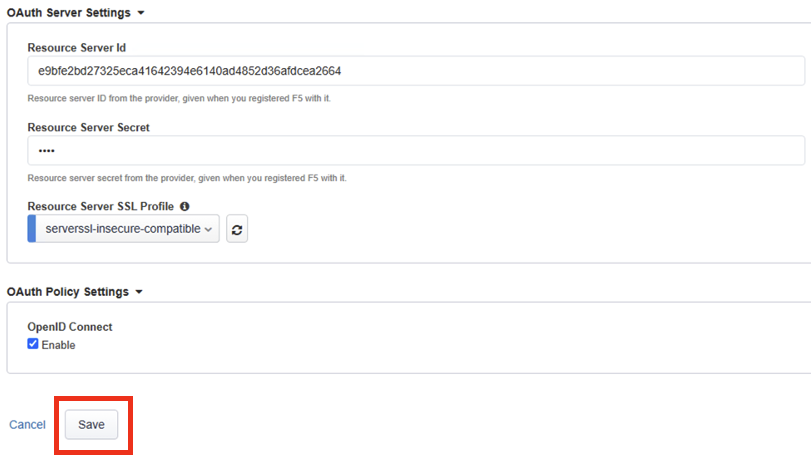

Lab 1: Using encrypted JSON Web token (JWE) in an OpenID authentication workflow
================================================================================

This lab we will demonstrate the layered use of Advanced Web Application Firewall and Access Policy Manager to protect the PetStore application by using JWE (encrypted JSON token) to authenticate requests.

Lab 1 we will be performing a few tasks that will create and use a JWE to access a protected resource behind an OAuth 2.0 authorization flow. The following tasks will be walked through or configured by the lab attendee:   

Tasks
------
Task 1 - Configure a JWE token for access 

Task 2 - Create a Client Application to serve as an OAuth Client 

Task 3 - Create a Resource Server  

Task 4 - Create a OAuth Profile 

Task 5 - Create an OAuth Server to grant authentication 

Task 6 - Create an Advanced Web Application Firewall policy to protect APIs via 	OpenAPI file

Task 7 - Disable Strict Update

Task 8 - Add Client Application to Access API profile

Task 9 - Test the policy 

Expected time to complete: **40 minutes**

Task  1 - Configure a JWE token for access
~~~~~~~~~~~~~~~~~~~~~~~~~~~~~~~~~~~~~~~~~~

In this lab we will review the configuration of a JSON web token key. These settings define when a JWE token is generated, which  Key Encryption Algorithm and what Content Encryption Algorithm to use for the key, along with the certificate use to sign the key. 

We start configurating the access token first, then we will integrate these settings into the rest of the APM OAuth workflow.  

#. Log in BIG-IP by opening Chrome browser, and clicking on the BIG-IP shortcut from the bookmark bar.

   |image1|

#. Login with username **admin** and password **admin**

#. Click on **Access** menu --> Click on **Federation** --> Click on **JSON Web Token** --> Click on **Key Configuration** -->    Click on **test-key** 

   |image2|

#. Observe the settings. Click **Cancel** to close out of the key configuration settings. 

   |image3|

Task 2 - Creating a Client Application (Observation only)
~~~~~~~~~~~~~~~~~~~~~~~~~~~~~~~~~~~~~~~~~~~~~~~~~~~~~~~~~

   In this lab we will review the Client Application settings. These settings define how a client authenticates the application, what URL(s) to display once successfully authorized, as well as apply additional conditions to client portion of the OAuth flow. 

#. Click on **Access** menu --> Click on **Federation** --> Click on **OAuth Authorization Server** --> Click on **Client Application** 

   |image5|

#. Click on **oauth-api-client** 

   |image6|

   **General Properties** - we gave the client application a **Name**.

   **Application Name** - The name of the application. This will be displayed during the authenticate request. You'll see this demonstrated in later part of the lab. 

   **Caption** - is a required field. In the lab we put the name of the application, you may want to use a short description of your application. 

   |image7|

   Under **Security Settings**, **Grant Type**, define what a client will use for authentication. We selected **Authorization Code / Hybrid** because we want the client to authenticate with an OAuth Authorization Server. After authentication has been granted, the OAuth Authorization server will send a code to the OAuth client, then the client will send A code is sent by the   

   **Redirect URI(s)** - Specifies the URI for the OAuth server to redirect a user back to the OAuth client. Displays when Grant Type is set to Authorization code. 

   **Support OpenID Connect** - Specifies whether the agent uses OpenID Connect for authorization. Displays when Grant Type is set to Authorization code. 

   **Authentication Type** - The authentication type is set to secret. When a client application is registered with the OAuth authorization server, it is issued a client ID and a client secret. These credentials are used to identify and authenticate the client application to the authorization server.  

   **NOTE:** It is common to use an enterprise identity provider or a social media platform to authenticate and authorize users via OpenID Connector (OIDC) protocol. In this lab the BIG-IP is acting as an authentication and authorization server in the OAuth flow. This configuration will be covered in Task 5.

   **Scopes** - Adding scope helps improve our security by adding a more precise or fine-grained control over what a user is allowed to access. These scopes have been preconfigured for this lab exercise. 

   **Token Management Configuration** - We set this to Enabled because we would like the Client Application to use token management configuration set in the OAuth Profile which we will review in later steps. 

   |image8|

Task 3 - Creating a Resource Server (Observation only)
~~~~~~~~~~~~~~~~~~~~~~~~~~~~~~~~~~~~~~~~~~~~~~~~~~~~~~

   In this lab we will review the Resource Server configuration. The resource server plays a vital role in the Oauth flow by hosting protected resources. The resource server ensures only authorized client application can access the resource

#. Click on **Access** menu --> Click on **Federation** --> Click on **OAuth Authorization Server** --> Click on **Resource Server** 

   |image9|

#. Click on **oauth-api-rs**.

   |image10|

#. Review the settings for the Resource Server 

   **General Properties** - The Resource Server name is locally significant on the BIG-IP.  

      **Authentication Type** - Define the type of authentication to use for validating the request. We selected Secret. BIG-IP APM will generate a random alphanumeric string to use as part of the token validation request for authentication.  

   |image11|

Task 4 - Configuring an Authorization Profile (Observation only)  
~~~~~~~~~~~~~~~~~~~~~~~~~~~~~~~~~~~~~~~~~~~~~~~~~~~~~~~~~~~~~~~~

   In this lab we will review the authorization profile settings which define the client application, resource server, and token key definition that were created previously into OAuth authorization flow. This Authorization Profile will later be attached to the virtual server. 

#. Go to **Access** --> Click on **Federation** --> Click on **OAuth Authorization Server** --> Click on **OAuth Profile** 

   |image12|

#. Click on **oauth_as_oauthProfile** to view the settings

   |image13|
   
#. Observe the settings in OAuth Profile

   In the Authorization Profile you can see a client application is defined as well as a resource server. Creating this authorization profile configures the F5 Access Policy Manager to facilitate the OAuth Authorization Flow between the resource owner, client application, and resource server. 

   You will see the JWE token that was configured in Task 1 is defined here in the authorization profile.

   |image14|

   |image15|

   |image16|

   A few items that were preconfigured are also included in this profile including the Claims, OIDC Claims (UserInfo), and token issuer URL (authorization server).  

Task 5 - Configuring an OAuth Server Profile (Observation only)
~~~~~~~~~~~~~~~~~~~~~~~~~~~~~~~~~~~~~~~~~~~~~~~~~~~~~~~~~~~~~~~

   In this task we will review the OAuth Server Profile configuration. The OAuth Server profile builds the configuration to reference a OAuth provider for authentication and access rights. This is where you can define the identity service, for example pre-configured IdPs include F5, EntraID, Okta, Google and Facebook. You can set the token expiration, iRules, and associate the client and resource server.  For this lab, we have configured BIG-IP APM to act as both Client and Resource Server. F5 is also serving as the authentication provider via OIDC in this authorization flow.  

#. Click on **Access** --> Click on **Federation** --> Click on **OAuth Client/Resource Server ** --> Click on **OAuth Server**

   |image17|

#. Click on **api-client-resource-server**

   |image18|

#. Review the OAuth Server settings.

   |image19|

   The Client and Resource Server has been selected to accommodate the F5 APM serving both functions. Additionally, this is where APM joins the identity provider to the authorization OAuth flow. Custom IdPs can also be configured to APM as long as they conform to RFC 6749.   
 

   The client and resource server settings have settings that include secret, ServerSSL profiles, and JWE key information.  

   The OAuth provider information was pre-configured for you in this lab. You can browse to Access -> Federation > OAuth Client/Resource Server > Provider. This is where you can configure the OAuth provider with either custom or pre-canned details of an identity provider. 

Task 6 - Building a Security Policy using Guided Configuration (Hands-On lab)
~~~~~~~~~~~~~~~~~~~~~~~~~~~~~~~~~~~~~~~~~~~~~~~~~~~~~~~~~~~~~~~~~~~~~~~~~~~~~

   With the previous steps completed, you will now create a security policy using the Security Guided Configuration to help protect the PetStore application from known threats, and vulnerabilities.  Then later in the lab we will layer on Access policy to improve the security posture towards a zero-trust architecture.  

#. Click on **Security** --> Click on **Guided Configuration** --> Click on **API Security Protection**

   |image20|

#. Click on REST API Security (Open API Spec)  

   |image21|

#. On the next page, scroll all the way down the page, and click on Next button 

   |image22|

#. The API Protection Properties page is where you can upload a swagger file with the API definition of your application, set an authorization method, and specify optional settings you would like to configure like Use Rate Limiting. When selected an additional configuration menu will be added to the Guided Configuration banner menu.  

   In this lab, set the following configurations.  

   **Configuration Name:** security_policy 

   **Import OpenAI Spec File:** click on **Choose File** 

   |image23|

   In the windows explorer window, click on **petstore-swagger.json** file, and then click **Open**

   |image23-2|

   Confirm the swagger file has been added successfully. 

   |image24|

   **Authorization Method:** check the **OAuth 2.0** box 

   **DNS Resolver:** select **DNS_pub** 

   |image24-2|

   **Click Save & Next**  

5. On the next page **API Protection Configuration**, you can view the paths, methods, descriptions from the swagger file imported from the previous step.  

   You should see a list of the API end points. Click **Save & Next**.

   |image25|

6. In the **Responses** section, under **API Protection Response** this page shows you the responses that are used when requests are denied.

   Review the responses, and then click **Save & Next**.

   |image26|

7. On the Web Application Security Policy Properties page you can set the enforcement mode of the security policy whether you want to start Blocking immediately or in Transparent mode.  

   In this lab we will set the policy to **Blocking**. Click **Save & Next**. 

   |image27|

8. On the **Provider** page, under **OAuth General Properties** you can define the **OAuth Authorization Server**. This is the authorization server endpoint where BIG-IP APM can go to retrieve a token on behalf of the client. 

   In this lab set the following configurations: 

   **OAuth Provider Type:** F5 

   **Choose OAuth Provider:** oauthas.appworld.com-provider 

   |image28|

   Under the **OAuth Policy Settings:** select **Enable**  

   **NOTE:** This will expand the OAuth Server Settings. 

   |image29|

   Under the **OAuth Server Settings** you will want to enter the Resource Server Configuration created in the previously in Task 3. 

   For this lab please enter the following configurations: 

   **Resource Server Id:** e9bfe2bd27325eca41642394e6140ad4852d36afdcea2664 

   **Resource Server Secret:** ztna 

   **Resource Server SSL Profile:** select serverssl-insecure-compatiable 

   Click on **Save**

   |image29-2|

   After clicking Save, this should take you back to the Provider page. Under the **OAuth Provider List** confirm the OAuth Provider has been added successfully. 

   Click on **Save & Next**

   |image30|

9. On the **Virtual Server** page, under **Virtual Server Properties**, you can define if you would like the security policy to be assigned to an existing virtual server or create a new virtual server. 

   In this lab we will assign the policy to an existing virtual server. 

   Check the **Assign Policy to Virtual Server(s)** box. 

   Click in the **Use Existing** radio button. 

   |image31|

   Under **Assign Virtual Server**, select **/petstore-prod/API/VS_API_petstore** virtual server, and then click on the right arrow to move the object to the Selected column. 

   |image32|

   Confirm your policy looks like the screen shot below. Click on **Save & Next**. 

   |image33|

10. In the **Summary** page gives you a summary of the policy Guided Configuration is building for you.  

 Click on **Deploy**.

   |image34|

11. Click on **Finished** to return to the Guided Configuration screen.

Task 7 - Disable Strict Update
~~~~~~~~~~~~~~~~~~~~~~~~~~~~~~

Guided Configurations are predefined templates using iApp. The templates are set to strict update so changes aren't inadvertly made to the objects related to policy. We will need to modify the policy we just created in Task 6 so we can further define the Access part of the policy. We will need to disable Strict Update. Follow the steps below to disable Strict Update.

#.  Click on **iApps** --> Click on **Application Services** --> click on **security_policy**

   |image35|

2. Click on **Properties** tab, uncheck the **Strict Updates** box, and click **Update** 

   |image36|

Task 8 - Edit the Access API Profile policy to add Client Application
~~~~~~~~~~~~~~~~~~~~~~~~~~~~~~~~~~~~~~~~~~~~~~~~~~~~~~~~~~~~~~~~~~~~~

   In the Security Guided Configuration, we enabled OAuth2.0, and set defined an OAuth Server. By configuring these settings, BIG-IP automatically creates an Access Policy under API Protection.  

   In this lab, since BIG-IP will be acting as a OAuth Client we will go into the Access policy to define this setting.  

#. Click on **Access** --> Click on **API Protection** --> Click on **Profile**

   |image37|

#. Click on the **Edit** button of the **security_policy** profile 

   |image38|

   This will open the Visual Policy Editor. Expand OAuth Scope Check AuthZ subroutine. We will need to add an oauth client to the flow. Click on the **+** sign next to **oauth**

   |image39|

3. Select **OAuth Client**, and then click on **Add Item** 

   |image39-2|

4. In the **OAuth Client Properties** set the following configurations: 

   **Server:** /Common/api-client-resource-server 

   **OpenID Connect:** Enabled 

   **Scope:** api_access profile address 

   Click **Save** 

   |image40|

5. We will need to adjust the OAuth Scope for External to point to api-resource-server. 

   Click on **OAuth Scope (External)**

   |image41|

6. Click on the drop-down box next to Server and select **/Common/api-resource-server**

   Click **Save**

   |image42|

   Close out of Access Policy by clicking on the green Close button at the top right corner. 

Task 9 - Testing our Policy 
~~~~~~~~~~~~~~~~~~~~~~~~~~~

#. Open Postman from the desktop icon 

   |image43|

#. Click on **Test API** folder, click on **List Available Pets**

   Notice in the Auth Type, we set it to Inherit auth from parent which has no authentication. 

   |image44|

3. Click on the **Send**, to send a GET request to the API endpoint. 

   |image45|

   The request is blocked. This is because we applied a security policy to block the request for unauthorized user. Let's apply authentication and observe the request.  

4. In the **Type** box, click the drop down box and select **OAuth 2.0**. 

   |image46|

5. In the Current Token window scroll down to the bottom of the section, till you see the **Get New Access Token** button. 

   |image47|

6. Before clicking the Get New Access Token, let's Clear cookies. Click on **Clear cookies** button. 

7. Now click on **Get New Access Token** button. 

   |image48|

8. In the Secure Logon Page type in the following credential  

   **Username:** user1 
   **Password:** user 

   |image49|

9. After successful login, you will be prompted for Authorization Request which shows what permissions is being granted. Click **Authorize**. 

   **NOTE** Recall the OAuth Client Application setup earlier in the lab where we define the application name as Demo API? This is where that name is displayed.

   |image50|

10. If you like, you may click Proceed in the Get a new access token screen, else give it a couple of seconds, and it should automatically close. 

   |image51|

11. In the **Token Details** screen, click on **Use Token** button 

   **NOTE:** You can copy the encrypted Access token, go to jwt.io, and paste the token to have the code decoded. The payload of the JWT token should be encrypted.

   |image52|

12. Back in Postman Scratch pad, click on **Send**, to make the API call. Observe the request is now successful.  

   |image53|

13. This concludes the lab.

.. |image4| image:: media/lab01/image4.png
      :width: 600px

.. |image22| image:: media/lab01/image22.png
      :width: 600px

.. |image26| image:: media/lab01/image26.png

.. |image35| image:: media/lab01/image35.png

.. |image39-2| image:: media/lab01/image39-2.png

.. |image46| image:: media/lab01/image46.png

