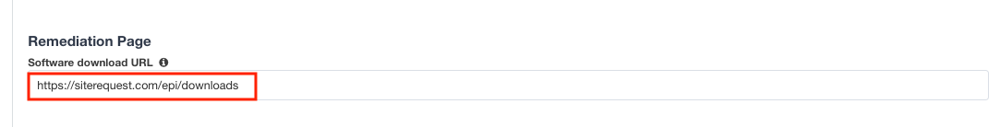
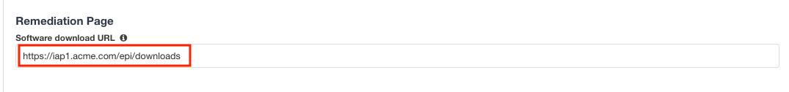

Lab 1.10 - Customization
------------------------------------------------

The Customization section allows an administrator to define the images, colors, and messages that are presented to a user.

Task - Customize the Remediation Page URL
~~~~~~~~~~~~~~~~~~~~~~~~~~~~~~~~~~~~~~~~~~

The default **remediation Page** URL uses the hostname site **request.com**.  This should be changed to reference a real host where users can download and install the EPI updates.

#. Scroll down to the Remediation Page Section

   |image29|

#. Enter the URL **https://iap1.acme.com/epi/downloads**

   |image30|

#. Click **Save & Next**

#. On the Logon Protection menu, Click **Save & Next**

