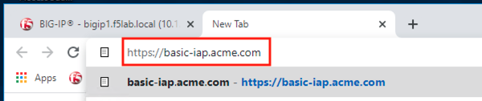
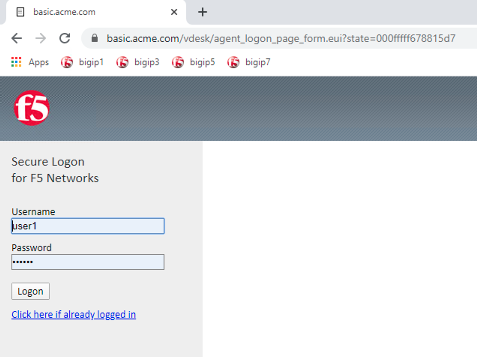
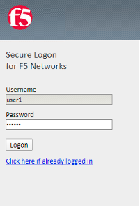
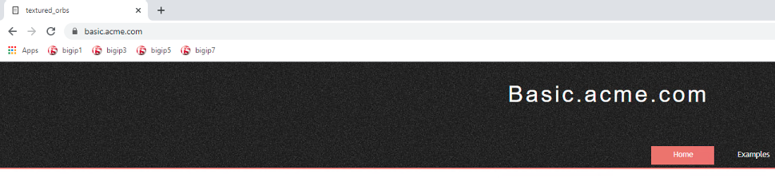
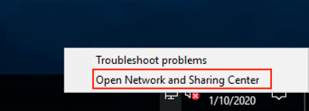
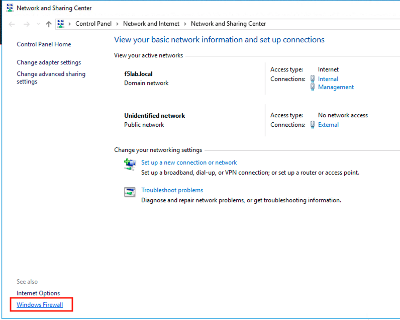
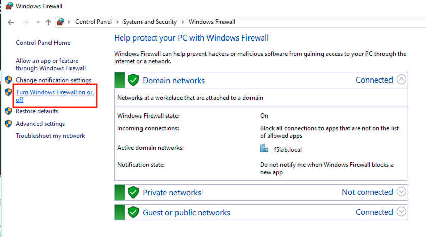
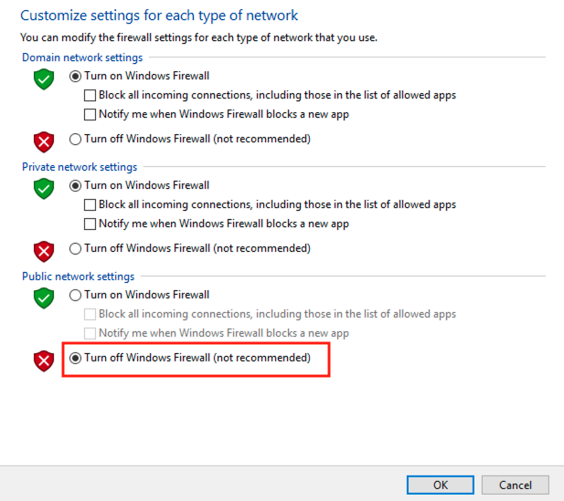
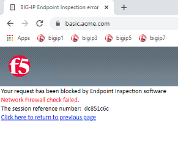
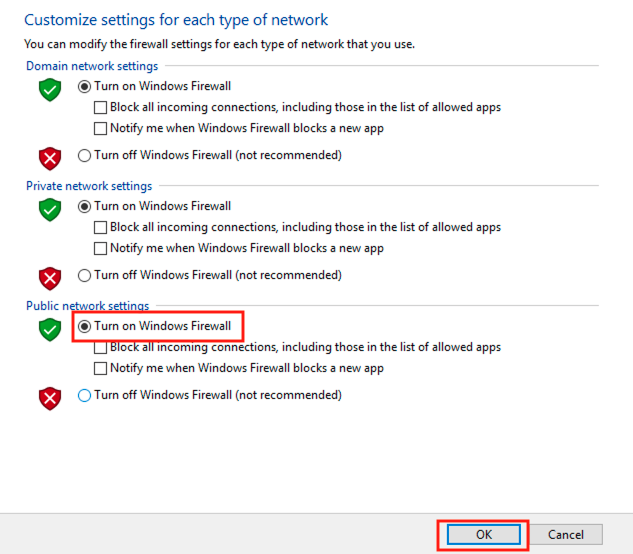

Lab 1.12 - Testing 
------------------------------------------------

In this section you will access the application basic.acme.com and watch how the BIG-IP restricts access when a device fails it's posture assessment.

Task - Access basic.acme.com
~~~~~~~~~~~~~~~~~~~~~~~~~~~~~~~~~~~~~~~~~~

.. NOTE:: Posture Assessments in a Per-Request Policy use F5 Access Guard(running on clients) to perform posture assessments prior to accessing an application.  This improves the user experience since posture checks do not introduce any delay when accessing the application. This also improves security by allowing posture assessments to occur continuously throughout the life of the session.

#. From the jumpbox, browse to https://basic.acme.com
#. At the logon page enter the Username:**user1** and Password:**user1**
#. Click **Logon**

   |image33|

#. The RADIUS logon page, prepopulates the username:**user1**.  Enter the PIN: **123456**

   |image34|

#. The SSO profile passes the username and password to the website for logon.

   |image35|

#. Close the browser Window to ensure there is not cached data

Task - Disable Windows Firewall
~~~~~~~~~~~~~~~~~~~~~~~~~~~~~~~~~~

#. Right click the computer icon in the taskbar and open **Network and Sharing Center**

   |image36|

#. Click **Windows Firewall**

   |image37|

#. Click **Turn Windows Firewall on or off**

   |image38|

#. Click the radio button **Turn off Windows Firewall** under Public Network Settings
#. Click **Ok**

   |image39|

Task - See Deny Page basic.acme.com 
~~~~~~~~~~~~~~~~~~~~~~~~~~~~~~~~~~~~~~~~

#. From the jumpbox, browse to https://basic.acme.com

#. Refresh the screen using the F5 key until the deny page appears.

#. After approximately 15 seconds you will receive a deny page from the IAP stating that you have failed the network firewall check

   |image40|

#. Close the browser Window to ensure there is no cached data

Task - Enable Windows Firewall
~~~~~~~~~~~~~~~~~~~~~~~~~~~~~~~~~~

#. Right click the computer icon in the taskbar and open **Network and Sharing Center**

   |image36|

#. Click **Windows Firewall**

   |image37|

#. Click **Turn Windows Firewall on or off**

   |image38|

#. Click the radio button **Turn on Windows Firewall** under Public Network Settings
#. Click **Ok**

   |image41|
   
#. From the jumpbox, browse to https://basic.acme.com to sure you can connect. 

