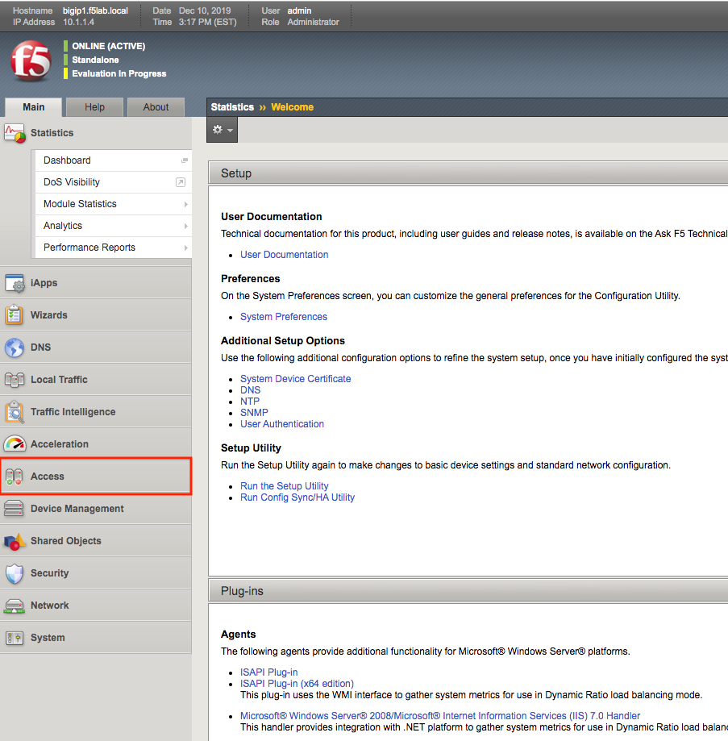

Lab 2.1 - Access Guided Configuration
----------------------------------------

To onboard a new application to the IAP, you will first access the Guided Configuration menu.

Task - Access the Zero Trust IAP guided configuration
~~~~~~~~~~~~~~~~~~~~~~~~~~~~~~~~~~~~~~~~~~~~~~~~~~~~~~

#. From the web browser, click on the **Access** tab located on the left side.

   |image0|

#. Click **Guided Configuration**

   |image1|

#. Click **IAP_DEMO** 

   |image2|

.. |image1| image:: media/image001.png
.. |image2| image:: media/image002.png
	:width: 800px

