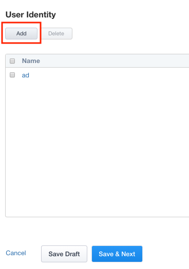
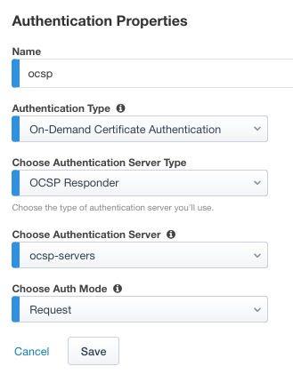
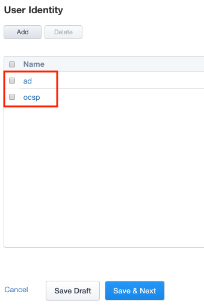

Lab 2.2 - User Identity
------------------------------------------------

Adding an additional User Identity to IAP is just a few simple steps. 

Task - Configure Certificate Authentication with OCSP
~~~~~~~~~~~~~~~~~~~~~~~~~~~~~~~~~~~~~~~~~~~~~~~~~~~~~~

#. Click **User Identity** in the Ribbon

    |image3|

#. Click **Add** to create a new User Identity

    |image4|

#. Enter Name **ocsp** 
#. Select **On-Demand Certificate Authentication** from the Authentication Type dropdown
#. Select **OCSP Responder** from the Authentication Server Type dropdown
#. Select **ocsp-servers** from the Authentication Server dropdown
#. Leave **Request** selected under Choose Auth Mode
#. Click **Save**

    |image5|

#. Verify the **ocsp** object was created

    |image6|

.. |image3| image:: media/image003.png
	:width: 1000px

