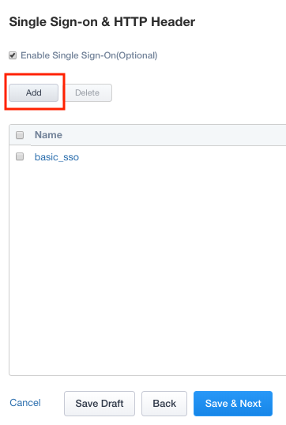
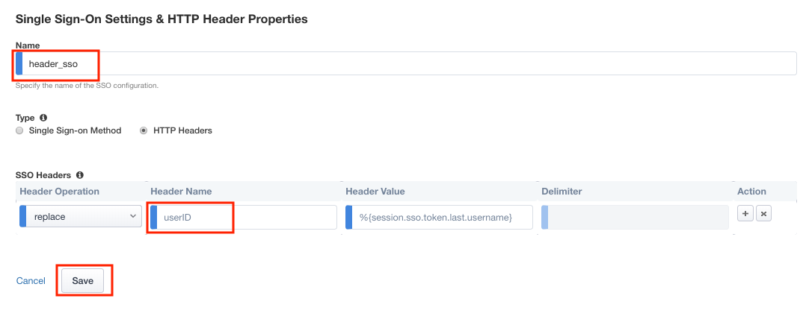
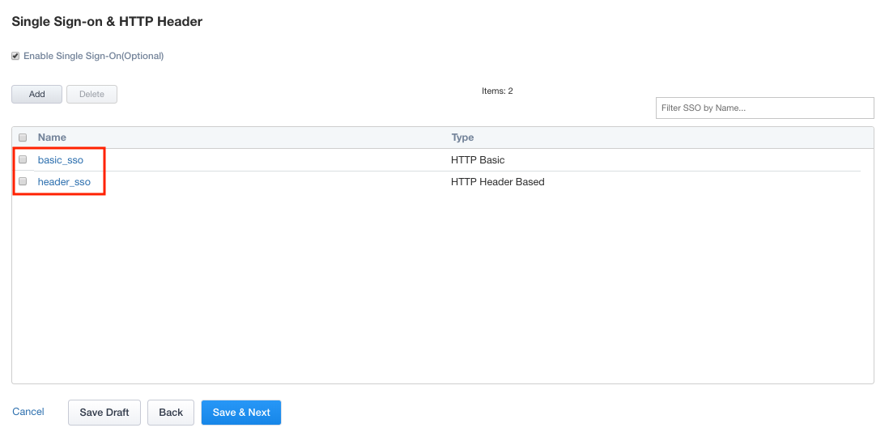

Lab 2.3 - SSO & HTTP Header
------------------------------------------------

In this section, you will create a custom header value to pass to the web server. 

Task - Create Custom Header
~~~~~~~~~~~~~~~~~~~~~~~~~~~~~~~~~~~~~~~~~~

#. Click **SSO & HTTP Header** from the Ribbon.

   |image7|

#. Click **Add** to create a new header object.

   |image8|

#. Enter Name **header_sso**
#. Change radio button for Type to **HTTP Headers**
#. In the **SSO Headers** section, enter **userID** in the Header Name Field
#. Click **Save**

   |image9|

#. Verify the **header_sso** object was created

   |image10|

