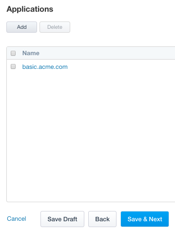
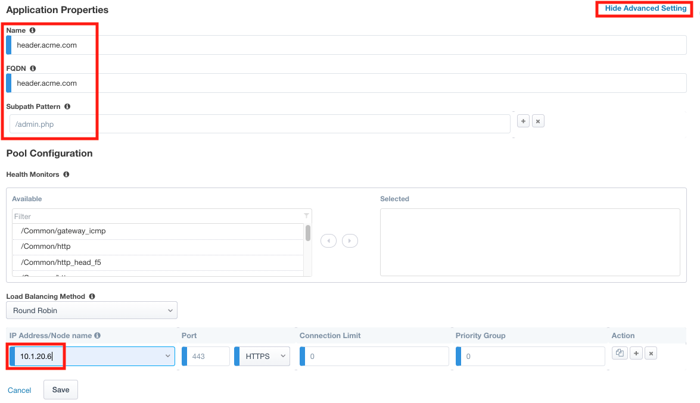
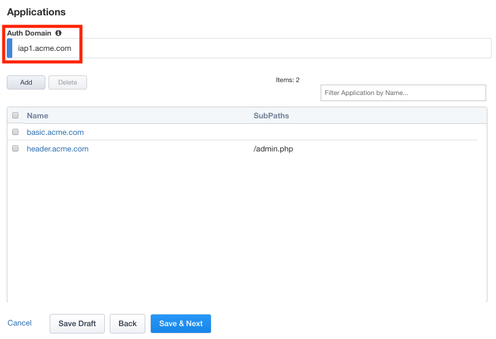

Lab 2.4 - Applications
------------------------------------------------

In this section you will define a second application with subpaths.  

Task - Configure Application header.acme.com
~~~~~~~~~~~~~~~~~~~~~~~~~~~~~~~~~~~~~~~~~~~~~~~~~~

#. Click the **Applications** icon from the ribbon.

   |image11|

#. Click **Add** to create a new application

   |image12|

#. Click **Show Advanced Setting** in the top right corner to see additional properties
#. Enter Name **header.acme.com**
#. Enter FQDN **header.acme.com**
#. Enter Subpath Pattern **/admin.php**
#. Under Pool Configuration, you will create a node by entering **10.1.20.6** in the IP Address/Node name field. **Note** This may already exist in the drop down menu.
#. Verify the pool member properties of Port **443** and Protocol **HTTPS**
#. Click **Save**

	.. note:: Subpaths are used in Application Groups to define contextual access on 	portions of an application (separate from the default contextual Access Policy).  	If necessary, an application can be split up into multiple Application Groups to 	meet an organization's access control needs.

    |image13|

#. On the Applications menu, enter Auth Domain **iap1.acme.com**
#. Verify **header.acme.com** was created.

   |image14|

