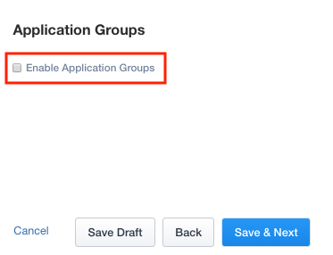
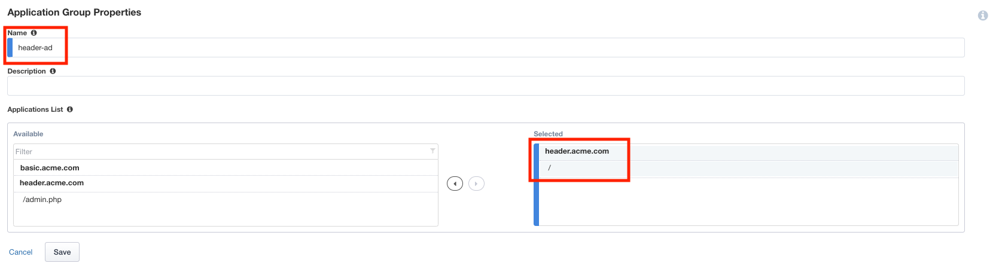
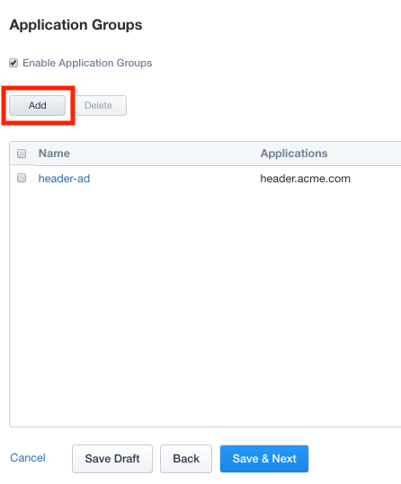
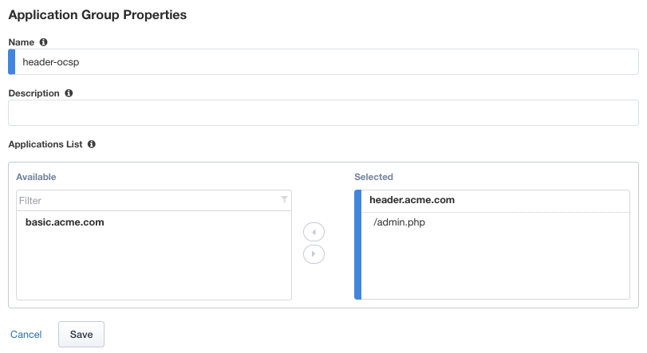
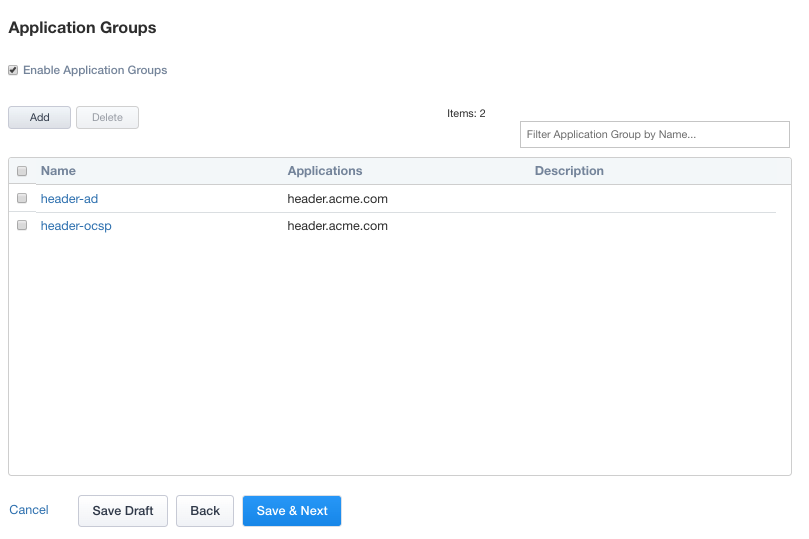

Lab 2.5 - Application Groups
------------------------------------------------

In this section you will configure two Application groups to enforce different policies on parts of the header-iap.acme.com website.  

Task - Create header-ad Group
~~~~~~~~~~~~~~~~~~~~~~~~~~~~~~~~~~~~~~~~~~

#. Click **Application Groups** from the ribbon.

   |image15|

#. Check **Enable Application Groups**
 
  |image16|

#. Enter Name **header-ad**
#. Under Applications List, select **/** and click the arrow to move it into the Selected box
#. Click **Save** 
 
   |image17|

Task - Create header-ocsp Group
~~~~~~~~~~~~~~~~~~~~~~~~~~~~~~~~~~~~~~~~~~

#. Click **Add** to create a second application group

   |image18|

#. Enter Name **header-ocsp**
#. Under Applications List, select **/admin.php** and click the arrow to move it into the Selected box
#. Click **Save** 

   |image19|
 
#. Verify both applications groups have been created.
#. Click **Save & Next**

   |image20|

