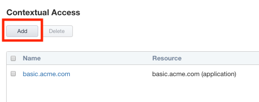
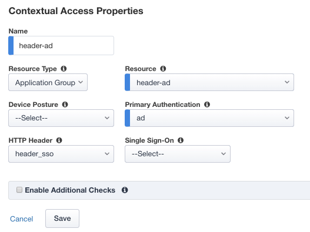
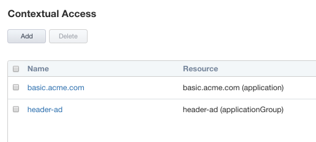
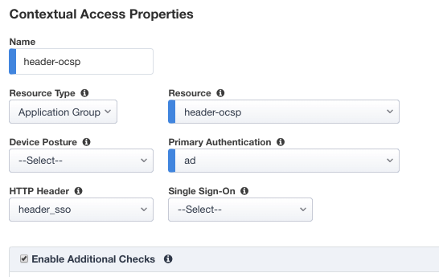
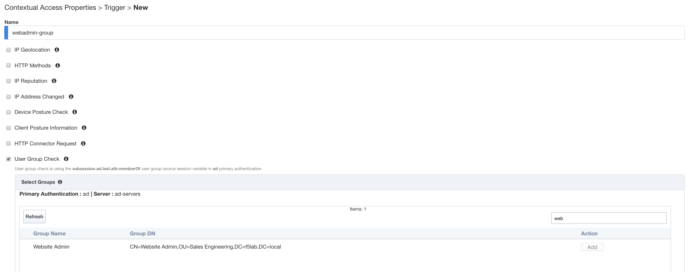
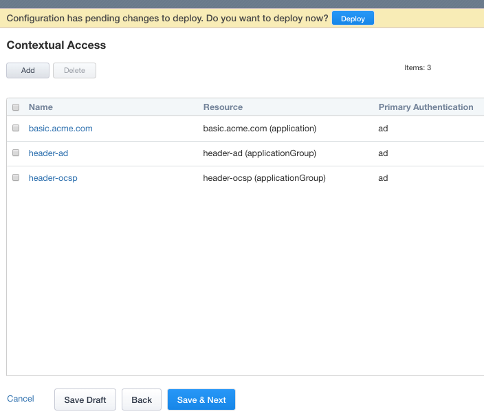
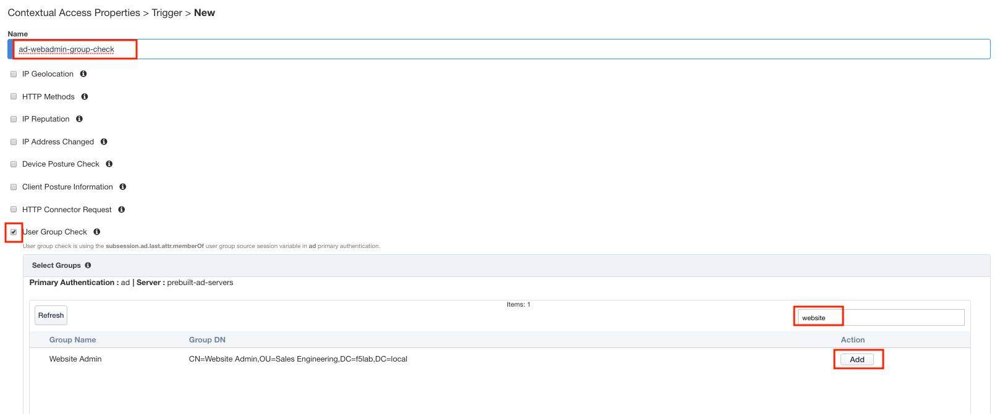
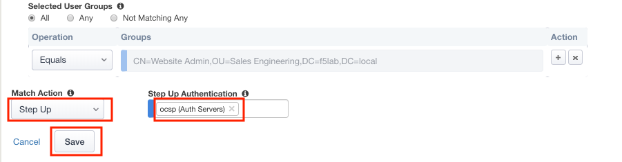

Lab 2.6 - Contextual Access
------------------------------------------------

In this section you will configure Contextual Access for the previously created Application Groups

Task - Configure Contextual Access for header_ad Group
~~~~~~~~~~~~~~~~~~~~~~~~~~~~~~~~~~~~~~~~~~~~~~~~~~~~~~~~~~~~~~~

#. Click **Contextual Access** from the ribbon

   |image21|

#. Click **Add**

   |image22|

#. Enter Name **header-ad**
#. Select **Application Group** from the Resource Type dropdown
#. Select **header-ad** from the Resource dropdown
#. Select **ad** from the Primary Authentication dropdown
#. Select **header_sso** from the HTTP_Header dropdown
#. Click **Save**

   |image23|

Task - Configure Contextual Access for header-ocsp Group
~~~~~~~~~~~~~~~~~~~~~~~~~~~~~~~~~~~~~~~~~~~~~~~~~~~~~~~~~~~~~~~

#. Click **Add**

   |image24|

#. Enter Name **header-ocsp**
#. Select **Application Group** from the Resource Type dropdown
#. Select **header-ocsp** from the Resource dropdown
#. Select **ad** from the Primary Authentication dropdown
#. Select **header_sso** from the HTTP_Header dropdown
#. Check **Enable Additional Checks**

   |image25|

#. Click **Add** to add a Trigger Rule

   |image26|

#. Enter Name **webadmin-group**
#. Check **User Group Check**
#. Locate the **Website Admin** group 

   .. tip:: Try using the filter field to search

#. Click **Add** under the Action column

   |image28|

#. Select **Step Up** from the Match Action dropdown
#. Select **ocsp** from the Step Up Authentication dropdown
#. Click **Save**
#. Click **Save** again to save the Contextual Access Properties for ocsp-header-iap.acme.com

   |image29|

#. Click **Deploy** located under the ribbon. Deployment will take a few moments.

   |image27|

