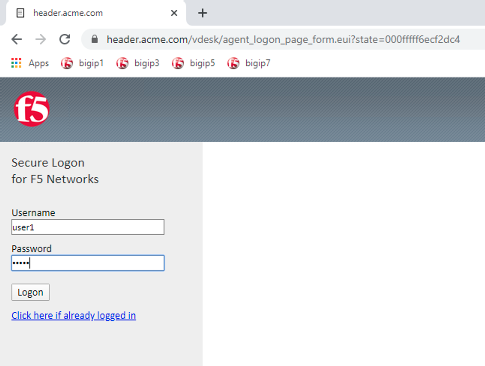
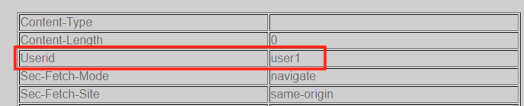
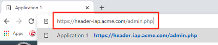
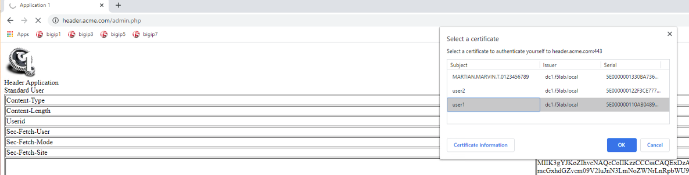
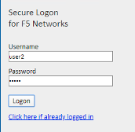
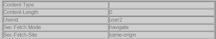
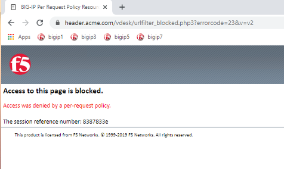

Lab 2.7 - Testing
------------------

In this section you will use user1's credentials to default website header.acme.com.  However, when you attempt to access the admin page you will be prompted for certificate based authentication.  After a successful login you will close your browser and login to default website using user2's credentials.  User2 will be denied due to not having the correct AD groups.

Task - Login to header.acme.com using user1
~~~~~~~~~~~~~~~~~~~~~~~~~~~~~~~~~~~~~~~~~~~~~

#. Open a new browser tab
#. Access the site https://header.acme.com
#. At the logon page enter the Username: **user1** and Password: **user1**
#. Click **Logon**

   |image30|

#. Notice the custom header **UserID** has a value of user1

   |image31|

#. Access the **admin** portion of the website https://header.acme.com/admin.php
#. Select the certificate **user1**
#. Click **OK**

   |image33|

#. You should be successfully logged into the **admin** portion of the site.

   |image37|

#. Close the browser completely.

Task - Login to header.acme.com using user2
~~~~~~~~~~~~~~~~~~~~~~~~~~~~~~~~~~~~~~~~~~~~~

#. Open a new browser window.
#. Access the site https://header.acme.com
#. At the logon page enter the Username: **user2** and Password: **user2**
#. Click **Logon**

   |image34|

#. Notice the custom header **UserID** has a value of user2

   |image35|

#. Access the **admin** portion of the website https://header.acme.com/admin.php
#. You receive a **Access Denied** page due to not having the correct group membership

   |image36|

