Lab 1: Implement C3D with APM Enhancements
===============================================

Expected time to complete: **1 hour**

Task 1 - Setup Lab Environment
----------------------------------

To access your dedicated student lab environment, you will require a web browser and Remote Desktop Protocol (RDP) client software. The web browser will be used to access the Lab Training Portal. The RDP client will be used to connect to the Jump Host, where you will be able to access the BIG-IP management interfaces (HTTPS, SSH).

#. Click **DEPLOYMENT** located on the top left corner to display the environment

#. Click **ACCESS** next to jumpbox.f5lab.local

   |image090|

#. Select your RDP solution.  

#. The RDP client on your local host establishes a RDP connection to the Jump Host.

#. Login with the following credentials:
         - User: **f5lab\\user1**
         - Password: **user1**

#. After successful logon the Chrome browser will auto launch opening the site https://portal.f5lab.local.  This process usually takes 30 seconds after logon.

	|image091|

#. Click the **Classes** tab at the top of the page.

#. Scroll down the page until you see **302 Ephemeral Authentication** on the left

   |image087|

#. Hover over tile **Implement C3D with APM Enchancements**. A start and stop icon should appear within the tile.  Click the **Play** Button to start the automation to build the environment

   |image088|

#. The screen should refresh displaying the progress of the automation within 30 seconds.  Scroll to the bottom of the automation workflow to ensure all requests succeeded.  If you you experience errors try running the automation a second time or open an issue on the `Access Labs Repo <https://github.com/f5devcentral/access-labs>`__.

   |image089|

Task 2 - Create an Active Directory AAA Object
----------------------------------------------------

The first step in deploying CertSSO is creating the objects required for the user to authenticate to APM.  In this lab, the user will authenticate via Active Directory and simulated MFA via RADIUS.  The user's authentication method to APM is independent of how the BIG-IP authenticates the user to the backend server for Single-Sign-On.  This allows an organization to choose an authentication scheme that matches their needs such as SAML, OAuth, or other method.

#. Navigate to **Access >> Authentication >> Active Directory**, then click the **+** (plus symbol) to create a new AAA object

   |image001|

#. Enter the following information for the AD Authentication Object

   - Name: **ad_servers**
   - Domain Name: **f5lab.local**
   - Domain Controller Pool Name: **ad_pool**
   - Domain Controller IP address: **10.1.20.7**
   - Domain Controller Hostname: **dc1.f5lab.local**
   - Admin name: **admin**
   - Admin Password: **admin**

   |image002|

#. Click **Finished**

Task 3 - Create a RADIUS AAA Object
---------------------------------------------

#. Navigate to **Access >> Authentication >> RADIUS**, then click the **+** (plus symbol) to create a new AAA object

   |image003|

#. Enter the following information for the Radius Authentication Object

   - Name: **radius_servers**
   - Server Pool Name: **radius_pool**
   - Server Addresses: **10.1.20.8**
   - Secret password: **secret**

   |image004|

#. Click **Finished**

Task 4 - Create the cert_sso Access Profile
-----------------------------------------------

In this section, you will create the APM Access Profile.

#. Navigate to **Access >> Profile/ Policies >> Access Profile(Per-Session Policies)**, then click the **+** (plus symbol) to create a new Access Profile

   |image005|

#. Enter the Name **cert_sso** 
#. Select the profile Type **All** from the dropdown

   |image006|

#. Scroll to the bottom of the profile settings to set the default language to **English**

#. Click **Finished**

   |image007|
   
   
Task 5 - Create the Access Policy
------------------------------------

In this section, edit the policy using the Visual Policy Editor to enable users to login via AD+MFA, then transition to CertSSO.

#. On the cert_sso profile line click **edit** under Per-Session Policy

   |image008|

#. Click the **+** (plus symbol) located on the fallback branch located between the **Start** and **Deny** boxes

   |image009|

#. Click the **Logon** Tab
#. Select **Logon Page**  
#. Click **Add Item**

   |image011|

#. Add an additional field to the logon page by selecting **password** from the **Type** dropdown (line 3)
#. Enter **OTP** for **Post Variable Name**
#. Enter **OTP** for **Session Variable Name**
#. Enter **OTP** for **Logon Page Input Field #3**
#. Click **Save**

   |image012|

#. Click the **+** (plus symbol) located on the fallback branch located between the **Logon Page** and **Deny** boxes

   |image013|

#. Click the **Authentication** tab
#. Select **RADIUS Auth**  
#. Click **Add Item**

   |image014|

#. Select **radius_servers** from the **AAA Server** dropdown box
#. Change the password source to **%{session.logon.last.OTP}**
#. Click **Save**

   |image015|

#. Click the **+** (plus symbol) located on the **Successful** branch located between **RADIUS Auth** and **Deny** boxes

   |image016|

#. In the **Authentication** tab, select **AD Auth** 
#. Click **Add Item**

   |image017|

#. Select **ad_servers** from the Server dropdown box
#. Click **Save**

   |image018|

#. Click the **+** (plus symbol) located on the **Successful** branch located between **AD Auth** and **Deny** box
#. Click **Add Item**

   |image010|

#. In the **Assignment** tab, select **Variable Assign** 
#. Click **Add Item**

   |image019|

#. Click **Add new entry**

   |image036|

#. Click **change**

   |image037|

#. Enter **session.ssl.cert.whole** in the custom variable field

   |image038|

#. Locate the **F5CertSSO.f5lab.local.txt** file in the **C:\\access-labs\\class3\\module2\\student_files** directory. 

   |image039|

#. Open the file with **notepad++** and copy the contents of the file

   |image040|

#. Return to the **Visual Policy Editor** and paste the certificate into the **custom expression** field
#. Click **Finished**

   |image041|

#. Click **Save**

   |image042|

#. Click the **Deny** ending icon located on the fallback branch of the **Variable Assign** agent

   |image020|

#. Click **Allow**
#. Click **Save**

   |image021|

#. Click **Apply Access Policy** located in the top left corner to commit the policy changes

Task 6 - Create a Client SSL Profile
----------------------------------------

#. Navigate to **Local Traffic >> Profiles >> SSL >> Client**, then click the **+** (plus symbol) to create a new **SSL Profile**

   |image023|

#. Enter the name **client_certsso**
#. **Check** the **custom** box to the right of **Certificate Key Chain**
#. Click **add**

   |image024|

#. Select **acme.com-wildcard** from the **certificate** dropdown box
#. Select **acme.com-wildcard** from the **key** dropdown box
#. Click **Add**

   |image025|

#. **Check** the **custom** box to the right of **Client Certificate Constrained Delegation**
#. Select **Enabled** from the **Client Certificate Constrained Delegation** dropdown box
#. Click **Finished**

   |image026|

#. Click **Finished**

Task 7 - Create a Server SSL Profile
--------------------------------------

#. Navigate to **Local Traffic >> Profiles >> SSL >> Server**, then click the **+** (plus symbol) to create a new SSL Profile

   |image027|

#. Enter **server_certsso** for profile name
#. Change the Configuraiton from Basic to Advanced via the dropdown box.
#. **Check** the two custom boxes next to **Certificate** and **Key**
#. Select **F5CertSSO.f5lab.local.crt** from the **certificate** dropbox box
#. Select **F5CertSSO.f5lab.local.key** from the **key** dropdown box
#. **Check** the custom box for **Servername**.
#. Enter the name **mtls.acme.com**

   |image028|

#. Check the **custom** box about the **Client Certificate Constrained Delegation** box
#. Select **Enabled** from the **Client Certificate Constrained Delegation** dropdown box
#. Select **F5SubCA.f5lab.local.crt** from the **CA Certificate** dropdown box
#. Select **F5SubCA.f5lab.local.key** from the **CA Key dropdown** box
#. **Click** Finished

   |image029|
   
   
Task 8 - Create the Pool
-------------------------------

In this section you create a pool that contains the IP address of the CentOS server hosting the website requiring mTLS.

#. Navigate to **Local Traffic >> Pools >> Pool List**, then click the **+** (plus symbol) to create a new **Pool**

   |image030|

#. Enter **mtls_pool** for the **Pool Name**
#. Select **https** from the list of available monitors
#. Enter **10.1.20.9** for the member address
#. Enter **443** for the member port
#. Click **add**
#. Click **Finished**

   |image031|
   
   

Task 9 - Create a Virtual Server
--------------------------------------

#. Navigate to **Local Traffic >> Virtual Servers >> Virtual Server List**, then click the **+** (plus symbol) to create a new virtual Server

   |image032|

#. Enter **mtls_vs** for the **Name**
#. Enter **10.1.10.105** for the **DestinationAddress/Mask**
#. Enter **443** for the **Service Port**
#. Select **http** for **HTTP Profile (Client)**
#. Select **client_certsso** from the **SSL Profile (Client)** List

   |image033|

#. Select **server_certsso** from the **SSL Profile (Server)** List
#. Select **Auto Map** from the **Source Address Translation** dropdown Box
#. Select **cert_sso** from the **Access Profile** dropdown Box

   |image034|

#. Select the irule **Cert_SSO**
#. Select **mtls_pool** for the **Default Pool**
#. Click **Finished**

.. note::

   The following iRule must be used when inserting custom extensions using C3D.

.. code-block:: none
   :linenos:

   when SERVERSSL_CLIENTHELLO_SEND {
      set username [ACCESS::session data get "session.logon.last.username"]
      set domain [ACCESS::session data get "session.ad.last.actualdomain"]
      SSL::c3d extension 1.1.1.1 "Minted Extension=$username@$domain"
   }

|image035|

Task 10 - Test CertSSO
------------------------------------------------

In this section, you will test access to an NGINX website requiring mTLS.

#. From the jumpbox's web browser, access https://mtls.acme.com

#. Use the following credentials:
    - Username **user1** 
    - Password: **user1**
    - OTP: **123456**

   |image044|

#. You will be logged into the site as **User1**.

   .. note::

      The contents of the certificate used for logging into the website was the CertSSO certificate copied into Per-Session Policy. The iRule that was attached inserted the custom extension 1.1.1.1 with the value of the user's logon name.  Notice that the Subject Name is CertSSO, the Subject Alternative Name is empty, and the custom extension is user1@f5lab.local.
   
       - Cert Subject: **f5certsso**
       - Subject Alt: **<empty>**
       - Custom Ext: **user1@f5lab.local**

   |image045|

#. Open a new incognito browser window so you can test access to https://mtls.acme.com with different user credentials.

   |image048|

#. Use the following credentials:
    - Username **user2** 
    - Password: **user2**
    - OTP: **123456** 

   |image050|

#. You will be logged into the site as **user2@f5lab.local**

   .. note::

      Notice that user2's Cert Subject is the same as in User1, but the custom extension name is different (now user2@f5lab.local).
   
        - Cert Subject: **f5certsso**
        - Subject Alt: **<empty>**
        - Custom Ext: **user2@f5lab.local**

   |image051|

   
Task 11 - Create an HTTP Connector Transport
------------------------------------------------

#. Navigate to **Access >> Authentication >> HTTP Connector >> HTTP Connector Transport** and click the  **+** (plus symbol)

   |image054|

#. Enter Name **demo-http-connector**

#. Select **internal-dns-resolver** from the **DNS Resolver** dropdown

#. Select **apiadmin-serverssl** from the **Server SSL Profile**

#. Click **Save**

   |image055|

Task 12 - Create a HTTP Connector Request
------------------------------------------------

#. Navigate to **Access >> Authentication >> HTTP Connector >> HTTP Connector Request** and click the  **+** (plus symbol)

   |image056|

#. Enter name **get-cert**
#. Select **demo-http-connector** from the dropdown
#. Enter URL **https://adapi.f5lab.local:8443/user/cert?username=%{perflow.username}**
#. Enter **GET** for the **Method**
#. Select **Parse** for the **Response Action**
#. Click **Save**

   |image057|

Task 13 - Create a Per-Request Policy
------------------------------------------------

#. Navigate to **Access >> Profiles/Policies >> Per-Request Policies** and click the  **+** (plus symbol)

   |image058|

#. Enter the name **certsso_prp**
#. Select the Language **English**
#. Click **Finished**

   |image059|

#. Click **edit** under **Per-Request Policy**

   |image060|

#. Click **Add New Subroutine**

   |image061|

#. Enter the name **Request Cert**
#. Click **Save**

   |image062|

#. Expand the subroutine by click the **+** (plus symbol)

   |image063|

#. Click the **+** (plus symbol) on the fallback branch.

   |image064|

#. Click the **General Purpose** tab
#. Select **HTTP Connector**
#. Click **Add Item**

   |image065|

#. Select **get-cert** drop the dropdown

   |image066|

#. Click **Edit Terminals**

   |image067|

#. Click **Add Terminal**

   |image068|

#. Change the name for the default branch to **Fail**
#. Change the default branch text to **Red**
#. Enter the name **Success** for the new branch
#. Change the color of the new branch to **Green**

   |image069|

#. Click the **Fail** terminal at the end of the **Successful** branch

   |image070|

#. Select the **Success** terminal
#. Click **Save**

   |image071|

#. Click the **+** (plus symbol) on the **successful** branch

   |image072|

#. Click the **Assignment** tab
#. Select **Variable Assign**
#. Click **Add Item**

   |image073|

#. Click **Add new entry**
#. Click **change**

   |image074|

#. Enter **session.ssl.cert.whole** for the **Custom Variable**
#. Select **Session Variable** from the dropdown
#. Enter **subsession.http_connector.body.certificate** for the **Session Variable**
#. Click **Finished**

   |image075|

#. Click **Save**

   |image076|

#. Click the **+** (plus symbol) located between **Start** and **Allow** in the policy

   |image077|

#. Click the **Subroutines** tab
#. Select the **Request Cert** subroutine
#. Click **Add Item**

   |image078|

#. Click the **+** (plus symbol) on the success branch of **Request Cert**

   |image079|

#. Click the **General Purpose** tab
#. Select **irule Event**
#. Click **Add Item**

.. note::

   This iRule event triggers the code from the previously attached iRule. This iRule must be used when inserting a certificate using C3D in a per-request policy.

.. code-block:: none
   :linenos:

   when ACCESS_PER_REQUEST_AGENT_EVENT {
      set cert [ACCESS::session data get {session.ssl.cert.whole}]
      log local0. "My cert: $cert"
      SSL::c3d cert [X509::pem2der $cert]
   }

   |image080|

#. Enter **lab** for the **ID**
#. Click **Save**

   |image081|

Task 14 - Attach the PRP to the mTLS Virtual Server
-------------------------------------------------------

#. Navigate to **Local Traffic >> Virtual Servers**.  Click **Virtual Server List**

   |image082|

#. Click **mtls_vs**

   |image083|

#. Navigate to the **Access Policy** section and select **certsso_prp** from the **Per-Request Policy** dropdown
#. Click **Update**

   |image084|

Task 15 - Access mtls.acme.com with Dynamic Certificate
~~~~~~~~~~~~~~~~~~~~~~~~~~~~~~~~~~~~~~~~~~~~~~~~~~~~~~~~

#. From the web browser on the jumphost, access https://mtls.acme.com

#. Use the following credentials:
   - Username: **user1**
   - password: **user1**
   - OTP: **123456**

   |image044|
#. You will be logged into the site as **user1@f5lab.local**

   .. note::
   	The contents of the certificate used for logging into the website were from certificate retrieved via HTTP connector in Active Directory. The irule continues to insert the 	custom extension 1.1.1.1 with the value containing the user's logon name. Notice the Subject Name is user1, the Subject Alternative Name is user1@f5lab.local and the custom 	extension is user1@f5lab.local
   
      - Cert Subject: **user1**
      - Subject Alt: **user1@f5lab.local**
      - Custom Ext: **user1@f5lab.local**

   |image085|

#. Open a new incognito browser window so you can test access to mtls.acme.com with different user credentials.

   |image048|

#. Use the following credentials: 

   - Username: **user1**
   - password: **user1**
   - OTP: **123456**

   |image050|

#. You will be logged into the site as **user2@f5lab.local**

   .. note::
     Notice that user2's Cert Subject is now user2 and the subject alt is user2@f5lab.local.  The irule continues to insert the custom extension.
   
      - Subject: **user2**
      - Subject Alt: **user2@f5lab.local**
      - Custom Ext: **user2@f5lab.local**

   |image086|

This concludes our lab on APM C3D Enchancements 

   |image000|

.. |image000| image:: media/lab01/000.png
.. |image001| image:: media/lab01/image001.png
.. |image002| image:: media/lab01/002.png
	:width: 800px
.. |image003| image:: media/lab01/image003.png
.. |image004| image:: media/lab01/image004.png
	:width: 700px
.. |image005| image:: media/lab01/image005.png
.. |image006| image:: media/lab01/image006.png
	:width: 800px
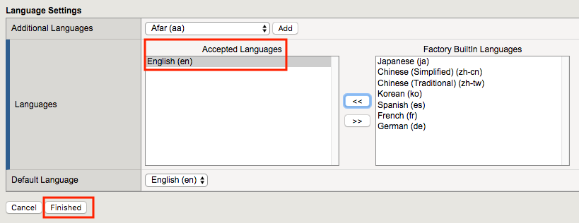
.. |image008| image:: media/lab01/image008.png
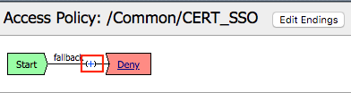
.. |image010| image:: media/lab01/image010.png
.. |image011| image:: media/lab01/image011.png
.. |image012| image:: media/lab01/image012.png
.. |image013| image:: media/lab01/image013.png
.. |image014| image:: media/lab01/image014.png
.. |image015| image:: media/lab01/image015.png
	:width: 800px
.. |image016| image:: media/lab01/image016.png
.. |image017| image:: media/lab01/image017.png
.. |image018| image:: media/lab01/image018.png
	:width: 800px
.. |image019| image:: media/lab01/image019.png
.. |image020| image:: media/lab01/image020.png
.. |image021| image:: media/lab01/image021.png
.. |image022| image:: media/lab01/image022.png
.. |image023| image:: media/lab01/image023.png
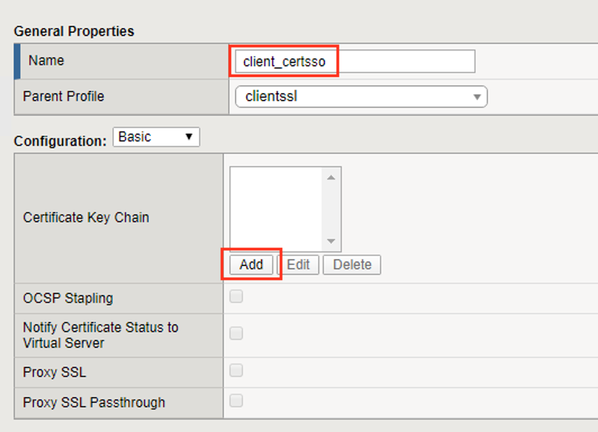
.. |image025| image:: media/lab01/025.png
.. |image026| image:: media/lab01/image026.png
	:width: 800px
.. |image027| image:: media/lab01/image027.png
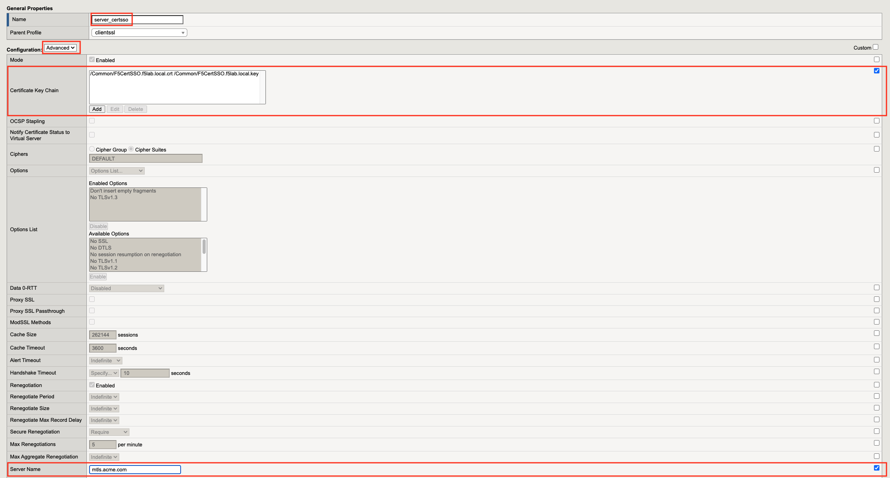
.. |image029| image:: media/lab01/image029.png
	:width: 1000px
.. |image030| image:: media/lab01/image030.png
.. |image031| image:: media/lab01/image031.png
	:width: 800px
.. |image032| image:: media/lab01/image032.png
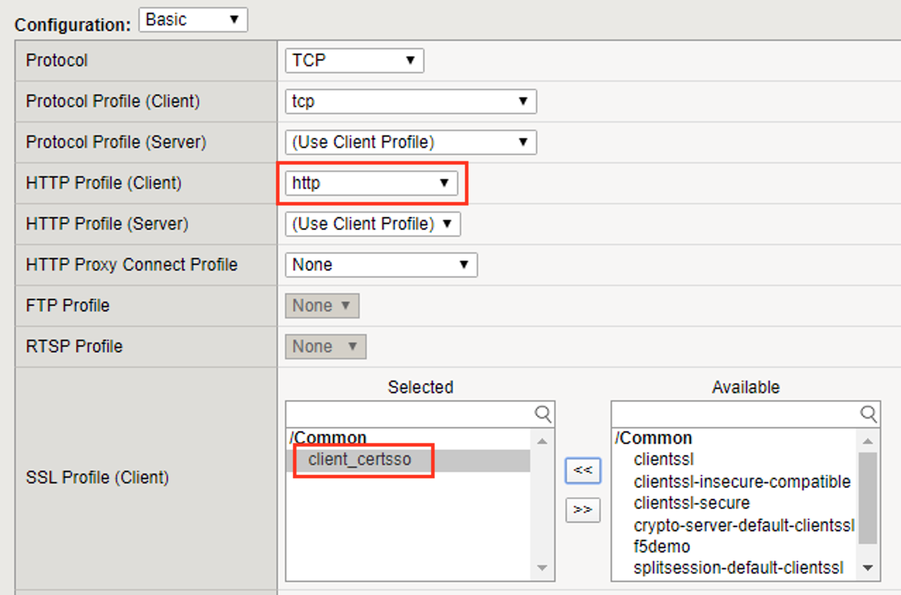
.. |image034| image:: media/lab01/image034.png
	:width: 800px
.. |image035| image:: media/lab01/image035.png
	:width: 800px
.. |image036| image:: media/lab01/image036.png
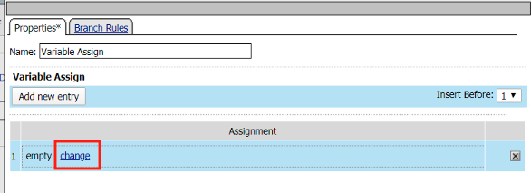
.. |image038| image:: media/lab01/image038.png
.. |image039| image:: media/lab01/039.png
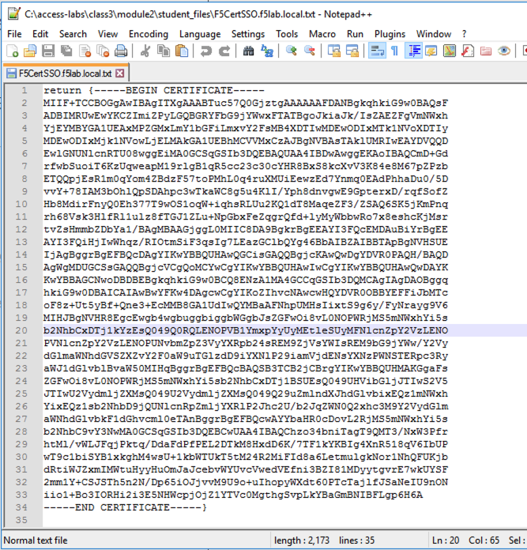
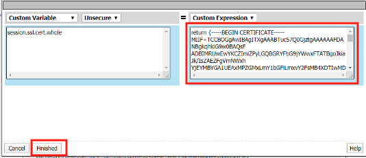
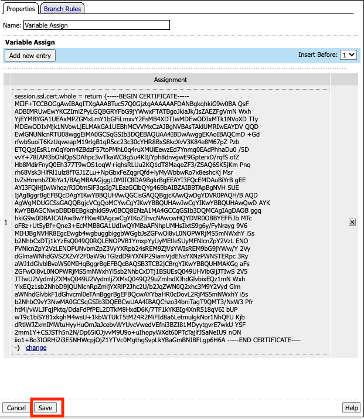
.. |image043| image:: media/lab01/image043.png
.. |image044| image:: media/lab01/image044.png
	:width: 800px
.. |image045| image:: media/lab01/image045.png
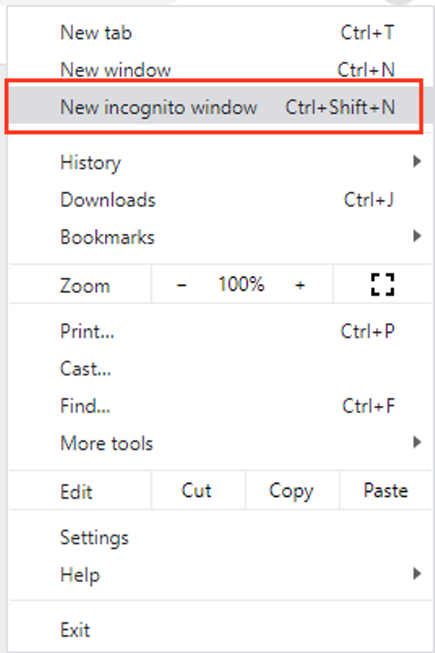
.. |image049| image:: media/lab01/image049.png
.. |image050| image:: media/lab01/image050.png
	:width: 800px
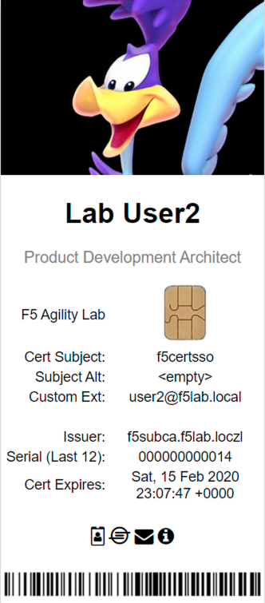
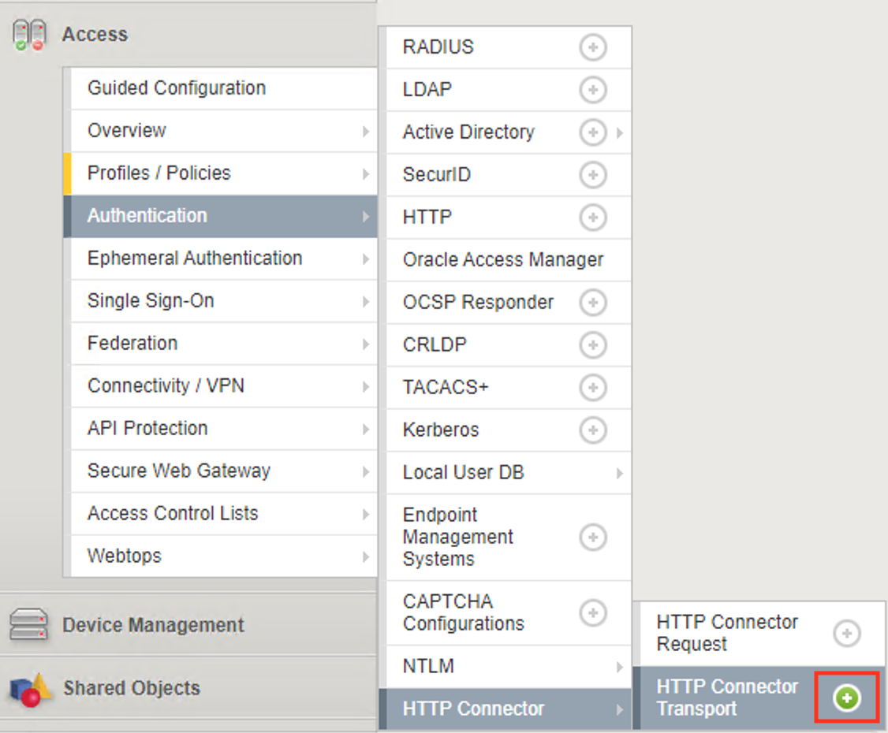
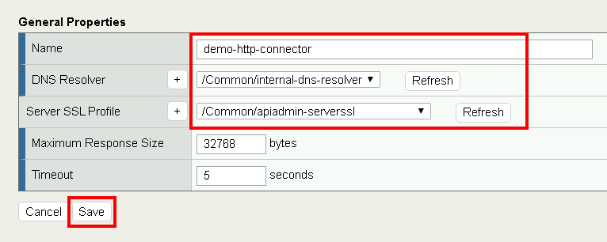
.. |image056| image:: media/lab01/image056.png
.. |image057| image:: media/lab01/image057.png
.. |image058| image:: media/lab01/image058.png
.. |image059| image:: media/lab01/image059.png
	:width: 800px
.. |image060| image:: media/lab01/image060.png
	:width: 1000px
.. |image061| image:: media/lab01/image061.png
.. |image062| image:: media/lab01/image062.png
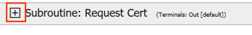
.. |image064| image:: media/lab01/image064.png
.. |image065| image:: media/lab01/image065.png
.. |image066| image:: media/lab01/image066.png
.. |image067| image:: media/lab01/image067.png
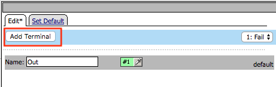
.. |image069| image:: media/lab01/image069.png
.. |image070| image:: media/lab01/image070.png
.. |image071| image:: media/lab01/image071.png
.. |image072| image:: media/lab01/image072.png
.. |image073| image:: media/lab01/image073.png
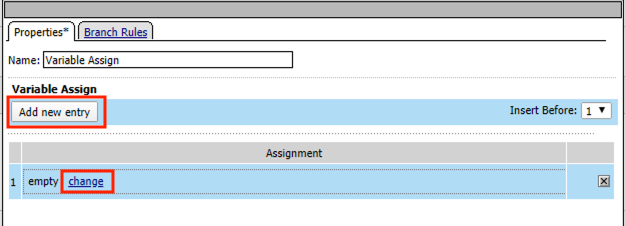
.. |image075| image:: media/lab01/image075.png
.. |image076| image:: media/lab01/image076.png
.. |image077| image:: media/lab01/image077.png
.. |image078| image:: media/lab01/image078.png
.. |image079| image:: media/lab01/image079.png
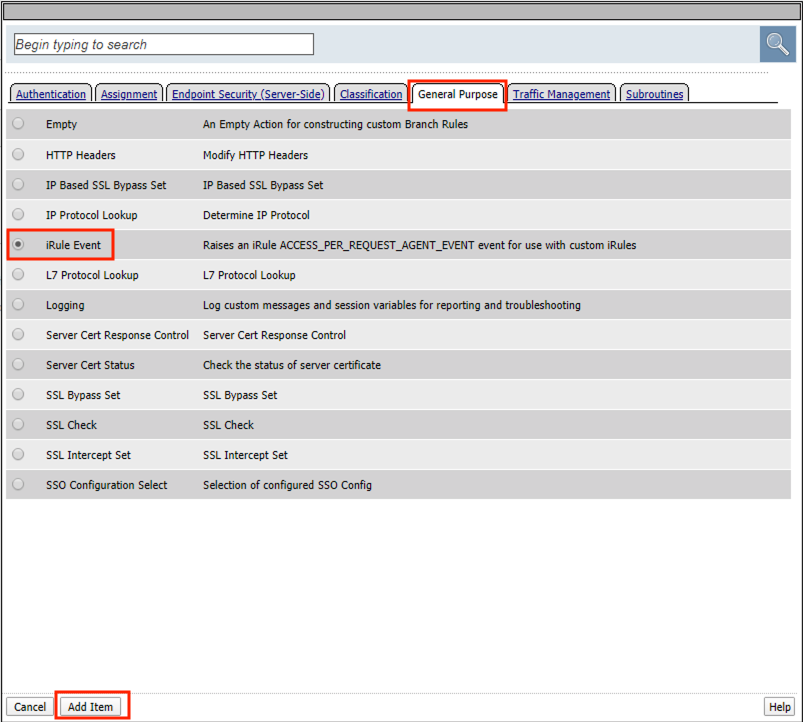
.. |image081| image:: media/lab01/image081.png
.. |image082| image:: media/lab01/image082.png
.. |image083| image:: media/lab01/image083.png
.. |image084| image:: media/lab01/image084.png
.. |image085| image:: media/lab01/image085.png
.. |image086| image:: media/lab01/image086.png
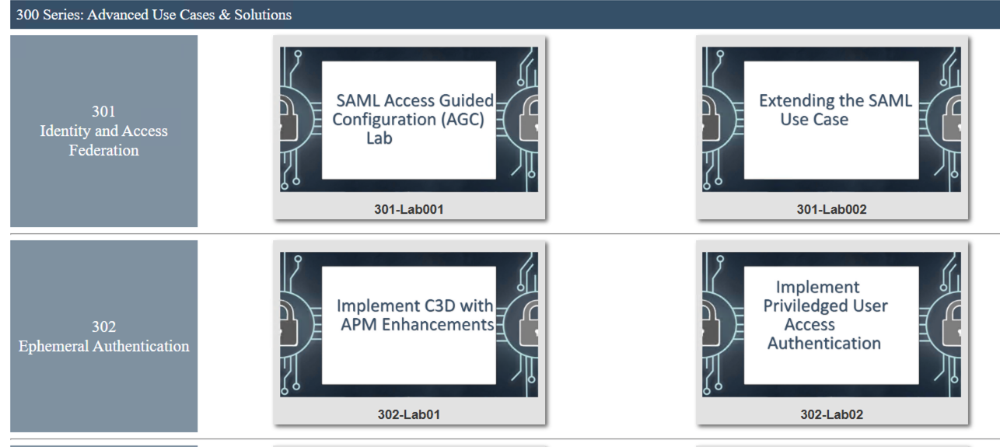
.. |image088| image:: media/lab01/088.png
.. |image089| image:: media/lab01/089.png
.. |image090| image:: media/lab01/090.png
.. |image091| image:: media/lab01/091.png

