Lab 2: Implement Priviledged User Access Authentication
===========================================================

The F5 Privileged User Access (PUA) solution provides an easy way to add CAC/PKI authentication or other strong authentication methods to network infrastructure and systems that do not natively support this functionality.  It does this without requiring the addition of client software or agents anywhere in the environment and allows you to fully leverage your legacy or non-compliant systems in a safe and secure manner.  It integrates directly into DoD PKI or MFA systems and may be configured to work cooperatively with existing TACACS, Active Directory, AAA servers, or a variety of third-party authentication databases.

F5 PUA is DoD CIO approved as an Identify Federation Service (IFS) for facilitating both privileged and unprivileged user authentication to unclassified and secret fabric DoD Information Systems.

IFS are third-party intermediary services facilitating user-authentication to resources or relying parties. IFS may be used when a system or application does not support direct authentication with PKI or MFA credentials, or the system owner desires a single management framework for a group of heterogeneous systems.

**F5 Certifications**

   - DoD UC APL
   - FIPS 140-2 Validated - Level 1, 2, or 3 depending on platform selection.  F5 offers software (VE), F5 Full-Box FIPS platforms, integrated (HSM PCI Card), and external (Network HSM) FIPS solutions
   - Common Criteria Certification
   - NSA Commercial Solutions for Classified (CSfC) Components List
   - DISA/JITC PKE (public key enabled)
   - United States Government IPv6 Conformance Certification (USGv6)

Priviledged User Access (PUA) Requirements
------------------------------------------------------

In order to deploy the F5 PUA solution, you will require the following:

   - F5 BIG-IP Access Policy Manager (APM)
   - iRules LX licensed and provisioned
   - F5 PUA platform and device licenses
   - F5 PUA installation script ("build_pua.zip") - for this release of PUA

The following resources will be defined for the lab environment:

+-------------------------+------------------------------------------------------------------+-------------+
| **Resource**            | **Description**                                                  | **Value**   |
+=========================+==================================================================+=============+
| WebSSH\_proxy\_vs\_IP   | Virtual server IP Address of WebSSH2 service.                    | 10.1.10.104 |
+-------------------------+------------------------------------------------------------------+-------------+
| APM\_Portal\_vs\_IP     | Virtual server IP Address of APM portal for authentication       | 10.1.20.104 |
+-------------------------+------------------------------------------------------------------+-------------+
| RADIUS\_proxy\_vs\_IP   | Virtual server IP address of RADIUS proxy service                | 10.1.20.104 |
+-------------------------+------------------------------------------------------------------+-------------+
| LDAP\_proxy\_vs\_IP     | Virtual server IP address of LDAP proxy service                  | 10.1.20.104 |
+-------------------------+------------------------------------------------------------------+-------------+
| LDAPS\_proxy\_vs\_IP    | Virtual server IP address of LDAPS proxy service                 | 10.1.20.104 |
+-------------------------+------------------------------------------------------------------+-------------+
| LDAP\_server\_IP        | IP Address of site LDAP or AD server (required for LDAP use)     | 10.1.20.7   |
+-------------------------+------------------------------------------------------------------+-------------+
| RADIUS\_server\_IP      | IP Address of site RADIUS server (if RADIUS bypass is used)      | 10.1.20.7   |
+-------------------------+------------------------------------------------------------------+-------------+

Expected time to complete: **1 hour**

Task 1 - Setup Lab Environment 
-----------------------------------

To access your dedicated student lab environment, you will require a web browser and Remote Desktop Protocol (RDP) client software. The web browser will be used to access the Lab Training Portal. The RDP client will be used to connect to the Jump Host, where you will be able to access the BIG-IP management interfaces (HTTPS, SSH).

#. Click **DEPLOYMENT** located on the top left corner to display the environment

#. Click **ACCESS** next to jumpbox.f5lab.local

   |image200|

#. Select your RDP solution.  

#. The RDP client on your local host establishes a RDP connection to the Jump Host.

#. Login with the following credentials:
         - User: **f5lab\\user1**
         - Password: **user1**

#. After successful logon the Chrome browser will auto launch opening the site https://portal.f5lab.local.  This process usually takes 30 seconds after logon.

	|image201|

#. Click the **Classes** tab at the top of the page.

#. Scroll down the page until you see **302 Ephemeral Authentication** on the left

   |image087|

#. Hover over tile **Implement Priviledged user Access Authentication**. A start and stop icon should appear within the tile.  Click the **Play** Button to start the automation to build the environment

   |image088|

#. The screen should refresh displaying the progress of the automation within 30 seconds.  Scroll to the bottom of the automation workflow to ensure all requests succeeded.  If you you experience errors try running the automation a second time or open an issue on the `Access Labs Repo <https://github.com/f5devcentral/access-labs>`__..

   |image089|

Task 2 - Executing the PUA Script
------------------------------------------------

**Overview**

The ./build_pua.sh script will do a pre-flight check to ensure all the pre-requisites are met and will invoke a UCS backup by default before making any changes. If this script is run on a BIG-IP with a trial license, you must use the -s or --sanity option to prevent checking for licensing restrictions, this should only be done in a non-production environment as this may cause issues with production systems.

After each invocation, a log file will be left in /var/log called f5-pua-install-xxxx.log which will outline all the actions taken along with the result or any errors encountered. This log file may be requested by support or an F5 engineer to assist in any troubleshooting.

**Usage**

Invoking ./build_pua.sh with "-h" or "--help" will alert you to the potential options you may use to modify the behavior of the script. As of this document and version 1.1.3 the current options are:

.. list-table::
    :widths: 20 40
    :header-rows: 1

    * - **Options**
      - **Descriptions**
    * - -h, -\\-help
      - This Notice
    * - -s -\\-sanity
      - Bypass santiy checks (license, BIG-IP status)
    * - -u -\\-update
      - Update existing installation
    * - -e -\\-extract
      - Extract files to temp location and exit
    * - -n -\\-nobackup
      - Does not perform UCS backup
    * - -c -\\-checkonly
      - Check installed versions against this package
    * - -d -\\-disabletest
      - Disable test user
    * - -f -\\-forceupgrade
      - Force upgrade of packages from this archive

.. note::

   This lab will automate the installation of the ./build_pua.sh script by creating a file called pua_config.sh and saving to the same directory as ./build_pua.sh.
   The **pua_config.sh** file is located in the **/var/tmp/pua** directory

.. code-block:: console

   # Sample unattended install script
   # place this in the same directory as
   # build_pua.sh to automatcailly install
   #
   # uncomment the lines below to use/customize
   noninteractive=true
   radiusvip=10.1.20.104
   ldapvip=10.1.20.104
   ldapsvip=10.1.20.104
   webtopvip=10.1.10.104
   radiusconfig=y
   sampleca=y
   disabletest=true
   nobackup=true

Setting the "noninteractive=true" option will perform a full unattended install if all the sample prompts above are provided and uncommented, otherwise the answers provided in pua_config.sh will be used as the defaults in a semi-interactive install method.

#. Login to into the BIG-IP via SSH

#. Change Directory to **/var/tmp/pua**

   .. code-block:: console

      cd /var/tmp/pua

   |image01|

#. Unzip the PUA Build Script

   .. code-block:: console

      unzip build_pua-151-1.1.5-rc17.zip

   |image02|

#. Verify the **pua_config.sh**

   .. code-block:: console

      cat pua_config.sh

   |image03|

#. Run the PUA installation script **./build_pua.sh**

   .. code-block:: console

      ./build_pua-151.sh

   .. code-block:: console

      [admin@bigip1:Active:Standalone] pua # ./build_pua-151.sh

      /var/tmp/pua/build_pua-151.sh - v1.1.5-rc17 on BIG-IP v15.1.0
      Reading config from /var/tmp/pua/pua_config.sh...

      noninteractive is GO... Buckle up...

      Preparing environment... [OK]

      Changing to /tmp/pua.rILEoICRFw... [OK]

      Extracting archive... [OK]

      Checking License Entitlements for Privileged User Access... [OK]

      Adding ILX archive directory... [OK]

      Checking modules are provisioned.

      Checking apm... [OK]

      Checking ilx... [OK]

      SUCCESS: All modules provisioned.

      Checking for BIG-IP-ILX-WebSSH2-current.tgz... [OK]

      Hash check for BIG-IP-ILX-WebSSH2-current.tgz... [OK]

      Checking for BIG-IP-ILX-ephemeral_auth-151-current.tgz... [OK]

      Hash check for BIG-IP-ILX-ephemeral_auth-151-current.tgz... [OK]

      RADIUS = 10.1.20.104

      LDAP = 10.1.20.104

      LDAPS = 10.1.20.104

      Webtop = 10.1.10.104
      [OK]
      [OK]
      [OK]
      [OK]
      [OK]
      [OK]

      Checking for ca.pua.lab.cer... [OK]

      Hash check for ca.pua.lab.cer... [OK]

      Installing CA file ca.pua.lab.cer... [OK]

      Creating pua_webtop-clientssl profile with CA ca.pua.lab.cer... [OK]

      Creating ephemeral_config data group... [OK]

      Creating ephemeral_LDAP_Bypass data group... [OK]

      Creating ephemeral_RADIUS_Bypass data group... [OK]

      Creating ephemeral_radprox_host_groups data group... [OK]

      Creating ephemeral_radprox_radius_attributes data group... [OK]

      Creating ephemeral_radprox_radius_client data group... [OK]

      Creating WebSSH2 Workspace... [OK]

      Extracting BIG-IP-ILX-WebSSH2-current.tgz to /var/ilx/workspaces/Common... [OK]

      Copying WebSSH2 config.json.sample to config.json... [OK]

      Creating WebSSH2 Plugin... [OK]

      Importing APM sample profile ... [OK]

      Modifying pua Web Top Link... [OK]

      Applying pua APM Policy... [OK]

      Creating Ephemeral Authentication Workspace... [OK]

      Extracting BIG-IP-ILX-ephemeral_auth-151-current.tgz to /var/ilx/workspaces/Common... [OK]

      Modifying Ephemeral Authentication Workspace... [OK]

      Copying Ephemeral Auth config.json.sample to config.json... [OK]

      Creating Ephemeral Authentication Plugin... [OK]

      Creating RADIUS Proxy Service Virtual Server... [OK]

      Creating LDAP Proxy Service Virtual Server... [OK]

      Creating LDAP Proxy Service Virtual Server... [OK]

      Creating LDAPS (ssl) Proxy Service Virtual Server... [OK]

      Creating Webtop Virtual Server... [OK]

      Modifying BIG-IP for RADIUS authentication against itself... [OK]

      Saving config... [OK]

      You can test your new APM webtop now by browsing to:

         https://10.1.10.104

         username: <any>
         password: <any>

      This will let anyone in with any policy. The next step after testing would be
      to add access control through AD, MFA, or some other method.

      If the RADIUS testing option was enabled, any username will log in using
      Ephemeral Authentication.

      Task complete.

      Now go build an APM policy for PUA!

      Cleaning up...

      /var/tmp/pua/build_pua-151.sh - v1.1.5-rc17 on BIG-IP v15.1.0
      [admin@bigip1:Active:Standalone]

Task 3 - Accessing the BIG-IP via APM Webtop
------------------------------------------------

In this section, you will test the initial installation of the PUA deployment.

#. Open a web browser and navigate to https://pua.acme.com

#. A Warning Banner page (customizable) should appear, click the **Click here to continue** link.

   |image10|

#. You should now see a logon page. Enter a random username and any password. Then, click the **Logon** button.

   |image11|

#. You should be directed to the webtop. Click the **BIG-IP** tile.

   |image12|

#. You should then see a WebSSH screen. Notice that you were logged into the BIG-IP with the username that you entered at the logon page.

   |image13|
   
Task 4 - Review the APM Policy Created by the PUA Build Script
-------------------------------------------------------------------

#. Open a web browser and log into the BIG-IP via its management address: https://10.1.1.4

#. Navigate to **Access >> Profiles/Policies >> Access Profiles (Per-Session Polices)**.

   |image20|

#. Click the **Edit** link for the **pua** Access Profile.

   |image21|

#. Expanded the Macros by clicking the square box with the plus sign inside.

   |image22|

#. Here is the policy created by the PUA Build Script:

   |image23|
   

Task 5 - Build a LDAP macro
------------------------------

PUA requires a Directory Service to authenticate users. In this section you will build a LDAP macro to perform the authentication function.

.. note::

   This lab makes use of APM macros to make policies easy to view and manage.

The LDAP macro will verify that the requesting user has a valid account and the appropriate group permission.

#. Click the **Add New Macro** button

   |image30|

#. Enter **LDAP_Query** for the and click **Save**

   |image31|

#. Open the newly created macro by clicking the plus sign by the name: **Macro: LDAP_Query**

   |image32|

#. Add the LDAP Query action by clicking the plus sign

   |image33|

#. Select the **Authentication** tab, select the **LDAP Query** agent, and then click **Add Item**

   |image34|

#. Update the **Properties** tab by modifying the **Server**, **SearchDN**, **SearchFilter**, and **Fetch Groups** settings

   - Server = **/Common/ldap-servers**
   - SearchDN = **DC=f5lab,DC=local**
   - SearchFilter = **UserPrincipalName=%{session.custom.ephemeral.upn}**
   - Fetch groups to which the user or group belong = **Direct**

   |image35|

#. Click on the **Branch Rules** tab to edit the Branch Rules

#. Click the **X** button beside **User Group Membership**. This will delete the branch

   |image36|

#. Click **Add Branch Rule**

   |image37|

#. Enter **LDAP Query** in the **Name** field and click the **change** link

   |image38|

#. Click the **Add Expression** button

   |image39|

#. Change the **Context** setting to **LDAP Query** and the **Condition** setting to **LDAP Query Passed**. Ensure that **LDAP Query has** is set to **Passed**. Click th 

   |image130|

#. Click the **Add Expression** button

   |image131|

#. Click **Finish**, and then click **Save**

#. Now add a **Message Box** agent to alert when the LDAP query fails. Click on the plus sign on the **fallback** branch (between the **LDAP Query** and the **OUT** terminal)

   |image132|

#. Select the **General Purpose** tab and then select **Message Box** in the main section, and Click the **Add Item** button

   |image133|

#. Enter the following values for the message box agent, and Click on the **Save** button

   .. code-block:: console

      Name:    **LDAP Failure**
      Message: **LDAP Failure for user %{UserPrincipalName}**

   |image134|

#. Click on the **Edit Terminals** button to change the terminals to report Success and Failure

   |image136|

#. Change the Name from **out** to **Success**, and then click on the **Add Terminal** button

   |image137|

#. Change the name from **Terminal 1** to **Failure**, and then click on **Save**

   |image138|

#. Click the terminal for the **LDAP Failure** branch 

   |image139|

#. Change the setting from **Success** to **Failure**. and click **Save**

   |image1130|

#. Click **Save**

Here is the completed macro.

   |image135|
   
   

Task 6 - Build CAC AUTH Macro
---------------------------------

In this section, you will build a macro to request the user certificate.

#. Click the **Add New Macro** button

   |image30|

#. Name the Macro CAC Auth and click **save**

   |image40|

#. Open the newly created macro by clicking the plus sign by the name: **CAC Auth**

   |image41|

#. Click the **Authentication** tab across the top, select **On-Demand Cert Auth**, and click **Add Item**

   |image42|

#. Leave the **Auth Mode** set to the default **Request**, and click **Save**

   |image43|

#. Click the plus sign on the **Successful** branch

   |image44|

#. Click the tab **Macros** across the top, select the **GET UPN from CAC** button in the main page, and click **Add Item**

   |image45|

#. Click the plus sign on the **Found** branch

   |image46|

#. Select **Macros** across the top, select the **LDAP_Query** button in the main page, and click **Add Item**

   |image47|

#. Click the plus sign on the **fallback** branch after the On-Demand Cert Auth

   |image48|

#. Select **General Purpose** across the top, select **Message Box** in the main page, and click **Add Item**

   |image49|

#. Name the message box CAC Failure, enter CAC Failure in the **Message** box, and click **Save**

   |image140|

#. Click **Edit Terminals**

   |image141|

#. Change the default name from Out to **Success**, and click **Add Terminal**

   |image142|

#. Change the default name to Failure

   |image143|

#. Click the down arrow beside the Failure box to change the order. The **Success** terminal should be on top. Click **Save**

   |image147|

#. Click the terminals on the **Not Found**, **Failure**, **Fallback** branches and change them from **Success** to **Failure**. Click **Save**

   |image144|

   |image145|

.. note:: The completed CAC Auth Macro

   |image146|
   
   
Task 7 - Update the Initial Access Policy
--------------------------------------------

In this section, you will add the CAC Auth Macro to the initial access policy and update the variable assignments.

#. Click the **X** the Logon Page box to remove the Logon Page

   |image50|

#. Click the Delete button

   |image51|

#. Click the plus sign between USG Waring Banner and Variable Assign

   |image52|

#. Select **Macros** across the top, select the **CAC Auth** button in the main page, and click **Add Item**

   |image53|

#. Click the **Variable Assign** box

   |image54|

#. Click **change** on row 1

   |image55|

#. Make the following changes

   - Change the right hand pull down setting to **AAA Attribute**
   - Change the Agent Type to **LDAP**
   - Change the Attribute type to **USE LDAP attribute**
   - Set the LDAP attribute name to **dn**
   - Click **Finished**

   |image56|

#. Click **Add new entry**

   |image57|

#. Click **change**

   |image58|

#. Make the following changes

   - Update the field below Custom Variable with **session.logon.last.username**
   - Change the Custom Expression pull down to **AAA Atribute**
   - Change the Agent Type to **LDAP**
   - Change the Atribute type to **Use LDAP attribute**
   - Set the LDAP attribute name to **sAMAccountName**
   - Click **Finished**

   |image59|

#. Click the down arrow on row 1 to move the Assignment to the second row, and click **Save**

   |image150|

   Here is the completed initial policy

   |image151|

#. Click **Apply Access Policy**

   |image152|
   

Task 8 - Update the SSL Profile
~~~~~~~~~~~~~~~~~~~~~~~~~~~~~~~~~~

In this section, you will modify the SSL profile to present an internally signed certificate for the PUA webtop and select a trusted Certificate Authority to validate the user certificates.

#. Click Local Traffic >> Profiles >> SSL >> Client

   |image60|

#. Click **pua_webtop-clientssl**

   |image61|

#. Update the **Certificate Key Chain**

   - Check the custom box beside **Certificate Key Chain**
   - Highlight the **default key chain** and click **delete**

      |image62|

   - Click **ADD**

      |image63|

   - Change the Certificate to **acme.com-wildcard.crt**
   - Change the Key to **acme.com-wildcard.key**
   - Click **ADD**

      |image64|

#. Update the Certificate Authorities

   - Change the Trusted Certificate from ca. pua.lab.cer to ca.f5lab.local
   - Change the Advertised Certificate from ca. pua.lab.cer to ca.f5lab.local
   - Click **Update**

   |image65|
   
   
Task 9 - Adding Devices to the webtop
-------------------------------------------

#. click **Access >> Webtops >> Webtop Links**

   |image70|

#. Click **Create**

   |image71|

#. Make the following changes

   - Enter **Host01** as the **Name**
   - Change the **Link Type** to **Application URI**
   - Update the **Application URI** with  **https://%{session.server.network.name}/ssh/host/10.1.20.8**

#. Click **Finish**

   |image72|

#. Click **Access >> Profiles/Policies >> Access Profiles (Per-Session Polices)**

   |image73|

#. Click the **Edit** button on the **pua** row

   |image74|

#. Click the plus sign beside the **Macro: Admin Access**

   |image75|

#. Click **Advanced Resource Assign**

   |image76|

#. Click the **Add/Delete** button

   |image77|

#. Click the **Webtop Links** tab and enable the **/Common/Host1** checkbox

#. Click **Update**, and then click **Save**

   |image78|

#. Click **Apply Access Policy**

   |image79|
   
   
Task 10 - Modifying Radius Configurations
-----------------------------------------------

#. Navigate to **Local Traffic >> iRules >> Data Group List**

   |image80|

#. Click **ephemeral_config**

   |image81|

#. Change the Radius Secret

   - Highlight **RADIUS_SECRET** in the String Records window
   - Click **Edit**

   |image82|

#. Change the Value from radius_secret to **secret**, Click **ADD**, and click **Update**

   |image83|

#. SSH into the BIG-IP and enter traffic management shell by typing **tmsh**

#. Enter the following commands

   .. code-block:: console

      modify auth radius-server system_auth_name1 secret secret
      save sys config

   |image84|
   
Task 11 - Verification Testing
-------------------------------------

#. Access the webtop via https://pua.acme.com

#. A Warning Banner page (customizable) should appear, click the **Click here to continue** link.

   |image90|

#. Select the certificate for user1 and click OK

   |image91|

#. Observer the updated webtop with Host01

   |image92|

#. Click the BIG-IP icon, and observer the username in the bottom left corner

   |image93|

#. Close the browser window and return to webtop

#. Click the Host01 icon

   |image92|

#. Observer the the username at the bottom left corner

   |image94|

#. Escalate Priviledges

   - type **sudo -i**
   - click the **Menu** button
   - click click **Credentials** button

   |image95|

.. note::
   The Credentials button sends the password to terminal

.. |image01| image:: media/lab02/image001.png
.. |image02| image:: media/lab02/image002.png
.. |image03| image:: media/lab02/image003.png
.. |image10| image:: media/lab02/image010.png
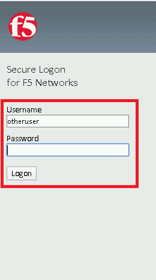
.. |image12| image:: media/lab02/image012.png
.. |image13| image:: media/lab02/image013.png
.. |image20| image:: media/lab02/image020.png
.. |image21| image:: media/lab02/image021.png
.. |image22| image:: media/lab02/image022.png
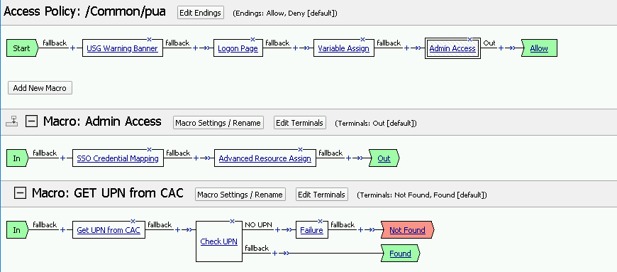
.. |image30| image:: media/lab02/image030.png
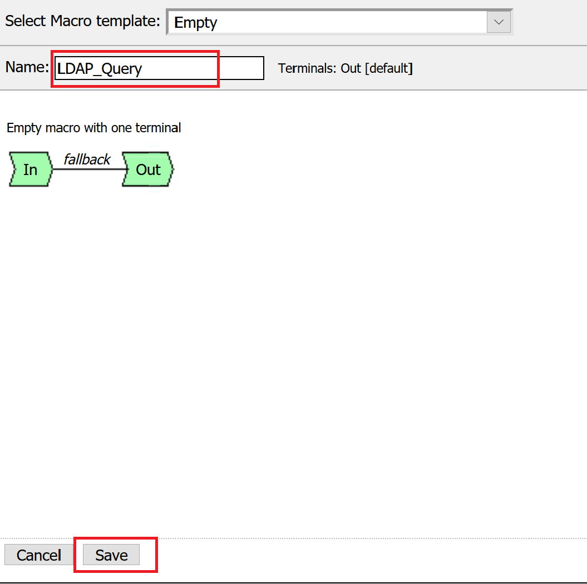
.. |image32| image:: media/lab02/image032.png
.. |image33| image:: media/lab02/image033.png
.. |image34| image:: media/lab02/image034.png
.. |image35| image:: media/lab02/image035.png
.. |image36| image:: media/lab02/image036.png
.. |image37| image:: media/lab02/image037.png
.. |image38| image:: media/lab02/image038.png
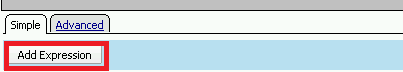
.. |image40| image:: media/lab02/image040.png
.. |image41| image:: media/lab02/image041.png
.. |image42| image:: media/lab02/image042.png
.. |image43| image:: media/lab02/image043.png
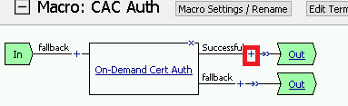
.. |image45| image:: media/lab02/image045.png
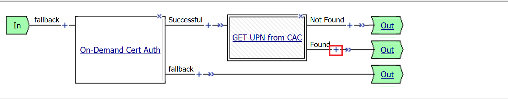
.. |image47| image:: media/lab02/image047.png
.. |image48| image:: media/lab02/image048.png
.. |image49| image:: media/lab02/image049.png
.. |image50| image:: media/lab02/image050.png
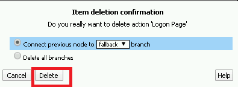
.. |image52| image:: media/lab02/image052.png
.. |image53| image:: media/lab02/image053.png
.. |image54| image:: media/lab02/image054.png
.. |image55| image:: media/lab02/image055.png
.. |image56| image:: media/lab02/image056.png
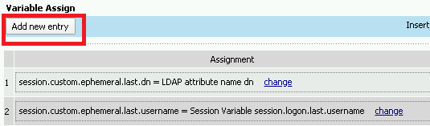
.. |image58| image:: media/lab02/image058.png
.. |image59| image:: media/lab02/image059.png
.. |image60| image:: media/lab02/image060.png
.. |image61| image:: media/lab02/image061.png
.. |image62| image:: media/lab02/image062.png
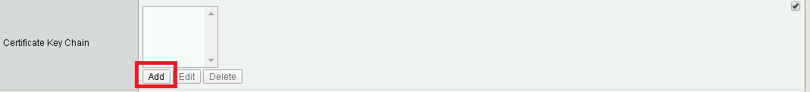
.. |image64| image:: media/lab02/image064.png
.. |image65| image:: media/lab02/image065.png
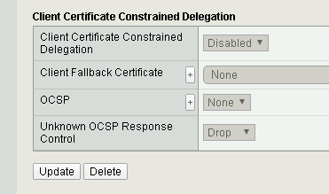
.. |image70| image:: media/lab02/image070.png
.. |image71| image:: media/lab02/image071.png
.. |image72| image:: media/lab02/image072.png
.. |image73| image:: media/lab02/image073.png
.. |image74| image:: media/lab02/image074.png
.. |image75| image:: media/lab02/image075.png
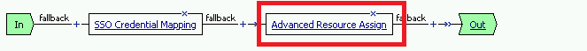
.. |image77| image:: media/lab02/image077.png
.. |image78| image:: media/lab02/image078.png
.. |image79| image:: media/lab02/image079.png
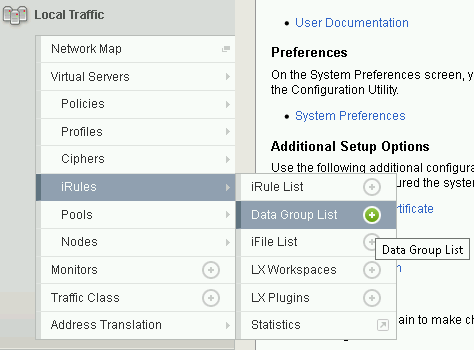
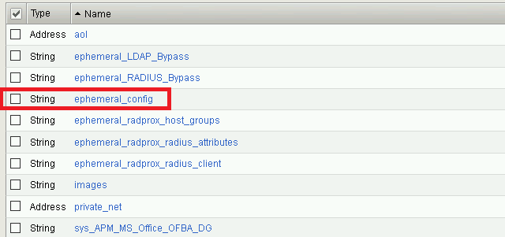
.. |image82| image:: media/lab02/image082.png
.. |image83| image:: media/lab02/image083.png
.. |image84| image:: media/lab02/image084.png
.. |image90| image:: media/lab02/image090.png
.. |image91| image:: media/lab02/image091.png
.. |image92| image:: media/lab02/image092.png
.. |image93| image:: media/lab02/image093.png
.. |image94| image:: media/lab02/image094.png
.. |image95| image:: media/lab02/image095.png
.. |image130| image:: media/lab02/image130.png
.. |image131| image:: media/lab02/image131.png
.. |image132| image:: media/lab02/image132.png
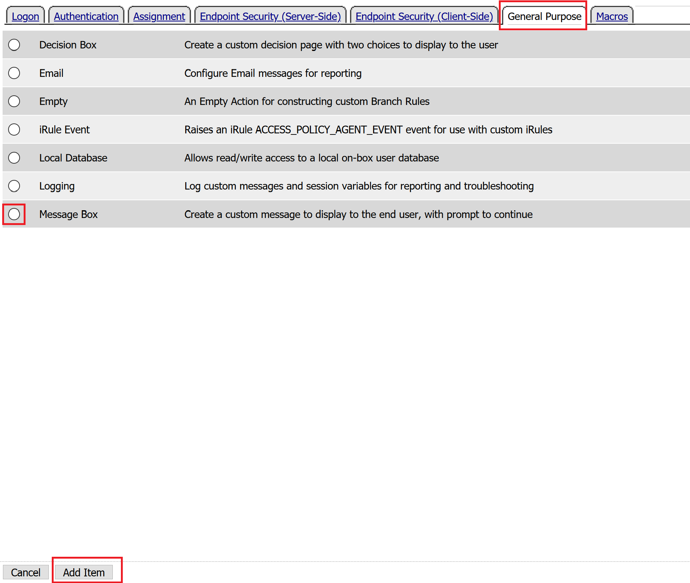
.. |image134| image:: media/lab02/image134.png
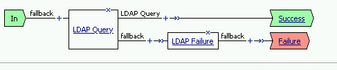
.. |image136| image:: media/lab02/image136.png
.. |image137| image:: media/lab02/image137.png
.. |image138| image:: media/lab02/image138.png
.. |image139| image:: media/lab02/image139.png
.. |image140| image:: media/lab02/image140.png
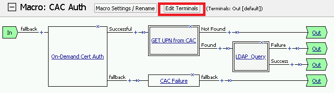
.. |image142| image:: media/lab02/image142.png
.. |image143| image:: media/lab02/image143.png
.. |image144| image:: media/lab02/image144.png
.. |image145| image:: media/lab02/image145.png
.. |image146| image:: media/lab02/image146.png
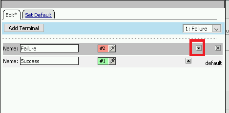
.. |image150| image:: media/lab02/image150.png
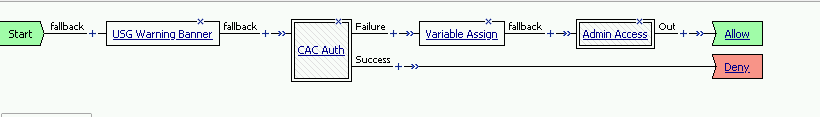
.. |image152| image:: media/lab02/image152.png
.. |image1130| image:: media/lab02/image1130.png
.. |image087| image:: media/lab02/087.png
.. |image088| image:: media/lab02/088.png
.. |image089| image:: media/lab02/089.png
.. |image200| image:: media/lab02/200.png
.. |image201| image:: media/lab02/201.png

