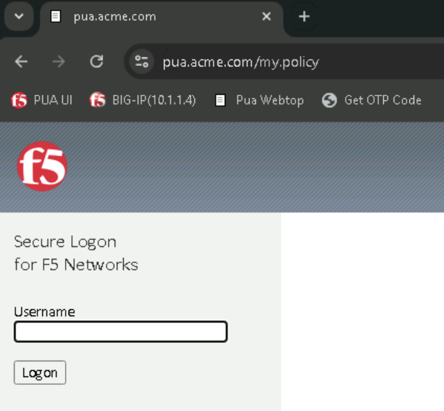
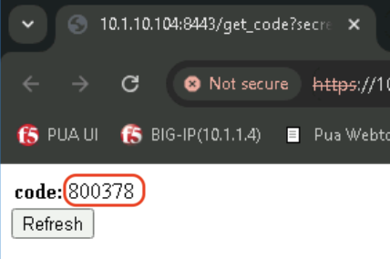

Lab 3: Deploy PUA with Multifactor Authentication
===========================================================

Expected time to complete: **15 minutes**

.. _Access PUA:

Access PUA
---------------------------------------------------------------

Task 1 - Access PUA
~~~~~~~~~~~~~~~~~~~~~~~~~~~~~~~~~~~~~~~~~~~~~~~~~~~~~~~~~~~~~~~

#. In Chrome browser, Click the bookmark **PUA UI** 

#. This should launch the PUA Web UI http://10.1.1.14:8080/ui

   |image_chrome_pua_ui|
  
.. warning:: If your not seeing the PUA Web UI as shown, Please review :doc:`/class3/module2/lab01` (:ref:`Start PUA`)

Deploy PUA MFA OTP
---------------------------------------------------------------

Task 1 - Add Deployment
~~~~~~~~~~~~~~~~~~~~~~~~~~~~~~~~~~~~~~~~~~~~~~~~~~~~~~~~~~~~~~~

#. In PUA UI, Click **Deployments** in left hand navigation bar and in the main panel, Click **Add Deployment** button.

   |image_chrome_pua_deployments|

#. In the resulting window,  enter the following data:

  * **Add Deployment**
    
    * **Name** : pua_mfa

    * **Device IP/Hostname** : 10.1.1.4

    * **Playbook**: PUA MFA
    
  |image_chrome_pua_add_deployment_mfa|

.. _Enter Deployment details:

Task 2 - Enter Deployment details
~~~~~~~~~~~~~~~~~~~~~~~~~~~~~~~~~~~~~~~~~~~~~~~~~~~~~~~~~~~~~~~

#.	When the **PUA MFA** playbook is selected, the editor values are updated to show the following inputs (Enter the associated values as specified below)

  * **Add Deployment**

    *	**LDAP IP**: 10.1.20.104

    *	**LDAPS Proxy IP**: 10.1.20.104

    *	**RADIUS IP**: 10.1.20.104

    *	**Webtop**: 10.1.10.104

    *	**Token Generation VS IP**: 10.1.10.104

    *	**Token Generation VS SSL Profile**: f5lab_client_ssl

    *	**LDAP Server IP**: 10.1.20.7

    *	**LDAP Management Password**: admin

    *	**LDAP Record String**: cn=Admin,cn=Users,dc=f5lab,dc=local
    
    *	**Active Directory IP**: 10.1.20.7
    
    *	**AD Domain Controller**: dc1.f5lab.local

    *	**MFA User Name**: user2

    *	**MFA User Key**: JUZG2URUGQZU45RT

    *	**Client SSL Certificate**: acme.com-wildcard

    *	**Client SSL Key**:	acme.com-wildcard

  |image_chrome_pua_add_deployment_mfa_details|

.. note:: You can also switch to **Raw JSON** input and paste this JSON object to get the input fields populated.
   
  |image_chrome_pua_add_deployment_raw|

  .. code-block:: json-object

    {
       "name": "pua_mfa",
       "device_ip": "10.1.1.4",
       "configuration": {
          "playbook": "PUA MFA",
          "user_input": {
                "LDAP_IP": "10.1.20.104",
                "LDAPS_IP": "10.1.20.104",
                "RADIUS_IP": "10.1.20.104",
                "WEBTOP_IP": "10.1.10.104",
                "TOKEN_GEN_IP": "10.1.10.104",
                "TOKEN_GEN_SSL_PROFILE": "f5lab_client_ssl",
                "LDAP_SRVR_IP": "10.1.20.7",
                "LDAP_SRVR_PASS": "admin",
                "LDAP_SRVR_RECORD": "cn=Admin,cn=Users,dc=f5lab,dc=local",
                "AD_SRVR_IP": "10.1.20.7",
                "AD_DOMAIN_NAME": "dc1.f5lab.local",
                "USER_NAME": "user2",
                "USER_KEY": "JUZG2URUGQZU45RT",
                "CLIENTSSL_CERT": "acme.com-wildcard",
                "CLIENTSSL_KEY": "acme.com-wildcard"
          }
       }
    }

Task 3 - Review Deployment details and Deploy
~~~~~~~~~~~~~~~~~~~~~~~~~~~~~~~~~~~~~~~~~~~~~~~~~~~~~~~~~~~~~~~

#. Review Deployment details and Click **Deploy**

   |image_chrome_pua_add_deployment_mfa_raw|

Task 4 - Track Deployment progress 
~~~~~~~~~~~~~~~~~~~~~~~~~~~~~~~~~~~~~~~~~~~~~~~~~~~~~~~~~~~~~~~

If you go back to the **PUA Deploy Agent WebSSH** tab in your local browser, you should see the logs generated by the the deployment of the PUA MFA Playbook.

#. Confirm that the deployment is successful by looking for **Playbook deployed successfully** log.

   |image_pua_webshell_docker_logs_mfa_deployment|

#. Confirm that **pua_mfa** is listed in the PUA UI Deployments.

   |image_chrome_pua_add_deployment_mfa_success|

.. warning:: If you don't see the **Playbook deployed successfully** in the logs and the **pua_mfa** does not appear in **PUA UI Deployments** go back to :ref:`Enter Deployment details`.

Test PUA MFA
---------------------------------------------------------------

Task 1 - Acces PUA Webtop as user2
~~~~~~~~~~~~~~~~~~~~~~~~~~~~~~~~~~~~~~~~~~~~~~~~~~~~~~~~~~~~~~~

#. Right click on the **PUA Webtop** Bookmark and click on **Open in Incognito window**

   |image_chrome_incognito_pua_webtop|

#. Click **Click here to continue**

   |image_chrome_incognito_pua_webtop_banner|

#. Login with the following credentials:

   * User: **user2**
   
   * Password: **user2**

   |image_chrome_incognito_pua_webtop_login_form_user2|

#. Next step is to provide the TOTP Token.

   |image_chrome_incognito_pua_webtop_login_form_code_user2|

   **Obtain the code using your mobile device**

   .. note:: You can use the Secret **JUZG2URUGQZU45RT** and add it to an authenticator application on your mobile device in order to get the OTP Code.

   **Obtain the code using the Get OTP Code**
   
   Right click on the Get OTP Code Bookmark and click on Open in new tab.

   |image_chrome_incognito_pua_webtop_new_tab|

   Enter your secret in the **secret** field or click **Submit** to use the predifined secret for **user2**.
   |image_chrome_incognito_get_code_secret|

   Copy the **code** display on the page.
   
   .. note:: You might need to click **Refresh** to get a new code if the login failed because it had already expired.

   |image_chrome_incognito_get_code_display|

   Paste the previously obtain code and click **Logon**.

   |image_chrome_incognito_pua_webtop_login_form_code_user2_paste|

#. Webtop should now be available

   |image_chrome_incognito_pua_webtop_links|

Task 2 - Validate user2 Access
~~~~~~~~~~~~~~~~~~~~~~~~~~~~~~~~~~~~~~~~~~~~~~~~~~~~~~~~~~~~~~~

#. In the **Applications and Links** section of the Webtop

   * Click on **bigip1** and observe the the username at the bottom left corner

     |image_chrome_incognito_pua_webtop_user2_bigip1|

   * Click on **bigip5** and observe the the username at the bottom left corner

     |image_chrome_incognito_pua_webtop_user2_bigip5|

.. warning:: Close the Incognito window before going to the next task

|image_end_of_lab|

.. |image_chrome_pua_deployments| image:: media/lab03/chrome_pua_deployments.png

.. |image_chrome_pua_add_deployment_raw| image:: media/lab03/chrome_pua_add_deployment_raw.png
  :width: 480

.. |image_chrome_pua_add_deployment_mfa_success| image:: media/lab03/chrome_pua_add_deployment_mfa_success.png
  :width: 800

.. |image_chrome_incognito_pua_webtop_banner| image:: media/lab03/chrome_incognito_pua_webtop_banner.png
  :width: 320

.. |image_chrome_incognito_get_code_secret| image:: media/lab03/chrome_incognito_get_code_secret.png
  :width: 320

.. |image_chrome_incognito_pua_webtop_user2_bigip1| image:: media/lab03/chrome_incognito_pua_webtop_user2_bigip1.png
  :width: 480
.. |image_chrome_incognito_pua_webtop_user2_bigip5| image:: media/lab03/chrome_incognito_pua_webtop_user2_bigip5.png
  :width: 480

.. |image_end_of_lab| image:: media/lab03/end_of_lab.png
