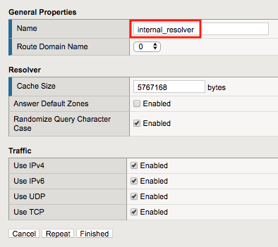
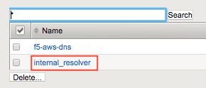
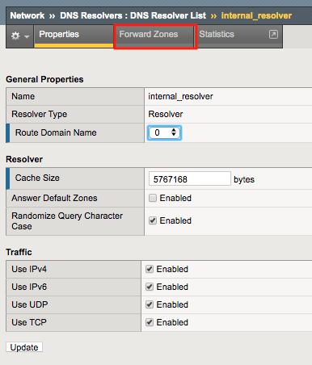
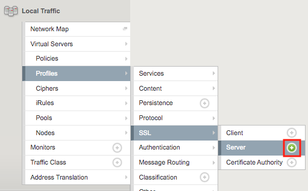
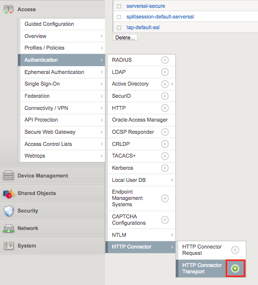
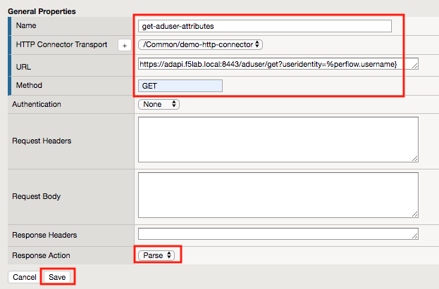

Lab 3.1 - Create the HTTP Connector Request
----------------------------------------------

The HTTP Connector is made up of two parts.  The first part is called the HTTP Connector Transport and it defines settings related to SSL, DNS, timeouts, and payload sizes.  The second part is the HTTP Connector Request which contains specific details such as HTTP Method, URL, message body, and how to handle the HTTP responses.

Task - Create a DNS Resolver
~~~~~~~~~~~~~~~~~~~~~~~~~~~~~

#. Return to the BIG-IP GUI

#. Navigate to Network >> DNS Resolvers >> DNS Resolver List. Click the  **+ (Plus symbol)** Symbol

   |image0|

#. Enter Name **internal_resolver** and click **Finished**

   |image1|

#. Click **internal_resolver** 

   |image2|

#. Click the **Forward Zones** tab

   |image3|

#. Click **Add**

   |image4|

#. Enter **. (a Single dot)** in the **Name** field
#. Add a Nameserver by entering Address **10.1.20.7** and click **Add**
#. Click **Finished**

   |image5|

Task - Create a ServerSide SSL Profile
~~~~~~~~~~~~~~~~~~~~~~~~~~~~~~~~~~~~~~~~~~~~~~~~~~~~~~

#. Navigate to Local Traffic >> Profiles >> SSL >> Server. Click the  **+ (Plus Symbol)** Symbol

   |image6|

#. Enter Name **adapi.f5lab.local**
#. Check **Custom** box to the right of the Certificate and Key fields to make them editable.
#. Select **apiadmin.crt** from the Certificate dropdown
#. Select **apiadmin.key** from the key dropdown
#. Click **Finished** at the Bottom of the page

   |image7|

Task - Create a HTTP Connector Transport
~~~~~~~~~~~~~~~~~~~~~~~~~~~~~~~~~~~~~~~~~~~~~~~~~~~~~~

#. Navigate to Access >> Authentication >> HTTP Connector >> HTTP Connector Transport  Click the  **+ (Plus Symbol)**

   |image8|

#. Enter the name **demo-http-connector**
#. Select **internal_resolver** from the DNS Resolver dropdown
#. Select **adapi.f5lab.local** from the Server SSL Profile
#. Click **Save**

   |image9|

Task - Create a HTTP Connector Request
~~~~~~~~~~~~~~~~~~~~~~~~~~~~~~~~~~~~~~~~~~~~~~~~~~~~~~

#. Navigate to Access >> Authentication >> HTTP Connector >> HTTP Connector Request.  Click the  **+ (Plus Symbol)**

   |image10|

#. Enter name **get-aduser-attributes**
#. Select **demo-http-connector** from the dropdown 
#. Enter URL **https://adapi.f5lab.local:8443/aduser/get?useridentity=%{perflow.username}**
#. Enter **GET** for the Method
#. Select **Parse** for the Response Action
#. Click **Save** 

   |image11|

