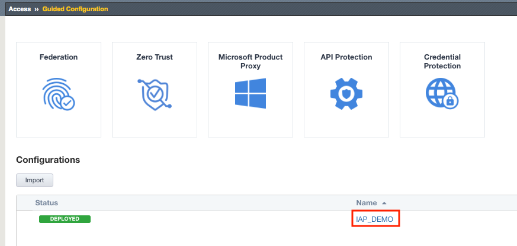
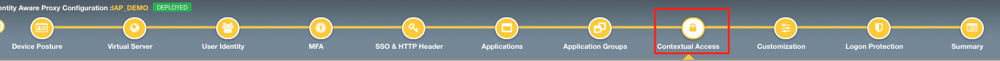
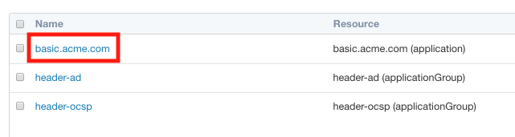
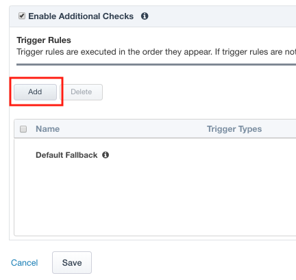
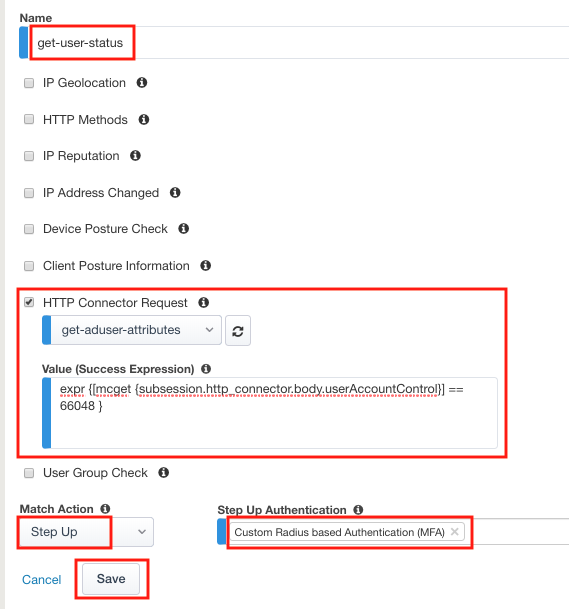
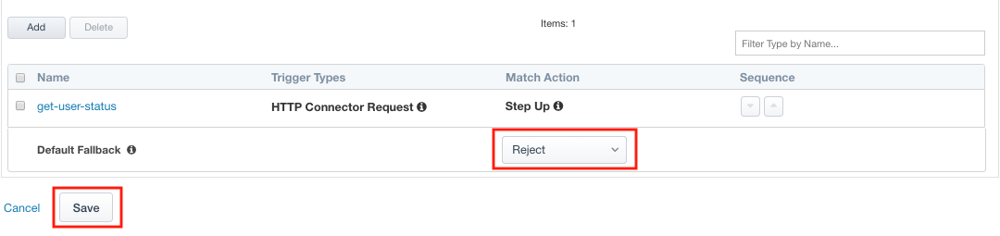
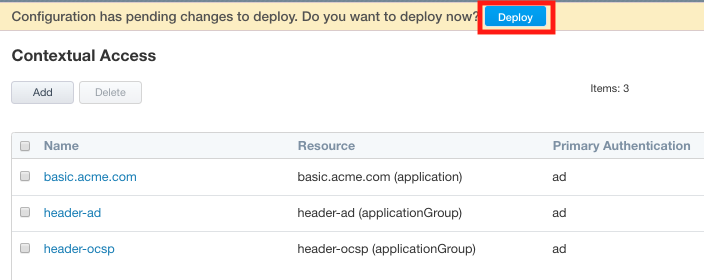

Lab 3.2 - Add HTTP Connector to the IAP Policy
--------------------------------------------------

Now that the HTTP Connector Request has been defined you will add it to basic-iap.acme.com application and test.

Task - Add the HTTP Connector Request
~~~~~~~~~~~~~~~~~~~~~~~~~~~~~~~~~~~~~~~~~~~~~~~~~~~~~~

#. From the web browser, click on the **Access** tab located on the left side.

   |image12|

#. Click **Guided Configuration**
#. Click **IAP_DEMO** 

   |image14|

#. Click on **Contextual Access**
   
   |image15|

#. Click on **basic.acme.com**

   |image16|

#. Click **Add** under Trigger Rules

   |image17|

#. Enter Name **get-user-status**
#. Check **HTTP Connector Request**
#. Select **get-aduser-attributes** from the HTTP Connector Request dropdown
#. Under Value (Success Expression) enter **expr {[mcget {subsession.http_connector.body.userAccountControl}] == 66048 }**
#. Select **Step Up** from the Match Action dropdown
#. Select **Custom Radius based Authentication (MFA)** from the Step Up Authentication field
#. Click **Save**

   |image18|

#. Change the **Match Action** field for the **Default Fallback** rule to **Reject**
#. Click **Save**

   |image19|

#. Click **Deploy**. Deployment will take a few moments.

   |image20|

.. |image12| image:: media/image012.png
	:width: 800px

