Lab 3.3 - Testing
------------------------------------------------

In this section you will test how HTTP connector can influence policy changes dynamically as conditions change in the network .

Task - Access basic.acme.com
~~~~~~~~~~~~~~~~~~~~~~~~~~~~~~~~~~~~~~~~~~

#. From the jump box open Chrome and open Developer Tools 

   |image21|

#. Ensure **Disable Cache** is checked

   |image22|

#. Access the site **https://basic.acme.com**
#. Login with the Username: **user2** and Password: **user2**

   |image23|

#. Enter the PIN **123456** for RADIUS authentication

   |image24|

#. You will be presented the website

   |image25|

#. From a separate browser tab access the BIG-IP management interface https://10.1.1.4

#. Navigate to Access >> Overview >> **Active Sessions**

   |image26|

#. You will see an active session for **user2**.
#. Expand the session to see all the sub-sessions by clicking the **+ (Plus symbol)** to the left of the session ID.  

   .. note :: Your session ID will not match the one displayed in the screenshot below.

   |image27|

#. Click **View** to the right of the HTTP Connector request **get-user-status** to see the sub-session variables.

   |image28|

#. You will notice that HTTP Connector received multiple values back in the response and each JSON key was parsed to individual subsession variables. 
#. userAccountControl is currently set to **66048**.  Which mean the account is enabled and the password never expires.

   |image29|

#. Click **Cancel**

#. Expand the session to see all the sub-sessions by clicking the **+ (Plus Symbol)** to the left of the session ID.  

   .. note :: You session ID will not match the one displayed in the screenshot below.

   |image27|

#. If the HTTP Connector sub-session still exists check off that specific sub-session only and click **Kill Selected Sessions**

   .. NOTE :: You are doing this to speed up the process and bypass the typical timers 		associated with HTTP Connector. This will enable you to see HTTP Connector trigger 	immediately on the next HTTP request sent from the jump box.

   |image30|

#. Locate Disable User 2 Powershell script shortcut located on the desktop.  

   |image31|

#. Click the **Disable User 2** Powershell script.  A Powershell window will appear disabling the User2 account is Disabled.

   |image32|

#. Return to your existing https://basic.acme.com session.
#. Click on one of the links for the website.  You will receive a **Deny Page**.

   |image33|

#. If you return to the sub-session variables screen in BIG-IP you will see UserAccountControl was **66050**.

   |image34|

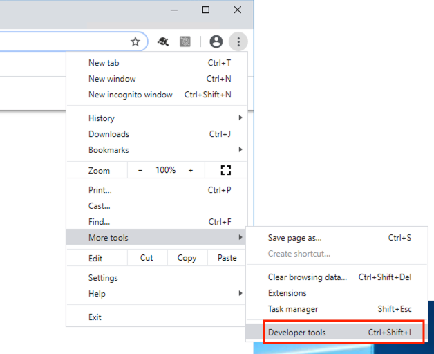
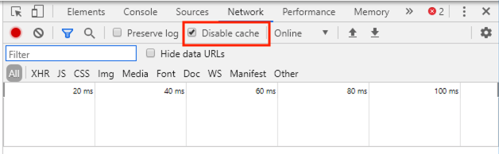
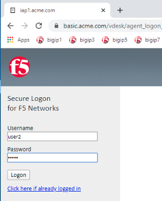
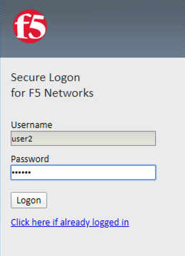
.. |image25| image:: media/image025.png
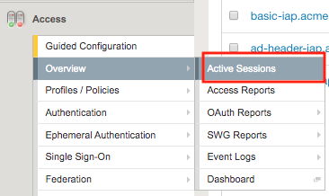
.. |image27| image:: media/image027.png
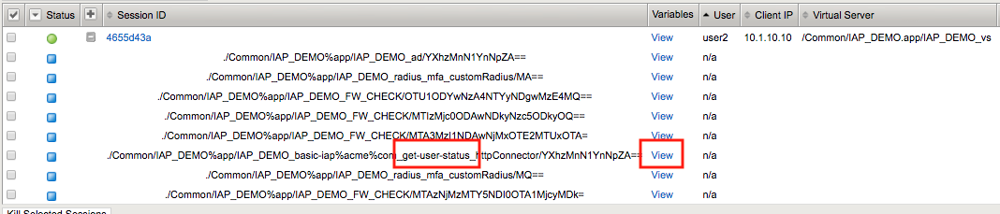
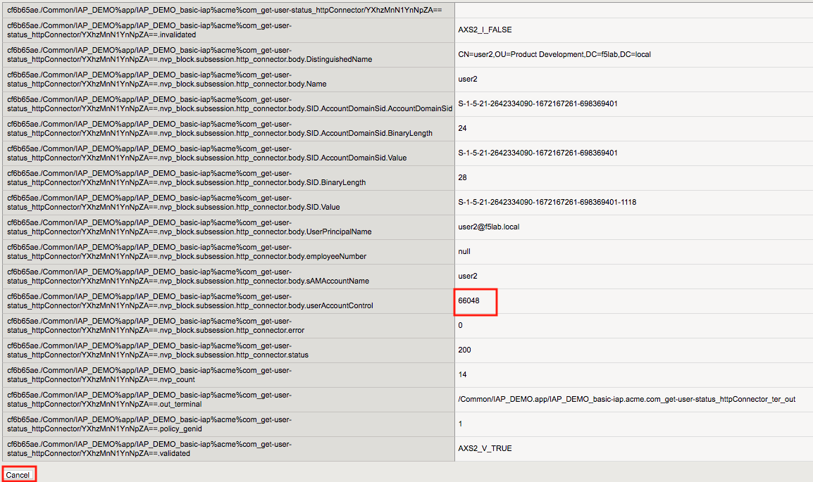
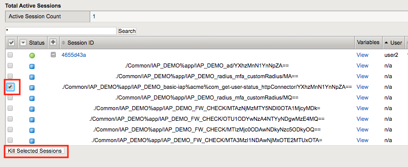
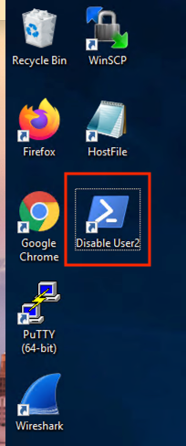
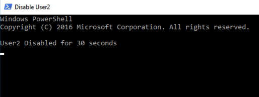
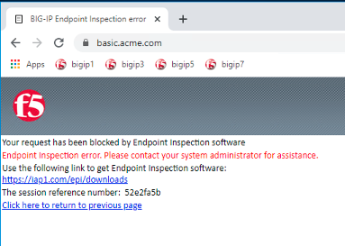
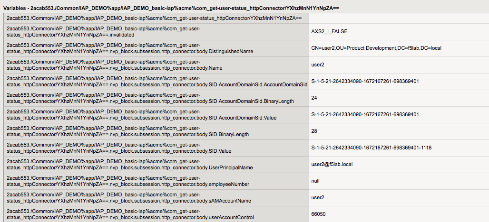

