Lab 2: Custom Per Request Policy
================================

The purpose of this lab is to build a custom Per Request Policy (PRP) flow and
then extend that policy with additional subroutines to perform dynamic updates
to access controls and authentication requirements. Per Request Policies will
restrict or grant access based on dynamic queries of AD Group Membership and the
URI accessed. Step-up authentication will also be leveraged.
Students will configure the various aspects using the Visual Policy Editor,
review the configuration and perform tests of the deployment.

Objective:
----------

-  Gain a deeper understanding of Per Request Policies and their applicability
   in various delivery and control scenarios
 
-  Gain a further understanding of Per Request Policy subroutines and their
   use in dynamic queries and step-up authentication.

Lab Requirements:
-----------------

-  All Lab requirements will be noted in the tasks that follow

-  Estimated completion time: 30 minutes

Lab 2 Tasks:
-----------------

TASK 1: Prepare Lab Environment
~~~~~~~~~~~~~~~~~~~~~~~~~~~~~~~

+----------------------------------------------------------------------------------------------+
| 1. From the Jumphost desktop, click on the **Remove-User1-from-App2** PowerShell Script.     |
|                                                                                              |
|    This prepares the environment for further user testing.                                   |
+----------------------------------------------------------------------------------------------+
| |image001|                                                                                   |
+----------------------------------------------------------------------------------------------+

TASK 2: Review Existing Configuration
~~~~~~~~~~~~~~~~~~~~~~~~~~~~~~~~~~~~~

+----------------------------------------------------------------------------------------------+
| 1. On **bigip1.f5lab.local**, navigate to **Local Traffic -> Virtual Servers -> Virtual**    |
|                                                                                              |
|    **Server Lists**.                                                                         |
|                                                                                              |
| 2. Click on the link for the **app.acme.com_vs**.                                            |
+----------------------------------------------------------------------------------------------+
| |image002|                                                                                   |
+----------------------------------------------------------------------------------------------+

+----------------------------------------------------------------------------------------------+
| 3. Within the **app.acme.com_vs** configuration, scroll down to the **Access Policy**        |
|                                                                                              |
|    section, note the Per Session and Per Request policies applied.                           |
+----------------------------------------------------------------------------------------------+
| |image003|                                                                                   |
+----------------------------------------------------------------------------------------------+

+----------------------------------------------------------------------------------------------+
| 4. Navigate to **Access -> Profiles/Policies -> Access Profiles (Per-Session Policies)** and |
|                                                                                              |
|    then click the **Edit** link for the **app.acme.com_psp** Per Session Policy.             |
+----------------------------------------------------------------------------------------------+
| |image004|                                                                                   |
+----------------------------------------------------------------------------------------------+

+----------------------------------------------------------------------------------------------+
| 5. Note that the **app.acme.com_psp** Access Policy simply has **Start -> Allow**.  All      |
|                                                                                              |
|    Access configurations will occur in the Per Request Policy.                               |
+----------------------------------------------------------------------------------------------+
| |image005|                                                                                   |
+----------------------------------------------------------------------------------------------+

+----------------------------------------------------------------------------------------------+
| 6. Navigate to **Access -> Profiles/Policies -> Per-Request Policies** and then click the    |
|                                                                                              |
|    **Edit** link for the **app.acme.com_prp** Per Request Policy.                            |
+----------------------------------------------------------------------------------------------+
| |image006|                                                                                   |
+----------------------------------------------------------------------------------------------+

+----------------------------------------------------------------------------------------------+
| 7. Review the **app.acme.com_prp** Per Request Policy and the subroutine.                    |
|                                                                                              |
| 8. Click on the **+ (Plus Symbol)** to expand the **Logon** Subroutine.  Then click on the   |
|                                                                                              |
|    **Subroutine Settings / Rename** link.                                                    |
+----------------------------------------------------------------------------------------------+
| |image007|                                                                                   |
+----------------------------------------------------------------------------------------------+

+----------------------------------------------------------------------------------------------+
| 9. Review the **Logon** subroutine settings.  These settings will determine inactivity       |
|                                                                                              |
|    timers and session lifetime.                                                              |
+----------------------------------------------------------------------------------------------+
| |image008|                                                                                   |
+----------------------------------------------------------------------------------------------+

+----------------------------------------------------------------------------------------------+
| 10. Open **Firefox**, click on the **app.acme.com** link provided in the Bookmark toolbar.   |
|                                                                                              |
| 11. Logon to the resulting logon page with **UserID: user1** and **Password: user1**         |
|                                                                                              |
| **Note:** *User1 has access to all applications even though user1 does not currently have*   |
|                                                                                              |
| *the necessary group access for all applications.*                                           |
+----------------------------------------------------------------------------------------------+
| |image009|                                                                                   |
|                                                                                              |
| |image010|                                                                                   |
+----------------------------------------------------------------------------------------------+

TASK 3: URI Dynamic Filtering (via AD Group Membership)
~~~~~~~~~~~~~~~~~~~~~~~~~~~~~~~~~~~~~~~~~~~~~~~~~~~~~~~

+----------------------------------------------------------------------------------------------+
| **Note:** *This provides the ability to dynamically deploy new applications based on*        |
|                                                                                              |
| *standardized URI paths and control access to those applications (via group membership)*     |
|                                                                                              |
| *without needing to re-entrantly edit the Per Request Policy again.*                         |
|                                                                                              |
| 1. Navigate to **Access -> Profiles/Policies -> Per-Request Policies** and then click the    |
|                                                                                              |
|    **Edit** link for the **app.acme.com_prp** Per Request Policy.                            |
|                                                                                              |
| 2. In the resulting Visual Policy Editor window, click on the **+ (Plus Symbol)** on the     |
|                                                                                              |
|    **apps** branch following **URL Branching**.                                              |
|                                                                                              |
| 3. In the pop-up window, select the **General Purpose** tab, then click the radio button     |
|                                                                                              |
|    on the **Empty** action line, then click **Add Item**.                                    |
+----------------------------------------------------------------------------------------------+
| |image011|                                                                                   |
+----------------------------------------------------------------------------------------------+

+----------------------------------------------------------------------------------------------+
| 4. Enter **URI - Dynamic Mapping** in the **Name** field.                                    |
+----------------------------------------------------------------------------------------------+
| |image012|                                                                                   |
+----------------------------------------------------------------------------------------------+

+----------------------------------------------------------------------------------------------+
| 5. In the next window, click the **Add Branch Rule**.                                        |
|                                                                                              |
| 6. In the new section, enter **App Access** in the **Name** field.                           |
|                                                                                              |
| 7. Click the **change** link.                                                                |
+----------------------------------------------------------------------------------------------+
| |image013|                                                                                   |
+----------------------------------------------------------------------------------------------+

+----------------------------------------------------------------------------------------------+
| 8. In the resulting window, click on the **Advanced** tab.                                   |
|                                                                                              |
| 9. Paste the expression below into the provided window and then click **Finished**.          |
|                                                                                              |
| **Explanation:** *The expression shown parses the incoming URI to extract a portion of the*  |
|                                                                                              |
| *URI to use as a variable in determining an AD Group Name dynamically.*                      |
+----------------------------------------------------------------------------------------------+
| |image014|                                                                                   |
+----------------------------------------------------------------------------------------------+

**Expression is shown below for copy and paste convenience**

.. code-block:: tcl

    expr {[mcget {subsession.ad.last.attr.memberOf}] contains "CN=[findstr [mcget {perflow.category_lookup.result.url}] "http" 26 "/"],OU=Groups,DC=f5lab,DC=local"}

|

+----------------------------------------------------------------------------------------------+
| 10. Click **Save** in the resulting window.                                                  |
+----------------------------------------------------------------------------------------------+
| |image015|                                                                                   |
+----------------------------------------------------------------------------------------------+

+----------------------------------------------------------------------------------------------+
| 11. Review the added **URI - Dynamic Mapping** agent.  Ensure the **Allow** and **Reject**   |
|                                                                                              |
|     endings are set as shown.                                                                |
+----------------------------------------------------------------------------------------------+
| |image016|                                                                                   |
+----------------------------------------------------------------------------------------------+

TASK 4: URI DataGroup Filtering (via AD Group Membership)
~~~~~~~~~~~~~~~~~~~~~~~~~~~~~~~~~~~~~~~~~~~~~~~~~~~~~~~~~

+----------------------------------------------------------------------------------------------+
| **Note:** *This provides the ability to dynamically deploy new applications based on*        |
|                                                                                              |
| *standardized URI paths defined in DataGroups and control access to those applications*      |
|                                                                                              |
| *(via group membership) without needing to re-entrantly edit the Per Request Policy again.*  |
|                                                                                              |
| 1. In the Visual Policy Editor window, click on the **+ (Plus Symbol)** on the **members**   |
|                                                                                              |
|    branch following **URL Branching**.                                                       |
|                                                                                              |
| 2. In the pop-up window, select the **General Purpose** tab, then click the radio button     |
|                                                                                              |
|    on the **Empty** action line, then click **Add Item**.                                    |
+----------------------------------------------------------------------------------------------+
| |image017|                                                                                   |
+----------------------------------------------------------------------------------------------+

+----------------------------------------------------------------------------------------------+
| 3. Enter **URI - DataGroup Mapping** in the **Name** field.                                  |
+----------------------------------------------------------------------------------------------+
| |image018|                                                                                   |
+----------------------------------------------------------------------------------------------+

+----------------------------------------------------------------------------------------------+
| 4. In the next window, click the **Add Branch Rule**.                                        |
|                                                                                              |
| 5. In the new section, enter **Member Access** in the **Name** field.                        |
|                                                                                              |
| 6. Click the **change** link.                                                                |
+----------------------------------------------------------------------------------------------+
| |image019|                                                                                   |
+----------------------------------------------------------------------------------------------+

+----------------------------------------------------------------------------------------------+
| 7. In the resulting window, click on the **Advanced** tab.                                   |
|                                                                                              |
| 8. Paste the expression below into the provided window and then click **Finished**.          |
|                                                                                              |
| **Explanation:** *For environments in which URI's and AD Groups may not be standardized,*    |
|                                                                                              |
| *parsing the URI and then leveraging a Data Group match allows for non-standard matching*    |
|                                                                                              |
| *between URI and AD Groups. (Data Groups can be updated via REST (AS3 Declarations) calls.*  |
+----------------------------------------------------------------------------------------------+
| |image020|                                                                                   |
+----------------------------------------------------------------------------------------------+

**Expression is shown below for copy and paste convenience**

.. code-block:: tcl

    expr {[mcget {subsession.ad.last.attr.memberOf}] contains "[class match -value [findstr [mcget {perflow.category_lookup.result.url}] "http" 28 "/"] eq acme_app.acme.com_dg]"}

|

+----------------------------------------------------------------------------------------------+
| 9. Click **Save** in the resulting window.                                                   |
+----------------------------------------------------------------------------------------------+
| |image021|                                                                                   |
+----------------------------------------------------------------------------------------------+

+----------------------------------------------------------------------------------------------+
| 10. Review the added **URI - DataGroup Mapping** agent.  Ensure the **Allow** and **Reject** |
|                                                                                              |
|     endings are set as shown.                                                                |
+----------------------------------------------------------------------------------------------+
| |image022|                                                                                   |
+----------------------------------------------------------------------------------------------+

+----------------------------------------------------------------------------------------------+
| 11. In the administration window, navigate to **Local Traffic -> iRules -> Data Group List** |
|                                                                                              |
|     and then click the **acme_app.acme.com_dg** data group link.                             |
+----------------------------------------------------------------------------------------------+
| |image042|                                                                                   |
+----------------------------------------------------------------------------------------------+
    
+----------------------------------------------------------------------------------------------+
| 12. In the **String** field, enter **serviceB** and in the **Value** field enter             |
|                                                                                              |
|     **CN=member-services-B,OU=Groups,DC=f5lab,DC=local** then click the **Add** button.      |
|                                                                                              |
| 13. When correctly added, click the **Update** button.                                       |
+----------------------------------------------------------------------------------------------+
| |image043|                                                                                   |
+----------------------------------------------------------------------------------------------+

TASK 5: Testing URI Dynamic & DataGroup Filtering
~~~~~~~~~~~~~~~~~~~~~~~~~~~~~~~~~~~~~~~~~~~~~~~~~

+----------------------------------------------------------------------------------------------+
| 1. Return to **Firefox** test access to all the applications again.                          |
|                                                                                              |
| 2. Access to **App1**, **Member Services A** and the **Admin** application is still granted  |
|                                                                                              |
|    based on current AD Group Membership for user1.                                           |
+----------------------------------------------------------------------------------------------+
| |image023|                                                                                   |
|                                                                                              |
| |image024|                                                                                   |
+----------------------------------------------------------------------------------------------+

+----------------------------------------------------------------------------------------------+
| 3. Access to **App2** and **Member Services B** are denied based on current AD Group         |
|                                                                                              |
|    Membership for user1.                                                                     |
+----------------------------------------------------------------------------------------------+
| |image025|                                                                                   |
+----------------------------------------------------------------------------------------------+

TASK 6: Adding a new Application (App3)
~~~~~~~~~~~~~~~~~~~~~~~~~~~~~~~~~~~~~~~

+----------------------------------------------------------------------------------------------+
| 1. Deploy **App3** by clicking on the **Deploy App3** PowerShell link provided on the        |
|                                                                                              |
|    jumphost desktop.                                                                         |
+----------------------------------------------------------------------------------------------+
| |image026|                                                                                   |
+----------------------------------------------------------------------------------------------+

+----------------------------------------------------------------------------------------------+
| 2. Return to **Firefox** to see the newly deployed **App3** and test access to it.           |
|                                                                                              |
| 3. Even though **App3** is newly deployed, user1 access is still blocked based on AD Group   |
|                                                                                              |
|    membership.                                                                               |
|                                                                                              |
| **Note:** *No policy changes were required due to the dynamic URI mapping configured.*       |
+----------------------------------------------------------------------------------------------+
| |image027|                                                                                   |
|                                                                                              |
| |image028|                                                                                   |
+----------------------------------------------------------------------------------------------+

TASK 7: Dynamic Group Checks
~~~~~~~~~~~~~~~~~~~~~~~~~~~~

+----------------------------------------------------------------------------------------------+
| **Note:** *This provides the ability to dynamically enforce controlled application access*   |
|                                                                                              |
| *without requiring the user to logon/logoff to acquire new permissions or restrictions.*     |
|                                                                                              |
| 1. Navigate to **Access -> Profiles/Policies -> Per-Request Policies** and then click the    |
|                                                                                              |
|    **Edit** link for the **app.acme.com_prp** Per Request Policy (or use the already open    |
|                                                                                              |
|    browser tab).                                                                             |
|                                                                                              |
| 2. In the resulting Visual Policy Editor window, click on the **Add New Subroutine** link.   |
+----------------------------------------------------------------------------------------------+
| |image029|                                                                                   |
+----------------------------------------------------------------------------------------------+

+----------------------------------------------------------------------------------------------+
| 3. Enter **Dynamic GroupCheck** in the **Name** field and then click **Save**.               |
+----------------------------------------------------------------------------------------------+
| |image030|                                                                                   |
+----------------------------------------------------------------------------------------------+

+----------------------------------------------------------------------------------------------+
| 4. Click on the **+ (Plus Symbol)** to expand the **Dynamic GroupCheck** Subroutine.  Then   |
|                                                                                              |
|    click on the **+ (Plus Symbol)** between the **In** and **Out** tags.                     |
+----------------------------------------------------------------------------------------------+
| |image031|                                                                                   |
+----------------------------------------------------------------------------------------------+

+----------------------------------------------------------------------------------------------+
| 5. In the resulting window, click the **Assignment** tab, then select the radio button on    |
|                                                                                              |
|    the **Variable Assign** row, then the click **Add Item** button.                          |
+----------------------------------------------------------------------------------------------+
| |image061|                                                                                   |
+----------------------------------------------------------------------------------------------+

+----------------------------------------------------------------------------------------------+
| 6. In the **Variable Assign** window, click the **Add new entry** button.                    |
+----------------------------------------------------------------------------------------------+
| |image062|                                                                                   |
+----------------------------------------------------------------------------------------------+

+----------------------------------------------------------------------------------------------+
| 7. Modify the empty assignment as follows, then click the **Finished** button.               |
|                                                                                              |
|    - **Custom Variable: subsession.logon.last.username**                                     |
|                                                                                              |
|    - **Session Variable: session.logon.last.username**                                       |
+----------------------------------------------------------------------------------------------+
| |image063|                                                                                   |
+----------------------------------------------------------------------------------------------+

+----------------------------------------------------------------------------------------------+
| 8. Verify the variable assignment, then click the **Save** button.                           |
+----------------------------------------------------------------------------------------------+
| |image064|                                                                                   |
+----------------------------------------------------------------------------------------------+

+----------------------------------------------------------------------------------------------+
| 9. In the **Dynamic GroupCheck** Subroutine click the **+ (Plus Symbol)** following the      |
|                                                                                              |
|    **Variable Assign**                                                                       |
+----------------------------------------------------------------------------------------------+
| |image060|                                                                                   |
+----------------------------------------------------------------------------------------------+

+----------------------------------------------------------------------------------------------+
| 10. In the resulting window, click the **Authentication** tab, then select the radio button  |
|                                                                                              |
|     on the **AD Query** row, then click **Add Item**.                                        |
+----------------------------------------------------------------------------------------------+
| |image032|                                                                                   |
+----------------------------------------------------------------------------------------------+

+----------------------------------------------------------------------------------------------+
| 11. In the resulting **AD Query** window, select **/Common/f5lab.local** from the **Server** |
|                                                                                              |
|     dropdown.                                                                                |
|                                                                                              |
| 12. Enter the following **sAMAccountName=%{subsession.logon.last.username}** in the          |
|                                                                                              |
|     **SearchFilter** field.                                                                  |
|                                                                                              |
| 13. Under the **Required Attributes** section click the **X** icon for all attributes except |
|                                                                                              |
|     **memberOf** (row 9).                                                                    |
|                                                                                              |
| 14. Click the **Save** button when completed.                                                |
+----------------------------------------------------------------------------------------------+
| |image033|                                                                                   |
|                                                                                              |
| |image034|                                                                                   |
+----------------------------------------------------------------------------------------------+

+----------------------------------------------------------------------------------------------+
| 15. In the **Dynamic GroupCheck** Subroutine, click the **Subroutine Settings/Rename** link. |
+----------------------------------------------------------------------------------------------+
| |image035|                                                                                   |
+----------------------------------------------------------------------------------------------+

+----------------------------------------------------------------------------------------------+
| 16. In the **Dynamic GroupCheck** Subroutine Settings change the following values:           |
|                                                                                              |
| - **Inactivity Timeout (sec): 60**                                                           |
|                                                                                              |
| - **Max Subsession Life (sec): 60**                                                          |
|                                                                                              |
| - **Subroutine Timeout (sec): 120**                                                          |
|                                                                                              |
| 17. Click the **Save** button.                                                               |
+----------------------------------------------------------------------------------------------+
| |image036|                                                                                   |
+----------------------------------------------------------------------------------------------+

+----------------------------------------------------------------------------------------------+
| 18. Verify the **Dynamic GroupCheck** Subroutine contains both AD Query and Variable Assign  |
|     objects.                                                                                 |
+----------------------------------------------------------------------------------------------+
| |image065|                                                                                   |
+----------------------------------------------------------------------------------------------+

+----------------------------------------------------------------------------------------------+
| 19. In the main section of the **app.acme.com_prp** policy click the **+ (Plus Symbol)** in  |
|                                                                                              |
|     both the **apps** and **member** branches.                                               |
|                                                                                              |
| 20. In the resulting pop-up window, click the **Subroutines** tab, the click the radio       |
|                                                                                              |
|     button on the **Dynamic GroupCheck** and then click the **Add Item** button. Do this     |
|                                                                                              |
|     for both branches.                                                                       |
+----------------------------------------------------------------------------------------------+
| |image037|                                                                                   |
+----------------------------------------------------------------------------------------------+

+----------------------------------------------------------------------------------------------+
| 21. Review the policy changes to confirm subroutines have been added correctly.              |
+----------------------------------------------------------------------------------------------+
| |image038|                                                                                   |
+----------------------------------------------------------------------------------------------+

TASK 8: Testing Dynamic Group Checks
~~~~~~~~~~~~~~~~~~~~~~~~~~~~~~~~~~~~

+----------------------------------------------------------------------------------------------+
| 1. Add **user1** to the **app2**, **app3** and **member-service-B** AD Groups by clicking    |
|                                                                                              |
|    on the **Add-User1-to-App2**, **Add-User1-to-App3** and **Add-User1-to-MemberServiceB**   |
|                                                                                              |
|    PowerShell scripts on the jumphost desktop.                                               |
+----------------------------------------------------------------------------------------------+
| |image039|                                                                                   |
+----------------------------------------------------------------------------------------------+

+----------------------------------------------------------------------------------------------+
| 2. Return to **Firefox** test access to applications **app1**, **app2** and **app3**.        |
|                                                                                              |
|    **Note:** *60 seconds should elapse (the subsession timeout) before testing access to*    |
|                                                                                              |
|    *the applications begin.*                                                                 |
+----------------------------------------------------------------------------------------------+
| |image040|                                                                                   |
+----------------------------------------------------------------------------------------------+

+----------------------------------------------------------------------------------------------+
| 3. Test access to the **ServiceB** application.                                              |
|                                                                                              |
|    **Note:** *60 seconds should elapse (the subsession timeout) before testing access to*    |
|                                                                                              |
|    *the application begins.*                                                                 |
+----------------------------------------------------------------------------------------------+
| |image045|                                                                                   |
|                                                                                              |
| |image046|                                                                                   |
+----------------------------------------------------------------------------------------------+

+----------------------------------------------------------------------------------------------+
| 4. Return to Jumphost desktop and run the **Remove-User1-from-App2**.                        |
|                                                                                              |
| 5. Return to **Firefox** test access to application **app2**. **Note:** *60 seconds should*  |
|                                                                                              |
|    *elapse (the subsession timeout) before testing to the application begins.*               |
|                                                                                              |
| **Note:** *No user logon/logoff event needed to occur to change application access!*         |
+----------------------------------------------------------------------------------------------+
| |image041|                                                                                   |
+----------------------------------------------------------------------------------------------+

TASK 9: Step-Up Authentication (Client Cert Auth)
~~~~~~~~~~~~~~~~~~~~~~~~~~~~~~~~~~~~~~~~~~~~~~~~~

+----------------------------------------------------------------------------------------------+
| **Note:** *This provides the ability to require additional authentication/authorization*     |
|                                                                                              |
| *to priviledged pages or resources.*                                                         |
|                                                                                              |
| 1. Navigate to **Access -> Profiles/Policies -> Per-Request Policies** and then click the    |
|                                                                                              |
|    **Edit** link for the **app.acme.com_prp** Per Request Policy (or use the already open    |
|                                                                                              |
|    browser tab).                                                                             |
|                                                                                              |
| 2. In the resulting Visual Policy Editor window, click on the **Add New Subroutine** link    |
+----------------------------------------------------------------------------------------------+
| |image047|                                                                                   |
+----------------------------------------------------------------------------------------------+

+----------------------------------------------------------------------------------------------+
| 3. Enter **CertAuth** in the **Name** field and then click **Save**.                         |
+----------------------------------------------------------------------------------------------+
| |image048|                                                                                   |
+----------------------------------------------------------------------------------------------+

+----------------------------------------------------------------------------------------------+
| 4. Click on the **+ (Plus Symbol)** to expand the **CertAuth** Subroutine.  Then click on    |
|                                                                                              |
|    the **+ (Plus Symbol)** between the **In** and **Out** tags.                              |
+----------------------------------------------------------------------------------------------+
| |image049|                                                                                   |
+----------------------------------------------------------------------------------------------+

+----------------------------------------------------------------------------------------------+
| 5. In the resulting window, click the **Authentication** tab, then select the radio button   |
|                                                                                              |
|    on the **0n-Demand Cert Auth** row, then click **Add Item**.                              |
+----------------------------------------------------------------------------------------------+
| |image050|                                                                                   |
+----------------------------------------------------------------------------------------------+

+----------------------------------------------------------------------------------------------+
| 6. In the resulting **On-Demand Cert Auth**** window, select **Require** from the            |
|                                                                                              |
|    **Auth Mode** dropdown and click **Save**.                                                |
+----------------------------------------------------------------------------------------------+
| |image051|                                                                                   |
+----------------------------------------------------------------------------------------------+

+----------------------------------------------------------------------------------------------+
| 7. In the **On-Demand Cert Auth** Subroutine, click the **Edit Terminals** link.             |
+----------------------------------------------------------------------------------------------+
| |image052|                                                                                   |
+----------------------------------------------------------------------------------------------+

+----------------------------------------------------------------------------------------------+
| 8. In the **Terminals** window, click the **Add Terminal** link.                             |
|                                                                                              |
| 9. In the resulting section, change the **Name** to **Fail**, select the red color (#2) from |
|                                                                                              |
|    the dropdown and then click **Save**.                                                     |
+----------------------------------------------------------------------------------------------+
| |image053|                                                                                   |
+----------------------------------------------------------------------------------------------+

+----------------------------------------------------------------------------------------------+
| 10. In the **On-Demand Cert Auth** Subroutine, click the **Out** terminal link and change    |
|                                                                                              |
|     the value the **Fail** by clicking the radio button and then clicking **Save**.          |
+----------------------------------------------------------------------------------------------+
| |image054|                                                                                   |
+----------------------------------------------------------------------------------------------+

+----------------------------------------------------------------------------------------------+
| 11. In the main section of the **app.acme.com_prp** policy click the **+ (Plus Symbol)** in  |
|                                                                                              |
|     the **admin** branch.                                                                    |
|                                                                                              |
| 12. In the resulting pop-up window, click the **Subroutines** tab, the click the radio       |
|                                                                                              |
|     button on the **CertAuth** and then click the **Add Item** button.                       |
+----------------------------------------------------------------------------------------------+
| |image055|                                                                                   |
+----------------------------------------------------------------------------------------------+

+----------------------------------------------------------------------------------------------+
| 13. Review the added **CertAuth** Subroutine.  Ensure the **Allow** and **Reject**           |
|                                                                                              |
|     endings are set as shown.                                                                |
+----------------------------------------------------------------------------------------------+
| |image056|                                                                                   |
+----------------------------------------------------------------------------------------------+

TASK 10: Testing Step-Up Authentication (Client Cert Auth)
~~~~~~~~~~~~~~~~~~~~~~~~~~~~~~~~~~~~~~~~~~~~~~~~~~~~~~~~~~

+----------------------------------------------------------------------------------------------+
| 1. Return to **Firefox**. Test access to the **Admin** application.                          |
+----------------------------------------------------------------------------------------------+
| |image057|                                                                                   |
+----------------------------------------------------------------------------------------------+

+----------------------------------------------------------------------------------------------+
| 2. A Certificate Authentication prompt will now display. Review the certificate and click    |
|                                                                                              |
|    the **OK** button.                                                                        |
+----------------------------------------------------------------------------------------------+
| |image058|                                                                                   |
+----------------------------------------------------------------------------------------------+

+----------------------------------------------------------------------------------------------+
| 3. Access is now correctly granted to the **Admin** application.                             |
+----------------------------------------------------------------------------------------------+
| |image059|                                                                                   |
+----------------------------------------------------------------------------------------------+

TASK 11: End of Lab2
~~~~~~~~~~~~~~~~~~~~

+----------------------------------------------------------------------------------------------+
| 1. This concludes Lab2, feel free to review and test the configuration.                      |
+----------------------------------------------------------------------------------------------+
| |image000|                                                                                   |
+----------------------------------------------------------------------------------------------+

.. |image000| image:: media/image001.png
   :width: 800px

.. |image002| image:: media/lab2-002.png
   :width: 800px
.. |image003| image:: media/lab2-003.png
   :width: 800px
.. |image004| image:: media/lab2-004.png
   :width: 800px
.. |image005| image:: media/lab2-005.png
   :width: 800px
.. |image006| image:: media/lab2-006.png
   :width: 800px
.. |image007| image:: media/lab2-007.png
   :width: 800px
.. |image008| image:: media/lab2-008.png
   :width: 800px
.. |image009| image:: media/lab2-009.png
   :width: 800px
.. |image010| image:: media/lab2-010.png
   :width: 800px
.. |image011| image:: media/lab2-011.png
   :width: 800px
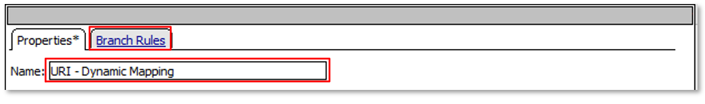
.. |image013| image:: media/lab2-013.png
   :width: 800px
.. |image014| image:: media/lab2-014.png
   :width: 800px
.. |image015| image:: media/lab2-015.png
   :width: 800px
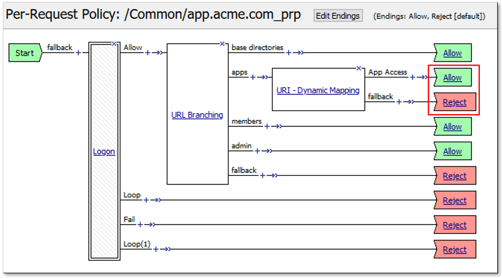
.. |image017| image:: media/lab2-017.png
   :width: 800px
.. |image018| image:: media/lab2-018.png
   :width: 800px
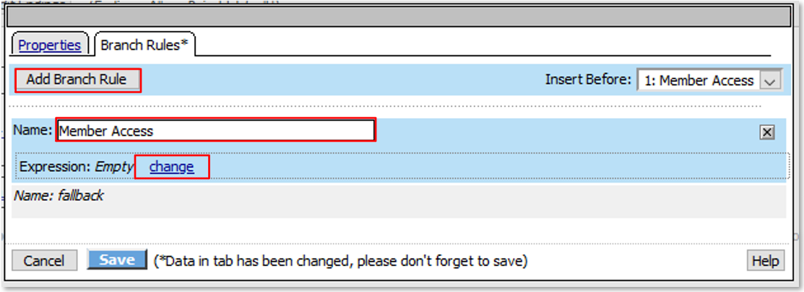
.. |image020| image:: media/lab2-020.png
   :width: 800px
.. |image021| image:: media/lab2-021.png
   :width: 800px
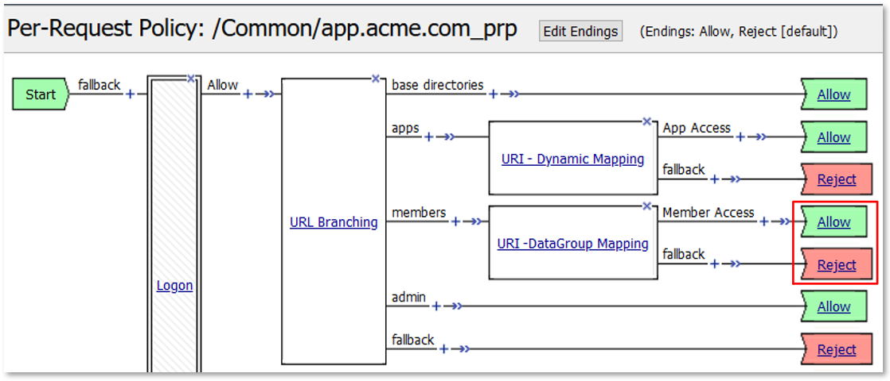
.. |image023| image:: media/lab2-023.png
   :width: 800px
.. |image024| image:: media/lab2-024.png
   :width: 800px
.. |image025| image:: media/lab2-025.png
   :width: 800px
.. |image026| image:: media/lab2-026.png
   :width: 800px
.. |image027| image:: media/lab2-027.png
   :width: 800px
.. |image028| image:: media/lab2-028.png
   :width: 800px
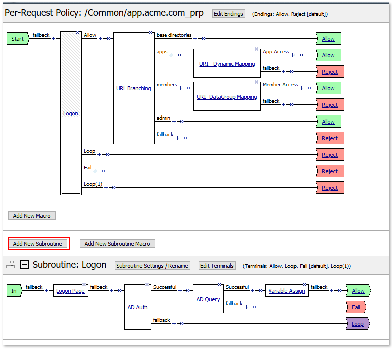
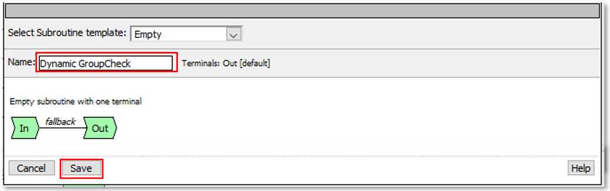
.. |image031| image:: media/lab2-031.png
   :width: 800px
.. |image032| image:: media/lab2-032.png
   :width: 800px
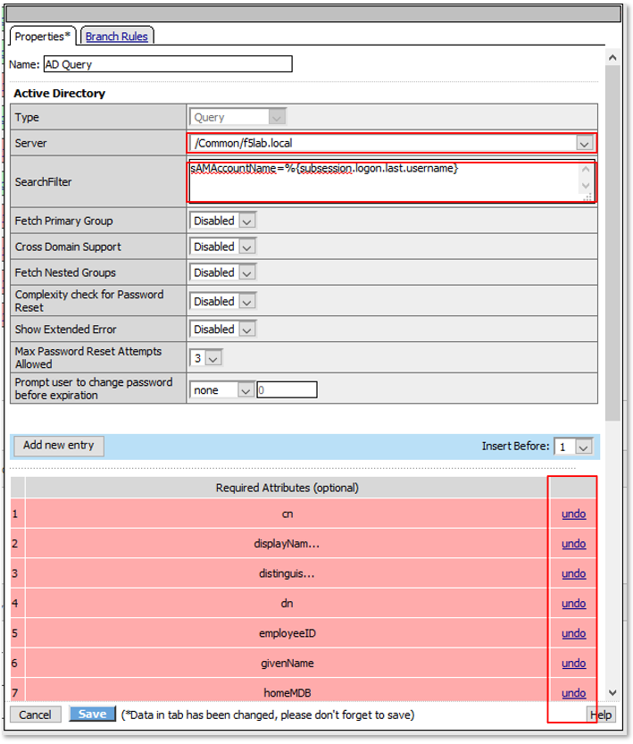
.. |image034| image:: media/lab2-034.png
   :width: 800px
.. |image035| image:: media/lab2-035.png
   :width: 800px
.. |image036| image:: media/lab2-036.png
   :width: 800px
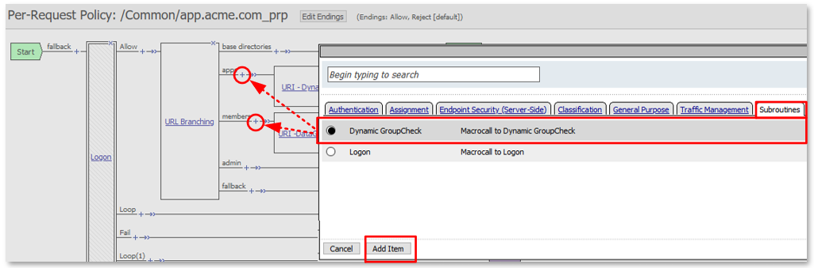
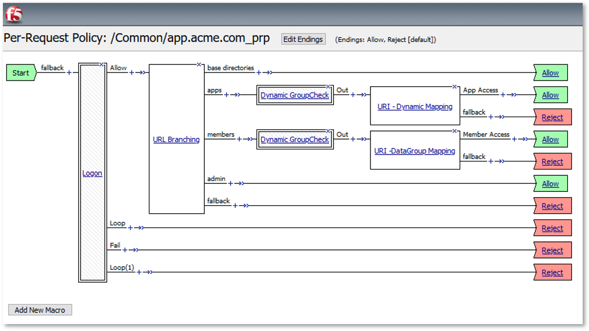

.. |image040| image:: media/lab2-040.png
   :width: 800px

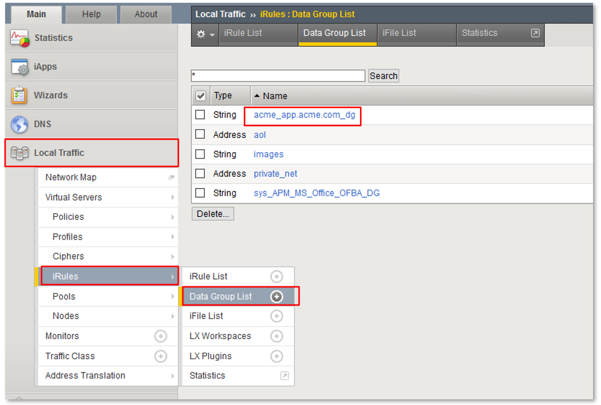
.. |image043| image:: media/lab2-043.png
   :width: 800px
.. |image044| image:: media/lab2-044.png
   :width: 800px
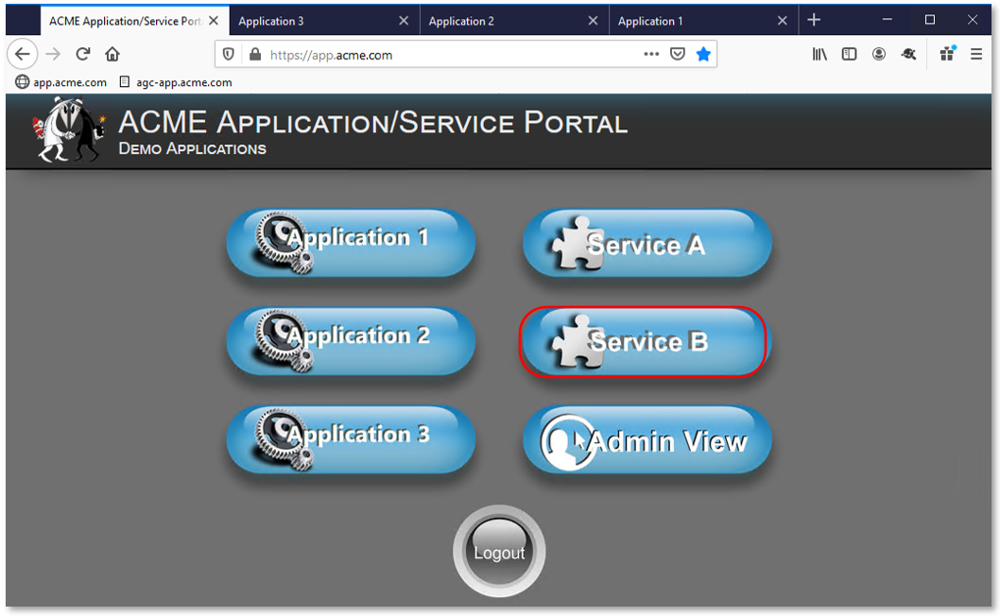
.. |image046| image:: media/lab2-046.png
   :width: 800px
.. |image047| image:: media/lab2-047.png
   :width: 800px
.. |image048| image:: media/lab2-048.png
   :width: 800px
.. |image049| image:: media/lab2-049.png
   :width: 800px
.. |image050| image:: media/lab2-050.png
   :width: 800px
.. |image051| image:: media/lab2-051.png
   :width: 800px
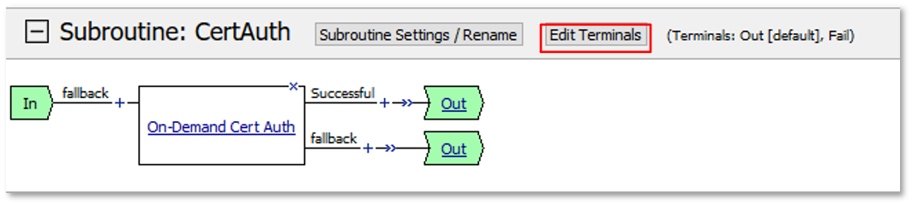
.. |image053| image:: media/lab2-053.png
   :width: 800px
.. |image054| image:: media/lab2-054.png
   :width: 800px
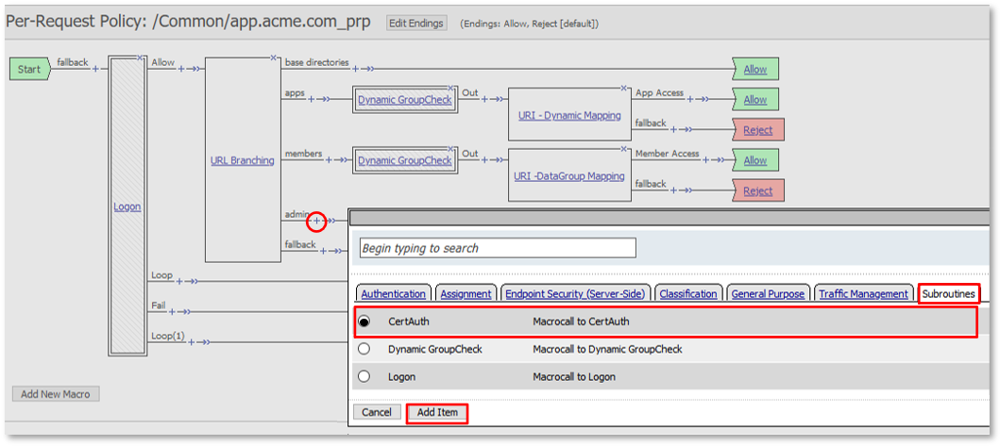
.. |image056| image:: media/lab2-056.png
   :width: 800px
.. |image057| image:: media/lab2-057.png
   :width: 800px
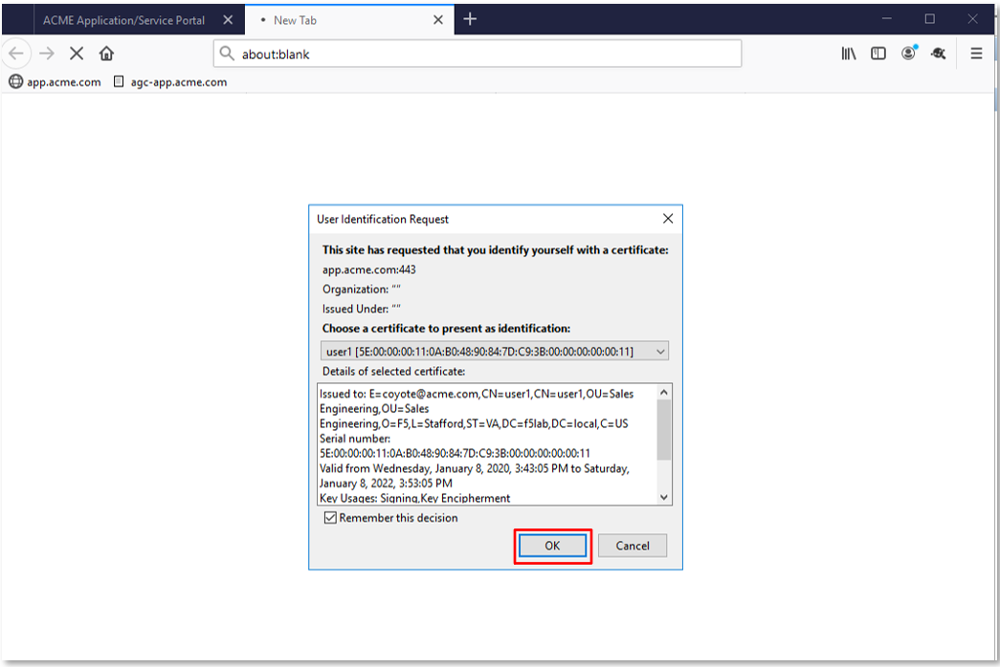
.. |image059| image:: media/lab2-059.png
   :width: 800px
.. |image060| image:: media/lab2-060.png
   :width: 800px
.. |image061| image:: media/lab2-061.png
   :width: 800px
.. |image062| image:: media/lab2-062.png
   :width: 800px
.. |image063| image:: media/lab2-063.png
   :width: 800px
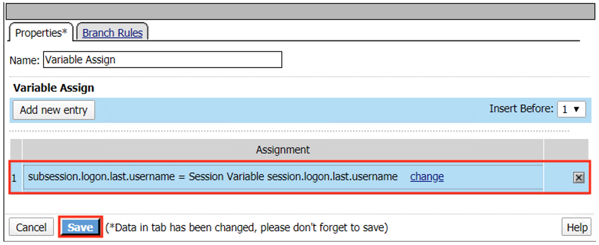
.. |image065| image:: media/lab2-065.png
   :width: 800px

