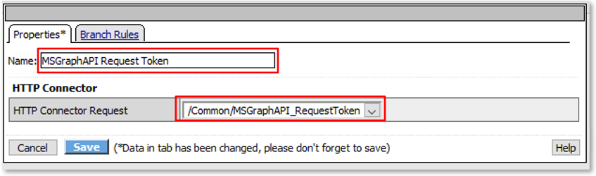
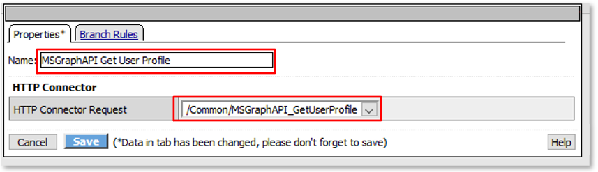
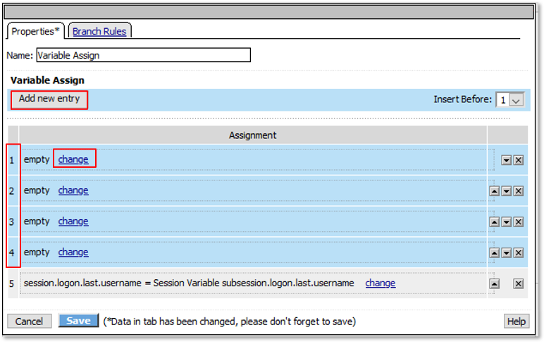
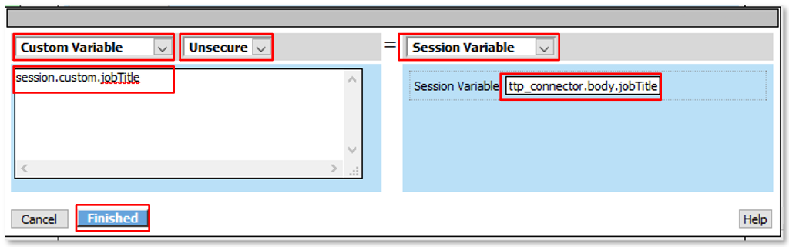
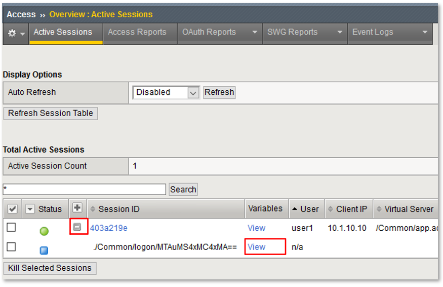
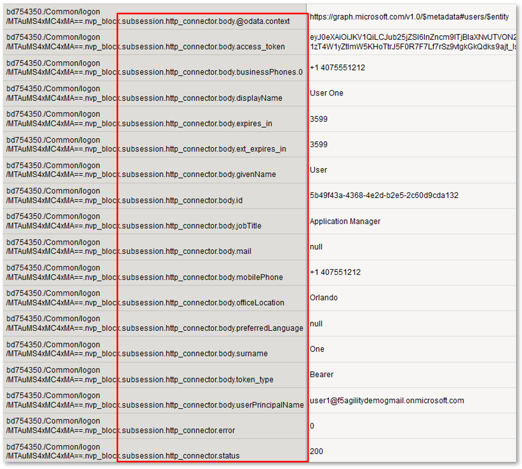
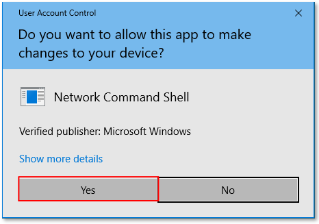
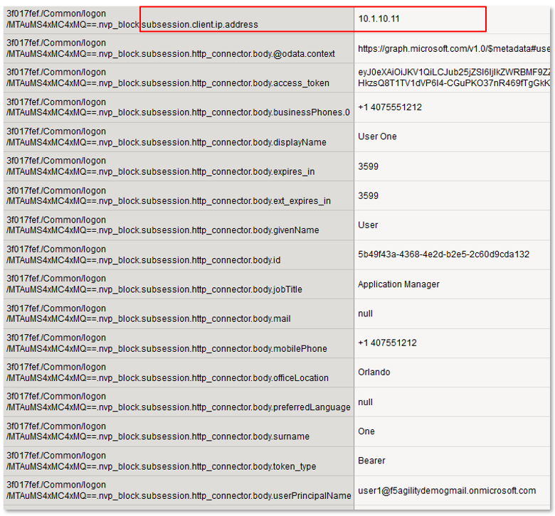

Lab 3: Custom Per Request Policy - Extended
===========================================

The purpose of this lab is to change the behavior of the custom Per Request Policies
built during Lab 2.  Lab attendees will expand policies by incorporating HTTP_Connector
agents to query external API's and incorporate Gating Criteria to enforce policy behavior
while accessing the lab application.
Students will configure the various aspects of this lab using the Visual Policy Editor,
review the configuration and perform tests of the deployment.

Objective:
----------

-  Gain a deeper understanding of Per Request Policies and their applicability
   in various delivery and control scenarios.

-  Gain a further understanding of Per Request Policy Subroutines and their
   expandaility with HTTP_Connector and gating criteria.

Lab Requirements:
-----------------

-  All Lab requirements will be noted in the tasks that follow

-  Estimated completion time: 20 minutes.

Lab 3 Tasks:
-----------------

TASK 1: Prepare Lab Environment
~~~~~~~~~~~~~~~~~~~~~~~~~~~~~~~

+----------------------------------------------------------------------------------------------+
| 1. On **bigip1.f5lab.local**, navigate to **Access -> Overview -> Active Sessions** and      |
|                                                                                              |
|    confirm all active sessions have been killed.                                             |
|                                                                                              |
| 2. If any sessions are active, click all checkboxes by the active session and then click     |
|                                                                                              |
|    the **Kill Selected Sessions** button.  In the resulting dialogue window ensure the       |
|                                                                                              |
|    **Session ID/Subsession ID** is checked and click the **Delete** button.                  |
|                                                                                              |
| 3. Close any open browser windows on the Jumphost desktop.                                   |
|                                                                                              |
|    This prepares the environment for further user testing.                                   |
+----------------------------------------------------------------------------------------------+
| |image001|                                                                                   |
|                                                                                              |
| |image002|                                                                                   |
+----------------------------------------------------------------------------------------------+

TASK 2: Review HTTP Connector Configuration
~~~~~~~~~~~~~~~~~~~~~~~~~~~~~~~~~~~~~~~~~~~

+----------------------------------------------------------------------------------------------+
| 1. On **bigip1.f5lab.local**, navigate to **Access -> Authentication -> HTTP Connector ->**  |
|                                                                                              |
|    **HTTP Connector Transport**.                                                             |
|                                                                                              |
| 2. Click on the **http_connector_transport** link.                                           |
|                                                                                              |
| **Note:** *This configured resource provides DNS resolution and HTTPS functionality*         |
|                                                                                              |
| *enabling access to queried Web Service and API endpoints.*                                  |
+----------------------------------------------------------------------------------------------+
| |image003|                                                                                   |
|                                                                                              |
| |image004|                                                                                   |
+----------------------------------------------------------------------------------------------+

+----------------------------------------------------------------------------------------------+
| 1. Navigate to **Access -> Authentication -> HTTP Connector -> HTTP Connector Request**.     |
|                                                                                              |
| 2. Click on the **MSGraphAPI_RequestToken** link.                                            |
|                                                                                              |
| **Note:** *This configured resource retrieves an oAuth Bearer Token to be used to query the* |
|                                                                                              |
| *Microsoft Graph API.*                                                                       |
|                                                                                              |
| **Note:** *While values like tenant_id, client_id & client_secret have been statically*      |
|                                                                                              |
| *entered for the purposes of this lab, these could have been referenced variables set*       |
|                                                                                              |
| *in the Per Request Policy flow. Screenshot may show different values then your lab.*        |
+----------------------------------------------------------------------------------------------+
| |image005|                                                                                   |
|                                                                                              |
| |image006|                                                                                   |
+----------------------------------------------------------------------------------------------+

+----------------------------------------------------------------------------------------------+
| 1. Navigate to **Access -> Authentication -> HTTP Connector -> HTTP Connector Request**.     |
|                                                                                              |
| 2. Click on the **MSGraphAPI_GetUserProfile** link.                                          |
|                                                                                              |
| **Note:** *This configured resource uses a previously obtained oAuth Bearer Token and*       |
|                                                                                              |
| *queries the Microsoft Graph API for the queried user's profile information.*                |
|                                                                                              |
| **Note:** *The Application (client_id) has been granted API Permissions for User.Read.All*   |
+----------------------------------------------------------------------------------------------+
| |image007|                                                                                   |
|                                                                                              |
| |image008|                                                                                   |
+----------------------------------------------------------------------------------------------+

TASK 3: Extended Logon Subroutine
~~~~~~~~~~~~~~~~~~~~~~~~~~~~~~~~~

+----------------------------------------------------------------------------------------------+
| 1. Navigate to **Access -> Profiles/Policies -> Per-Request Policies** and then click the    |
|                                                                                              |
|    **Edit** link for the **app.acme.com_prp** Per Request Policy.                            |
|                                                                                              |
| **Note:** *This may already be open.*                                                        |
+----------------------------------------------------------------------------------------------+
| |image032|                                                                                   |
+----------------------------------------------------------------------------------------------+

+----------------------------------------------------------------------------------------------+
| 2. In the resulting Visual Policy Editor window for the On  **app.acme.com_prp**, expand the |
|                                                                                              |
|    **Logon** subroutine and click the **+ (Plus Symbol)** on the **Successful** branch       |
|                                                                                              |
|    following the **AD Query** and before the **Variable Assign**.                            |
|                                                                                              |
| 3. In the pop-up window, select the **General Purpose** tab, then click the radio button     |
|                                                                                              |
|    on the **HTTP Connector** action line, then click **Add Item**.                           |
+----------------------------------------------------------------------------------------------+
| |image009|                                                                                   |
|                                                                                              |
| |image010|                                                                                   |
+----------------------------------------------------------------------------------------------+

+----------------------------------------------------------------------------------------------+
| 4. In the resulting **HTTP Connector** window, change the **Name** field to **MSGraphAPI**   |
|                                                                                              |
|    **Request Token**.                                                                        |
|                                                                                              |
| 5. In the **HTTP Connector** section, Select **/Common/MSGraphAPI_RequestToken** from the    |
|                                                                                              |
|    the drop down for **HTTP Connector Request** and then click **Save**.                     |
+----------------------------------------------------------------------------------------------+
| |image011|                                                                                   |
+----------------------------------------------------------------------------------------------+

+----------------------------------------------------------------------------------------------+
| 6. In the **Logon** subroutine and click the **+ (Plus Symbol)** on the **Successful**       |
|                                                                                              |
|    branch following the **MSGraphAPI Request Token** and before the **Variable Assign**.     |
|                                                                                              |
| 7. In the pop-up window, select the **General Purpose** tab, then click the radio button     |
|                                                                                              |
|    on the **HTTP Connector** action line, then click **Add Item**.                           |
+----------------------------------------------------------------------------------------------+
| |image012|                                                                                   |
|                                                                                              |
| |image013|                                                                                   |
+----------------------------------------------------------------------------------------------+

+----------------------------------------------------------------------------------------------+
| 8. In the resulting **HTTP Connector** window, change the **Name** field to **MSGraphAPI**   |
|                                                                                              |
|    **Get User Profile**.                                                                     |
|                                                                                              |
| 9. In the **HTTP Connector** section, Select **/Common/MSGraphAPI_GetUserProfile** from the  |
|                                                                                              |
|    the drop down for **HTTP Connector Request** and then click **Save**.                     |
+----------------------------------------------------------------------------------------------+
| |image014|                                                                                   |
+----------------------------------------------------------------------------------------------+

+----------------------------------------------------------------------------------------------+
| **Note:** *The extending of Per Request Policies using the HTTP Connector can be leveraged*  |
|                                                                                              |
| *to query any Web Service or API endpoint.  In this case, MS Graph API is being leveraged*   |
|                                                                                              |
| *to retrieve additional information regarding a logged in user.*                             |
+----------------------------------------------------------------------------------------------+

+----------------------------------------------------------------------------------------------+
| 10. In the **Logon** subroutine click the link for the **Variable Assign**.                  |
+----------------------------------------------------------------------------------------------+
| |image015|                                                                                   |
+----------------------------------------------------------------------------------------------+

+----------------------------------------------------------------------------------------------+
| 11. In the resulting **Variable Assign** window, in the **Variable Assign** section, click   |
|                                                                                              |
|     the **Add new entry** button four(4) times. Click the **change** link in the first       |
|                                                                                              |
|     **empty** row.                                                                           |
+----------------------------------------------------------------------------------------------+
| |image016|                                                                                   |
+----------------------------------------------------------------------------------------------+

+----------------------------------------------------------------------------------------------+
| 12. In the resulting assignment window use the following values:                             |
|                                                                                              |
|     **LEFT SIDE**                                                                            |
|                                                                                              |
|     - **Custom Variable**                                                                    |
|                                                                                              |
|     - **Unsecure**                                                                           |
|                                                                                              |
|     - **Text Window:** **session.custom.displayName**                                        |
|                                                                                              |
|     **RIGHT SIDE**                                                                           |
|                                                                                              |
|     - **Session Variable**                                                                   |
|                                                                                              |
|     - **Text Window:** **subsession.http_connector.body.displayName**                        |
|                                                                                              |
| 13. Click **Finished** once complete.                                                        |
+----------------------------------------------------------------------------------------------+
| |image017|                                                                                   |
+----------------------------------------------------------------------------------------------+

+----------------------------------------------------------------------------------------------+
| 14. Repeat the process again for the remaining two(2) **empty** rows using the values shown  |
|                                                                                              |
|     below.                                                                                   |
|                                                                                              |
| **ROW 2**                                                                                    |
|                                                                                              |
| - **LEFT SIDE**                                                                              |
|                                                                                              |
| * **Custom Variable**                                                                        |
|                                                                                              |
| * **Unsecure**                                                                               |
|                                                                                              |
| * **Text Window:** **session.custom.jobTitle**                                               |
|                                                                                              |
| - **RIGHT SIDE**                                                                             |
|                                                                                              |
| * **Session Variable**                                                                       |
|                                                                                              |
| * **Text Window:** **subsession.http_connector.body.jobTitle**                               |
|                                                                                              |
| **ROW 3**                                                                                    |
|                                                                                              |
| - **LEFT SIDE**                                                                              |
|                                                                                              |
| * **Custom Variable**                                                                        |
|                                                                                              |
| * **Unsecure**                                                                               |
|                                                                                              |
| * **Text Window:** **session.custom.mobilePhone**                                            |
|                                                                                              |
| - **RIGHT SIDE**                                                                             |
|                                                                                              |
| * **Session Variable**                                                                       |
|                                                                                              |
| * **Text Window:** **subsession.http_connector.body.mobilePhone**                            |
|                                                                                              |
| **ROW 4**                                                                                    |
|                                                                                              |
| - **LEFT SIDE**                                                                              |
|                                                                                              |
| * **Custom Variable**                                                                        |
|                                                                                              |
| * **Unsecure**                                                                               |
|                                                                                              |
| * **Text Window:** **subsession.client.ip.address**                                          |
|                                                                                              |
| - **RIGHT SIDE**                                                                             |
|                                                                                              |
| * **Session Variable**                                                                       |
|                                                                                              |
| * **Text Window:** **perflow.client.ip.address**                                             |
+----------------------------------------------------------------------------------------------+
| |image018|                                                                                   |
|                                                                                              |
| |image019|                                                                                   |
|                                                                                              |
| |image042|                                                                                   |
+----------------------------------------------------------------------------------------------+

+----------------------------------------------------------------------------------------------+
| 15. Review the **Variable Assign** and click **Save** once completed.                        |
+----------------------------------------------------------------------------------------------+
| |image020|                                                                                   |
+----------------------------------------------------------------------------------------------+

+----------------------------------------------------------------------------------------------+
| 16. In the **Per-Request Policy** section, click the **+ (Plus Symbol)** on the **Allow**    |
|                                                                                              |
|     branch following the **Logon** subroutine and the **URL Branching** agent.               |
+----------------------------------------------------------------------------------------------+
| |image021|                                                                                   |
+----------------------------------------------------------------------------------------------+

+----------------------------------------------------------------------------------------------+
| 17. In the pop-up window, select the **General Purpose** tab, then click the radio button    |
|                                                                                              |
|     on the **HTTP Headers** action line, then click **Add Item**.                            |
+----------------------------------------------------------------------------------------------+
| |image022|                                                                                   |
+----------------------------------------------------------------------------------------------+

+----------------------------------------------------------------------------------------------+
| 18. In the resulting **HTTP Headers** window, click the **Add new entry** button three(3)    |
|                                                                                              |
|     times to add three(3) rows in the **Header Modify Section**.  Use the following values   |
|                                                                                              |
|     to complete each added row.                                                              |
|                                                                                              |
| **ROW 1**                                                                                    |
|                                                                                              |
| - **Header Operation:** **replace**                                                          |
|                                                                                              |
| - **Header Name:** **displayName**                                                           |
|                                                                                              |
| - **Header Value:** **%{session.custom.displayName}**                                        |
|                                                                                              |
| **ROW 2**                                                                                    |
|                                                                                              |
| - **Header Operation:** **replace**                                                          |
|                                                                                              |
| - **Header Name:** **jobTitle**                                                              |
|                                                                                              |
| - **Header Value:** **%{session.custom.jobTitle}**                                           |
|                                                                                              |
| **ROW 3**                                                                                    |
|                                                                                              |
| - **Header Operation:** **replace**                                                          |
|                                                                                              |
| - **Header Name:** **mobilePhone**                                                           |
|                                                                                              |
| - **Header Value:** **%{session.custom.mobilePhone}**                                        |
|                                                                                              |
| 19. Click **Save** once completed.                                                           |
+----------------------------------------------------------------------------------------------+
| |image023|                                                                                   |
|                                                                                              |
| |image024|                                                                                   |
+----------------------------------------------------------------------------------------------+

TASK 4: Testing & Reviewing the Extended Logon Subroutine
~~~~~~~~~~~~~~~~~~~~~~~~~~~~~~~~~~~~~~~~~~~~~~~~~~~~~~~~~

+----------------------------------------------------------------------------------------------+
| 1. Return to Firefox on the **Jumphost** test access to the **app.acme.com** application and |
|                                                                                              |
|    access App1.                                                                              |
+----------------------------------------------------------------------------------------------+
| |image025|                                                                                   |
+----------------------------------------------------------------------------------------------+

+----------------------------------------------------------------------------------------------+
| 2. Note the newly injected headers into **Application 1's** display page.                    |
+----------------------------------------------------------------------------------------------+
| |image026|                                                                                   |
+----------------------------------------------------------------------------------------------+

+----------------------------------------------------------------------------------------------+
| 3. Return to **bigip1.f5lab.local**, navigate to **Access -> Overview -> Active Sessions**.  |
|                                                                                              |
|    Expand the **+ (Plus Symbol)** to see the subsession.                                     |
|                                                                                              |
| 4. Click on the **View** link in the **Variables** column for the listed subsession.         |
+----------------------------------------------------------------------------------------------+
| |image027|                                                                                   |
+----------------------------------------------------------------------------------------------+

+----------------------------------------------------------------------------------------------+
| 5. Review the variables collected via the HTTP Connector Requests.                           |
+----------------------------------------------------------------------------------------------+
| |image028|                                                                                   |
+----------------------------------------------------------------------------------------------+

+----------------------------------------------------------------------------------------------+
| 6. Navigate to **Access -> Overview -> Active Sessions**. Click on the **Session ID** link   |
|                                                                                              |
|    in the **Session ID** column for the listed active session.                               |
+----------------------------------------------------------------------------------------------+
| |image034|                                                                                   |
+----------------------------------------------------------------------------------------------+

+----------------------------------------------------------------------------------------------+
| 7. Review the actions in the Session log, particularly those associated with HTTP Connector  |
|                                                                                              |
|    requests.                                                                                 |
+----------------------------------------------------------------------------------------------+
| |image029|                                                                                   |
+----------------------------------------------------------------------------------------------+

TASK 5: Configuring Gating Criteria 
~~~~~~~~~~~~~~~~~~~~~~~~~~~~~~~~~~~

+----------------------------------------------------------------------------------------------+
| 1. Navigate to **Access -> Profiles/Policies -> Per-Request Policies** and then click the    |
|                                                                                              |
|    **Edit** link for the **app.acme.com_prp** Per Request Policy.                            |
|                                                                                              |
| **Note:** *This may already be open.*                                                        |
+----------------------------------------------------------------------------------------------+
| |image032|                                                                                   |
+----------------------------------------------------------------------------------------------+

+----------------------------------------------------------------------------------------------+
| 2. In the resulting Visual Policy Editor window for **app.acme.com_prp**, expand the         |
|                                                                                              |
|    **Logon** subroutine and click the **Subroutine Settings/Rename** link.                   |
+----------------------------------------------------------------------------------------------+
| |image030|                                                                                   |
+----------------------------------------------------------------------------------------------+

+----------------------------------------------------------------------------------------------+
| 3. In the pop-up window, in the **Gating Criteria** field, enter                             |
|                                                                                              |
|    **perflow.client.ip.address** and click **Save**.                                         |
+----------------------------------------------------------------------------------------------+
| |image031|                                                                                   |
+----------------------------------------------------------------------------------------------+

TASK 6: Testing Gating Criteria 
~~~~~~~~~~~~~~~~~~~~~~~~~~~~~~~

+----------------------------------------------------------------------------------------------+
| 1. Return to Firefox on the **Jumphost** test access to the **app.acme.com** application and |
|                                                                                              |
|    access **App1**. Re-login to the application if necessary.                                |
+----------------------------------------------------------------------------------------------+
| |image025|                                                                                   |
|                                                                                              |
| |image040|                                                                                   |
+----------------------------------------------------------------------------------------------+

+----------------------------------------------------------------------------------------------+
| 2. Confirm on that your session is active on **bigip1.f5lab.local**, by navigating to        |
|                                                                                              |
|    **Access -> Overview -> Active Sessions**. Expand the **+ (Plus Symbol)** to see the      |
|                                                                                              |
|    subsession.                                                                               |
+----------------------------------------------------------------------------------------------+
| |image033|                                                                                   |
+----------------------------------------------------------------------------------------------+

+----------------------------------------------------------------------------------------------+
| 3. Return to the **Jumphost**.  Do **NOT** close the browser and the already opened          |
|                                                                                              |
|    application.                                                                              |
|                                                                                              |
| 4. Navigate to the Jumphost desktop and click on the **Change IP 10.1.10.11** link (Confirm  |
|                                                                                              |
|    the elevated Administrator privlege pop-up).                                              |
+----------------------------------------------------------------------------------------------+
| |image035|                                                                                   |
|                                                                                              |
| |image036|                                                                                   |
+----------------------------------------------------------------------------------------------+

+----------------------------------------------------------------------------------------------+
| 5. Return to Firefox and the **app.acme.com** application by accessing App1 again. Note that |
|                                                                                              |
|    you will be re-prompted for access.                                                       |
+----------------------------------------------------------------------------------------------+
| |image025|                                                                                   |
|                                                                                              |
| |image100|                                                                                   |
|                                                                                              |
| |image041|                                                                                   |
+----------------------------------------------------------------------------------------------+

+----------------------------------------------------------------------------------------------+
| 6. Return to **bigip1.f5lab.local**, and navigate to **Access -> Overview -> Active**        |
|                                                                                              |
|    **Sessions**. Expand the **+ (Plus Symbol)** to see the two(2) subsessions now associated |
|                                                                                              |
|    with your session. (You may alternatively refresh the screen if already opened.)          |
+----------------------------------------------------------------------------------------------+
| |image037|                                                                                   |
|                                                                                              |
| |image038|                                                                                   |
|                                                                                              |
| |image039|                                                                                   |
+----------------------------------------------------------------------------------------------+

+----------------------------------------------------------------------------------------------+
| **Note:** *The are multiple examples of Gating Criteria. In this example, client IP was*     |
|                                                                                              |
| *used to show that any changes in the connecting entity can result in establishing a new*    |
|                                                                                              |
| *subsession. What happens in new subsessions, the number of subsessions and how they are*    |
|                                                                                              |
| *controlled is based on the individual customer/application need.*                           |
+----------------------------------------------------------------------------------------------+

TASK 7: End of Lab3
~~~~~~~~~~~~~~~~~~~~

+----------------------------------------------------------------------------------------------+
| 1. This concludes Lab3, feel free to review and test the configuration.                      |
+----------------------------------------------------------------------------------------------+
| |image000|                                                                                   |
+----------------------------------------------------------------------------------------------+

.. |image000| image:: media/image001.png
   :width: 800px
.. |image001| image:: media/lab3-001.png
   :width: 800px
.. |image002| image:: media/lab3-002.png
   :width: 800px
.. |image003| image:: media/lab3-003.png
   :width: 800px
.. |image004| image:: media/lab3-004.png
   :width: 800px
.. |image005| image:: media/lab3-005.png
   :width: 800px
.. |image006| image:: media/lab3-006.png
   :width: 800px
.. |image007| image:: media/lab3-007.png
   :width: 800px
.. |image008| image:: media/lab3-008.png
   :width: 800px
.. |image009| image:: media/lab3-009.png
   :width: 800px
.. |image010| image:: media/lab3-010.png
   :width: 800px

.. |image012| image:: media/lab3-012.png
   :width: 800px
.. |image013| image:: media/lab3-013.png
   :width: 800px

.. |image015| image:: media/lab3-015.png
   :width: 800px

.. |image017| image:: media/lab3-017.png
   :width: 800px

.. |image019| image:: media/lab3-019.png
   :width: 800px
.. |image020| image:: media/lab3-020.png
   :width: 800px
.. |image021| image:: media/lab3-021.png
   :width: 800px
.. |image022| image:: media/lab3-022.png
   :width: 800px
.. |image023| image:: media/lab3-023.png
   :width: 800px
.. |image024| image:: media/lab3-024.png
   :width: 800px
.. |image025| image:: media/lab3-025.png
   :width: 800px
.. |image026| image:: media/lab3-026.png
   :width: 800px

.. |image029| image:: media/lab3-029.png
   :width: 800px
.. |image030| image:: media/lab3-030.png
   :width: 800px
.. |image031| image:: media/lab3-031.png
   :width: 800px
.. |image032| image:: media/lab3-032.png
   :width: 800px
.. |image033| image:: media/lab3-033.png
   :width: 800px
.. |image034| image:: media/lab3-034.png
   :width: 800px
.. |image035| image:: media/lab3-035.png
   :width: 800px

.. |image037| image:: media/lab3-037.png
   :width: 800px
.. |image038| image:: media/lab3-038.png
   :width: 800px

.. |image040| image:: media/lab3-040.png
   :width: 800px
.. |image041| image:: media/lab3-041.png
   :width: 800px
.. |image042| image:: media/lab3-042.png
   :width: 800px
.. |image100| image:: media/image100.png
   :width: 800px

