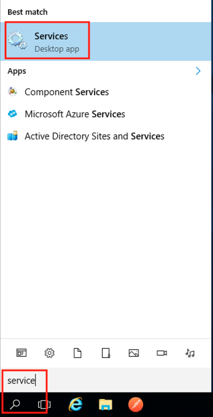
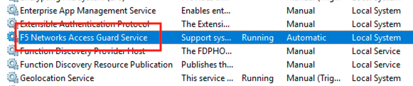

Lab 4.2 - System Service
-----------------------------------

The AccessGuard System Service performs the continuous monitoring of the system based on the parameters in the previously explored F5AccessGuardServiceConfig.xml file

Task - Locate the F5 Access Guard Service
~~~~~~~~~~~~~~~~~~~~~~~~~~~~~~~~~~~~~~~~~~~~~~~~~~~~~~

#. Enter Services into the jump box's desktop search bar.

   |image5|

#. The F5 Networks Access Guard Service was installed via a .msi available on https://downloads.f5.com

   |image6|

#. Close the services screen.

