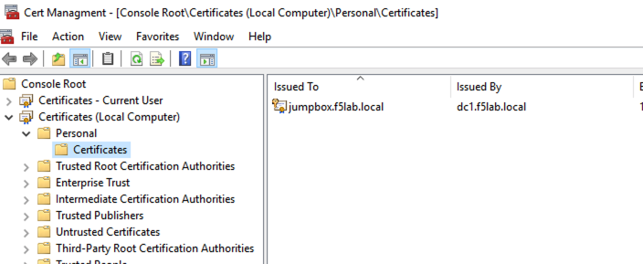
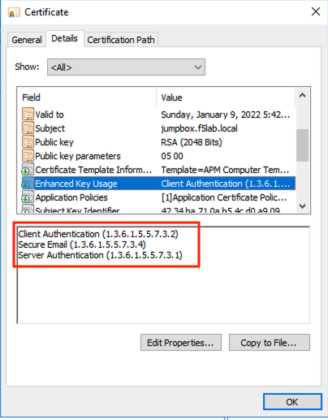

Lab 4.3 - Device Certificate
------------------------------------------------

When the configuration file is set to sign posture data, it uses the specified certificate/key pair in the machines local certifcate store.

Task - Explore the Device Certificate
~~~~~~~~~~~~~~~~~~~~~~~~~~~~~~~~~~~~~~~~~~

#. Open the jump box's certificate store by clicking the **Certificate Management** shortcut located on the desktop

   |image7|

#. Double click the **jumpbox.f5lab.local** certificate

   |image8|

#. Click the **Details** tab and scroll to the Enhanced Key Usage section.  The default usage types associated with a Microsoft CA template is Client Authentication and Server Authentication.  The default template must be modified to include Secure Email. 

   |image9|

#. Click **OK** and close the Certificate management window 

.. |image7| image:: media/image007.png

