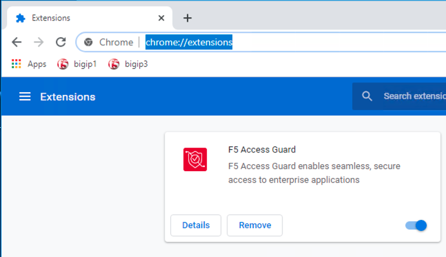
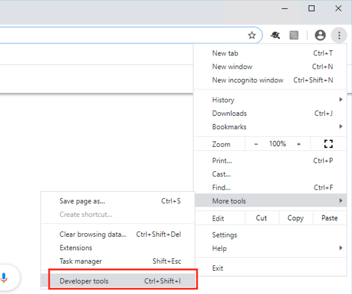
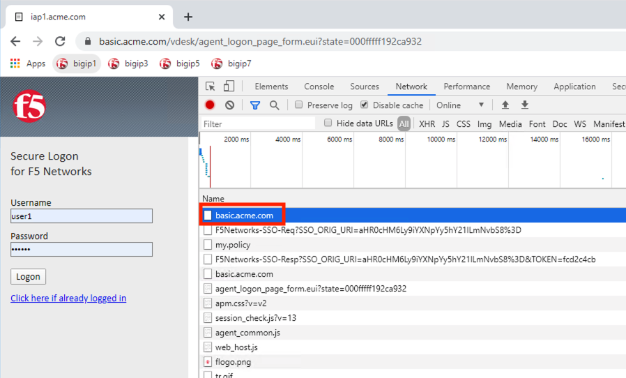
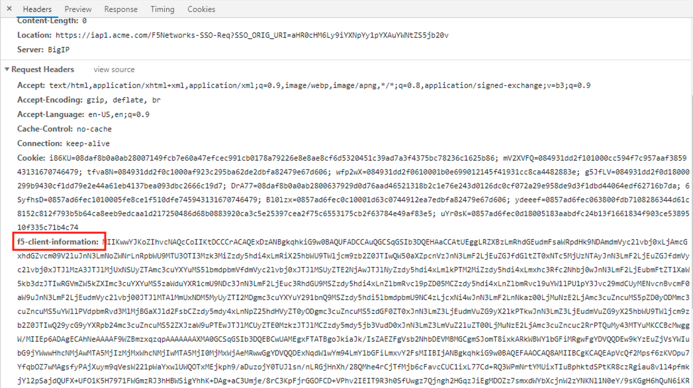

Lab 4.4 - Browser Extension
------------------------------------------------

The browser extension takes the posture data generated by the Access Guard service and converts it to a header.  

Task - View the installed Extension
~~~~~~~~~~~~~~~~~~~~~~~~~~~~~~~~~~~~~~~~~~

#. Open Chrome and enter **chrome://extensions** to see that the F5 Access Guard extension is installed.  The extension is download and installed via a browsers extension store.

   |image10|

#. Open **Developer Tools** by navigating to settings >> More Tools >> Developer Tools.

   |image11|

#. Access the website **https://basic.acme.com**
#. Click on the request **basic.acme.com** under the network tab.

   |image12|

#. Under the Request Headers section of the request you will see an injected header called **f5-client-information**.  This is the signed posture assessment data being sent to the BIG-IP on every request.

   |image13|

