Lab 1: Deploy an API Protection Profile
===========================================

Section 1.1 - Setup Lab Environment
-----------------------------------

To access your dedicated student lab environment, you will need a web browser and Remote Desktop Protocol (RDP) client software. The web browser will be used to access the Unified Demo Framework (UDF) Training Portal. The RDP client will be used to connect to the jumphost, where you will be able to access the BIG-IP management interfaces (HTTPS, SSH).

#. Click **DEPLOYMENT** located on the top left corner to display the environment

#. Click **ACCESS** next to jumpbox.f5lab.local

   |image200|

#. Select your RDP resolution.

#. The RDP client on your local host establishes a RDP connection to the Jumphost.

#. Login with the following credentials:

         - User: **f5lab\\user1**
         - Password: **user1**

#. After successful logon the Chrome browser will auto launch opening the site https://portal.f5lab.local.  This process usually takes 30 seconds after logon.

	|image201|

#. Click the **Classes** tab at the top of the page.

#. Scroll down the page until you see **304 API Protection** on the left

   |image202|

#. Hover over tile **Deploy an API Protection Profile**. A start and stop icon should appear within the tile.  Click the **Play** Button to start the automation to build the environment

   |image203|

#. The screen should refresh displaying the progress of the automation within 30 seconds.  Scroll to the bottom of the automation workflow to ensure all requests succeeded.  If you you experience errors try running the automation a second time or open an issue on the `Access Labs Repo <https://github.com/f5devcentral/access-labs>`__.

   |image204|

Section 1.2 - Implement Course-Graing Access Control
--------------------------------------------------------

Task 1 - Create a Provider
~~~~~~~~~~~~~~~~~~~~~~~~~~~~~

The cornerstone of the API protection profile is the ability to authorize users using JWT. Unlike Guided Configuration that creates the JWT Provider for you based on a few defined parameters, you must create the provider manually.

#. Navigate to Access >> Federation >> OAuth Client/Resource Server >> Provider. Click the **+ (Plus Symbol)**

   |image3|

#. Configure the following parameters:

   - Name: **api-as-provider**
   - Trusted Certificate Authorities: **ca.acme.com.**
   - OpenID URL: replace f5-oauth.local with **as.acme.com**

#. Click **Discover**

   |image4|

#. The Authentication URI, Token URI, Token Validation Scope URI, UserInfo URI and keys should be updated.

   |image5|

#. Click **Save**

Task 2 - Create a JWT Provider
~~~~~~~~~~~~~~~~~~~~~~~~~~~~~~~~~~~~

#. Navigate to Access >> Federation >> JSON Web Token >> Provider List. Click the **+ (Plus Symbol)**.

   |image9|

#. Enter the name: **as-jwt-provider**

#. Click **Add** so api-as-provider is added to list of providers

#. Click **Save**

   |image10|

Task 3 - Create an API Protection Profile
~~~~~~~~~~~~~~~~~~~~~~~~~~~~~~~~~~~~~~~~~~~

#. Navigate to API Protection >> Profile. Click the **+ (plus symbol)**

   |image11|

   .. note:: The JSON file is located on the jumpbox in c:\\access-labs\\class3\\module4\\student_files

#. Enter the following parameters:

   - Name: **api-protection**
   - OpenAPI File: **Active Directory OpenAPI.json**
   - DNS Resolver: **internal-dns-resolver**
   - Authorization: **OAuth 2.0**

#. Click **Add**

#. Click **Save**

   |image12|

Task 4 - Explore the Path Configuration
~~~~~~~~~~~~~~~~~~~~~~~~~~~~~~~~~~~~~~~~~~

#. Note the Spec file contained a single path of /user but it supports four different request methods.

#. The API server that all requests will be sent to is http://adapi.f5lab.local:81

   |image13|

Task 5 - Associate a JWT Provider
~~~~~~~~~~~~~~~~~~~~~~~~~~~~~~~~~~~

#. Click **Access Control** from the top ribbon

#. Click **Edit (Per Request Policy)**

   |image14|

#. Notice the same paths displayed in the API Protection profile appear here. Currently there is no fine-grained access control.  We will implement it later in the lab.

#. Click the **+ (plus symbol)** next the Subroutine **OAuth Scope Check AuthZ** to expand its properties:

   |image15|

   .. note:: The OAuth scope agent currently has a red asterisk since no provider is associated with it.

#. Click **OAuth Scope**

   |image16|

#. Enter the following parameters:

   - Token Validation Mode: **Internal**
   - JWT Provider List: **as-jwt-provider**
   - Response: **api-protection_auto_response1**

#. Click **Save**

   |image17|

Task 6 - Create a virtual server
~~~~~~~~~~~~~~~~~~~~~~~~~~~~~~~~~~~

#. From the web browser, click on the **Local Traffic** tab located on the left side

   |image18|

#. Navigate to Virtual Servers >> Virtual Server List.  Click the **+ (plus symbol)**

   |image19|

#. Enter the following parameters:

   - Name: **api.acme.com**
   - Destination Address/Mask: **10.1.10.102**
   - Service Port: **443**
   - HTTP Profile (Client): **http**
   - SSL Profile(Client): **acme.com**
   - Source Address Translation: **Auto Map**
   - API Protection: **api-protection**

#. Click **Finished**

   |image20|
   |image22|

Task 7 - Import Postman Collections
~~~~~~~~~~~~~~~~~~~~~~~~~~~~~~~~~~~~~~

#. From the Jumpbox, open **Postman** via the desktop shortcut or toolbar at the bottom

    |image106|

#. Click **Yes** if prompted for "Do you want to allow this app to make changes to your device?"

    |image107|

#. Click **Import** located on the top left of the Postman application

    |image108|

#.  Click **Upload Files**

    |image109|

#. Navigate to C:\\access-labs\\class3\\module4\\student_files, select **student-class3-module4-lab01.postman_collection.json**, and click **Open**

    |image110|

#.  Click **Import**

    |image111|

#. A collection called **student-class3-module4-lab01** will appear on the left side in Postman

Task 8 - Retreive your OAuth clientID
~~~~~~~~~~~~~~~~~~~~~~~~~~~~~~~~~~~~~~~~

#. Expand the **student-class3-module4-lab01** Collection

#. Select the request **Request1: Retrieve Postman ClientID**

   |image112|

#. Click **Send**

   |image25|

#. You receive a *200 OK** with a response body.  The clientID is now stored as a Postman Variable to be used in future requests.

   |image113|

Task 9 - Attempt to Retrieve User1\'s Attributes without JWT
~~~~~~~~~~~~~~~~~~~~~~~~~~~~~~~~~~~~~~~~~~~~~~~~~~~~~~~~~~~~~~

#. Select the request **Request2: Retrieve User Attributes without JWT**

#. Click **Send**

#. You receive a **403 Forbidden** response status code since you do not have a valid JWT

   |image26|

Task 10 -  Retrieve User1\'s Attributes with a JWT
~~~~~~~~~~~~~~~~~~~~~~~~~~~~~~~~~~~~~~~~~~~~~~~~~~~

#. Select the request **Request3: Retrieve User Attributes with JWT**

#. Select the **Authorization** tab

#. Click **Get New Access Token**

   |image44|

#. Enter **User1** for the Token Name and review the Postman Configuration. Nothing else should need to be modified.

#. Click **Request Token**

   |image27|

#. Login using Username: **user1**, Password: **user1**

   |image28|

#. Click **Use Token** at the top.

   |image29|

#. Notice the **Access Token** field is now populated

   |image34|

#. Click **Send**

#. You receive a **200 OK** response status code with attributes for user1 in the body of the response

   |image31|

Task 11 - Set a Valid User Attribute
~~~~~~~~~~~~~~~~~~~~~~~~~~~~~~~~~~~~~~~~~~~~~~~~

#. Select the request **Request 4: Update a Valid User Attribute**

#. Select the **Authorization** tab

#. Select the previously created **User1** token from the **Available Tokens** dropdown

   |image33|

#. The **Token** field is now populated

   |image34|

#. Click **Send**

   .. note:: If you receive a 403 response status code, request a new token.  You can change the name of the token request prior to sending by setting the Token Name. You can delete expired tokens by clicking the Available Tokens dropdown, clicking Manage Tokens, and then clicking the trashcan next to the Token.

#. You receive a **200 OK** response status code with a response body that contains user1's employeeNumber **123456**

   |image35|

Task 12 - Set an Nonexistent User's Attribute
~~~~~~~~~~~~~~~~~~~~~~~~~~~~~~~~~~~~~~~~~~~~~~~~

#. Select the request **Request 5: Update a Nonexistent User Attribute**

#. Select the **Authorization** tab

#. Select the previously created **User1** token from the **Available Tokens** dropdown

#. The **Token** field is now populated

#. Click **Send**

   .. note:: If you receive a 403 response status code, request a new token.  You can change the name of the token request prior to sending by setting the Token Name. You can delete expired tokens by clicking the Available Tokens dropdown, clicking Manage Tokens, and then clicking the trashcan next to the Token.

#. You receive a **2O0 OK** response status code. The request successfully passed through the API Gateway, but the server failed to process the request.

|image37|

Task 13 - Update a Valid User with PUT
~~~~~~~~~~~~~~~~~~~~~~~~~~~~~~~~~~~~~~~~~~

#. Select the request **Request 6: Update a Valid User's Attribute with PUT**

#. Select the **Authorization** tab

#. Select the previously created **User1** token from the **Available Tokens** dropdown

#. The **Token** field is now populated

#. Click **Send**

#. You receive a **403 Forbidden** response status code. This is expected because the PUT Method was not specified in the API Protection Profile for the path /user

   |image39|

Task 14 - Create a User
~~~~~~~~~~~~~~~~~~~~~~~~~~~~

#. Select the request **Request 7: Create a User**

#. Select the **Authorization** tab

#. Select the previously created **User1** token from the **Available Tokens** dropdown

   |image33|

#. Click **Send**

#. You receive a **200 OK** response status code with a response body that contains Bob Smith's user attributes

   |image46|

Task 15 - Request invalid endpoint
~~~~~~~~~~~~~~~~~~~~~~~~~~~~~~~~~~~~~

#. Select the request **Request 8: Request Invalid Endpoint**

#. Select the **Authorization** tab

#. Select the previously created **User1** token from the **Available Tokens** dropdown

#. The **Token** field is now populated

#. Click **Send**

#. You receive a **403 Forbidden** response status code. This is expected because the path /hacker/attack was not specified in the API Protection Profile

   |image39|

Section 1.3 - Implement Fine-Grained Access Controls
-----------------------------------------------------------

Up to this point any authenticated user to the API is authorized to use them. In this section we will restrict user1's ability to create users, but will still be able to modify a user's employee number.

Task 1 - Retrieve Group Membership Subsession Variable
~~~~~~~~~~~~~~~~~~~~~~~~~~~~~~~~~~~~~~~~~~~~~~~~~~~~~~~~~~~~~~~~~~~~~~~~

   .. note:: In order to implement fine-grained control the session variables that contain the data must be known. This first session shows you how to display the session variables and their values.

#. From the Jumpbox desktop click on the **BIG-IP1** Putty icon

   |image47|

#. Enter the command **sessiondump --delete all** to remove any existing APM sessions

   |image41|

#. Enter the command **tailf /var/log/apm**.  Hit enter a few times to create some space on the screen

   |image84|

#. From Postman, Select the request **Request 3: Retrieve User Attributes with JWT**.  The Authorization field should already be populated with User1's token.

#. Click **Send**

#. You receive a **200 OK** response status code with attributes for user1 in the body of the response

   |image31|

   .. Note:: Your SessionID will be different

#. Return to the CLI and examine the logs. You will see a message about a new subsession being created. Copy the subsession ID

   |image85|

#. Exit the logs using Ctrl+Z

#. Enter the command **sessiondump -subkeys <subsessionID>**

   |image86|

#.  Scroll through input until you find the session variable for **subsession.oauth.scope.last.jwt.groups**

   |image87|

Task 2 - Edit the per-request policy
~~~~~~~~~~~~~~~~~~~~~~~~~~~~~~~~~~~~~~~~~~~~~~~~~~~~~~~~~~~~~~~~~~~~~~~~

#. Return to BIG-IP1's management interface and navigate to Access  >> API Protection >> Profile.  Click **Profile** to modify the previously created API protection Profile (not the + Plus symbol)

#. Click **Edit** Under Per-Request Policy

   |image49|

#. Click the **Allow** terminal located at the end of the **POST /user** branch

   |image72|

#. Select **Reject**
#. Click **Save**

   |image60|

#. Click the **+ (Plus Symbol)** on the POST /user branch

   |image50|

#. Click the **General Purpose** tab

#. Select **Empty**

#. Click **Add Item**

   |image51|

#. Enter the name **Claim Check**

   |image53|

#. Click the **Branch Rules** tab

#. Click the **Add Branch Rule**

   |image52|

#. Enter Name **CreateUser**

#. Click **Change**

   |image54|

#. Click the **Advanced** tab

#. Enter the string in the notes section to restrict access to only members of the **CreateUser** Group. Make sure the " characters are properly formatted after pasting. If they aren't, simply delete and re-enter them manually.

#. Click **Finished**

   .. Note::

	expr {[mcget {subsession.oauth.scope.last.jwt.groups}] contains "CreateUser"}

   |image55|

#. Click **Save**

   |image56|

#. Click **Reject** on the CreateUser Branch to permit access

   |image57|

#. Select **Allow**

#. Click **Save**

   |image58|

#. Review the Policy Flow

   |image61|

Task 3 - Test the Fine-Grained Access Control with user1
~~~~~~~~~~~~~~~~~~~~~~~~~~~~~~~~~~~~~~~~~~~~~~~~~~~~~~~~~~~~~~~~~~~~~~~~

1. From Postman select the request **Request 7: Create User**

2. Select the **Authorization** Tab

3. Select the previously created **User1** token from the **Available Tokens** dropdown

4. The **Token** field is now populated

5. Click **Send**

6. You receive a **403 Forbidden** response status code when using user1. User1 does not contain the proper claim data.

|image26|

Task 4 - Test the Fine-Grained Access Control with user2
~~~~~~~~~~~~~~~~~~~~~~~~~~~~~~~~~~~~~~~~~~~~~~~~~~~~~~~~~~~~~~~~~~~~~~~~

1. Select the request **Request 7: Create User**

2. Select the **Authorization** tab

3. Click **Get New Access Token**

|image44|

4. Enter **User2** for the Token Name and review the Postman Configuration. Nothing else should need to be modified
5. Click **Request Token**

|image101|

6. Login using Username: **user2**, Password: **user2**

|image62|

7. Scroll down to the token and click **Use Token**
8. The **Token** field is now populated
9. Click **Send**

10. You receive a **200 OK** response status code when using user2. User2 does contain the proper claim data

|image46|

Section 1.4 - Implement Rate Limiting
----------------------------------------

The API Protection Profile allows a BIG-IP administrator to throttle the amount of connections to an API through the use of Key Names.

Task 1 - Test pre-rate limiting Access
~~~~~~~~~~~~~~~~~~~~~~~~~~~~~~~~~~~~~~~~~~~~~~~~~~~~~~~~~~~~~~~~~~~~~~~~

#. From Postman, Select the request **Request 3: Retrieve User Attributes with JWT**

#. Click **Save**, so the current token is saved as part of the API request.

   |image88|

#. Click the **arrow** located to the right of the student-class3-module-lab01 collection.

   |image89|

#. Click **Run**

   |image104|

#. Deselect all requests except **Request 3: Retrieve User Attributes with JWT**

#. Set the iterations to **100**

#. Click the blue **Run Student-class....** button

   |image105|

#. You receive a **200 OK** for every request. Leave Runner open

   |image92|

Task 2 - Define the rate limiting keys
~~~~~~~~~~~~~~~~~~~~~~~~~~~~~~~~~~~~~~~~~~~~~~~~~~~~~~~~~~~~~~~~~~~~~~~~

#. Navigate to API Protection >> Profile.  Click **Profile** to modify the previously created API protection Profile.  Not the + Plus symbol.

   |image48|

#. Click **api-protection**

   |image64|

#. Click **Rate Limiting** from the top ribbon

   |image69|

   .. Note ::  The API protection profile default settings contains five Key Names created, but their values are empty.  Additional Keys can be created if necessary

#. Click **api-protection_auto_rate_limiting_key1**

   |image70|

#. Enter the Key Value **%{subsession.oauth.scope.last.jwt.user}**

#. Click **Edit**

   |image71|

#. Click **api-protection_auto_rate_limiting_key2**

#. Enter the Key Value **%{subsession.oauth.scope.last.jwt.groupid}**

#. Click **Edit**

   |image73|

#. Click **api-protection_auto_rate_limiting_key3**

#. Enter the Key Value **%{subsession.oauth.scope.last.jwt.client}**

#. Click **Edit**

   |image75|

#. Click **api-protection_auto_rate_limiting_key4**

#. Enter the Key Value **%{subsession.oauth.scope.last.jwt.tier}**

#. Click **Edit**

   |image77|

#. Click **api-protection_auto_rate_limiting_key5**

#. Enter the Key Value **%{subsession.oauth.scope.last.jwt.org}**

#. Click **Edit**

   |image79|

#. Click **Save**

   |image80|

Task 3 - Create a Rate Limiting Policy
~~~~~~~~~~~~~~~~~~~~~~~~~~~~~~~~~~~~~~~~~~~~~~~~~~~~~~~~~~~~~~~~~~~~~~~~

#. Click **Create** in the rate limiting section

   |image81|

#. Enter the Name **acme-rate-limits**

#. Move all five keys under **Selected Keys**

#. Enter **10** for the number of requests per minute

#. Enter **5** for the number requests per second

#. Click **Add**.

   |image82|

#. Click **Save**

   |image83|

Task 4 - Apply the Rate Limiting Policy
~~~~~~~~~~~~~~~~~~~~~~~~~~~~~~~~~~~~~~~~~~~~~~~~~~~~~~~~~~~~~~~~~~~~~~~~

#. Click **Access Control** from the ribbon

   |image93|

#. Click **Edit** Per Request Policy

   |image94|

#. Click the **+ (Plus Symbol)** on the **Out** branch of the **OAuth Scope Check AuthZ** Macro

   |image95|

#. Click the **Traffic Management** tab

#. Select **API Rate Limiting**

#. Click **Add Item**

   |image96|

#. Click **Add new entry**

#. Select **acme-rate-limits**

#. Click **Save**

   |image97|

#. Verify the Rate Limiting agent now appears in the appropriate location

   |image98|

Task 5 - Test Rate Limiting
~~~~~~~~~~~~~~~~~~~~~~~~~~~~~~~~~~~~~~~~~~~~~~~~~~~~~~~~~~~~~~~~~~~~~~~~

#. From Postman, return to Runner

   |image89|

#. Click **Retry** to rerun the request an additional 100 times.

   |image103|

#. On the 6th request you begin to receive a **429 Too Many Requests** response status code

   |image99|

Section 1.5 - Onboard a New API
----------------------------------------

Organizations change. With this change, new APIs are introduced requiring modifications to the API Gateway. In this section you will learn how to add additional paths.

Task 1 - Verify no access to API
~~~~~~~~~~~~~~~~~~~~~~~~~~~~~~~~~~~~~~~~~~~~~~~~~~~~~~~~~~~~~~~~~~~~~~~~

#. From Postman, select the request **Request 9: Create DNS Entry**

#. Select the **Authorization** tab

#. Select the previously created **User1** token from the **Available Tokens** dropdown

#. The **Token** field is now populated

#. Click **Send**

#. You receive a **403 Forbidden** response status code because the the new API has not been published at the Gateway. WARNING: If you executed this step too quickly after the prior 1.6 lab, you may still be rate limited and need to wait a minute.

Task 2 - Add the new API path
~~~~~~~~~~~~~~~~~~~~~~~~~~~~~~~~~~~~~~~~~~~~~~~~~~~~~~~~~~~~~~~~~~~~~~~~

#. From the browser, navigate to API Protection >> Profile.  Click **Profile** to modify the previously created API protection Profile (not the + Plus symbol)

   |image48|

#. Click **api-protection**

   |image64|

#. Click **Paths**

   |image65|

#. Click **Create**

   |image66|

#. The URI **/dns**

#. Select the Method **POST**

#. Click **Add**

   |image67|

#. Click **Save**

   |image68|

Task 3 - Test Access to the new path
~~~~~~~~~~~~~~~~~~~~~~~~~~~~~~~~~~~~~~~~~~~~~~~~~~~~~~~~~~~~~~~~~~~~~~~~

#. From Postman, select the request **Request 9: Create DNS Entry**

#. You receive a **200 OK** that the endpoint is now published.

|image102|

.. |image0| image:: media/lab01/image000.png
	:width: 800px
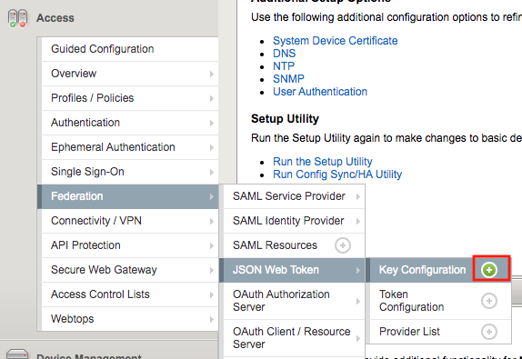
.. |image2| image:: media/lab01/image002.png
.. |image3| image:: media/lab01/image003.png
.. |image4| image:: media/lab01/004.png
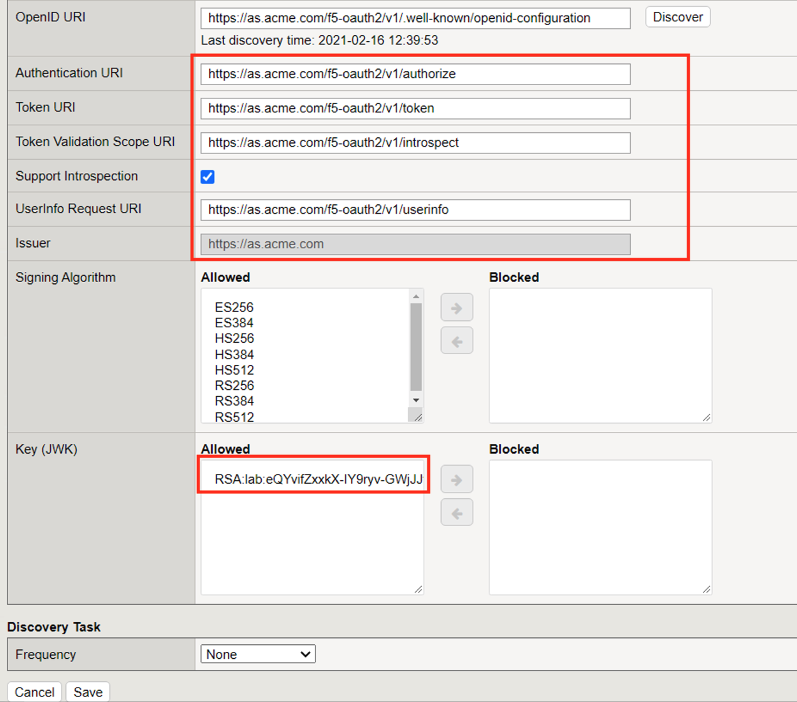
.. |image6| image:: media/lab01/image006.png
	:width: 800px
.. |image7| image:: media/lab01/image007.png
.. |image8| image:: media/lab01/image008.png
.. |image9| image:: media/lab01/image009.png
.. |image10| image:: media/lab01/image010.png
.. |image11| image:: media/lab01/image011.png
.. |image12| image:: media/lab01/image012.png
	:width: 800px
.. |image13| image:: media/lab01/013.png
	:width: 800px
.. |image14| image:: media/lab01/image014.png
	:width: 800px
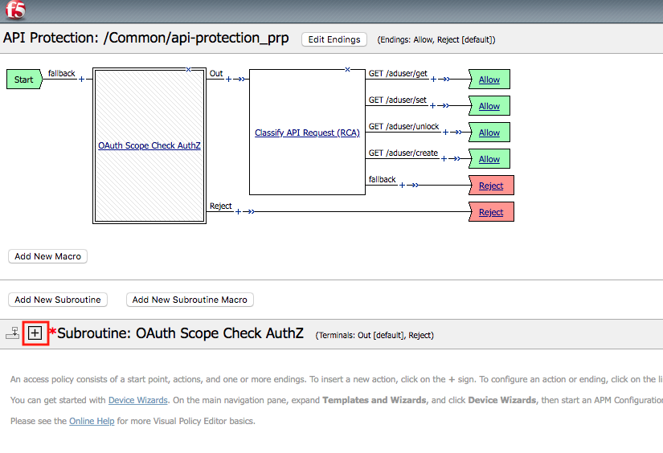
.. |image16| image:: media/lab01/image016.png
	:width: 800px
.. |image17| image:: media/lab01/image017.png
	:width: 800px
.. |image18| image:: media/lab01/image018.png
.. |image19| image:: media/lab01/image019.png
.. |image20| image:: media/lab01/image020.png
.. |image21| image:: media/lab01/image021.png
	:width: 700px
.. |image22| image:: media/lab01/image022.png
.. |image24| image:: media/lab01/024.png
.. |image25| image:: media/lab01/image025.png
.. |image26| image:: media/lab01/image026.png
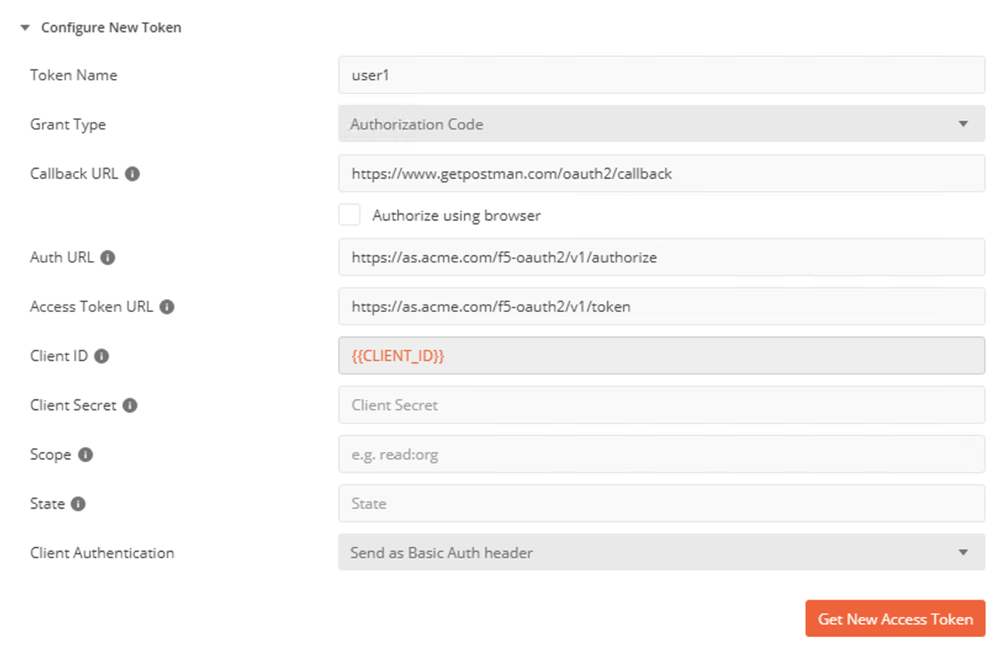
.. |image28| image:: media/lab01/image028.png
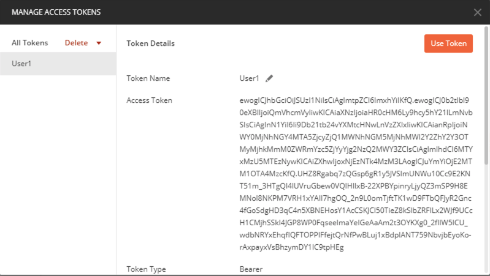
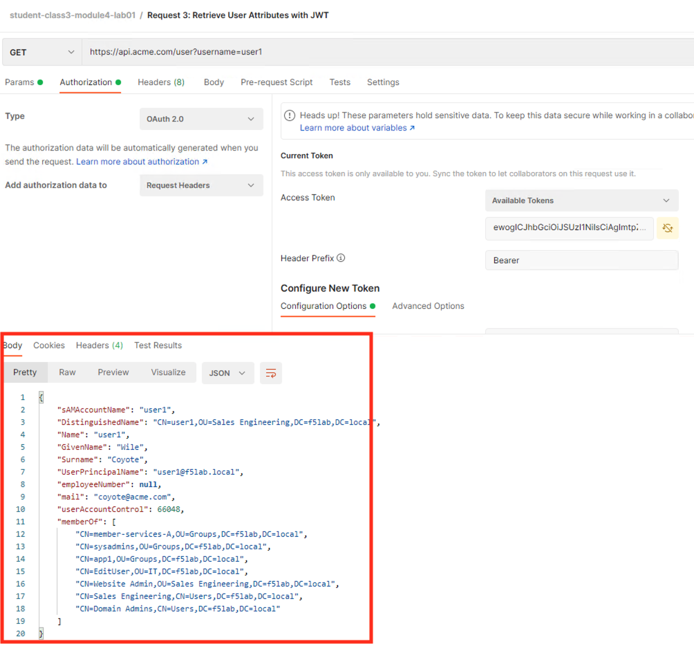
.. |image32| image:: media/lab01/image032.png
.. |image33| image:: media/lab01/image033.png
	:width: 800px
.. |image34| image:: media/lab01/image034.png
.. |image35| image:: media/lab01/image035.png
.. |image36| image:: media/lab01/image036.png
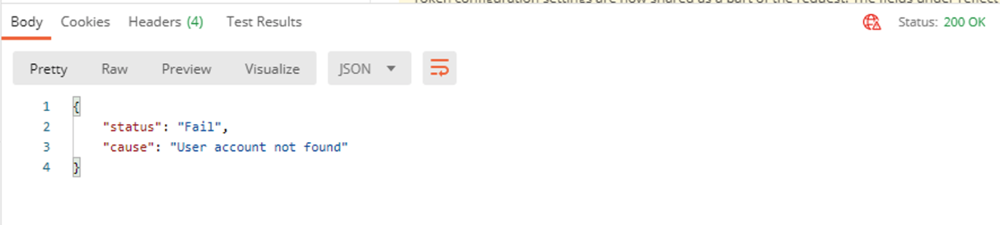
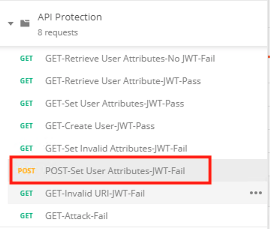
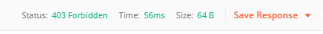
.. |image40| image:: media/lab01/image040.png
.. |image41| image:: media/lab01/image041.png
.. |image42| image:: media/lab01/image042.png
.. |image43| image:: media/lab01/image043.png
.. |image44| image:: media/lab01/image044.png
.. |image45| image:: media/lab01/image045.png
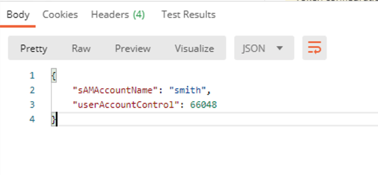
.. |image47| image:: media/lab01/image047.png
.. |image48| image:: media/lab01/image048.png
.. |image49| image:: media/lab01/image049.png
	:width: 800px
.. |image50| image:: media/lab01/050.png
.. |image51| image:: media/lab01/image051.png
.. |image52| image:: media/lab01/image052.png
.. |image53| image:: media/lab01/image053.png
.. |image54| image:: media/lab01/image054.png
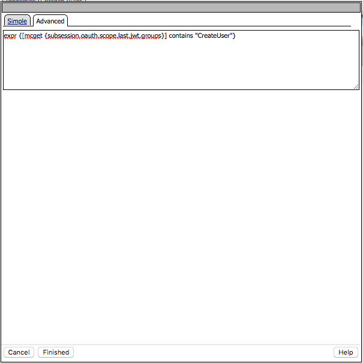
.. |image56| image:: media/lab01/image056.png
	:width: 800px
.. |image57| image:: media/lab01/057.png
.. |image58| image:: media/lab01/image058.png
.. |image59| image:: media/lab01/image059.png
.. |image60| image:: media/lab01/image060.png
.. |image61| image:: media/lab01/061.png
	:width: 800px
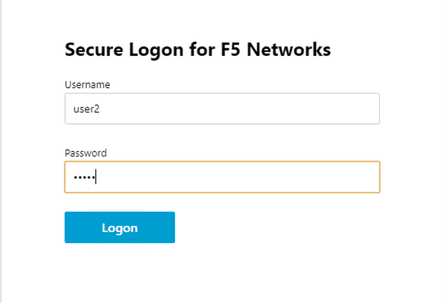
.. |image63| image:: media/lab01/image063.png
.. |image64| image:: media/lab01/064.png
.. |image65| image:: media/lab01/065.png
.. |image66| image:: media/lab01/066.png
	:width: 800px
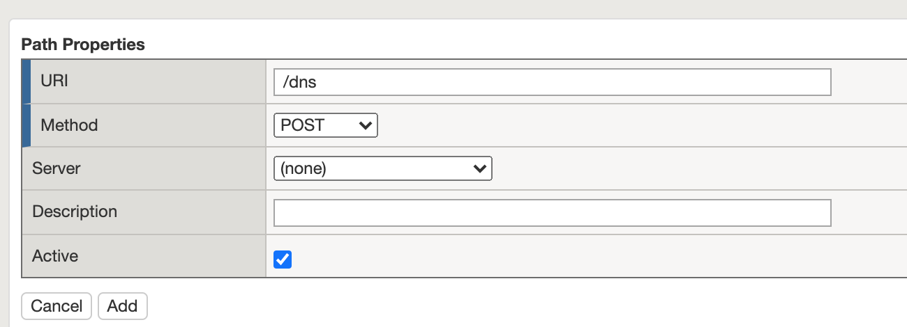
.. |image68| image:: media/lab01/068.png
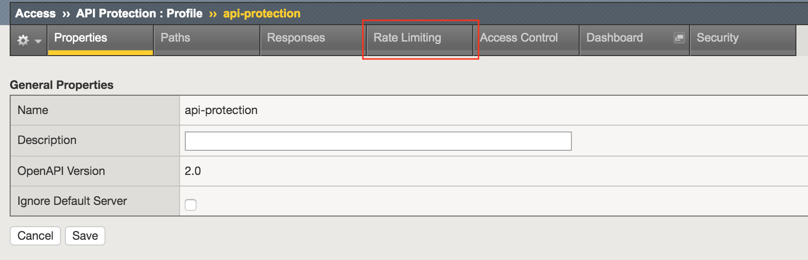
.. |image70| image:: media/lab01/image070.png
	:width: 1000px
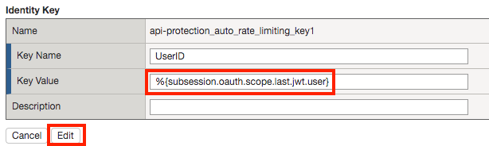
.. |image72| image:: media/lab01/072.png
.. |image73| image:: media/lab01/image073.png
.. |image75| image:: media/lab01/image075.png
.. |image77| image:: media/lab01/image077.png
.. |image79| image:: media/lab01/image079.png
.. |image80| image:: media/lab01/image080.png
	:width: 1200px
.. |image81| image:: media/lab01/image081.png
	:width: 1000px
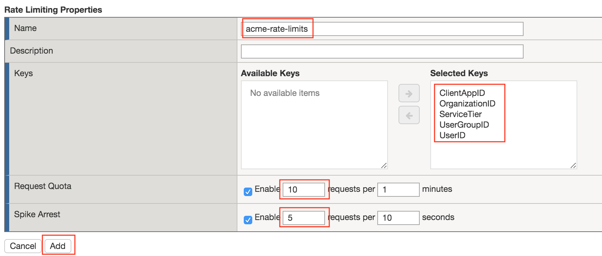
.. |image83| image:: media/lab01/image083.png
	:width: 1200px
.. |image84| image:: media/lab01/image084.png
	:width: 800px
.. |image85| image:: media/lab01/image085.png
	:width: 1200px
.. |image86| image:: media/lab01/image086.png
	:width: 1200px
.. |image87| image:: media/lab01/image087.png
	:width: 1200px
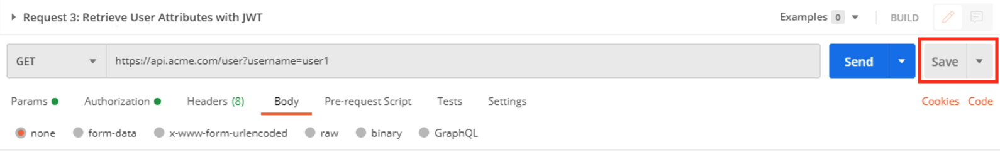
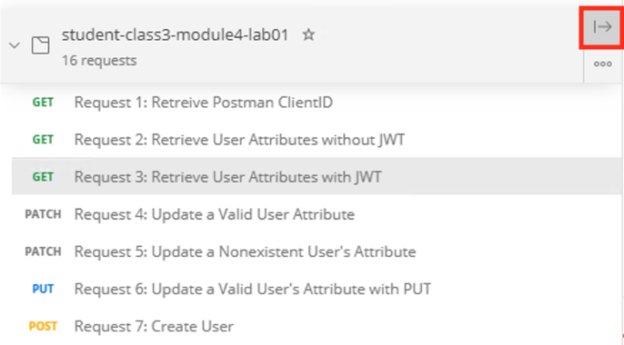
.. |image90| image:: media/lab01/image090.png
	:width: 800px
.. |image91| image:: media/lab01/image091.png
	:width: 800px
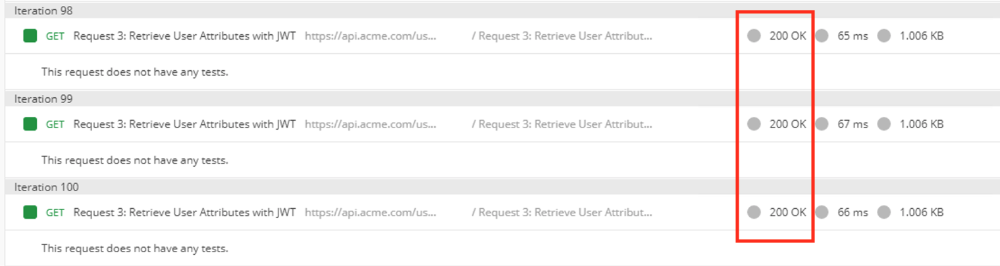
.. |image93| image:: media/lab01/image093.png
	:width: 800px
.. |image94| image:: media/lab01/image094.png
	:width: 800px
.. |image95| image:: media/lab01/095.png
	:width: 800px
.. |image96| image:: media/lab01/image096.png
	:width: 800px
.. |image97| image:: media/lab01/image097.png
	:width: 800px
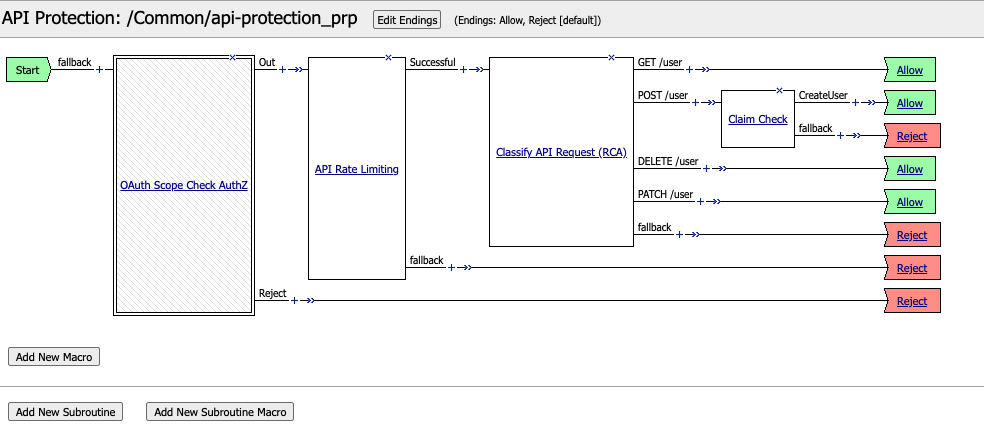
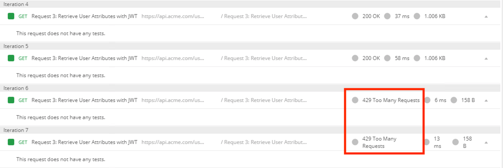
.. |image101| image:: media/lab01/101.png
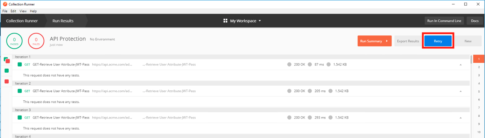
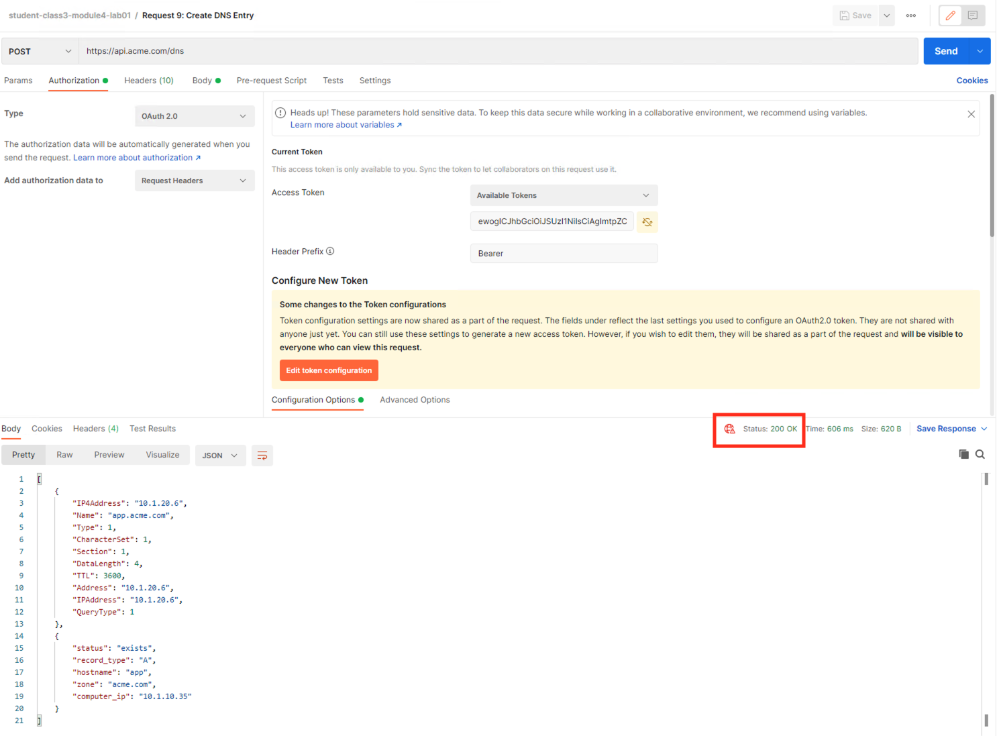
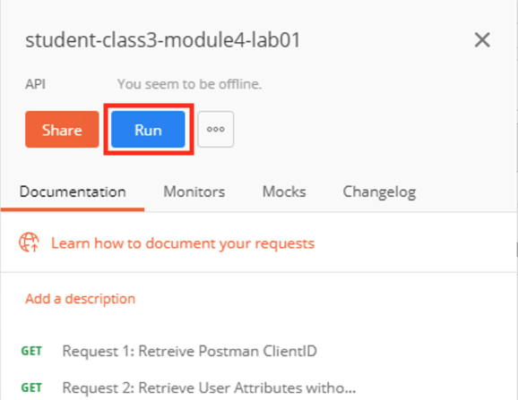
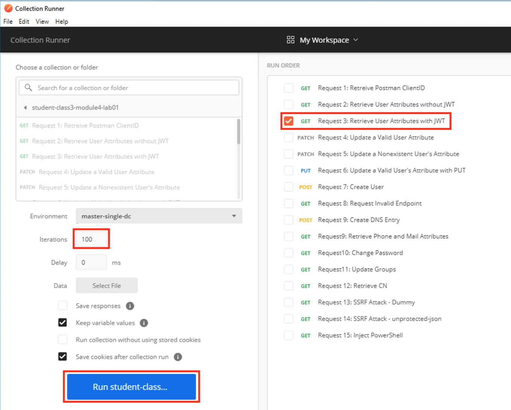
.. |image106| image:: media/lab01/106.png
.. |image107| image:: media/lab01/107.png
.. |image108| image:: media/lab01/108.png
.. |image109| image:: media/lab01/109.png
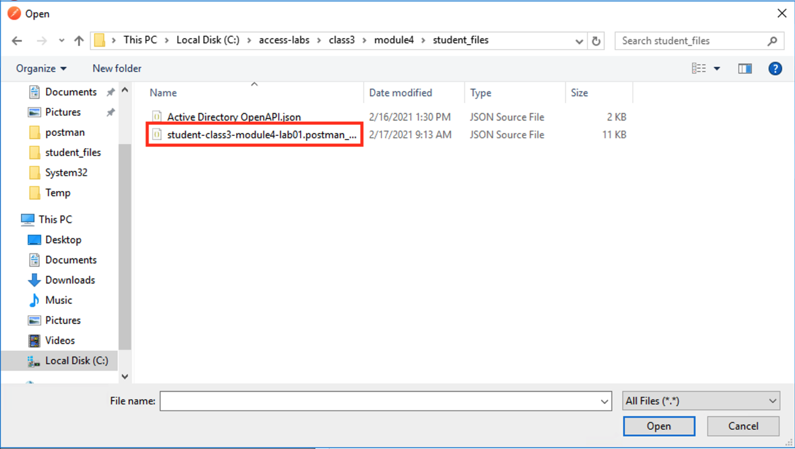
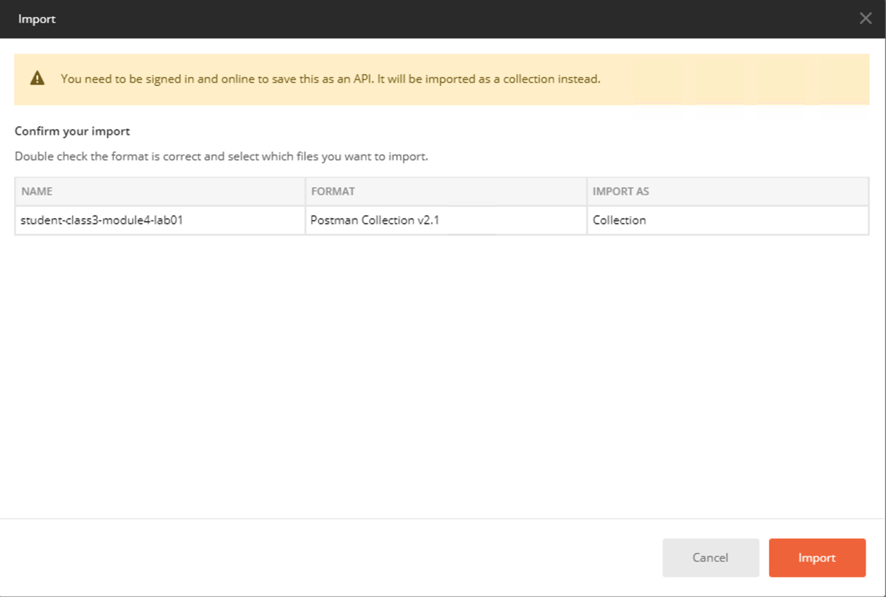
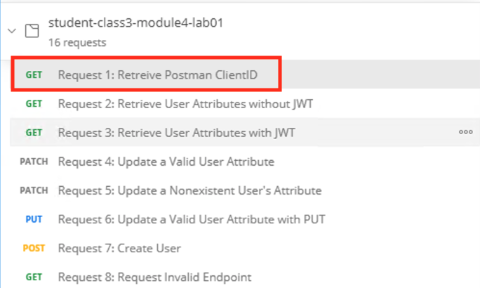
.. |image113| image:: media/lab01/113.png
.. |image200| image:: media/lab01/200.png
.. |image201| image:: media/lab01/201.png
.. |image202| image:: media/lab01/202.png
.. |image203| image:: media/lab01/203.png
.. |image204| image:: media/lab01/204.png

