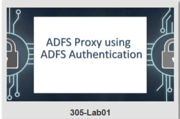
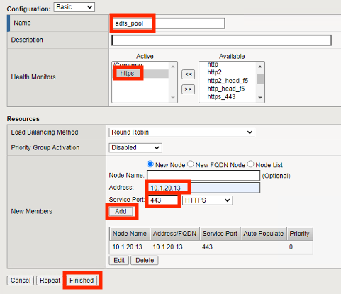
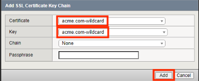
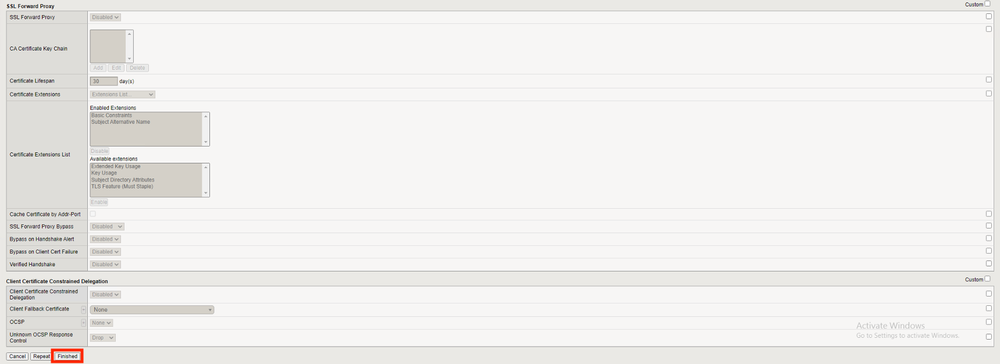
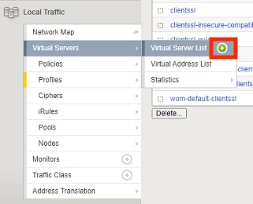
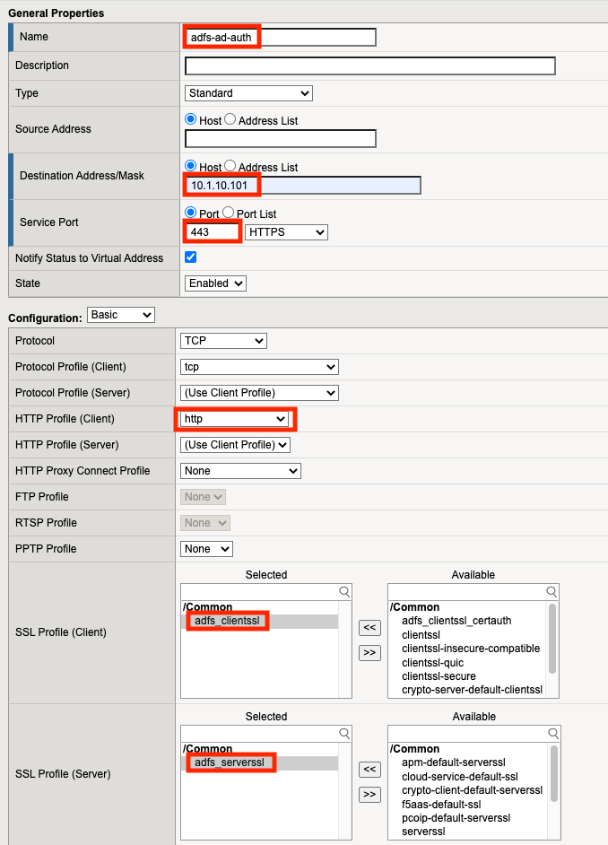
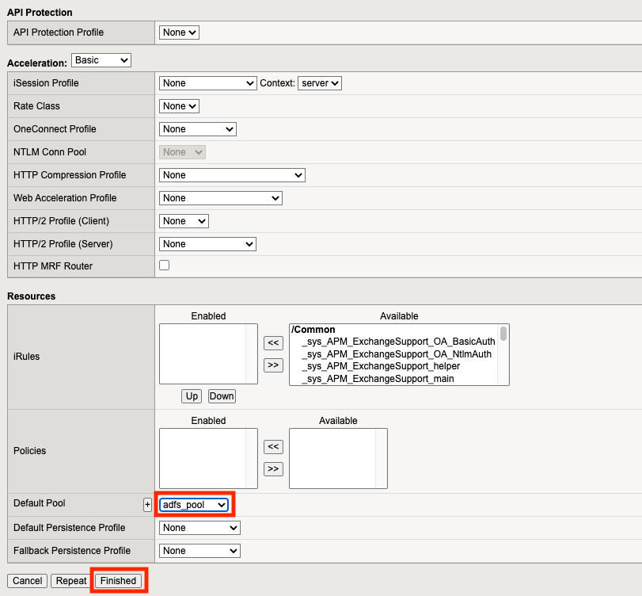
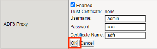
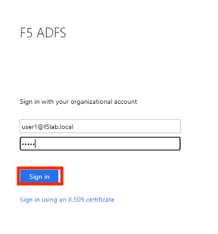
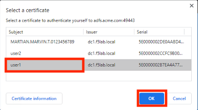

Lab 1: ADFS Proxy using ADFS Authentication
============================================

Task 1 - Setup Lab Environment
-----------------------------------

To access your dedicated student lab environment, you will require a web browser and Remote Desktop Protocol (RDP) client software. The web browser will be used to access the Lab Training Portal. The RDP client will be used to connect to the Jump Host, where you will be able to access the BIG-IP management interfaces (HTTPS, SSH).

#. Click **DEPLOYMENT** located on the top left corner to display the environment

#. Click **ACCESS** next to jumpohost.f5lab.local

   |image001|

#. Select your RDP resolution.

#. The RDP client on your local host establishes a RDP connection to the Jumphost.

#. Login with the following credentials:

         - User: **f5lab\\user1**
         - Password: **user1**

#. After successful logon the Chrome browser will auto launch opening the site https://portal.f5lab.local.  This process usually takes 30 seconds after logon.

#. Click the **Classes** tab at the top of the page.

	|image002|

#. Scroll down the page until you see **305 ADFS Proxy** on the left

   |image003|

#. Hover over tile **ADFS Proxy using ADFS Authentication**. A start and stop icon should appear within the tile.  Click the **Play** Button to start the automation to build the environment

   +---------------+-------------+
   | |image004|    | |image005|  |
   +---------------+-------------+

#. The screen should refresh displaying the progress of the automation within 30 seconds.  Scroll to the bottom of the automation workflow to ensure all requests succeeded.  If you experience errors try running the automation a second time or open an issue on the `Access Labs Repo <https://github.com/f5devcentral/access-labs>`__.

   |image006|

Task 2 - Create the ADFS Server Pool
-----------------------------------------

#. From the jumphost browser navigate to https://bigip1.f5lab.local

#. Login with the following credentials:

   - username **admin**
   - password **admin**

#. Navigate to Local Traffic >> Pool >> Pool List.  Click the **+ (Plus Symbol)**

    |image009|

#. Enter the Name **adfs_pool**
#. Select the Health Monitor **https** from the list of available monitors
#. Enter the Member Address **10.1.20.13**
#. Enter the Member Service Port **443**
#. Click **Add**
#. Click **Finished**

    |image010|

Task 3 - Create an ADFS Server-side SSL Profile
-----------------------------------------------------

#. Navigate to Local Traffic >> Profiles >> SSL >> Server.  Click the **+ (Plus Symbol)**

    |image011|

#. Enter the Name **adfs_serverssl**
#. From the Configuration dropdown select **Advanced**
#. On the Server Name line Check the **Custom** box on the right side
#. Enter the Server Name **adfs.acme.com**
#. Click **Finished**

    |image012|

    |image013|

Task 4 - Create an ADFS Client-side SSL Profile
-------------------------------------------------

#. Navigate to Local Traffic >> Profiles >> SSL >> Client.  Click the **+ (Plus Symbol)**

    |image014|

#. Enter the Name **adfs_clientssl**
#. On the Certificate Key Chain line check the **Custom** box on the right side
#. Click **Add**

    |image015|

#. From the Certificate Dropdown select **acme.com-wildcard**
#. From the Key dropdown select **acme.com-wildcard**
#. Click **Add**

    |image016|

#. Click **Finished**

    |image017|

    |image018|

Task 5 - Create an ADFS Client-side SSL Profile for Certificate Authentication
-----------------------------------------------------------------------------------

#. Navigate to Local Traffic >> Profiles >> SSL >> Client.  Click the **+ (Plus Symbol)**

    |image014|

#. Enter the Name **adfs_clientssl_certauth**
#. Select Parent Profile **adfs_clientssl**
#. On the Trusted Certificate Authorities line check the **Custom** box on the right side
#. From the Trusted certifciate Authoriates dropdown select **ca.f5lab.local**  
#. On the Advertised Certificate Authorities line check the **Custom** box on the right side
#. From the Advertised certifciate Authoriates dropdown select **ca.f5lab.local** 
    
    |image019|

 
#. Click **Finished**

    |image020|

Task 6 - Create the AD Authenticated ADFS Proxy Virtual Server
------------------------------------------------------------------

#. Navigate to Local Traffic >> Virtual Servers >> Virtual Server List.  Click the **+ (Plus Symbol)**

    |image021|

#. Enter the Name **adfs-ad-auth**
#. Enter the Destination Address **10.1.10.101**
#. Enter the Service Port **443**
#. Select the HTTP profile(Client) **http** from the dropdown
#. In the SSL Profile(Client) section move **adfs_clientssl** under Selected 
#. In the SSL Profile(Server) section move **adfs_serverssl** under Selected 

    |image022|

#. From the Source Address Translation dropdown select **Auto Map**
#. **Check** the ADFS Proxy Enabled box 

    |image023|

#. From the Default Pool dropdown select **adfs_pool**
#. Click **Finished**

    |image024|

#. Click **adfs-ad-auth**

    |image025|

#. Scroll down to the Access Policy section and click **Establish Trust**

    |image026|

#. Enter the Username **admin**
#. Enter the Password **admin**
#. Enter the Certificate Name **adfs**
#. Click **OK**

    |image027|

#. A Trust certificate should now be displayed.
#. Click **Update**

    |image028|

Task 7 - Create the Certificate Authentication ADFS Proxy Virtual Server
----------------------------------------------------------------------------

#. Navigate to Local Traffic >> Virtual Servers >> Virtual Server List.  Click the **+ (Plus Symbol)**

    |image021|

#. Enter the Name **adfs-cert-auth**
#. Enter the Destination Address **10.1.10.101**
#. Enter the Service Port **49443**
#. Select the HTTP profile(Client) **http** from the dropdown
#. In the SSL Profile(Client) section move **adfs_clientssl_certauth** under Selected 
#. In the SSL Profile(Server) section move **adfs_serverssl** under Selected 
#. From the Source Address Translation dropdown select **Auto Map**

    |image029|

#. **Check** the ADFS Proxy Enabled box 
#. From the Default Pool dropdown select **adfs_pool**
#. Click **Finished**

    |image030|

Task 8 - Test username and password Authenticaiton
---------------------------------------------------

#. On the jumphost open a webbrowser and navigate to https://sp.acme.com.  You will redirected to https://adfs.acme.com
#. Enter the username **user1@f5lab.local**
#. Enter the password **user1**
#. Click **Sign in**

    |image031|

#.  After successful login at ADFS you redirected to http://sp.acme.com

    |image032|

Task 9 - Test Certificate authentication
-----------------------------------------

#. Close the browser completely from the previous test or open a new tab in ingonito(private) view
#.  On the jumphost open a webbrowser and navigate to https://sp.acme.com.  You will redirected to https://adfs.acme.com
#. Select **Sign in using an X.509 Certificate**

    |image033|

#. Select the **user1** certificate
#. Click **OK**

    |image034|

#.  After successful login at ADFS you redirected to http://sp.acme.com

    |image032|

Task 10 - Lab Cleanup
-----------------------

#. From the jumphost browser navigate to https://bigip1.f5lab.local

#. Login with the following credentials:

   - username **admin**
   - password **admin**

#. From a browser on the jumphost navigate to https://portal.f5lab.local                     
                                                                                            
#. Click the **Classes** tab at the top of the page.  

    |image002|

#. Scroll down the page until you see **305 ADFS Proxy** on the left     

    |image003|

#. Hover over the tile **ADFS Proxy using ADFS Authentication**. A start and stop icon should appear within the tile.  Click the **Stop** Button to start the automation to delete any prebuilt objects                                                                  

    +---------------+-------------+
    | |image004|    | |image007|  |
    +---------------+-------------+

#. The screen should refresh displaying the progress of the automation within 30 seconds. Scroll to the bottom of the automation workflow to ensure all requests succeeded. If you you experience errors try running the automation a second time or open an issue on the `Access Labs Repo <https://github.com/f5devcentral/access-labs>`__.                      

    |image008|

#. This concludes Lab 1.   

    |image000|

.. |image000| image:: ./media/lab01/000.png
.. |image001| image:: ./media/lab01/001.png
.. |image002| image:: ./media/lab01/002.png
.. |image003| image:: ./media/lab01/003.png

.. |image005| image:: ./media/lab01/005.png
.. |image006| image:: ./media/lab01/006.png
.. |image007| image:: ./media/lab01/007.png
.. |image008| image:: ./media/lab01/008.png
.. |image009| image:: ./media/lab01/009.png

.. |image011| image:: ./media/lab01/011.png
.. |image012| image:: ./media/lab01/012.png
.. |image013| image:: ./media/lab01/013.png
.. |image014| image:: ./media/lab01/014.png
.. |image015| image:: ./media/lab01/015.png

.. |image017| image:: ./media/lab01/017.png
.. |image018| image:: ./media/lab01/018.png
.. |image019| image:: ./media/lab01/019.png

.. |image023| image:: ./media/lab01/023.png

.. |image025| image:: ./media/lab01/025.png
.. |image026| image:: ./media/lab01/026.png

.. |image028| image:: ./media/lab01/028.png
.. |image029| image:: ./media/lab01/029.png
.. |image030| image:: ./media/lab01/030.png

.. |image032| image:: ./media/lab01/032.png
.. |image033| image:: ./media/lab01/033.png

