Lab 2: SSL VPN SAML Authentication
========================================================

Section 1.1 - Setup Lab Environment
-------------------------------------
To access your dedicated student lab environment, you will need a web browser and Remote Desktop Protocol (RDP) client software. The web browser will be used to access the Unified Demo Framework (UDF) Training Portal. The RDP client will be used to connect to the jumphost, where you will be able to access the BIG-IP management interfaces (HTTPS, SSH).

#. Click **DEPLOYMENT** located on the top left corner to display the environment

#. Click **ACCESS** next to jumphost.f5lab.local

   |image0010|

#. Select your RDP resolution.

#. The RDP client on your local host establishes a RDP connection to the jumphost.

#. Login with the following credentials:

         - User: **f5lab\\user1**
         - Password: **user1**

#. After successful logon the Chrome browser will auto launch opening the site https://portal.f5lab.local.  This process usually takes 30 seconds after logon.

#. Click the **Classes** tab at the top of the page.

	 |image0020|

#. Scroll down the page until you see **309 SSL VPN** on the left

   |image0030|

#. Hover over tile **SSL VPN - SAML Authentication**. A start and stop icon should appear within the tile.  Click the **Play** Button to start the automation to build the environment

   +---------------+-------------+
   | |image037|    | |image0040| |
   +---------------+-------------+

#. The screen should refresh displaying the progress of the automation within 30 seconds.  Scroll to the bottom of the automation workflow to ensure all requests succeeded.  If you experience errors try running the automation a second time or open an issue on the `Access Labs Repo <https://github.com/f5devcentral/access-labs>`__.

   |image0050|

Task 1 - Review Network Access Components
~~~~~~~~~~~~~~~~~~~~~~~~~~~~~~~~~~~~~~~~~
.. Note::  The network access components were built in Lab01 and have been recreated in Lab02

#.  While in the jumphost, launch Chrome and click on the bigip1 bookmark.
#.  Log in to bigip1.f5lab.local

      - User: **admin**
      - Password: **admin**

#.  Navigate to **Access** --> **Connectivity/VPN** --> **Network Access (VPN)** --> **Network Access Lists**
#.  Click the **vpn-lab01-vpn** network access resource

      |image016|

#.  Click on the **Network Settings** tab
#.  We are using the **vpn-lab01-vpn_pool** lease pool
#.  Split tunneling is enabled for only the internal network traffic

      |image018|

      .. Note:: For the purposes of this lab we are only going to use a single IP address for the lease pool.  In a production environment you should set this range to as many as you need.

#.  Navigate to **Access** --> **Connectivity/VPN** --> **Connectivity** --> **Profiles**
#.  Click on **vpn-lab01-cp** then scroll to the bottom and click **Edit**
#.  Profile name is **/Common/vpn-lab01-cp** and Parent Profile **/Common/connectivity**
#.  Click **OK**

      |image023|

#.  Navigate to **Access** --> **Webtops** --> **Webtop Sections**
#.  Click **vpn-lab01-network_access**

      |image020|

#.  Navigate to **Access** --> **Webtops** --> **Webtop Lists**
#.  Click **vpn-lab01-webtop**
#.  This is a type **Full** and using **Modern** customization type.

      |image021|

Task 2 - SAML Auth objects
~~~~~~~~~~~~~~~~~~~~~~~~~~~~~~~~~~~~~~~~~
.. Note:: For the lab the objects needed in Azure AD have already been created for the Azure Tenant.  For complete instructions on integrating Azure AD with SAML to APM SSL-VPN see:  https://docs.microsoft.com/en-us/azure/active-directory/manage-apps/f5-aad-password-less-vpn

#.  Navigate to **Access** --> **Federation** --> **SAML Service Provider** --> **Local SP Services**

      |image008|

#.  Click **Create** from the far right
#.  Give the local SP service a name and identify the entity ID

    .. Note::  The **Entity ID** is the fully qualified domain name (FQDN) of your application.  This is the FQDN that was configured in the Azure Portal and will be the FQDN used to access the application or in this case vpn.

    +-------------+-------------------------+
    | Name        |  AAD_VPN_SP             |
    +-------------+-------------------------+
    | Entity ID   | https://sp.acme.com     |
    +-------------+-------------------------+
    | Host        | sp.acme.com             |
    +-------------+-------------------------+

#.  Click OK
#.  From the drop down menu under **SAML Service Provider** select **External IDP Connector**

      |image007|

#.  Click on the drop down next to **Create** button and choose **From Metadata**

      |image009|

#.  Click **Browse** from and choose the **sp.acme.com.xml** file
#.  Click **Open**
#.  Give this object a name **AAD_SAML_IDP**  and Click **OK**

      |image006|

#.  Click on the drop down menu for **SAML Service Provider** and select **Local SP Services**

      |image008|

#.  Select the checkbox next to the **AAD_VPN_SP** object and click **Bind/Unbind IdP Connector** at the bottom of the screen (you may need to scroll down)
#.  Click **Add New Row** select the **AAD_SAML_IDP**
#.  Click **Update**
#.  Click **OK**

      |image010|

Task 3 - Per Session Access Policy
~~~~~~~~~~~~~~~~~~~~~~~~~~~~~~~~~~~

#.  Navigate to **Access** --> **Profiles/Policies** --> **Access Profiles (Per-Session Policies)**
#.  Click **Create** to create a new per session policy for VPN

      +----------------------+----------------+
      | Name                 |  vpn-lab02-psp |
      +----------------------+----------------+
      | Profile Type         |  All           |
      +----------------------+----------------+
      | Customization Type   |  Modern        |
      +----------------------+----------------+

#. Scroll to the bottom choose English from the right menu and slide move it to the left and click **Finished**

      |image024|

#.  Locate profile **vpn-lab02-psp** and click on **Edit**.  This opens the Visual Policy Editor (VPE) and we can take a look at the policy
#.  Click the **+** between **Start** and **Deny**

      |image005|

#.  Click on the **Authentication** tab, scroll to **SAML Auth** and click **Add Item**

      |image011|

#.  Click the drop down next to AAA Server and choose **/Common/AAD_VPN_SP** then click **Save**

      |image012|

#.  Click the **+** between **SAML Auth** and **Deny** on the **Successful** branch
#.  Click the **Assignment** tab and choose **Advanced Resource Assign** then **Add Item**
#.  Click **Add new entry** button then the **Add/Delete** link

      |image038|

#.  Click the **Network Acces** tab and choose the object, then the Webtop tab, then the webtop setion.
#.  Click **Update**
#.  Click **Save**
#.  Click the **Deny** end point on the fallback branch from from *Advanced Resource Assign**.  Choose **Allow**  and **Save**

      |image013|

#.  Click **Apply Access Policy**

      |image039|

Task 4 - Apply Policy and profiles to Virtual Server
~~~~~~~~~~~~~~~~~~~~~~~~~~~~~~~~~~~~~~~~~~~~~~~~~~~~~

#.  Navigate to **Local Traffic** --> **Virtual Servers** --> **Virtual Server List**
#.  From the **Partition** menu in the upper right choose **vpn-lab01**
#.  Click on **vpn-lab01** Virtual Server
#.  Scroll down to the **Access Policy** section
#.  Select the **vpn-lab02-psp** from the **Access Profile** drop down menu
#.  Click the drop down for ""Connectivity Profle** and choose the **vpn-lab01-cp** from the menu

      |image033|

#.  Scroll down and click *Update**

Task 4 - Test VPN Access
~~~~~~~~~~~~~~~~~~~~~~~~~~~~~~~~~~~

#. The connects to https://sp.acme.com with the following credentials

      +------------+------------------------------------+
      | Username:  | user1@f5access.onmicrosoft.com     |
      +------------+------------------------------------+
      | Password:  | F5twister$                         |
      +------------+------------------------------------+

      |image025|

#.  Click **Next** and enter the password and click **Sign in* then **Yes**

#. Once authenticated the user is presented a Webtop with a single VPN icon.

      |image026|

#. Assuming the VPN has already been installed the user is notified that the client is attempting to start

      |image027|

      .. Note::  You may be prompted to download the VPN update.  This is what a user will experience if you have auto-update enabled in the VPN Connectivity Profile. Click Download and wait for the components to update.

#. A popup opens displaying the status of the VPN connection.  The status will eventually become **Connected**

      |image028|

      .. Note::  If you lose the pop-up check the system tray for the little red ball.  Right click and choose **restore**

#. Click **Disconnect**

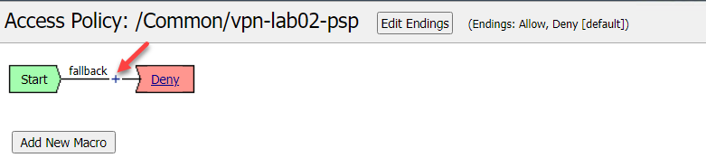
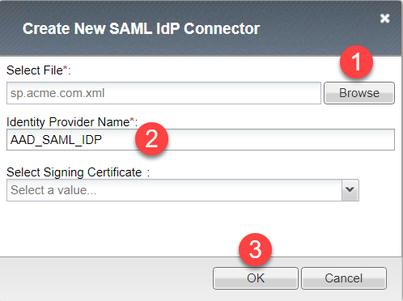
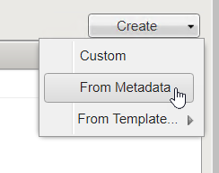
.. |image008| image:: ./media/lab02/008.png
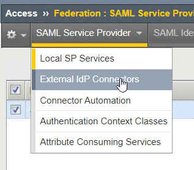
.. |image010| image:: ./media/lab02/010.png
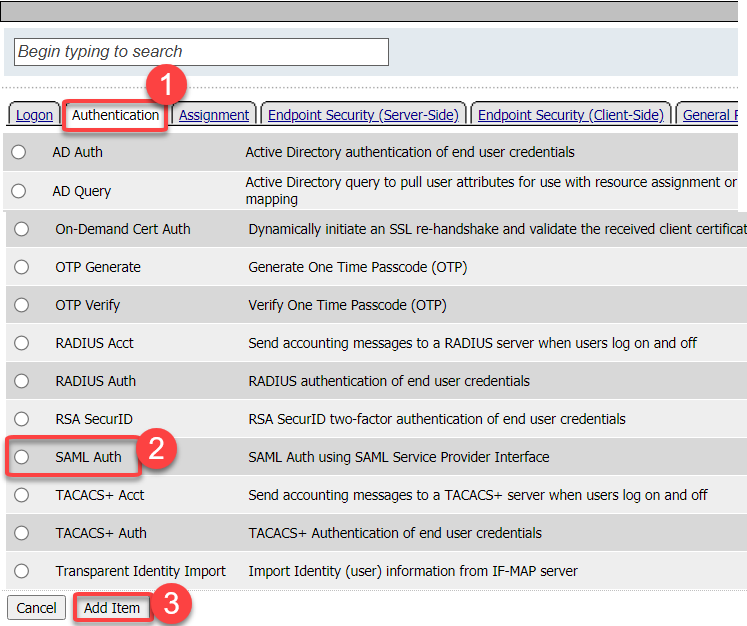
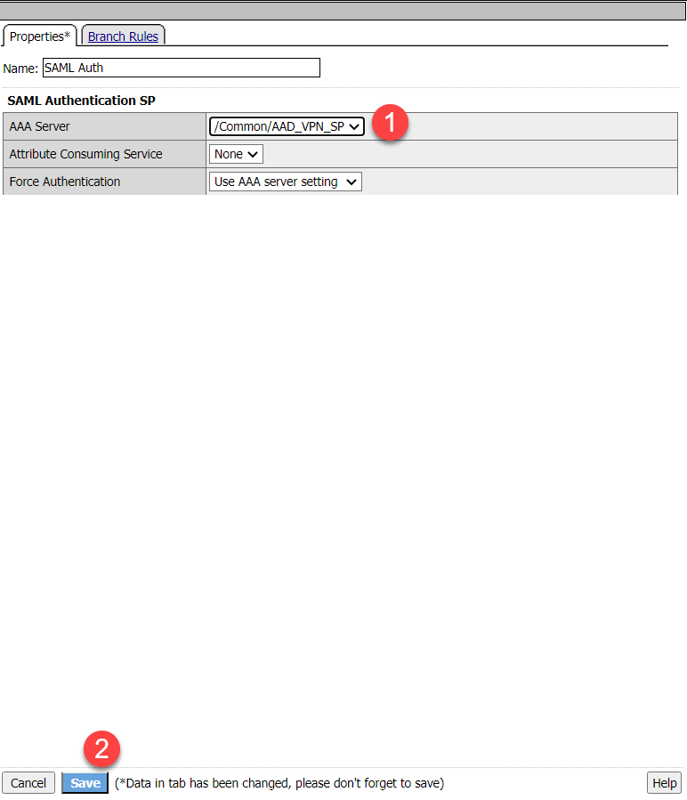
.. |image013| image:: ./media/lab02/013.png
.. |image016| image:: ./media/lab02/016.png
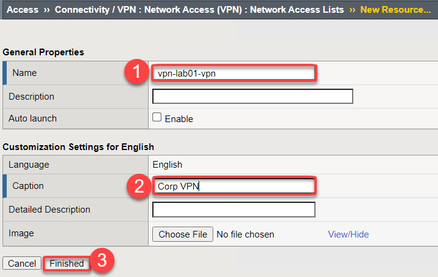
.. |image018| image:: ./media/lab02/018.png
.. |image019| image:: ./media/lab02/019.png
.. |image020| image:: ./media/lab02/020.png
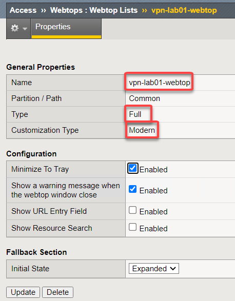
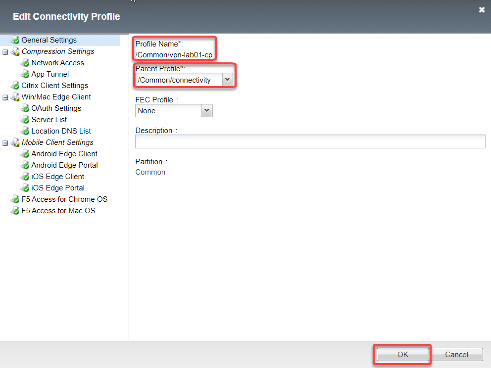
.. |image024| image:: ./media/lab02/024.png
.. |image025| image:: ./media/lab02/025.png
.. |image026| image:: ./media/lab02/026.png
.. |image027| image:: ./media/lab02/027.png
.. |image028| image:: ./media/lab02/028.png
.. |image033| image:: ./media/lab02/033.png
.. |image037| image:: ./media/lab02/037.png
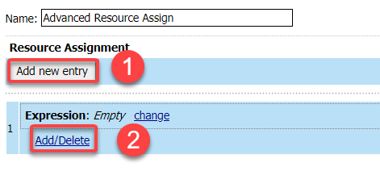
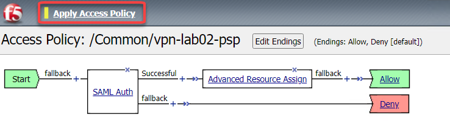
.. |image041| image:: ./media/lab02/041.png
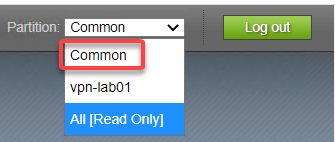
.. |image0010| image:: ./media/lab02/0010.png
.. |image0020| image:: ./media/lab02/0020.png
.. |image0030| image:: ./media/lab02/0030.png
.. |image0040| image:: ./media/lab02/0040.png
.. |image0050| image:: ./media/lab02/0050.png
